# Expo Google Fonts Gallery

A visual gallery showing you every font available in Expo Fonts Google packages.
Each image links to the package containing that font.

The [Google Fonts site](https://fonts.google.com) is also a great way to browse through the available fonts.

## 🔠 Font Families

[ABeeZee](https://github.com/expo/google-fonts/tree/master/font-packages/abeezee#readme), [Abel](https://github.com/expo/google-fonts/tree/master/font-packages/abel#readme), [Abhaya Libre](https://github.com/expo/google-fonts/tree/master/font-packages/abhaya-libre#readme), [Abril Fatface](https://github.com/expo/google-fonts/tree/master/font-packages/abril-fatface#readme), [Aclonica](https://github.com/expo/google-fonts/tree/master/font-packages/aclonica#readme), [Acme](https://github.com/expo/google-fonts/tree/master/font-packages/acme#readme), [Actor](https://github.com/expo/google-fonts/tree/master/font-packages/actor#readme), [Adamina](https://github.com/expo/google-fonts/tree/master/font-packages/adamina#readme), [Advent Pro](https://github.com/expo/google-fonts/tree/master/font-packages/advent-pro#readme), [Aguafina Script](https://github.com/expo/google-fonts/tree/master/font-packages/aguafina-script#readme), [Akronim](https://github.com/expo/google-fonts/tree/master/font-packages/akronim#readme), [Aladin](https://github.com/expo/google-fonts/tree/master/font-packages/aladin#readme), [Alata](https://github.com/expo/google-fonts/tree/master/font-packages/alata#readme), [Alatsi](https://github.com/expo/google-fonts/tree/master/font-packages/alatsi#readme), [Aldrich](https://github.com/expo/google-fonts/tree/master/font-packages/aldrich#readme), [Alef](https://github.com/expo/google-fonts/tree/master/font-packages/alef#readme), [Alegreya](https://github.com/expo/google-fonts/tree/master/font-packages/alegreya#readme), [Alegreya SC](https://github.com/expo/google-fonts/tree/master/font-packages/alegreya-sc#readme), [Alegreya Sans](https://github.com/expo/google-fonts/tree/master/font-packages/alegreya-sans#readme), [Alegreya Sans SC](https://github.com/expo/google-fonts/tree/master/font-packages/alegreya-sans-sc#readme), [Aleo](https://github.com/expo/google-fonts/tree/master/font-packages/aleo#readme), [Alex Brush](https://github.com/expo/google-fonts/tree/master/font-packages/alex-brush#readme), [Alfa Slab One](https://github.com/expo/google-fonts/tree/master/font-packages/alfa-slab-one#readme), [Alice](https://github.com/expo/google-fonts/tree/master/font-packages/alice#readme), [Alike](https://github.com/expo/google-fonts/tree/master/font-packages/alike#readme), [Alike Angular](https://github.com/expo/google-fonts/tree/master/font-packages/alike-angular#readme), [Allan](https://github.com/expo/google-fonts/tree/master/font-packages/allan#readme), [Allerta](https://github.com/expo/google-fonts/tree/master/font-packages/allerta#readme), [Allerta Stencil](https://github.com/expo/google-fonts/tree/master/font-packages/allerta-stencil#readme), [Allura](https://github.com/expo/google-fonts/tree/master/font-packages/allura#readme), [Almarai](https://github.com/expo/google-fonts/tree/master/font-packages/almarai#readme), [Almendra](https://github.com/expo/google-fonts/tree/master/font-packages/almendra#readme), [Almendra Display](https://github.com/expo/google-fonts/tree/master/font-packages/almendra-display#readme), [Almendra SC](https://github.com/expo/google-fonts/tree/master/font-packages/almendra-sc#readme), [Amarante](https://github.com/expo/google-fonts/tree/master/font-packages/amarante#readme), [Amaranth](https://github.com/expo/google-fonts/tree/master/font-packages/amaranth#readme), [Amatic SC](https://github.com/expo/google-fonts/tree/master/font-packages/amatic-sc#readme), [Amethysta](https://github.com/expo/google-fonts/tree/master/font-packages/amethysta#readme), [Amiko](https://github.com/expo/google-fonts/tree/master/font-packages/amiko#readme), [Amiri](https://github.com/expo/google-fonts/tree/master/font-packages/amiri#readme), [Amita](https://github.com/expo/google-fonts/tree/master/font-packages/amita#readme), [Anaheim](https://github.com/expo/google-fonts/tree/master/font-packages/anaheim#readme), [Andada](https://github.com/expo/google-fonts/tree/master/font-packages/andada#readme), [Andika](https://github.com/expo/google-fonts/tree/master/font-packages/andika#readme), [Angkor](https://github.com/expo/google-fonts/tree/master/font-packages/angkor#readme), [Annie Use Your Telescope](https://github.com/expo/google-fonts/tree/master/font-packages/annie-use-your-telescope#readme), [Anonymous Pro](https://github.com/expo/google-fonts/tree/master/font-packages/anonymous-pro#readme), [Antic](https://github.com/expo/google-fonts/tree/master/font-packages/antic#readme), [Antic Didone](https://github.com/expo/google-fonts/tree/master/font-packages/antic-didone#readme), [Antic Slab](https://github.com/expo/google-fonts/tree/master/font-packages/antic-slab#readme), [Anton](https://github.com/expo/google-fonts/tree/master/font-packages/anton#readme), [Arapey](https://github.com/expo/google-fonts/tree/master/font-packages/arapey#readme), [Arbutus](https://github.com/expo/google-fonts/tree/master/font-packages/arbutus#readme), [Arbutus Slab](https://github.com/expo/google-fonts/tree/master/font-packages/arbutus-slab#readme), [Architects Daughter](https://github.com/expo/google-fonts/tree/master/font-packages/architects-daughter#readme), [Archivo](https://github.com/expo/google-fonts/tree/master/font-packages/archivo#readme), [Archivo Black](https://github.com/expo/google-fonts/tree/master/font-packages/archivo-black#readme), [Archivo Narrow](https://github.com/expo/google-fonts/tree/master/font-packages/archivo-narrow#readme), [Aref Ruqaa](https://github.com/expo/google-fonts/tree/master/font-packages/aref-ruqaa#readme), [Arima Madurai](https://github.com/expo/google-fonts/tree/master/font-packages/arima-madurai#readme), [Arimo](https://github.com/expo/google-fonts/tree/master/font-packages/arimo#readme), [Arizonia](https://github.com/expo/google-fonts/tree/master/font-packages/arizonia#readme), [Armata](https://github.com/expo/google-fonts/tree/master/font-packages/armata#readme), [Arsenal](https://github.com/expo/google-fonts/tree/master/font-packages/arsenal#readme), [Artifika](https://github.com/expo/google-fonts/tree/master/font-packages/artifika#readme), [Arvo](https://github.com/expo/google-fonts/tree/master/font-packages/arvo#readme), [Arya](https://github.com/expo/google-fonts/tree/master/font-packages/arya#readme), [Asap](https://github.com/expo/google-fonts/tree/master/font-packages/asap#readme), [Asap Condensed](https://github.com/expo/google-fonts/tree/master/font-packages/asap-condensed#readme), [Asar](https://github.com/expo/google-fonts/tree/master/font-packages/asar#readme), [Asset](https://github.com/expo/google-fonts/tree/master/font-packages/asset#readme), [Assistant](https://github.com/expo/google-fonts/tree/master/font-packages/assistant#readme), [Astloch](https://github.com/expo/google-fonts/tree/master/font-packages/astloch#readme), [Asul](https://github.com/expo/google-fonts/tree/master/font-packages/asul#readme), [Athiti](https://github.com/expo/google-fonts/tree/master/font-packages/athiti#readme), [Atma](https://github.com/expo/google-fonts/tree/master/font-packages/atma#readme), [Atomic Age](https://github.com/expo/google-fonts/tree/master/font-packages/atomic-age#readme), [Aubrey](https://github.com/expo/google-fonts/tree/master/font-packages/aubrey#readme), [Audiowide](https://github.com/expo/google-fonts/tree/master/font-packages/audiowide#readme), [Autour One](https://github.com/expo/google-fonts/tree/master/font-packages/autour-one#readme), [Average](https://github.com/expo/google-fonts/tree/master/font-packages/average#readme), [Average Sans](https://github.com/expo/google-fonts/tree/master/font-packages/average-sans#readme), [Averia Gruesa Libre](https://github.com/expo/google-fonts/tree/master/font-packages/averia-gruesa-libre#readme), [Averia Libre](https://github.com/expo/google-fonts/tree/master/font-packages/averia-libre#readme), [Averia Sans Libre](https://github.com/expo/google-fonts/tree/master/font-packages/averia-sans-libre#readme), [Averia Serif Libre](https://github.com/expo/google-fonts/tree/master/font-packages/averia-serif-libre#readme), [B612](https://github.com/expo/google-fonts/tree/master/font-packages/b612#readme), [B612 Mono](https://github.com/expo/google-fonts/tree/master/font-packages/b612-mono#readme), [Bad Script](https://github.com/expo/google-fonts/tree/master/font-packages/bad-script#readme), [Bahiana](https://github.com/expo/google-fonts/tree/master/font-packages/bahiana#readme), [Bahianita](https://github.com/expo/google-fonts/tree/master/font-packages/bahianita#readme), [Bai Jamjuree](https://github.com/expo/google-fonts/tree/master/font-packages/bai-jamjuree#readme), [Baloo 2](https://github.com/expo/google-fonts/tree/master/font-packages/baloo-2#readme), [Baloo Bhai 2](https://github.com/expo/google-fonts/tree/master/font-packages/baloo-bhai-2#readme), [Baloo Bhaina 2](https://github.com/expo/google-fonts/tree/master/font-packages/baloo-bhaina-2#readme), [Baloo Chettan 2](https://github.com/expo/google-fonts/tree/master/font-packages/baloo-chettan-2#readme), [Baloo Da 2](https://github.com/expo/google-fonts/tree/master/font-packages/baloo-da-2#readme), [Baloo Paaji 2](https://github.com/expo/google-fonts/tree/master/font-packages/baloo-paaji-2#readme), [Baloo Tamma 2](https://github.com/expo/google-fonts/tree/master/font-packages/baloo-tamma-2#readme), [Baloo Tammudu 2](https://github.com/expo/google-fonts/tree/master/font-packages/baloo-tammudu-2#readme), [Baloo Thambi 2](https://github.com/expo/google-fonts/tree/master/font-packages/baloo-thambi-2#readme), [Balsamiq Sans](https://github.com/expo/google-fonts/tree/master/font-packages/balsamiq-sans#readme), [Balthazar](https://github.com/expo/google-fonts/tree/master/font-packages/balthazar#readme), [Bangers](https://github.com/expo/google-fonts/tree/master/font-packages/bangers#readme), [Barlow](https://github.com/expo/google-fonts/tree/master/font-packages/barlow#readme), [Barlow Condensed](https://github.com/expo/google-fonts/tree/master/font-packages/barlow-condensed#readme), [Barlow Semi Condensed](https://github.com/expo/google-fonts/tree/master/font-packages/barlow-semi-condensed#readme), [Barriecito](https://github.com/expo/google-fonts/tree/master/font-packages/barriecito#readme), [Barrio](https://github.com/expo/google-fonts/tree/master/font-packages/barrio#readme), [Basic](https://github.com/expo/google-fonts/tree/master/font-packages/basic#readme), [Baskervville](https://github.com/expo/google-fonts/tree/master/font-packages/baskervville#readme), [Battambang](https://github.com/expo/google-fonts/tree/master/font-packages/battambang#readme), [Baumans](https://github.com/expo/google-fonts/tree/master/font-packages/baumans#readme), [Bayon](https://github.com/expo/google-fonts/tree/master/font-packages/bayon#readme), [Be Vietnam](https://github.com/expo/google-fonts/tree/master/font-packages/be-vietnam#readme), [Bebas Neue](https://github.com/expo/google-fonts/tree/master/font-packages/bebas-neue#readme), [Belgrano](https://github.com/expo/google-fonts/tree/master/font-packages/belgrano#readme), [Bellefair](https://github.com/expo/google-fonts/tree/master/font-packages/bellefair#readme), [Belleza](https://github.com/expo/google-fonts/tree/master/font-packages/belleza#readme), [Bellota](https://github.com/expo/google-fonts/tree/master/font-packages/bellota#readme), [Bellota Text](https://github.com/expo/google-fonts/tree/master/font-packages/bellota-text#readme), [BenchNine](https://github.com/expo/google-fonts/tree/master/font-packages/benchnine#readme), [Bentham](https://github.com/expo/google-fonts/tree/master/font-packages/bentham#readme), [Berkshire Swash](https://github.com/expo/google-fonts/tree/master/font-packages/berkshire-swash#readme), [Beth Ellen](https://github.com/expo/google-fonts/tree/master/font-packages/beth-ellen#readme), [Bevan](https://github.com/expo/google-fonts/tree/master/font-packages/bevan#readme), [Big Shoulders Display](https://github.com/expo/google-fonts/tree/master/font-packages/big-shoulders-display#readme), [Big Shoulders Text](https://github.com/expo/google-fonts/tree/master/font-packages/big-shoulders-text#readme), [Bigelow Rules](https://github.com/expo/google-fonts/tree/master/font-packages/bigelow-rules#readme), [Bigshot One](https://github.com/expo/google-fonts/tree/master/font-packages/bigshot-one#readme), [Bilbo](https://github.com/expo/google-fonts/tree/master/font-packages/bilbo#readme), [Bilbo Swash Caps](https://github.com/expo/google-fonts/tree/master/font-packages/bilbo-swash-caps#readme), [BioRhyme](https://github.com/expo/google-fonts/tree/master/font-packages/biorhyme#readme), [BioRhyme Expanded](https://github.com/expo/google-fonts/tree/master/font-packages/biorhyme-expanded#readme), [Biryani](https://github.com/expo/google-fonts/tree/master/font-packages/biryani#readme), [Bitter](https://github.com/expo/google-fonts/tree/master/font-packages/bitter#readme), [Black And White Picture](https://github.com/expo/google-fonts/tree/master/font-packages/black-and-white-picture#readme), [Black Han Sans](https://github.com/expo/google-fonts/tree/master/font-packages/black-han-sans#readme), [Black Ops One](https://github.com/expo/google-fonts/tree/master/font-packages/black-ops-one#readme), [Blinker](https://github.com/expo/google-fonts/tree/master/font-packages/blinker#readme), [Bokor](https://github.com/expo/google-fonts/tree/master/font-packages/bokor#readme), [Bonbon](https://github.com/expo/google-fonts/tree/master/font-packages/bonbon#readme), [Boogaloo](https://github.com/expo/google-fonts/tree/master/font-packages/boogaloo#readme), [Bowlby One](https://github.com/expo/google-fonts/tree/master/font-packages/bowlby-one#readme), [Bowlby One SC](https://github.com/expo/google-fonts/tree/master/font-packages/bowlby-one-sc#readme), [Brawler](https://github.com/expo/google-fonts/tree/master/font-packages/brawler#readme), [Bree Serif](https://github.com/expo/google-fonts/tree/master/font-packages/bree-serif#readme), [Bubblegum Sans](https://github.com/expo/google-fonts/tree/master/font-packages/bubblegum-sans#readme), [Bubbler One](https://github.com/expo/google-fonts/tree/master/font-packages/bubbler-one#readme), [Buda](https://github.com/expo/google-fonts/tree/master/font-packages/buda#readme), [Buenard](https://github.com/expo/google-fonts/tree/master/font-packages/buenard#readme), [Bungee](https://github.com/expo/google-fonts/tree/master/font-packages/bungee#readme), [Bungee Hairline](https://github.com/expo/google-fonts/tree/master/font-packages/bungee-hairline#readme), [Bungee Inline](https://github.com/expo/google-fonts/tree/master/font-packages/bungee-inline#readme), [Bungee Outline](https://github.com/expo/google-fonts/tree/master/font-packages/bungee-outline#readme), [Bungee Shade](https://github.com/expo/google-fonts/tree/master/font-packages/bungee-shade#readme), [Butcherman](https://github.com/expo/google-fonts/tree/master/font-packages/butcherman#readme), [Butterfly Kids](https://github.com/expo/google-fonts/tree/master/font-packages/butterfly-kids#readme), [Cabin](https://github.com/expo/google-fonts/tree/master/font-packages/cabin#readme), [Cabin Condensed](https://github.com/expo/google-fonts/tree/master/font-packages/cabin-condensed#readme), [Cabin Sketch](https://github.com/expo/google-fonts/tree/master/font-packages/cabin-sketch#readme), [Caesar Dressing](https://github.com/expo/google-fonts/tree/master/font-packages/caesar-dressing#readme), [Cagliostro](https://github.com/expo/google-fonts/tree/master/font-packages/cagliostro#readme), [Cairo](https://github.com/expo/google-fonts/tree/master/font-packages/cairo#readme), [Caladea](https://github.com/expo/google-fonts/tree/master/font-packages/caladea#readme), [Calistoga](https://github.com/expo/google-fonts/tree/master/font-packages/calistoga#readme), [Calligraffitti](https://github.com/expo/google-fonts/tree/master/font-packages/calligraffitti#readme), [Cambay](https://github.com/expo/google-fonts/tree/master/font-packages/cambay#readme), [Cambo](https://github.com/expo/google-fonts/tree/master/font-packages/cambo#readme), [Candal](https://github.com/expo/google-fonts/tree/master/font-packages/candal#readme), [Cantarell](https://github.com/expo/google-fonts/tree/master/font-packages/cantarell#readme), [Cantata One](https://github.com/expo/google-fonts/tree/master/font-packages/cantata-one#readme), [Cantora One](https://github.com/expo/google-fonts/tree/master/font-packages/cantora-one#readme), [Capriola](https://github.com/expo/google-fonts/tree/master/font-packages/capriola#readme), [Cardo](https://github.com/expo/google-fonts/tree/master/font-packages/cardo#readme), [Carme](https://github.com/expo/google-fonts/tree/master/font-packages/carme#readme), [Carrois Gothic](https://github.com/expo/google-fonts/tree/master/font-packages/carrois-gothic#readme), [Carrois Gothic SC](https://github.com/expo/google-fonts/tree/master/font-packages/carrois-gothic-sc#readme), [Carter One](https://github.com/expo/google-fonts/tree/master/font-packages/carter-one#readme), [Catamaran](https://github.com/expo/google-fonts/tree/master/font-packages/catamaran#readme), [Caudex](https://github.com/expo/google-fonts/tree/master/font-packages/caudex#readme), [Caveat](https://github.com/expo/google-fonts/tree/master/font-packages/caveat#readme), [Caveat Brush](https://github.com/expo/google-fonts/tree/master/font-packages/caveat-brush#readme), [Cedarville Cursive](https://github.com/expo/google-fonts/tree/master/font-packages/cedarville-cursive#readme), [Ceviche One](https://github.com/expo/google-fonts/tree/master/font-packages/ceviche-one#readme), [Chakra Petch](https://github.com/expo/google-fonts/tree/master/font-packages/chakra-petch#readme), [Changa](https://github.com/expo/google-fonts/tree/master/font-packages/changa#readme), [Changa One](https://github.com/expo/google-fonts/tree/master/font-packages/changa-one#readme), [Chango](https://github.com/expo/google-fonts/tree/master/font-packages/chango#readme), [Charm](https://github.com/expo/google-fonts/tree/master/font-packages/charm#readme), [Charmonman](https://github.com/expo/google-fonts/tree/master/font-packages/charmonman#readme), [Chathura](https://github.com/expo/google-fonts/tree/master/font-packages/chathura#readme), [Chau Philomene One](https://github.com/expo/google-fonts/tree/master/font-packages/chau-philomene-one#readme), [Chela One](https://github.com/expo/google-fonts/tree/master/font-packages/chela-one#readme), [Chelsea Market](https://github.com/expo/google-fonts/tree/master/font-packages/chelsea-market#readme), [Chenla](https://github.com/expo/google-fonts/tree/master/font-packages/chenla#readme), [Cherry Cream Soda](https://github.com/expo/google-fonts/tree/master/font-packages/cherry-cream-soda#readme), [Cherry Swash](https://github.com/expo/google-fonts/tree/master/font-packages/cherry-swash#readme), [Chewy](https://github.com/expo/google-fonts/tree/master/font-packages/chewy#readme), [Chicle](https://github.com/expo/google-fonts/tree/master/font-packages/chicle#readme), [Chilanka](https://github.com/expo/google-fonts/tree/master/font-packages/chilanka#readme), [Chivo](https://github.com/expo/google-fonts/tree/master/font-packages/chivo#readme), [Chonburi](https://github.com/expo/google-fonts/tree/master/font-packages/chonburi#readme), [Cinzel](https://github.com/expo/google-fonts/tree/master/font-packages/cinzel#readme), [Cinzel Decorative](https://github.com/expo/google-fonts/tree/master/font-packages/cinzel-decorative#readme), [Clicker Script](https://github.com/expo/google-fonts/tree/master/font-packages/clicker-script#readme), [Coda](https://github.com/expo/google-fonts/tree/master/font-packages/coda#readme), [Coda Caption](https://github.com/expo/google-fonts/tree/master/font-packages/coda-caption#readme), [Codystar](https://github.com/expo/google-fonts/tree/master/font-packages/codystar#readme), [Coiny](https://github.com/expo/google-fonts/tree/master/font-packages/coiny#readme), [Combo](https://github.com/expo/google-fonts/tree/master/font-packages/combo#readme), [Comfortaa](https://github.com/expo/google-fonts/tree/master/font-packages/comfortaa#readme), [Comic Neue](https://github.com/expo/google-fonts/tree/master/font-packages/comic-neue#readme), [Coming Soon](https://github.com/expo/google-fonts/tree/master/font-packages/coming-soon#readme), [Concert One](https://github.com/expo/google-fonts/tree/master/font-packages/concert-one#readme), [Condiment](https://github.com/expo/google-fonts/tree/master/font-packages/condiment#readme), [Content](https://github.com/expo/google-fonts/tree/master/font-packages/content#readme), [Contrail One](https://github.com/expo/google-fonts/tree/master/font-packages/contrail-one#readme), [Convergence](https://github.com/expo/google-fonts/tree/master/font-packages/convergence#readme), [Cookie](https://github.com/expo/google-fonts/tree/master/font-packages/cookie#readme), [Copse](https://github.com/expo/google-fonts/tree/master/font-packages/copse#readme), [Corben](https://github.com/expo/google-fonts/tree/master/font-packages/corben#readme), [Cormorant](https://github.com/expo/google-fonts/tree/master/font-packages/cormorant#readme), [Cormorant Garamond](https://github.com/expo/google-fonts/tree/master/font-packages/cormorant-garamond#readme), [Cormorant Infant](https://github.com/expo/google-fonts/tree/master/font-packages/cormorant-infant#readme), [Cormorant SC](https://github.com/expo/google-fonts/tree/master/font-packages/cormorant-sc#readme), [Cormorant Unicase](https://github.com/expo/google-fonts/tree/master/font-packages/cormorant-unicase#readme), [Cormorant Upright](https://github.com/expo/google-fonts/tree/master/font-packages/cormorant-upright#readme), [Courgette](https://github.com/expo/google-fonts/tree/master/font-packages/courgette#readme), [Courier Prime](https://github.com/expo/google-fonts/tree/master/font-packages/courier-prime#readme), [Cousine](https://github.com/expo/google-fonts/tree/master/font-packages/cousine#readme), [Coustard](https://github.com/expo/google-fonts/tree/master/font-packages/coustard#readme), [Covered By Your Grace](https://github.com/expo/google-fonts/tree/master/font-packages/covered-by-your-grace#readme), [Crafty Girls](https://github.com/expo/google-fonts/tree/master/font-packages/crafty-girls#readme), [Creepster](https://github.com/expo/google-fonts/tree/master/font-packages/creepster#readme), [Crete Round](https://github.com/expo/google-fonts/tree/master/font-packages/crete-round#readme), [Crimson Pro](https://github.com/expo/google-fonts/tree/master/font-packages/crimson-pro#readme), [Crimson Text](https://github.com/expo/google-fonts/tree/master/font-packages/crimson-text#readme), [Croissant One](https://github.com/expo/google-fonts/tree/master/font-packages/croissant-one#readme), [Crushed](https://github.com/expo/google-fonts/tree/master/font-packages/crushed#readme), [Cuprum](https://github.com/expo/google-fonts/tree/master/font-packages/cuprum#readme), [Cute Font](https://github.com/expo/google-fonts/tree/master/font-packages/cute-font#readme), [Cutive](https://github.com/expo/google-fonts/tree/master/font-packages/cutive#readme), [Cutive Mono](https://github.com/expo/google-fonts/tree/master/font-packages/cutive-mono#readme), [DM Mono](https://github.com/expo/google-fonts/tree/master/font-packages/dm-mono#readme), [DM Sans](https://github.com/expo/google-fonts/tree/master/font-packages/dm-sans#readme), [DM Serif Display](https://github.com/expo/google-fonts/tree/master/font-packages/dm-serif-display#readme), [DM Serif Text](https://github.com/expo/google-fonts/tree/master/font-packages/dm-serif-text#readme), [Damion](https://github.com/expo/google-fonts/tree/master/font-packages/damion#readme), [Dancing Script](https://github.com/expo/google-fonts/tree/master/font-packages/dancing-script#readme), [Dangrek](https://github.com/expo/google-fonts/tree/master/font-packages/dangrek#readme), [Darker Grotesque](https://github.com/expo/google-fonts/tree/master/font-packages/darker-grotesque#readme), [David Libre](https://github.com/expo/google-fonts/tree/master/font-packages/david-libre#readme), [Dawning of a New Day](https://github.com/expo/google-fonts/tree/master/font-packages/dawning-of-a-new-day#readme), [Days One](https://github.com/expo/google-fonts/tree/master/font-packages/days-one#readme), [Dekko](https://github.com/expo/google-fonts/tree/master/font-packages/dekko#readme), [Delius](https://github.com/expo/google-fonts/tree/master/font-packages/delius#readme), [Delius Swash Caps](https://github.com/expo/google-fonts/tree/master/font-packages/delius-swash-caps#readme), [Delius Unicase](https://github.com/expo/google-fonts/tree/master/font-packages/delius-unicase#readme), [Della Respira](https://github.com/expo/google-fonts/tree/master/font-packages/della-respira#readme), [Denk One](https://github.com/expo/google-fonts/tree/master/font-packages/denk-one#readme), [Devonshire](https://github.com/expo/google-fonts/tree/master/font-packages/devonshire#readme), [Dhurjati](https://github.com/expo/google-fonts/tree/master/font-packages/dhurjati#readme), [Didact Gothic](https://github.com/expo/google-fonts/tree/master/font-packages/didact-gothic#readme), [Diplomata](https://github.com/expo/google-fonts/tree/master/font-packages/diplomata#readme), [Diplomata SC](https://github.com/expo/google-fonts/tree/master/font-packages/diplomata-sc#readme), [Do Hyeon](https://github.com/expo/google-fonts/tree/master/font-packages/do-hyeon#readme), [Dokdo](https://github.com/expo/google-fonts/tree/master/font-packages/dokdo#readme), [Domine](https://github.com/expo/google-fonts/tree/master/font-packages/domine#readme), [Donegal One](https://github.com/expo/google-fonts/tree/master/font-packages/donegal-one#readme), [Doppio One](https://github.com/expo/google-fonts/tree/master/font-packages/doppio-one#readme), [Dorsa](https://github.com/expo/google-fonts/tree/master/font-packages/dorsa#readme), [Dosis](https://github.com/expo/google-fonts/tree/master/font-packages/dosis#readme), [Dr Sugiyama](https://github.com/expo/google-fonts/tree/master/font-packages/dr-sugiyama#readme), [Duru Sans](https://github.com/expo/google-fonts/tree/master/font-packages/duru-sans#readme), [Dynalight](https://github.com/expo/google-fonts/tree/master/font-packages/dynalight#readme), [EB Garamond](https://github.com/expo/google-fonts/tree/master/font-packages/eb-garamond#readme), [Eagle Lake](https://github.com/expo/google-fonts/tree/master/font-packages/eagle-lake#readme), [East Sea Dokdo](https://github.com/expo/google-fonts/tree/master/font-packages/east-sea-dokdo#readme), [Eater](https://github.com/expo/google-fonts/tree/master/font-packages/eater#readme), [Economica](https://github.com/expo/google-fonts/tree/master/font-packages/economica#readme), [Eczar](https://github.com/expo/google-fonts/tree/master/font-packages/eczar#readme), [El Messiri](https://github.com/expo/google-fonts/tree/master/font-packages/el-messiri#readme), [Electrolize](https://github.com/expo/google-fonts/tree/master/font-packages/electrolize#readme), [Elsie](https://github.com/expo/google-fonts/tree/master/font-packages/elsie#readme), [Elsie Swash Caps](https://github.com/expo/google-fonts/tree/master/font-packages/elsie-swash-caps#readme), [Emblema One](https://github.com/expo/google-fonts/tree/master/font-packages/emblema-one#readme), [Emilys Candy](https://github.com/expo/google-fonts/tree/master/font-packages/emilys-candy#readme), [Encode Sans](https://github.com/expo/google-fonts/tree/master/font-packages/encode-sans#readme), [Encode Sans Condensed](https://github.com/expo/google-fonts/tree/master/font-packages/encode-sans-condensed#readme), [Encode Sans Expanded](https://github.com/expo/google-fonts/tree/master/font-packages/encode-sans-expanded#readme), [Encode Sans Semi Condensed](https://github.com/expo/google-fonts/tree/master/font-packages/encode-sans-semi-condensed#readme), [Encode Sans Semi Expanded](https://github.com/expo/google-fonts/tree/master/font-packages/encode-sans-semi-expanded#readme), [Engagement](https://github.com/expo/google-fonts/tree/master/font-packages/engagement#readme), [Englebert](https://github.com/expo/google-fonts/tree/master/font-packages/englebert#readme), [Enriqueta](https://github.com/expo/google-fonts/tree/master/font-packages/enriqueta#readme), [Erica One](https://github.com/expo/google-fonts/tree/master/font-packages/erica-one#readme), [Esteban](https://github.com/expo/google-fonts/tree/master/font-packages/esteban#readme), [Euphoria Script](https://github.com/expo/google-fonts/tree/master/font-packages/euphoria-script#readme), [Ewert](https://github.com/expo/google-fonts/tree/master/font-packages/ewert#readme), [Exo](https://github.com/expo/google-fonts/tree/master/font-packages/exo#readme), [Exo 2](https://github.com/expo/google-fonts/tree/master/font-packages/exo-2#readme), [Expletus Sans](https://github.com/expo/google-fonts/tree/master/font-packages/expletus-sans#readme), [Fahkwang](https://github.com/expo/google-fonts/tree/master/font-packages/fahkwang#readme), [Fanwood Text](https://github.com/expo/google-fonts/tree/master/font-packages/fanwood-text#readme), [Farro](https://github.com/expo/google-fonts/tree/master/font-packages/farro#readme), [Farsan](https://github.com/expo/google-fonts/tree/master/font-packages/farsan#readme), [Fascinate](https://github.com/expo/google-fonts/tree/master/font-packages/fascinate#readme), [Fascinate Inline](https://github.com/expo/google-fonts/tree/master/font-packages/fascinate-inline#readme), [Faster One](https://github.com/expo/google-fonts/tree/master/font-packages/faster-one#readme), [Fasthand](https://github.com/expo/google-fonts/tree/master/font-packages/fasthand#readme), [Fauna One](https://github.com/expo/google-fonts/tree/master/font-packages/fauna-one#readme), [Faustina](https://github.com/expo/google-fonts/tree/master/font-packages/faustina#readme), [Federant](https://github.com/expo/google-fonts/tree/master/font-packages/federant#readme), [Federo](https://github.com/expo/google-fonts/tree/master/font-packages/federo#readme), [Felipa](https://github.com/expo/google-fonts/tree/master/font-packages/felipa#readme), [Fenix](https://github.com/expo/google-fonts/tree/master/font-packages/fenix#readme), [Finger Paint](https://github.com/expo/google-fonts/tree/master/font-packages/finger-paint#readme), [Fira Code](https://github.com/expo/google-fonts/tree/master/font-packages/fira-code#readme), [Fira Mono](https://github.com/expo/google-fonts/tree/master/font-packages/fira-mono#readme), [Fira Sans](https://github.com/expo/google-fonts/tree/master/font-packages/fira-sans#readme), [Fira Sans Condensed](https://github.com/expo/google-fonts/tree/master/font-packages/fira-sans-condensed#readme), [Fira Sans Extra Condensed](https://github.com/expo/google-fonts/tree/master/font-packages/fira-sans-extra-condensed#readme), [Fjalla One](https://github.com/expo/google-fonts/tree/master/font-packages/fjalla-one#readme), [Fjord One](https://github.com/expo/google-fonts/tree/master/font-packages/fjord-one#readme), [Flamenco](https://github.com/expo/google-fonts/tree/master/font-packages/flamenco#readme), [Flavors](https://github.com/expo/google-fonts/tree/master/font-packages/flavors#readme), [Fondamento](https://github.com/expo/google-fonts/tree/master/font-packages/fondamento#readme), [Fontdiner Swanky](https://github.com/expo/google-fonts/tree/master/font-packages/fontdiner-swanky#readme), [Forum](https://github.com/expo/google-fonts/tree/master/font-packages/forum#readme), [Francois One](https://github.com/expo/google-fonts/tree/master/font-packages/francois-one#readme), [Frank Ruhl Libre](https://github.com/expo/google-fonts/tree/master/font-packages/frank-ruhl-libre#readme), [Freckle Face](https://github.com/expo/google-fonts/tree/master/font-packages/freckle-face#readme), [Fredericka the Great](https://github.com/expo/google-fonts/tree/master/font-packages/fredericka-the-great#readme), [Fredoka One](https://github.com/expo/google-fonts/tree/master/font-packages/fredoka-one#readme), [Freehand](https://github.com/expo/google-fonts/tree/master/font-packages/freehand#readme), [Fresca](https://github.com/expo/google-fonts/tree/master/font-packages/fresca#readme), [Frijole](https://github.com/expo/google-fonts/tree/master/font-packages/frijole#readme), [Fruktur](https://github.com/expo/google-fonts/tree/master/font-packages/fruktur#readme), [Fugaz One](https://github.com/expo/google-fonts/tree/master/font-packages/fugaz-one#readme), [GFS Didot](https://github.com/expo/google-fonts/tree/master/font-packages/gfs-didot#readme), [GFS Neohellenic](https://github.com/expo/google-fonts/tree/master/font-packages/gfs-neohellenic#readme), [Gabriela](https://github.com/expo/google-fonts/tree/master/font-packages/gabriela#readme), [Gaegu](https://github.com/expo/google-fonts/tree/master/font-packages/gaegu#readme), [Gafata](https://github.com/expo/google-fonts/tree/master/font-packages/gafata#readme), [Galada](https://github.com/expo/google-fonts/tree/master/font-packages/galada#readme), [Galdeano](https://github.com/expo/google-fonts/tree/master/font-packages/galdeano#readme), [Galindo](https://github.com/expo/google-fonts/tree/master/font-packages/galindo#readme), [Gamja Flower](https://github.com/expo/google-fonts/tree/master/font-packages/gamja-flower#readme), [Gayathri](https://github.com/expo/google-fonts/tree/master/font-packages/gayathri#readme), [Gelasio](https://github.com/expo/google-fonts/tree/master/font-packages/gelasio#readme), [Gentium Basic](https://github.com/expo/google-fonts/tree/master/font-packages/gentium-basic#readme), [Gentium Book Basic](https://github.com/expo/google-fonts/tree/master/font-packages/gentium-book-basic#readme), [Geo](https://github.com/expo/google-fonts/tree/master/font-packages/geo#readme), [Geostar](https://github.com/expo/google-fonts/tree/master/font-packages/geostar#readme), [Geostar Fill](https://github.com/expo/google-fonts/tree/master/font-packages/geostar-fill#readme), [Germania One](https://github.com/expo/google-fonts/tree/master/font-packages/germania-one#readme), [Gidugu](https://github.com/expo/google-fonts/tree/master/font-packages/gidugu#readme), [Gilda Display](https://github.com/expo/google-fonts/tree/master/font-packages/gilda-display#readme), [Girassol](https://github.com/expo/google-fonts/tree/master/font-packages/girassol#readme), [Give You Glory](https://github.com/expo/google-fonts/tree/master/font-packages/give-you-glory#readme), [Glass Antiqua](https://github.com/expo/google-fonts/tree/master/font-packages/glass-antiqua#readme), [Glegoo](https://github.com/expo/google-fonts/tree/master/font-packages/glegoo#readme), [Gloria Hallelujah](https://github.com/expo/google-fonts/tree/master/font-packages/gloria-hallelujah#readme), [Goblin One](https://github.com/expo/google-fonts/tree/master/font-packages/goblin-one#readme), [Gochi Hand](https://github.com/expo/google-fonts/tree/master/font-packages/gochi-hand#readme), [Gorditas](https://github.com/expo/google-fonts/tree/master/font-packages/gorditas#readme), [Gothic A1](https://github.com/expo/google-fonts/tree/master/font-packages/gothic-a1#readme), [Gotu](https://github.com/expo/google-fonts/tree/master/font-packages/gotu#readme), [Goudy Bookletter 1911](https://github.com/expo/google-fonts/tree/master/font-packages/goudy-bookletter-1911#readme), [Graduate](https://github.com/expo/google-fonts/tree/master/font-packages/graduate#readme), [Grand Hotel](https://github.com/expo/google-fonts/tree/master/font-packages/grand-hotel#readme), [Gravitas One](https://github.com/expo/google-fonts/tree/master/font-packages/gravitas-one#readme), [Great Vibes](https://github.com/expo/google-fonts/tree/master/font-packages/great-vibes#readme), [Grenze](https://github.com/expo/google-fonts/tree/master/font-packages/grenze#readme), [Griffy](https://github.com/expo/google-fonts/tree/master/font-packages/griffy#readme), [Gruppo](https://github.com/expo/google-fonts/tree/master/font-packages/gruppo#readme), [Gudea](https://github.com/expo/google-fonts/tree/master/font-packages/gudea#readme), [Gugi](https://github.com/expo/google-fonts/tree/master/font-packages/gugi#readme), [Gupter](https://github.com/expo/google-fonts/tree/master/font-packages/gupter#readme), [Gurajada](https://github.com/expo/google-fonts/tree/master/font-packages/gurajada#readme), [Habibi](https://github.com/expo/google-fonts/tree/master/font-packages/habibi#readme), [Halant](https://github.com/expo/google-fonts/tree/master/font-packages/halant#readme), [Hammersmith One](https://github.com/expo/google-fonts/tree/master/font-packages/hammersmith-one#readme), [Hanalei](https://github.com/expo/google-fonts/tree/master/font-packages/hanalei#readme), [Hanalei Fill](https://github.com/expo/google-fonts/tree/master/font-packages/hanalei-fill#readme), [Handlee](https://github.com/expo/google-fonts/tree/master/font-packages/handlee#readme), [Hanuman](https://github.com/expo/google-fonts/tree/master/font-packages/hanuman#readme), [Happy Monkey](https://github.com/expo/google-fonts/tree/master/font-packages/happy-monkey#readme), [Harmattan](https://github.com/expo/google-fonts/tree/master/font-packages/harmattan#readme), [Headland One](https://github.com/expo/google-fonts/tree/master/font-packages/headland-one#readme), [Heebo](https://github.com/expo/google-fonts/tree/master/font-packages/heebo#readme), [Henny Penny](https://github.com/expo/google-fonts/tree/master/font-packages/henny-penny#readme), [Hepta Slab](https://github.com/expo/google-fonts/tree/master/font-packages/hepta-slab#readme), [Herr Von Muellerhoff](https://github.com/expo/google-fonts/tree/master/font-packages/herr-von-muellerhoff#readme), [Hi Melody](https://github.com/expo/google-fonts/tree/master/font-packages/hi-melody#readme), [Hind](https://github.com/expo/google-fonts/tree/master/font-packages/hind#readme), [Hind Guntur](https://github.com/expo/google-fonts/tree/master/font-packages/hind-guntur#readme), [Hind Madurai](https://github.com/expo/google-fonts/tree/master/font-packages/hind-madurai#readme), [Hind Siliguri](https://github.com/expo/google-fonts/tree/master/font-packages/hind-siliguri#readme), [Hind Vadodara](https://github.com/expo/google-fonts/tree/master/font-packages/hind-vadodara#readme), [Holtwood One SC](https://github.com/expo/google-fonts/tree/master/font-packages/holtwood-one-sc#readme), [Homemade Apple](https://github.com/expo/google-fonts/tree/master/font-packages/homemade-apple#readme), [Homenaje](https://github.com/expo/google-fonts/tree/master/font-packages/homenaje#readme), [IBM Plex Mono](https://github.com/expo/google-fonts/tree/master/font-packages/ibm-plex-mono#readme), [IBM Plex Sans](https://github.com/expo/google-fonts/tree/master/font-packages/ibm-plex-sans#readme), [IBM Plex Sans Condensed](https://github.com/expo/google-fonts/tree/master/font-packages/ibm-plex-sans-condensed#readme), [IBM Plex Serif](https://github.com/expo/google-fonts/tree/master/font-packages/ibm-plex-serif#readme), [IM Fell DW Pica](https://github.com/expo/google-fonts/tree/master/font-packages/im-fell-dw-pica#readme), [IM Fell DW Pica SC](https://github.com/expo/google-fonts/tree/master/font-packages/im-fell-dw-pica-sc#readme), [IM Fell Double Pica](https://github.com/expo/google-fonts/tree/master/font-packages/im-fell-double-pica#readme), [IM Fell Double Pica SC](https://github.com/expo/google-fonts/tree/master/font-packages/im-fell-double-pica-sc#readme), [IM Fell English](https://github.com/expo/google-fonts/tree/master/font-packages/im-fell-english#readme), [IM Fell English SC](https://github.com/expo/google-fonts/tree/master/font-packages/im-fell-english-sc#readme), [IM Fell French Canon](https://github.com/expo/google-fonts/tree/master/font-packages/im-fell-french-canon#readme), [IM Fell French Canon SC](https://github.com/expo/google-fonts/tree/master/font-packages/im-fell-french-canon-sc#readme), [IM Fell Great Primer](https://github.com/expo/google-fonts/tree/master/font-packages/im-fell-great-primer#readme), [IM Fell Great Primer SC](https://github.com/expo/google-fonts/tree/master/font-packages/im-fell-great-primer-sc#readme), [Ibarra Real Nova](https://github.com/expo/google-fonts/tree/master/font-packages/ibarra-real-nova#readme), [Iceberg](https://github.com/expo/google-fonts/tree/master/font-packages/iceberg#readme), [Iceland](https://github.com/expo/google-fonts/tree/master/font-packages/iceland#readme), [Imprima](https://github.com/expo/google-fonts/tree/master/font-packages/imprima#readme), [Inconsolata](https://github.com/expo/google-fonts/tree/master/font-packages/inconsolata#readme), [Inder](https://github.com/expo/google-fonts/tree/master/font-packages/inder#readme), [Indie Flower](https://github.com/expo/google-fonts/tree/master/font-packages/indie-flower#readme), [Inika](https://github.com/expo/google-fonts/tree/master/font-packages/inika#readme), [Inknut Antiqua](https://github.com/expo/google-fonts/tree/master/font-packages/inknut-antiqua#readme), [Inria Sans](https://github.com/expo/google-fonts/tree/master/font-packages/inria-sans#readme), [Inria Serif](https://github.com/expo/google-fonts/tree/master/font-packages/inria-serif#readme), [Inter](https://github.com/expo/google-fonts/tree/master/font-packages/inter#readme), [Irish Grover](https://github.com/expo/google-fonts/tree/master/font-packages/irish-grover#readme), [Istok Web](https://github.com/expo/google-fonts/tree/master/font-packages/istok-web#readme), [Italiana](https://github.com/expo/google-fonts/tree/master/font-packages/italiana#readme), [Italianno](https://github.com/expo/google-fonts/tree/master/font-packages/italianno#readme), [Itim](https://github.com/expo/google-fonts/tree/master/font-packages/itim#readme), [Jacques Francois](https://github.com/expo/google-fonts/tree/master/font-packages/jacques-francois#readme), [Jacques Francois Shadow](https://github.com/expo/google-fonts/tree/master/font-packages/jacques-francois-shadow#readme), [Jaldi](https://github.com/expo/google-fonts/tree/master/font-packages/jaldi#readme), [Jim Nightshade](https://github.com/expo/google-fonts/tree/master/font-packages/jim-nightshade#readme), [Jockey One](https://github.com/expo/google-fonts/tree/master/font-packages/jockey-one#readme), [Jolly Lodger](https://github.com/expo/google-fonts/tree/master/font-packages/jolly-lodger#readme), [Jomhuria](https://github.com/expo/google-fonts/tree/master/font-packages/jomhuria#readme), [Jomolhari](https://github.com/expo/google-fonts/tree/master/font-packages/jomolhari#readme), [Josefin Sans](https://github.com/expo/google-fonts/tree/master/font-packages/josefin-sans#readme), [Josefin Slab](https://github.com/expo/google-fonts/tree/master/font-packages/josefin-slab#readme), [Jost](https://github.com/expo/google-fonts/tree/master/font-packages/jost#readme), [Joti One](https://github.com/expo/google-fonts/tree/master/font-packages/joti-one#readme), [Jua](https://github.com/expo/google-fonts/tree/master/font-packages/jua#readme), [Judson](https://github.com/expo/google-fonts/tree/master/font-packages/judson#readme), [Julee](https://github.com/expo/google-fonts/tree/master/font-packages/julee#readme), [Julius Sans One](https://github.com/expo/google-fonts/tree/master/font-packages/julius-sans-one#readme), [Junge](https://github.com/expo/google-fonts/tree/master/font-packages/junge#readme), [Jura](https://github.com/expo/google-fonts/tree/master/font-packages/jura#readme), [Just Another Hand](https://github.com/expo/google-fonts/tree/master/font-packages/just-another-hand#readme), [Just Me Again Down Here](https://github.com/expo/google-fonts/tree/master/font-packages/just-me-again-down-here#readme), [K2D](https://github.com/expo/google-fonts/tree/master/font-packages/k2d#readme), [Kadwa](https://github.com/expo/google-fonts/tree/master/font-packages/kadwa#readme), [Kalam](https://github.com/expo/google-fonts/tree/master/font-packages/kalam#readme), [Kameron](https://github.com/expo/google-fonts/tree/master/font-packages/kameron#readme), [Kanit](https://github.com/expo/google-fonts/tree/master/font-packages/kanit#readme), [Kantumruy](https://github.com/expo/google-fonts/tree/master/font-packages/kantumruy#readme), [Karla](https://github.com/expo/google-fonts/tree/master/font-packages/karla#readme), [Karma](https://github.com/expo/google-fonts/tree/master/font-packages/karma#readme), [Katibeh](https://github.com/expo/google-fonts/tree/master/font-packages/katibeh#readme), [Kaushan Script](https://github.com/expo/google-fonts/tree/master/font-packages/kaushan-script#readme), [Kavivanar](https://github.com/expo/google-fonts/tree/master/font-packages/kavivanar#readme), [Kavoon](https://github.com/expo/google-fonts/tree/master/font-packages/kavoon#readme), [Kdam Thmor](https://github.com/expo/google-fonts/tree/master/font-packages/kdam-thmor#readme), [Keania One](https://github.com/expo/google-fonts/tree/master/font-packages/keania-one#readme), [Kelly Slab](https://github.com/expo/google-fonts/tree/master/font-packages/kelly-slab#readme), [Kenia](https://github.com/expo/google-fonts/tree/master/font-packages/kenia#readme), [Khand](https://github.com/expo/google-fonts/tree/master/font-packages/khand#readme), [Khmer](https://github.com/expo/google-fonts/tree/master/font-packages/khmer#readme), [Khula](https://github.com/expo/google-fonts/tree/master/font-packages/khula#readme), [Kirang Haerang](https://github.com/expo/google-fonts/tree/master/font-packages/kirang-haerang#readme), [Kite One](https://github.com/expo/google-fonts/tree/master/font-packages/kite-one#readme), [Knewave](https://github.com/expo/google-fonts/tree/master/font-packages/knewave#readme), [KoHo](https://github.com/expo/google-fonts/tree/master/font-packages/koho#readme), [Kodchasan](https://github.com/expo/google-fonts/tree/master/font-packages/kodchasan#readme), [Kosugi](https://github.com/expo/google-fonts/tree/master/font-packages/kosugi#readme), [Kosugi Maru](https://github.com/expo/google-fonts/tree/master/font-packages/kosugi-maru#readme), [Kotta One](https://github.com/expo/google-fonts/tree/master/font-packages/kotta-one#readme), [Koulen](https://github.com/expo/google-fonts/tree/master/font-packages/koulen#readme), [Kranky](https://github.com/expo/google-fonts/tree/master/font-packages/kranky#readme), [Kreon](https://github.com/expo/google-fonts/tree/master/font-packages/kreon#readme), [Kristi](https://github.com/expo/google-fonts/tree/master/font-packages/kristi#readme), [Krona One](https://github.com/expo/google-fonts/tree/master/font-packages/krona-one#readme), [Krub](https://github.com/expo/google-fonts/tree/master/font-packages/krub#readme), [Kulim Park](https://github.com/expo/google-fonts/tree/master/font-packages/kulim-park#readme), [Kumar One](https://github.com/expo/google-fonts/tree/master/font-packages/kumar-one#readme), [Kumar One Outline](https://github.com/expo/google-fonts/tree/master/font-packages/kumar-one-outline#readme), [Kurale](https://github.com/expo/google-fonts/tree/master/font-packages/kurale#readme), [La Belle Aurore](https://github.com/expo/google-fonts/tree/master/font-packages/la-belle-aurore#readme), [Lacquer](https://github.com/expo/google-fonts/tree/master/font-packages/lacquer#readme), [Laila](https://github.com/expo/google-fonts/tree/master/font-packages/laila#readme), [Lakki Reddy](https://github.com/expo/google-fonts/tree/master/font-packages/lakki-reddy#readme), [Lalezar](https://github.com/expo/google-fonts/tree/master/font-packages/lalezar#readme), [Lancelot](https://github.com/expo/google-fonts/tree/master/font-packages/lancelot#readme), [Lateef](https://github.com/expo/google-fonts/tree/master/font-packages/lateef#readme), [Lato](https://github.com/expo/google-fonts/tree/master/font-packages/lato#readme), [League Script](https://github.com/expo/google-fonts/tree/master/font-packages/league-script#readme), [Leckerli One](https://github.com/expo/google-fonts/tree/master/font-packages/leckerli-one#readme), [Ledger](https://github.com/expo/google-fonts/tree/master/font-packages/ledger#readme), [Lekton](https://github.com/expo/google-fonts/tree/master/font-packages/lekton#readme), [Lemon](https://github.com/expo/google-fonts/tree/master/font-packages/lemon#readme), [Lemonada](https://github.com/expo/google-fonts/tree/master/font-packages/lemonada#readme), [Lexend Deca](https://github.com/expo/google-fonts/tree/master/font-packages/lexend-deca#readme), [Lexend Exa](https://github.com/expo/google-fonts/tree/master/font-packages/lexend-exa#readme), [Lexend Giga](https://github.com/expo/google-fonts/tree/master/font-packages/lexend-giga#readme), [Lexend Mega](https://github.com/expo/google-fonts/tree/master/font-packages/lexend-mega#readme), [Lexend Peta](https://github.com/expo/google-fonts/tree/master/font-packages/lexend-peta#readme), [Lexend Tera](https://github.com/expo/google-fonts/tree/master/font-packages/lexend-tera#readme), [Lexend Zetta](https://github.com/expo/google-fonts/tree/master/font-packages/lexend-zetta#readme), [Libre Barcode 128](https://github.com/expo/google-fonts/tree/master/font-packages/libre-barcode-128#readme), [Libre Barcode 128 Text](https://github.com/expo/google-fonts/tree/master/font-packages/libre-barcode-128-text#readme), [Libre Barcode 39](https://github.com/expo/google-fonts/tree/master/font-packages/libre-barcode-39#readme), [Libre Barcode 39 Extended](https://github.com/expo/google-fonts/tree/master/font-packages/libre-barcode-39-extended#readme), [Libre Barcode 39 Extended Text](https://github.com/expo/google-fonts/tree/master/font-packages/libre-barcode-39-extended-text#readme), [Libre Barcode 39 Text](https://github.com/expo/google-fonts/tree/master/font-packages/libre-barcode-39-text#readme), [Libre Baskerville](https://github.com/expo/google-fonts/tree/master/font-packages/libre-baskerville#readme), [Libre Caslon Display](https://github.com/expo/google-fonts/tree/master/font-packages/libre-caslon-display#readme), [Libre Caslon Text](https://github.com/expo/google-fonts/tree/master/font-packages/libre-caslon-text#readme), [Libre Franklin](https://github.com/expo/google-fonts/tree/master/font-packages/libre-franklin#readme), [Life Savers](https://github.com/expo/google-fonts/tree/master/font-packages/life-savers#readme), [Lilita One](https://github.com/expo/google-fonts/tree/master/font-packages/lilita-one#readme), [Lily Script One](https://github.com/expo/google-fonts/tree/master/font-packages/lily-script-one#readme), [Limelight](https://github.com/expo/google-fonts/tree/master/font-packages/limelight#readme), [Linden Hill](https://github.com/expo/google-fonts/tree/master/font-packages/linden-hill#readme), [Literata](https://github.com/expo/google-fonts/tree/master/font-packages/literata#readme), [Liu Jian Mao Cao](https://github.com/expo/google-fonts/tree/master/font-packages/liu-jian-mao-cao#readme), [Livvic](https://github.com/expo/google-fonts/tree/master/font-packages/livvic#readme), [Lobster](https://github.com/expo/google-fonts/tree/master/font-packages/lobster#readme), [Lobster Two](https://github.com/expo/google-fonts/tree/master/font-packages/lobster-two#readme), [Londrina Outline](https://github.com/expo/google-fonts/tree/master/font-packages/londrina-outline#readme), [Londrina Shadow](https://github.com/expo/google-fonts/tree/master/font-packages/londrina-shadow#readme), [Londrina Sketch](https://github.com/expo/google-fonts/tree/master/font-packages/londrina-sketch#readme), [Londrina Solid](https://github.com/expo/google-fonts/tree/master/font-packages/londrina-solid#readme), [Long Cang](https://github.com/expo/google-fonts/tree/master/font-packages/long-cang#readme), [Lora](https://github.com/expo/google-fonts/tree/master/font-packages/lora#readme), [Love Ya Like A Sister](https://github.com/expo/google-fonts/tree/master/font-packages/love-ya-like-a-sister#readme), [Loved by the King](https://github.com/expo/google-fonts/tree/master/font-packages/loved-by-the-king#readme), [Lovers Quarrel](https://github.com/expo/google-fonts/tree/master/font-packages/lovers-quarrel#readme), [Luckiest Guy](https://github.com/expo/google-fonts/tree/master/font-packages/luckiest-guy#readme), [Lusitana](https://github.com/expo/google-fonts/tree/master/font-packages/lusitana#readme), [Lustria](https://github.com/expo/google-fonts/tree/master/font-packages/lustria#readme), [M PLUS 1p](https://github.com/expo/google-fonts/tree/master/font-packages/m-plus-1p#readme), [M PLUS Rounded 1c](https://github.com/expo/google-fonts/tree/master/font-packages/m-plus-rounded-1c#readme), [Ma Shan Zheng](https://github.com/expo/google-fonts/tree/master/font-packages/ma-shan-zheng#readme), [Macondo](https://github.com/expo/google-fonts/tree/master/font-packages/macondo#readme), [Macondo Swash Caps](https://github.com/expo/google-fonts/tree/master/font-packages/macondo-swash-caps#readme), [Mada](https://github.com/expo/google-fonts/tree/master/font-packages/mada#readme), [Magra](https://github.com/expo/google-fonts/tree/master/font-packages/magra#readme), [Maiden Orange](https://github.com/expo/google-fonts/tree/master/font-packages/maiden-orange#readme), [Maitree](https://github.com/expo/google-fonts/tree/master/font-packages/maitree#readme), [Major Mono Display](https://github.com/expo/google-fonts/tree/master/font-packages/major-mono-display#readme), [Mako](https://github.com/expo/google-fonts/tree/master/font-packages/mako#readme), [Mali](https://github.com/expo/google-fonts/tree/master/font-packages/mali#readme), [Mallanna](https://github.com/expo/google-fonts/tree/master/font-packages/mallanna#readme), [Mandali](https://github.com/expo/google-fonts/tree/master/font-packages/mandali#readme), [Manjari](https://github.com/expo/google-fonts/tree/master/font-packages/manjari#readme), [Manrope](https://github.com/expo/google-fonts/tree/master/font-packages/manrope#readme), [Mansalva](https://github.com/expo/google-fonts/tree/master/font-packages/mansalva#readme), [Manuale](https://github.com/expo/google-fonts/tree/master/font-packages/manuale#readme), [Marcellus](https://github.com/expo/google-fonts/tree/master/font-packages/marcellus#readme), [Marcellus SC](https://github.com/expo/google-fonts/tree/master/font-packages/marcellus-sc#readme), [Marck Script](https://github.com/expo/google-fonts/tree/master/font-packages/marck-script#readme), [Margarine](https://github.com/expo/google-fonts/tree/master/font-packages/margarine#readme), [Markazi Text](https://github.com/expo/google-fonts/tree/master/font-packages/markazi-text#readme), [Marko One](https://github.com/expo/google-fonts/tree/master/font-packages/marko-one#readme), [Marmelad](https://github.com/expo/google-fonts/tree/master/font-packages/marmelad#readme), [Martel](https://github.com/expo/google-fonts/tree/master/font-packages/martel#readme), [Martel Sans](https://github.com/expo/google-fonts/tree/master/font-packages/martel-sans#readme), [Marvel](https://github.com/expo/google-fonts/tree/master/font-packages/marvel#readme), [Mate](https://github.com/expo/google-fonts/tree/master/font-packages/mate#readme), [Mate SC](https://github.com/expo/google-fonts/tree/master/font-packages/mate-sc#readme), [Maven Pro](https://github.com/expo/google-fonts/tree/master/font-packages/maven-pro#readme), [McLaren](https://github.com/expo/google-fonts/tree/master/font-packages/mclaren#readme), [Meddon](https://github.com/expo/google-fonts/tree/master/font-packages/meddon#readme), [MedievalSharp](https://github.com/expo/google-fonts/tree/master/font-packages/medievalsharp#readme), [Medula One](https://github.com/expo/google-fonts/tree/master/font-packages/medula-one#readme), [Meera Inimai](https://github.com/expo/google-fonts/tree/master/font-packages/meera-inimai#readme), [Megrim](https://github.com/expo/google-fonts/tree/master/font-packages/megrim#readme), [Meie Script](https://github.com/expo/google-fonts/tree/master/font-packages/meie-script#readme), [Merienda](https://github.com/expo/google-fonts/tree/master/font-packages/merienda#readme), [Merienda One](https://github.com/expo/google-fonts/tree/master/font-packages/merienda-one#readme), [Merriweather](https://github.com/expo/google-fonts/tree/master/font-packages/merriweather#readme), [Merriweather Sans](https://github.com/expo/google-fonts/tree/master/font-packages/merriweather-sans#readme), [Metal](https://github.com/expo/google-fonts/tree/master/font-packages/metal#readme), [Metal Mania](https://github.com/expo/google-fonts/tree/master/font-packages/metal-mania#readme), [Metamorphous](https://github.com/expo/google-fonts/tree/master/font-packages/metamorphous#readme), [Metrophobic](https://github.com/expo/google-fonts/tree/master/font-packages/metrophobic#readme), [Michroma](https://github.com/expo/google-fonts/tree/master/font-packages/michroma#readme), [Milonga](https://github.com/expo/google-fonts/tree/master/font-packages/milonga#readme), [Miltonian](https://github.com/expo/google-fonts/tree/master/font-packages/miltonian#readme), [Miltonian Tattoo](https://github.com/expo/google-fonts/tree/master/font-packages/miltonian-tattoo#readme), [Mina](https://github.com/expo/google-fonts/tree/master/font-packages/mina#readme), [Miniver](https://github.com/expo/google-fonts/tree/master/font-packages/miniver#readme), [Miriam Libre](https://github.com/expo/google-fonts/tree/master/font-packages/miriam-libre#readme), [Mirza](https://github.com/expo/google-fonts/tree/master/font-packages/mirza#readme), [Miss Fajardose](https://github.com/expo/google-fonts/tree/master/font-packages/miss-fajardose#readme), [Mitr](https://github.com/expo/google-fonts/tree/master/font-packages/mitr#readme), [Modak](https://github.com/expo/google-fonts/tree/master/font-packages/modak#readme), [Modern Antiqua](https://github.com/expo/google-fonts/tree/master/font-packages/modern-antiqua#readme), [Mogra](https://github.com/expo/google-fonts/tree/master/font-packages/mogra#readme), [Molengo](https://github.com/expo/google-fonts/tree/master/font-packages/molengo#readme), [Molle](https://github.com/expo/google-fonts/tree/master/font-packages/molle#readme), [Monda](https://github.com/expo/google-fonts/tree/master/font-packages/monda#readme), [Monofett](https://github.com/expo/google-fonts/tree/master/font-packages/monofett#readme), [Monoton](https://github.com/expo/google-fonts/tree/master/font-packages/monoton#readme), [Monsieur La Doulaise](https://github.com/expo/google-fonts/tree/master/font-packages/monsieur-la-doulaise#readme), [Montaga](https://github.com/expo/google-fonts/tree/master/font-packages/montaga#readme), [Montez](https://github.com/expo/google-fonts/tree/master/font-packages/montez#readme), [Montserrat](https://github.com/expo/google-fonts/tree/master/font-packages/montserrat#readme), [Montserrat Alternates](https://github.com/expo/google-fonts/tree/master/font-packages/montserrat-alternates#readme), [Montserrat Subrayada](https://github.com/expo/google-fonts/tree/master/font-packages/montserrat-subrayada#readme), [Moul](https://github.com/expo/google-fonts/tree/master/font-packages/moul#readme), [Moulpali](https://github.com/expo/google-fonts/tree/master/font-packages/moulpali#readme), [Mountains of Christmas](https://github.com/expo/google-fonts/tree/master/font-packages/mountains-of-christmas#readme), [Mouse Memoirs](https://github.com/expo/google-fonts/tree/master/font-packages/mouse-memoirs#readme), [Mr Bedfort](https://github.com/expo/google-fonts/tree/master/font-packages/mr-bedfort#readme), [Mr Dafoe](https://github.com/expo/google-fonts/tree/master/font-packages/mr-dafoe#readme), [Mr De Haviland](https://github.com/expo/google-fonts/tree/master/font-packages/mr-de-haviland#readme), [Mrs Saint Delafield](https://github.com/expo/google-fonts/tree/master/font-packages/mrs-saint-delafield#readme), [Mrs Sheppards](https://github.com/expo/google-fonts/tree/master/font-packages/mrs-sheppards#readme), [Mukta](https://github.com/expo/google-fonts/tree/master/font-packages/mukta#readme), [Mukta Mahee](https://github.com/expo/google-fonts/tree/master/font-packages/mukta-mahee#readme), [Mukta Malar](https://github.com/expo/google-fonts/tree/master/font-packages/mukta-malar#readme), [Mukta Vaani](https://github.com/expo/google-fonts/tree/master/font-packages/mukta-vaani#readme), [Muli](https://github.com/expo/google-fonts/tree/master/font-packages/muli#readme), [Mystery Quest](https://github.com/expo/google-fonts/tree/master/font-packages/mystery-quest#readme), [NTR](https://github.com/expo/google-fonts/tree/master/font-packages/ntr#readme), [Nanum Brush Script](https://github.com/expo/google-fonts/tree/master/font-packages/nanum-brush-script#readme), [Nanum Gothic](https://github.com/expo/google-fonts/tree/master/font-packages/nanum-gothic#readme), [Nanum Gothic Coding](https://github.com/expo/google-fonts/tree/master/font-packages/nanum-gothic-coding#readme), [Nanum Myeongjo](https://github.com/expo/google-fonts/tree/master/font-packages/nanum-myeongjo#readme), [Nanum Pen Script](https://github.com/expo/google-fonts/tree/master/font-packages/nanum-pen-script#readme), [Neucha](https://github.com/expo/google-fonts/tree/master/font-packages/neucha#readme), [Neuton](https://github.com/expo/google-fonts/tree/master/font-packages/neuton#readme), [New Rocker](https://github.com/expo/google-fonts/tree/master/font-packages/new-rocker#readme), [News Cycle](https://github.com/expo/google-fonts/tree/master/font-packages/news-cycle#readme), [Niconne](https://github.com/expo/google-fonts/tree/master/font-packages/niconne#readme), [Niramit](https://github.com/expo/google-fonts/tree/master/font-packages/niramit#readme), [Nixie One](https://github.com/expo/google-fonts/tree/master/font-packages/nixie-one#readme), [Nobile](https://github.com/expo/google-fonts/tree/master/font-packages/nobile#readme), [Nokora](https://github.com/expo/google-fonts/tree/master/font-packages/nokora#readme), [Norican](https://github.com/expo/google-fonts/tree/master/font-packages/norican#readme), [Nosifer](https://github.com/expo/google-fonts/tree/master/font-packages/nosifer#readme), [Notable](https://github.com/expo/google-fonts/tree/master/font-packages/notable#readme), [Nothing You Could Do](https://github.com/expo/google-fonts/tree/master/font-packages/nothing-you-could-do#readme), [Noticia Text](https://github.com/expo/google-fonts/tree/master/font-packages/noticia-text#readme), [Noto Sans](https://github.com/expo/google-fonts/tree/master/font-packages/noto-sans#readme), [Noto Sans HK](https://github.com/expo/google-fonts/tree/master/font-packages/noto-sans-hk#readme), [Noto Sans JP](https://github.com/expo/google-fonts/tree/master/font-packages/noto-sans-jp#readme), [Noto Sans KR](https://github.com/expo/google-fonts/tree/master/font-packages/noto-sans-kr#readme), [Noto Sans SC](https://github.com/expo/google-fonts/tree/master/font-packages/noto-sans-sc#readme), [Noto Sans TC](https://github.com/expo/google-fonts/tree/master/font-packages/noto-sans-tc#readme), [Noto Serif](https://github.com/expo/google-fonts/tree/master/font-packages/noto-serif#readme), [Noto Serif JP](https://github.com/expo/google-fonts/tree/master/font-packages/noto-serif-jp#readme), [Noto Serif KR](https://github.com/expo/google-fonts/tree/master/font-packages/noto-serif-kr#readme), [Noto Serif SC](https://github.com/expo/google-fonts/tree/master/font-packages/noto-serif-sc#readme), [Noto Serif TC](https://github.com/expo/google-fonts/tree/master/font-packages/noto-serif-tc#readme), [Nova Cut](https://github.com/expo/google-fonts/tree/master/font-packages/nova-cut#readme), [Nova Flat](https://github.com/expo/google-fonts/tree/master/font-packages/nova-flat#readme), [Nova Mono](https://github.com/expo/google-fonts/tree/master/font-packages/nova-mono#readme), [Nova Oval](https://github.com/expo/google-fonts/tree/master/font-packages/nova-oval#readme), [Nova Round](https://github.com/expo/google-fonts/tree/master/font-packages/nova-round#readme), [Nova Script](https://github.com/expo/google-fonts/tree/master/font-packages/nova-script#readme), [Nova Slim](https://github.com/expo/google-fonts/tree/master/font-packages/nova-slim#readme), [Nova Square](https://github.com/expo/google-fonts/tree/master/font-packages/nova-square#readme), [Numans](https://github.com/expo/google-fonts/tree/master/font-packages/numans#readme), [Nunito](https://github.com/expo/google-fonts/tree/master/font-packages/nunito#readme), [Nunito Sans](https://github.com/expo/google-fonts/tree/master/font-packages/nunito-sans#readme), [Odibee Sans](https://github.com/expo/google-fonts/tree/master/font-packages/odibee-sans#readme), [Odor Mean Chey](https://github.com/expo/google-fonts/tree/master/font-packages/odor-mean-chey#readme), [Offside](https://github.com/expo/google-fonts/tree/master/font-packages/offside#readme), [Old Standard TT](https://github.com/expo/google-fonts/tree/master/font-packages/old-standard-tt#readme), [Oldenburg](https://github.com/expo/google-fonts/tree/master/font-packages/oldenburg#readme), [Oleo Script](https://github.com/expo/google-fonts/tree/master/font-packages/oleo-script#readme), [Oleo Script Swash Caps](https://github.com/expo/google-fonts/tree/master/font-packages/oleo-script-swash-caps#readme), [Open Sans](https://github.com/expo/google-fonts/tree/master/font-packages/open-sans#readme), [Open Sans Condensed](https://github.com/expo/google-fonts/tree/master/font-packages/open-sans-condensed#readme), [Oranienbaum](https://github.com/expo/google-fonts/tree/master/font-packages/oranienbaum#readme), [Orbitron](https://github.com/expo/google-fonts/tree/master/font-packages/orbitron#readme), [Oregano](https://github.com/expo/google-fonts/tree/master/font-packages/oregano#readme), [Orienta](https://github.com/expo/google-fonts/tree/master/font-packages/orienta#readme), [Original Surfer](https://github.com/expo/google-fonts/tree/master/font-packages/original-surfer#readme), [Oswald](https://github.com/expo/google-fonts/tree/master/font-packages/oswald#readme), [Over the Rainbow](https://github.com/expo/google-fonts/tree/master/font-packages/over-the-rainbow#readme), [Overlock](https://github.com/expo/google-fonts/tree/master/font-packages/overlock#readme), [Overlock SC](https://github.com/expo/google-fonts/tree/master/font-packages/overlock-sc#readme), [Overpass](https://github.com/expo/google-fonts/tree/master/font-packages/overpass#readme), [Overpass Mono](https://github.com/expo/google-fonts/tree/master/font-packages/overpass-mono#readme), [Ovo](https://github.com/expo/google-fonts/tree/master/font-packages/ovo#readme), [Oxanium](https://github.com/expo/google-fonts/tree/master/font-packages/oxanium#readme), [Oxygen](https://github.com/expo/google-fonts/tree/master/font-packages/oxygen#readme), [Oxygen Mono](https://github.com/expo/google-fonts/tree/master/font-packages/oxygen-mono#readme), [PT Mono](https://github.com/expo/google-fonts/tree/master/font-packages/pt-mono#readme), [PT Sans](https://github.com/expo/google-fonts/tree/master/font-packages/pt-sans#readme), [PT Sans Caption](https://github.com/expo/google-fonts/tree/master/font-packages/pt-sans-caption#readme), [PT Sans Narrow](https://github.com/expo/google-fonts/tree/master/font-packages/pt-sans-narrow#readme), [PT Serif](https://github.com/expo/google-fonts/tree/master/font-packages/pt-serif#readme), [PT Serif Caption](https://github.com/expo/google-fonts/tree/master/font-packages/pt-serif-caption#readme), [Pacifico](https://github.com/expo/google-fonts/tree/master/font-packages/pacifico#readme), [Padauk](https://github.com/expo/google-fonts/tree/master/font-packages/padauk#readme), [Palanquin](https://github.com/expo/google-fonts/tree/master/font-packages/palanquin#readme), [Palanquin Dark](https://github.com/expo/google-fonts/tree/master/font-packages/palanquin-dark#readme), [Pangolin](https://github.com/expo/google-fonts/tree/master/font-packages/pangolin#readme), [Paprika](https://github.com/expo/google-fonts/tree/master/font-packages/paprika#readme), [Parisienne](https://github.com/expo/google-fonts/tree/master/font-packages/parisienne#readme), [Passero One](https://github.com/expo/google-fonts/tree/master/font-packages/passero-one#readme), [Passion One](https://github.com/expo/google-fonts/tree/master/font-packages/passion-one#readme), [Pathway Gothic One](https://github.com/expo/google-fonts/tree/master/font-packages/pathway-gothic-one#readme), [Patrick Hand](https://github.com/expo/google-fonts/tree/master/font-packages/patrick-hand#readme), [Patrick Hand SC](https://github.com/expo/google-fonts/tree/master/font-packages/patrick-hand-sc#readme), [Pattaya](https://github.com/expo/google-fonts/tree/master/font-packages/pattaya#readme), [Patua One](https://github.com/expo/google-fonts/tree/master/font-packages/patua-one#readme), [Pavanam](https://github.com/expo/google-fonts/tree/master/font-packages/pavanam#readme), [Paytone One](https://github.com/expo/google-fonts/tree/master/font-packages/paytone-one#readme), [Peddana](https://github.com/expo/google-fonts/tree/master/font-packages/peddana#readme), [Peralta](https://github.com/expo/google-fonts/tree/master/font-packages/peralta#readme), [Permanent Marker](https://github.com/expo/google-fonts/tree/master/font-packages/permanent-marker#readme), [Petit Formal Script](https://github.com/expo/google-fonts/tree/master/font-packages/petit-formal-script#readme), [Petrona](https://github.com/expo/google-fonts/tree/master/font-packages/petrona#readme), [Philosopher](https://github.com/expo/google-fonts/tree/master/font-packages/philosopher#readme), [Piedra](https://github.com/expo/google-fonts/tree/master/font-packages/piedra#readme), [Pinyon Script](https://github.com/expo/google-fonts/tree/master/font-packages/pinyon-script#readme), [Pirata One](https://github.com/expo/google-fonts/tree/master/font-packages/pirata-one#readme), [Plaster](https://github.com/expo/google-fonts/tree/master/font-packages/plaster#readme), [Play](https://github.com/expo/google-fonts/tree/master/font-packages/play#readme), [Playball](https://github.com/expo/google-fonts/tree/master/font-packages/playball#readme), [Playfair Display](https://github.com/expo/google-fonts/tree/master/font-packages/playfair-display#readme), [Playfair Display SC](https://github.com/expo/google-fonts/tree/master/font-packages/playfair-display-sc#readme), [Podkova](https://github.com/expo/google-fonts/tree/master/font-packages/podkova#readme), [Poiret One](https://github.com/expo/google-fonts/tree/master/font-packages/poiret-one#readme), [Poller One](https://github.com/expo/google-fonts/tree/master/font-packages/poller-one#readme), [Poly](https://github.com/expo/google-fonts/tree/master/font-packages/poly#readme), [Pompiere](https://github.com/expo/google-fonts/tree/master/font-packages/pompiere#readme), [Pontano Sans](https://github.com/expo/google-fonts/tree/master/font-packages/pontano-sans#readme), [Poor Story](https://github.com/expo/google-fonts/tree/master/font-packages/poor-story#readme), [Poppins](https://github.com/expo/google-fonts/tree/master/font-packages/poppins#readme), [Port Lligat Sans](https://github.com/expo/google-fonts/tree/master/font-packages/port-lligat-sans#readme), [Port Lligat Slab](https://github.com/expo/google-fonts/tree/master/font-packages/port-lligat-slab#readme), [Pragati Narrow](https://github.com/expo/google-fonts/tree/master/font-packages/pragati-narrow#readme), [Prata](https://github.com/expo/google-fonts/tree/master/font-packages/prata#readme), [Preahvihear](https://github.com/expo/google-fonts/tree/master/font-packages/preahvihear#readme), [Press Start 2P](https://github.com/expo/google-fonts/tree/master/font-packages/press-start-2p#readme), [Pridi](https://github.com/expo/google-fonts/tree/master/font-packages/pridi#readme), [Princess Sofia](https://github.com/expo/google-fonts/tree/master/font-packages/princess-sofia#readme), [Prociono](https://github.com/expo/google-fonts/tree/master/font-packages/prociono#readme), [Prompt](https://github.com/expo/google-fonts/tree/master/font-packages/prompt#readme), [Prosto One](https://github.com/expo/google-fonts/tree/master/font-packages/prosto-one#readme), [Proza Libre](https://github.com/expo/google-fonts/tree/master/font-packages/proza-libre#readme), [Public Sans](https://github.com/expo/google-fonts/tree/master/font-packages/public-sans#readme), [Puritan](https://github.com/expo/google-fonts/tree/master/font-packages/puritan#readme), [Purple Purse](https://github.com/expo/google-fonts/tree/master/font-packages/purple-purse#readme), [Quando](https://github.com/expo/google-fonts/tree/master/font-packages/quando#readme), [Quantico](https://github.com/expo/google-fonts/tree/master/font-packages/quantico#readme), [Quattrocento](https://github.com/expo/google-fonts/tree/master/font-packages/quattrocento#readme), [Quattrocento Sans](https://github.com/expo/google-fonts/tree/master/font-packages/quattrocento-sans#readme), [Questrial](https://github.com/expo/google-fonts/tree/master/font-packages/questrial#readme), [Quicksand](https://github.com/expo/google-fonts/tree/master/font-packages/quicksand#readme), [Quintessential](https://github.com/expo/google-fonts/tree/master/font-packages/quintessential#readme), [Qwigley](https://github.com/expo/google-fonts/tree/master/font-packages/qwigley#readme), [Racing Sans One](https://github.com/expo/google-fonts/tree/master/font-packages/racing-sans-one#readme), [Radley](https://github.com/expo/google-fonts/tree/master/font-packages/radley#readme), [Rajdhani](https://github.com/expo/google-fonts/tree/master/font-packages/rajdhani#readme), [Rakkas](https://github.com/expo/google-fonts/tree/master/font-packages/rakkas#readme), [Raleway](https://github.com/expo/google-fonts/tree/master/font-packages/raleway#readme), [Raleway Dots](https://github.com/expo/google-fonts/tree/master/font-packages/raleway-dots#readme), [Ramabhadra](https://github.com/expo/google-fonts/tree/master/font-packages/ramabhadra#readme), [Ramaraja](https://github.com/expo/google-fonts/tree/master/font-packages/ramaraja#readme), [Rambla](https://github.com/expo/google-fonts/tree/master/font-packages/rambla#readme), [Rammetto One](https://github.com/expo/google-fonts/tree/master/font-packages/rammetto-one#readme), [Ranchers](https://github.com/expo/google-fonts/tree/master/font-packages/ranchers#readme), [Rancho](https://github.com/expo/google-fonts/tree/master/font-packages/rancho#readme), [Ranga](https://github.com/expo/google-fonts/tree/master/font-packages/ranga#readme), [Rasa](https://github.com/expo/google-fonts/tree/master/font-packages/rasa#readme), [Rationale](https://github.com/expo/google-fonts/tree/master/font-packages/rationale#readme), [Ravi Prakash](https://github.com/expo/google-fonts/tree/master/font-packages/ravi-prakash#readme), [Red Hat Display](https://github.com/expo/google-fonts/tree/master/font-packages/red-hat-display#readme), [Red Hat Text](https://github.com/expo/google-fonts/tree/master/font-packages/red-hat-text#readme), [Redressed](https://github.com/expo/google-fonts/tree/master/font-packages/redressed#readme), [Reem Kufi](https://github.com/expo/google-fonts/tree/master/font-packages/reem-kufi#readme), [Reenie Beanie](https://github.com/expo/google-fonts/tree/master/font-packages/reenie-beanie#readme), [Revalia](https://github.com/expo/google-fonts/tree/master/font-packages/revalia#readme), [Rhodium Libre](https://github.com/expo/google-fonts/tree/master/font-packages/rhodium-libre#readme), [Ribeye](https://github.com/expo/google-fonts/tree/master/font-packages/ribeye#readme), [Ribeye Marrow](https://github.com/expo/google-fonts/tree/master/font-packages/ribeye-marrow#readme), [Righteous](https://github.com/expo/google-fonts/tree/master/font-packages/righteous#readme), [Risque](https://github.com/expo/google-fonts/tree/master/font-packages/risque#readme), [Roboto](https://github.com/expo/google-fonts/tree/master/font-packages/roboto#readme), [Roboto Condensed](https://github.com/expo/google-fonts/tree/master/font-packages/roboto-condensed#readme), [Roboto Mono](https://github.com/expo/google-fonts/tree/master/font-packages/roboto-mono#readme), [Roboto Slab](https://github.com/expo/google-fonts/tree/master/font-packages/roboto-slab#readme), [Rochester](https://github.com/expo/google-fonts/tree/master/font-packages/rochester#readme), [Rock Salt](https://github.com/expo/google-fonts/tree/master/font-packages/rock-salt#readme), [Rokkitt](https://github.com/expo/google-fonts/tree/master/font-packages/rokkitt#readme), [Romanesco](https://github.com/expo/google-fonts/tree/master/font-packages/romanesco#readme), [Ropa Sans](https://github.com/expo/google-fonts/tree/master/font-packages/ropa-sans#readme), [Rosario](https://github.com/expo/google-fonts/tree/master/font-packages/rosario#readme), [Rosarivo](https://github.com/expo/google-fonts/tree/master/font-packages/rosarivo#readme), [Rouge Script](https://github.com/expo/google-fonts/tree/master/font-packages/rouge-script#readme), [Rozha One](https://github.com/expo/google-fonts/tree/master/font-packages/rozha-one#readme), [Rubik](https://github.com/expo/google-fonts/tree/master/font-packages/rubik#readme), [Rubik Mono One](https://github.com/expo/google-fonts/tree/master/font-packages/rubik-mono-one#readme), [Ruda](https://github.com/expo/google-fonts/tree/master/font-packages/ruda#readme), [Rufina](https://github.com/expo/google-fonts/tree/master/font-packages/rufina#readme), [Ruge Boogie](https://github.com/expo/google-fonts/tree/master/font-packages/ruge-boogie#readme), [Ruluko](https://github.com/expo/google-fonts/tree/master/font-packages/ruluko#readme), [Rum Raisin](https://github.com/expo/google-fonts/tree/master/font-packages/rum-raisin#readme), [Ruslan Display](https://github.com/expo/google-fonts/tree/master/font-packages/ruslan-display#readme), [Russo One](https://github.com/expo/google-fonts/tree/master/font-packages/russo-one#readme), [Ruthie](https://github.com/expo/google-fonts/tree/master/font-packages/ruthie#readme), [Rye](https://github.com/expo/google-fonts/tree/master/font-packages/rye#readme), [Sacramento](https://github.com/expo/google-fonts/tree/master/font-packages/sacramento#readme), [Sahitya](https://github.com/expo/google-fonts/tree/master/font-packages/sahitya#readme), [Sail](https://github.com/expo/google-fonts/tree/master/font-packages/sail#readme), [Saira](https://github.com/expo/google-fonts/tree/master/font-packages/saira#readme), [Saira Condensed](https://github.com/expo/google-fonts/tree/master/font-packages/saira-condensed#readme), [Saira Extra Condensed](https://github.com/expo/google-fonts/tree/master/font-packages/saira-extra-condensed#readme), [Saira Semi Condensed](https://github.com/expo/google-fonts/tree/master/font-packages/saira-semi-condensed#readme), [Saira Stencil One](https://github.com/expo/google-fonts/tree/master/font-packages/saira-stencil-one#readme), [Salsa](https://github.com/expo/google-fonts/tree/master/font-packages/salsa#readme), [Sanchez](https://github.com/expo/google-fonts/tree/master/font-packages/sanchez#readme), [Sancreek](https://github.com/expo/google-fonts/tree/master/font-packages/sancreek#readme), [Sansita](https://github.com/expo/google-fonts/tree/master/font-packages/sansita#readme), [Sarabun](https://github.com/expo/google-fonts/tree/master/font-packages/sarabun#readme), [Sarala](https://github.com/expo/google-fonts/tree/master/font-packages/sarala#readme), [Sarina](https://github.com/expo/google-fonts/tree/master/font-packages/sarina#readme), [Sarpanch](https://github.com/expo/google-fonts/tree/master/font-packages/sarpanch#readme), [Satisfy](https://github.com/expo/google-fonts/tree/master/font-packages/satisfy#readme), [Sawarabi Gothic](https://github.com/expo/google-fonts/tree/master/font-packages/sawarabi-gothic#readme), [Sawarabi Mincho](https://github.com/expo/google-fonts/tree/master/font-packages/sawarabi-mincho#readme), [Scada](https://github.com/expo/google-fonts/tree/master/font-packages/scada#readme), [Scheherazade](https://github.com/expo/google-fonts/tree/master/font-packages/scheherazade#readme), [Schoolbell](https://github.com/expo/google-fonts/tree/master/font-packages/schoolbell#readme), [Scope One](https://github.com/expo/google-fonts/tree/master/font-packages/scope-one#readme), [Seaweed Script](https://github.com/expo/google-fonts/tree/master/font-packages/seaweed-script#readme), [Secular One](https://github.com/expo/google-fonts/tree/master/font-packages/secular-one#readme), [Sedgwick Ave](https://github.com/expo/google-fonts/tree/master/font-packages/sedgwick-ave#readme), [Sedgwick Ave Display](https://github.com/expo/google-fonts/tree/master/font-packages/sedgwick-ave-display#readme), [Sen](https://github.com/expo/google-fonts/tree/master/font-packages/sen#readme), [Sevillana](https://github.com/expo/google-fonts/tree/master/font-packages/sevillana#readme), [Seymour One](https://github.com/expo/google-fonts/tree/master/font-packages/seymour-one#readme), [Shadows Into Light](https://github.com/expo/google-fonts/tree/master/font-packages/shadows-into-light#readme), [Shadows Into Light Two](https://github.com/expo/google-fonts/tree/master/font-packages/shadows-into-light-two#readme), [Shanti](https://github.com/expo/google-fonts/tree/master/font-packages/shanti#readme), [Share](https://github.com/expo/google-fonts/tree/master/font-packages/share#readme), [Share Tech](https://github.com/expo/google-fonts/tree/master/font-packages/share-tech#readme), [Share Tech Mono](https://github.com/expo/google-fonts/tree/master/font-packages/share-tech-mono#readme), [Shojumaru](https://github.com/expo/google-fonts/tree/master/font-packages/shojumaru#readme), [Short Stack](https://github.com/expo/google-fonts/tree/master/font-packages/short-stack#readme), [Shrikhand](https://github.com/expo/google-fonts/tree/master/font-packages/shrikhand#readme), [Siemreap](https://github.com/expo/google-fonts/tree/master/font-packages/siemreap#readme), [Sigmar One](https://github.com/expo/google-fonts/tree/master/font-packages/sigmar-one#readme), [Signika](https://github.com/expo/google-fonts/tree/master/font-packages/signika#readme), [Signika Negative](https://github.com/expo/google-fonts/tree/master/font-packages/signika-negative#readme), [Simonetta](https://github.com/expo/google-fonts/tree/master/font-packages/simonetta#readme), [Single Day](https://github.com/expo/google-fonts/tree/master/font-packages/single-day#readme), [Sintony](https://github.com/expo/google-fonts/tree/master/font-packages/sintony#readme), [Sirin Stencil](https://github.com/expo/google-fonts/tree/master/font-packages/sirin-stencil#readme), [Six Caps](https://github.com/expo/google-fonts/tree/master/font-packages/six-caps#readme), [Skranji](https://github.com/expo/google-fonts/tree/master/font-packages/skranji#readme), [Slabo 13px](https://github.com/expo/google-fonts/tree/master/font-packages/slabo-13px#readme), [Slabo 27px](https://github.com/expo/google-fonts/tree/master/font-packages/slabo-27px#readme), [Slackey](https://github.com/expo/google-fonts/tree/master/font-packages/slackey#readme), [Smokum](https://github.com/expo/google-fonts/tree/master/font-packages/smokum#readme), [Smythe](https://github.com/expo/google-fonts/tree/master/font-packages/smythe#readme), [Sniglet](https://github.com/expo/google-fonts/tree/master/font-packages/sniglet#readme), [Snippet](https://github.com/expo/google-fonts/tree/master/font-packages/snippet#readme), [Snowburst One](https://github.com/expo/google-fonts/tree/master/font-packages/snowburst-one#readme), [Sofadi One](https://github.com/expo/google-fonts/tree/master/font-packages/sofadi-one#readme), [Sofia](https://github.com/expo/google-fonts/tree/master/font-packages/sofia#readme), [Solway](https://github.com/expo/google-fonts/tree/master/font-packages/solway#readme), [Song Myung](https://github.com/expo/google-fonts/tree/master/font-packages/song-myung#readme), [Sonsie One](https://github.com/expo/google-fonts/tree/master/font-packages/sonsie-one#readme), [Sorts Mill Goudy](https://github.com/expo/google-fonts/tree/master/font-packages/sorts-mill-goudy#readme), [Source Code Pro](https://github.com/expo/google-fonts/tree/master/font-packages/source-code-pro#readme), [Source Sans Pro](https://github.com/expo/google-fonts/tree/master/font-packages/source-sans-pro#readme), [Source Serif Pro](https://github.com/expo/google-fonts/tree/master/font-packages/source-serif-pro#readme), [Space Mono](https://github.com/expo/google-fonts/tree/master/font-packages/space-mono#readme), [Spartan](https://github.com/expo/google-fonts/tree/master/font-packages/spartan#readme), [Special Elite](https://github.com/expo/google-fonts/tree/master/font-packages/special-elite#readme), [Spectral](https://github.com/expo/google-fonts/tree/master/font-packages/spectral#readme), [Spectral SC](https://github.com/expo/google-fonts/tree/master/font-packages/spectral-sc#readme), [Spicy Rice](https://github.com/expo/google-fonts/tree/master/font-packages/spicy-rice#readme), [Spinnaker](https://github.com/expo/google-fonts/tree/master/font-packages/spinnaker#readme), [Spirax](https://github.com/expo/google-fonts/tree/master/font-packages/spirax#readme), [Squada One](https://github.com/expo/google-fonts/tree/master/font-packages/squada-one#readme), [Sree Krushnadevaraya](https://github.com/expo/google-fonts/tree/master/font-packages/sree-krushnadevaraya#readme), [Sriracha](https://github.com/expo/google-fonts/tree/master/font-packages/sriracha#readme), [Srisakdi](https://github.com/expo/google-fonts/tree/master/font-packages/srisakdi#readme), [Staatliches](https://github.com/expo/google-fonts/tree/master/font-packages/staatliches#readme), [Stalemate](https://github.com/expo/google-fonts/tree/master/font-packages/stalemate#readme), [Stalinist One](https://github.com/expo/google-fonts/tree/master/font-packages/stalinist-one#readme), [Stardos Stencil](https://github.com/expo/google-fonts/tree/master/font-packages/stardos-stencil#readme), [Stint Ultra Condensed](https://github.com/expo/google-fonts/tree/master/font-packages/stint-ultra-condensed#readme), [Stint Ultra Expanded](https://github.com/expo/google-fonts/tree/master/font-packages/stint-ultra-expanded#readme), [Stoke](https://github.com/expo/google-fonts/tree/master/font-packages/stoke#readme), [Strait](https://github.com/expo/google-fonts/tree/master/font-packages/strait#readme), [Stylish](https://github.com/expo/google-fonts/tree/master/font-packages/stylish#readme), [Sue Ellen Francisco](https://github.com/expo/google-fonts/tree/master/font-packages/sue-ellen-francisco#readme), [Suez One](https://github.com/expo/google-fonts/tree/master/font-packages/suez-one#readme), [Sulphur Point](https://github.com/expo/google-fonts/tree/master/font-packages/sulphur-point#readme), [Sumana](https://github.com/expo/google-fonts/tree/master/font-packages/sumana#readme), [Sunflower](https://github.com/expo/google-fonts/tree/master/font-packages/sunflower#readme), [Sunshiney](https://github.com/expo/google-fonts/tree/master/font-packages/sunshiney#readme), [Supermercado One](https://github.com/expo/google-fonts/tree/master/font-packages/supermercado-one#readme), [Sura](https://github.com/expo/google-fonts/tree/master/font-packages/sura#readme), [Suranna](https://github.com/expo/google-fonts/tree/master/font-packages/suranna#readme), [Suravaram](https://github.com/expo/google-fonts/tree/master/font-packages/suravaram#readme), [Suwannaphum](https://github.com/expo/google-fonts/tree/master/font-packages/suwannaphum#readme), [Swanky and Moo Moo](https://github.com/expo/google-fonts/tree/master/font-packages/swanky-and-moo-moo#readme), [Syncopate](https://github.com/expo/google-fonts/tree/master/font-packages/syncopate#readme), [Tajawal](https://github.com/expo/google-fonts/tree/master/font-packages/tajawal#readme), [Tangerine](https://github.com/expo/google-fonts/tree/master/font-packages/tangerine#readme), [Taprom](https://github.com/expo/google-fonts/tree/master/font-packages/taprom#readme), [Tauri](https://github.com/expo/google-fonts/tree/master/font-packages/tauri#readme), [Taviraj](https://github.com/expo/google-fonts/tree/master/font-packages/taviraj#readme), [Teko](https://github.com/expo/google-fonts/tree/master/font-packages/teko#readme), [Telex](https://github.com/expo/google-fonts/tree/master/font-packages/telex#readme), [Tenali Ramakrishna](https://github.com/expo/google-fonts/tree/master/font-packages/tenali-ramakrishna#readme), [Tenor Sans](https://github.com/expo/google-fonts/tree/master/font-packages/tenor-sans#readme), [Text Me One](https://github.com/expo/google-fonts/tree/master/font-packages/text-me-one#readme), [Thasadith](https://github.com/expo/google-fonts/tree/master/font-packages/thasadith#readme), [The Girl Next Door](https://github.com/expo/google-fonts/tree/master/font-packages/the-girl-next-door#readme), [Tienne](https://github.com/expo/google-fonts/tree/master/font-packages/tienne#readme), [Tillana](https://github.com/expo/google-fonts/tree/master/font-packages/tillana#readme), [Timmana](https://github.com/expo/google-fonts/tree/master/font-packages/timmana#readme), [Tinos](https://github.com/expo/google-fonts/tree/master/font-packages/tinos#readme), [Titan One](https://github.com/expo/google-fonts/tree/master/font-packages/titan-one#readme), [Titillium Web](https://github.com/expo/google-fonts/tree/master/font-packages/titillium-web#readme), [Tomorrow](https://github.com/expo/google-fonts/tree/master/font-packages/tomorrow#readme), [Trade Winds](https://github.com/expo/google-fonts/tree/master/font-packages/trade-winds#readme), [Trirong](https://github.com/expo/google-fonts/tree/master/font-packages/trirong#readme), [Trocchi](https://github.com/expo/google-fonts/tree/master/font-packages/trocchi#readme), [Trochut](https://github.com/expo/google-fonts/tree/master/font-packages/trochut#readme), [Trykker](https://github.com/expo/google-fonts/tree/master/font-packages/trykker#readme), [Tulpen One](https://github.com/expo/google-fonts/tree/master/font-packages/tulpen-one#readme), [Turret Road](https://github.com/expo/google-fonts/tree/master/font-packages/turret-road#readme), [Ubuntu](https://github.com/expo/google-fonts/tree/master/font-packages/ubuntu#readme), [Ubuntu Condensed](https://github.com/expo/google-fonts/tree/master/font-packages/ubuntu-condensed#readme), [Ubuntu Mono](https://github.com/expo/google-fonts/tree/master/font-packages/ubuntu-mono#readme), [Ultra](https://github.com/expo/google-fonts/tree/master/font-packages/ultra#readme), [Uncial Antiqua](https://github.com/expo/google-fonts/tree/master/font-packages/uncial-antiqua#readme), [Underdog](https://github.com/expo/google-fonts/tree/master/font-packages/underdog#readme), [Unica One](https://github.com/expo/google-fonts/tree/master/font-packages/unica-one#readme), [UnifrakturCook](https://github.com/expo/google-fonts/tree/master/font-packages/unifrakturcook#readme), [UnifrakturMaguntia](https://github.com/expo/google-fonts/tree/master/font-packages/unifrakturmaguntia#readme), [Unkempt](https://github.com/expo/google-fonts/tree/master/font-packages/unkempt#readme), [Unlock](https://github.com/expo/google-fonts/tree/master/font-packages/unlock#readme), [Unna](https://github.com/expo/google-fonts/tree/master/font-packages/unna#readme), [VT323](https://github.com/expo/google-fonts/tree/master/font-packages/vt323#readme), [Vampiro One](https://github.com/expo/google-fonts/tree/master/font-packages/vampiro-one#readme), [Varela](https://github.com/expo/google-fonts/tree/master/font-packages/varela#readme), [Varela Round](https://github.com/expo/google-fonts/tree/master/font-packages/varela-round#readme), [Vast Shadow](https://github.com/expo/google-fonts/tree/master/font-packages/vast-shadow#readme), [Vesper Libre](https://github.com/expo/google-fonts/tree/master/font-packages/vesper-libre#readme), [Viaoda Libre](https://github.com/expo/google-fonts/tree/master/font-packages/viaoda-libre#readme), [Vibes](https://github.com/expo/google-fonts/tree/master/font-packages/vibes#readme), [Vibur](https://github.com/expo/google-fonts/tree/master/font-packages/vibur#readme), [Vidaloka](https://github.com/expo/google-fonts/tree/master/font-packages/vidaloka#readme), [Viga](https://github.com/expo/google-fonts/tree/master/font-packages/viga#readme), [Voces](https://github.com/expo/google-fonts/tree/master/font-packages/voces#readme), [Volkhov](https://github.com/expo/google-fonts/tree/master/font-packages/volkhov#readme), [Vollkorn](https://github.com/expo/google-fonts/tree/master/font-packages/vollkorn#readme), [Vollkorn SC](https://github.com/expo/google-fonts/tree/master/font-packages/vollkorn-sc#readme), [Voltaire](https://github.com/expo/google-fonts/tree/master/font-packages/voltaire#readme), [Waiting for the Sunrise](https://github.com/expo/google-fonts/tree/master/font-packages/waiting-for-the-sunrise#readme), [Wallpoet](https://github.com/expo/google-fonts/tree/master/font-packages/wallpoet#readme), [Walter Turncoat](https://github.com/expo/google-fonts/tree/master/font-packages/walter-turncoat#readme), [Warnes](https://github.com/expo/google-fonts/tree/master/font-packages/warnes#readme), [Wellfleet](https://github.com/expo/google-fonts/tree/master/font-packages/wellfleet#readme), [Wendy One](https://github.com/expo/google-fonts/tree/master/font-packages/wendy-one#readme), [Wire One](https://github.com/expo/google-fonts/tree/master/font-packages/wire-one#readme), [Work Sans](https://github.com/expo/google-fonts/tree/master/font-packages/work-sans#readme), [Yanone Kaffeesatz](https://github.com/expo/google-fonts/tree/master/font-packages/yanone-kaffeesatz#readme), [Yantramanav](https://github.com/expo/google-fonts/tree/master/font-packages/yantramanav#readme), [Yatra One](https://github.com/expo/google-fonts/tree/master/font-packages/yatra-one#readme), [Yellowtail](https://github.com/expo/google-fonts/tree/master/font-packages/yellowtail#readme), [Yeon Sung](https://github.com/expo/google-fonts/tree/master/font-packages/yeon-sung#readme), [Yeseva One](https://github.com/expo/google-fonts/tree/master/font-packages/yeseva-one#readme), [Yesteryear](https://github.com/expo/google-fonts/tree/master/font-packages/yesteryear#readme), [Yrsa](https://github.com/expo/google-fonts/tree/master/font-packages/yrsa#readme), [ZCOOL KuaiLe](https://github.com/expo/google-fonts/tree/master/font-packages/zcool-kuaile#readme), [ZCOOL QingKe HuangYou](https://github.com/expo/google-fonts/tree/master/font-packages/zcool-qingke-huangyou#readme), [ZCOOL XiaoWei](https://github.com/expo/google-fonts/tree/master/font-packages/zcool-xiaowei#readme), [Zeyada](https://github.com/expo/google-fonts/tree/master/font-packages/zeyada#readme), [Zhi Mang Xing](https://github.com/expo/google-fonts/tree/master/font-packages/zhi-mang-xing#readme), [Zilla Slab](https://github.com/expo/google-fonts/tree/master/font-packages/zilla-slab#readme), [Zilla Slab Highlight](https://github.com/expo/google-fonts/tree/master/font-packages/zilla-slab-highlight#readme)

## 🔡 Styles

### [DM Mono](https://github.com/expo/google-fonts/tree/master/font-packages/dm-mono#readme)

||||
|-|-|-|
||[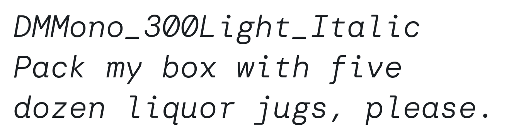](https://github.com/expo/google-fonts/tree/master/font-packages/dm-mono#readme)|||
|||||
### [Balsamiq Sans](https://github.com/expo/google-fonts/tree/master/font-packages/balsamiq-sans#readme)

||||
|-|-|-|
|||||
|[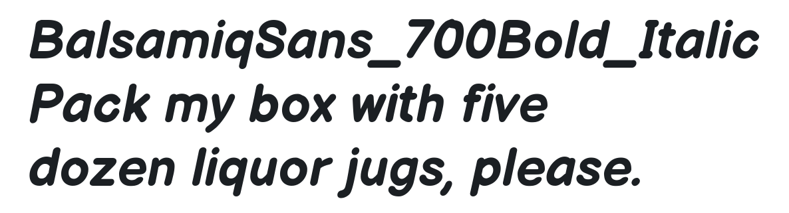](https://github.com/expo/google-fonts/tree/master/font-packages/balsamiq-sans#readme)||||
### [Comic Neue](https://github.com/expo/google-fonts/tree/master/font-packages/comic-neue#readme)

||||
|-|-|-|
|[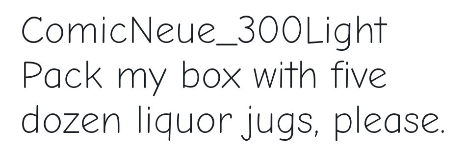](https://github.com/expo/google-fonts/tree/master/font-packages/comic-neue#readme)||||
|[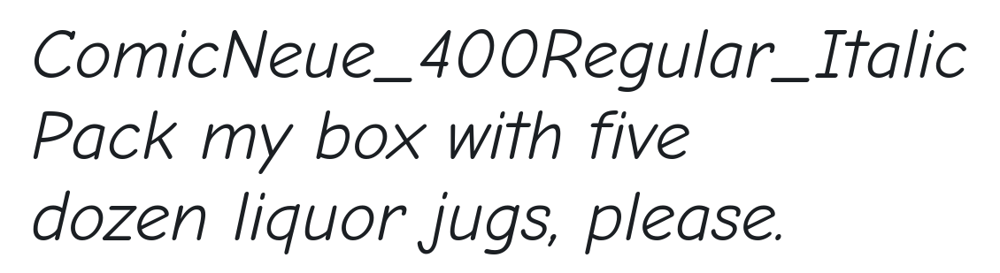](https://github.com/expo/google-fonts/tree/master/font-packages/comic-neue#readme)||[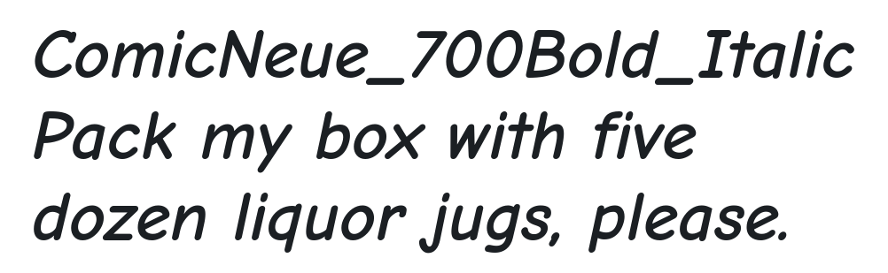](https://github.com/expo/google-fonts/tree/master/font-packages/comic-neue#readme)||
### [Caladea](https://github.com/expo/google-fonts/tree/master/font-packages/caladea#readme)

||||
|-|-|-|
|||[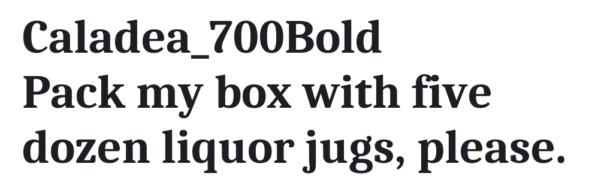](https://github.com/expo/google-fonts/tree/master/font-packages/caladea#readme)||
|||||
### [Jost](https://github.com/expo/google-fonts/tree/master/font-packages/jost#readme)

||||
|-|-|-|
|[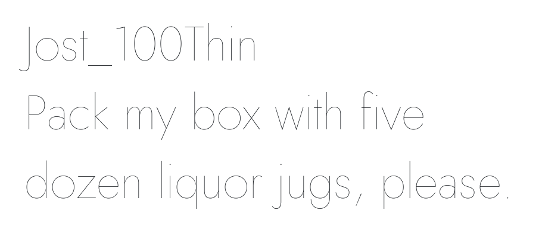](https://github.com/expo/google-fonts/tree/master/font-packages/jost#readme)|[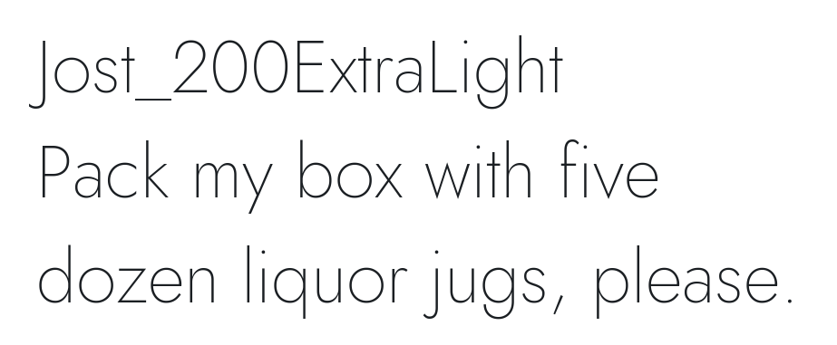](https://github.com/expo/google-fonts/tree/master/font-packages/jost#readme)|[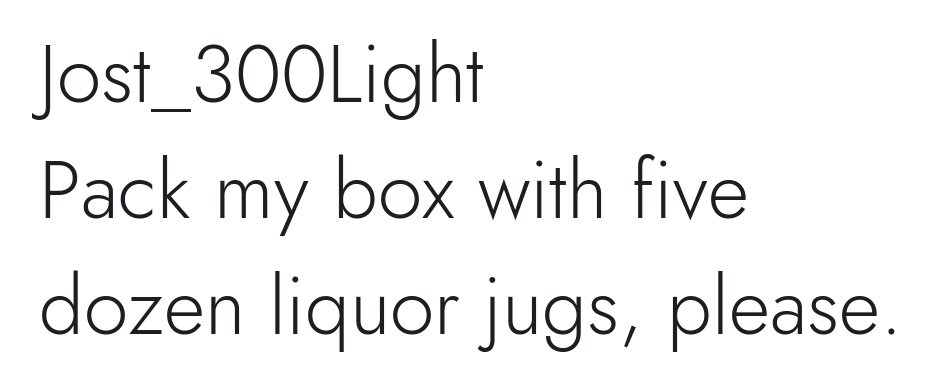](https://github.com/expo/google-fonts/tree/master/font-packages/jost#readme)||
|||||
||[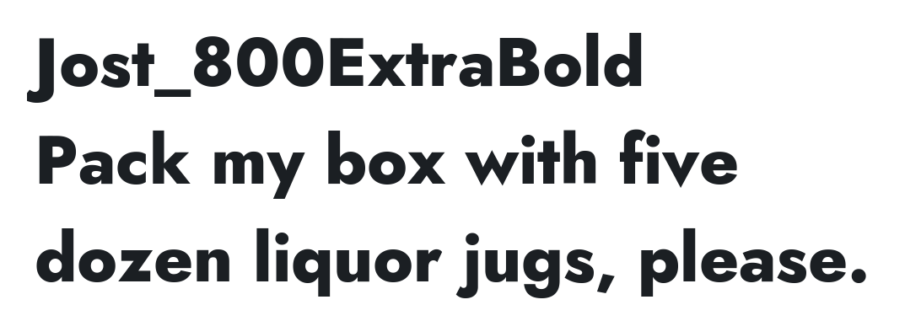](https://github.com/expo/google-fonts/tree/master/font-packages/jost#readme)|||
||[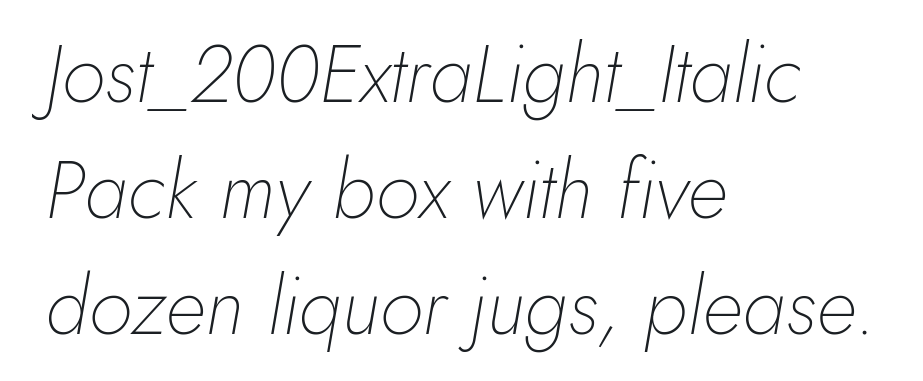](https://github.com/expo/google-fonts/tree/master/font-packages/jost#readme)|||
|[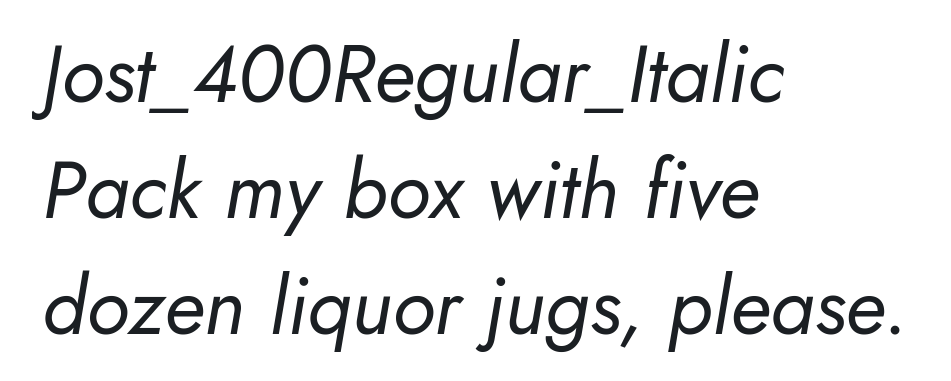](https://github.com/expo/google-fonts/tree/master/font-packages/jost#readme)||||
|||||
### [Oxanium](https://github.com/expo/google-fonts/tree/master/font-packages/oxanium#readme)

||||
|-|-|-|
|[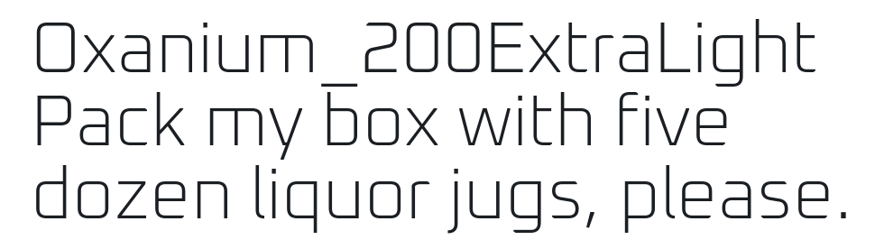](https://github.com/expo/google-fonts/tree/master/font-packages/oxanium#readme)||||
||[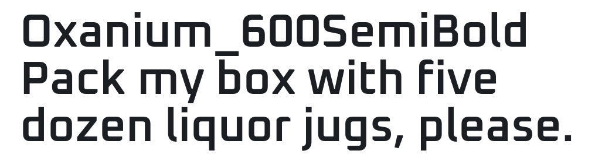](https://github.com/expo/google-fonts/tree/master/font-packages/oxanium#readme)|||
|[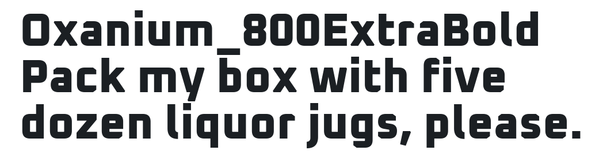](https://github.com/expo/google-fonts/tree/master/font-packages/oxanium#readme)||||
### [Spartan](https://github.com/expo/google-fonts/tree/master/font-packages/spartan#readme)

||||
|-|-|-|
|||||
|||||
|||||
### [Inter](https://github.com/expo/google-fonts/tree/master/font-packages/inter#readme)

||||
|-|-|-|
|||[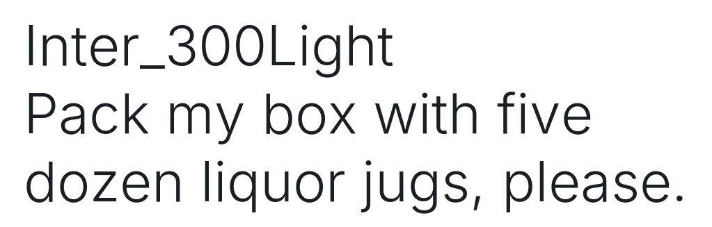](https://github.com/expo/google-fonts/tree/master/font-packages/inter#readme)||
|||||
|[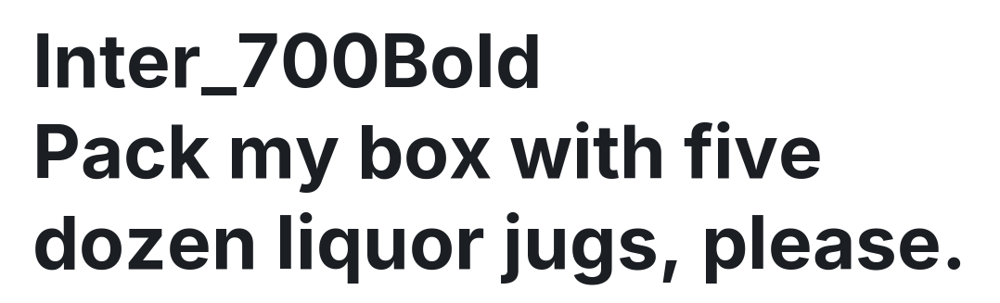](https://github.com/expo/google-fonts/tree/master/font-packages/inter#readme)|[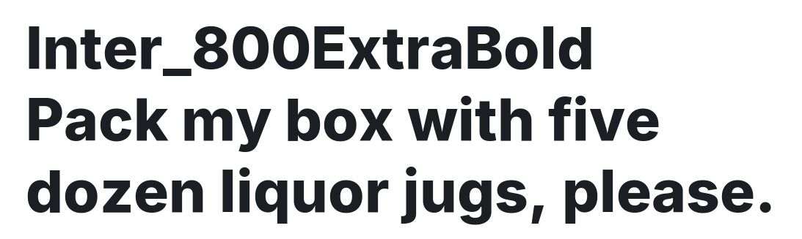](https://github.com/expo/google-fonts/tree/master/font-packages/inter#readme)|||
### [Sen](https://github.com/expo/google-fonts/tree/master/font-packages/sen#readme)

||||
|-|-|-|
|||||
### [Bellota](https://github.com/expo/google-fonts/tree/master/font-packages/bellota#readme)

||||
|-|-|-|
|||||
|[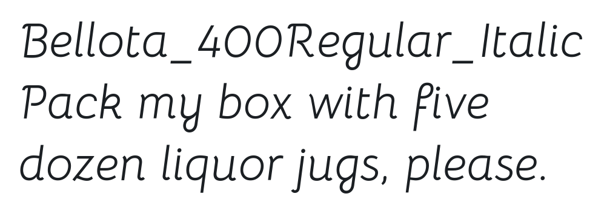](https://github.com/expo/google-fonts/tree/master/font-packages/bellota#readme)||[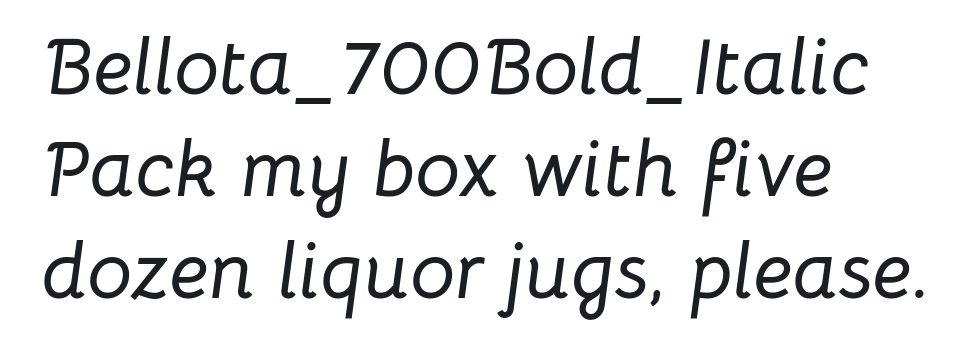](https://github.com/expo/google-fonts/tree/master/font-packages/bellota#readme)||
### [Bellota Text](https://github.com/expo/google-fonts/tree/master/font-packages/bellota-text#readme)

||||
|-|-|-|
||[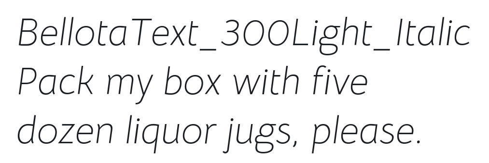](https://github.com/expo/google-fonts/tree/master/font-packages/bellota-text#readme)|||
|[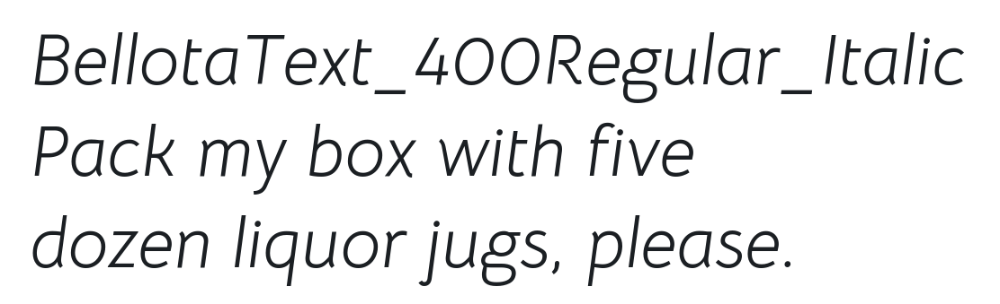](https://github.com/expo/google-fonts/tree/master/font-packages/bellota-text#readme)||||
### [Gotu](https://github.com/expo/google-fonts/tree/master/font-packages/gotu#readme)

||||
|-|-|-|
|||||
### [Courier Prime](https://github.com/expo/google-fonts/tree/master/font-packages/courier-prime#readme)

||||
|-|-|-|
||[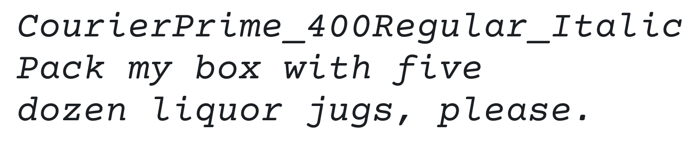](https://github.com/expo/google-fonts/tree/master/font-packages/courier-prime#readme)|||
|||||
### [Girassol](https://github.com/expo/google-fonts/tree/master/font-packages/girassol#readme)

||||
|-|-|-|
|[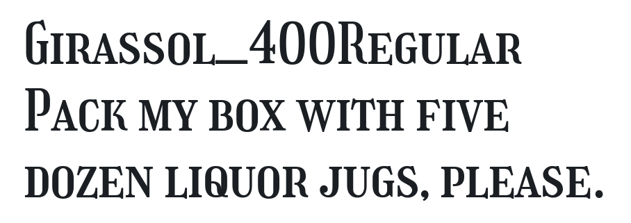](https://github.com/expo/google-fonts/tree/master/font-packages/girassol#readme)||||
### [Inria Sans](https://github.com/expo/google-fonts/tree/master/font-packages/inria-sans#readme)

||||
|-|-|-|
|||||
|||||
### [Inria Serif](https://github.com/expo/google-fonts/tree/master/font-packages/inria-serif#readme)

||||
|-|-|-|
|[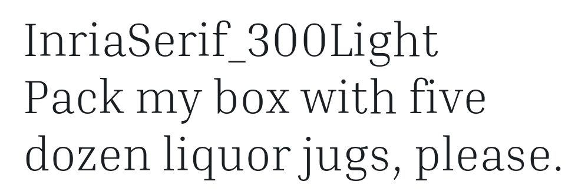](https://github.com/expo/google-fonts/tree/master/font-packages/inria-serif#readme)||[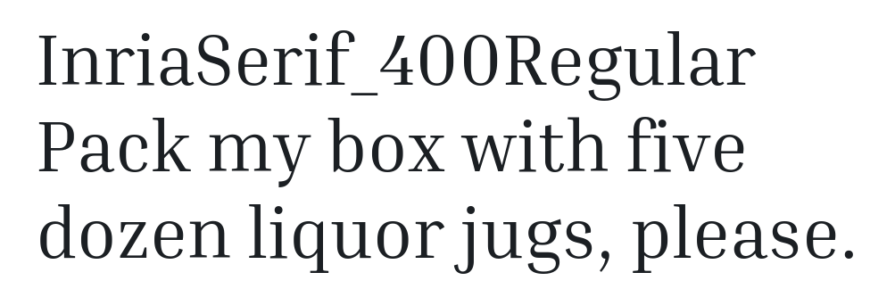](https://github.com/expo/google-fonts/tree/master/font-packages/inria-serif#readme)||
|[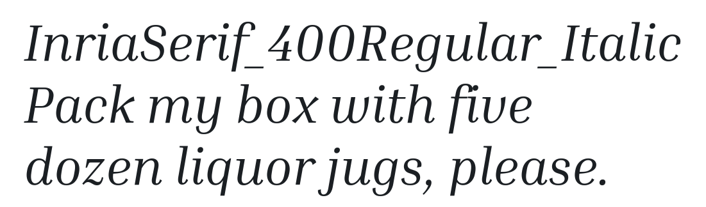](https://github.com/expo/google-fonts/tree/master/font-packages/inria-serif#readme)||||
### [Gelasio](https://github.com/expo/google-fonts/tree/master/font-packages/gelasio#readme)

||||
|-|-|-|
||[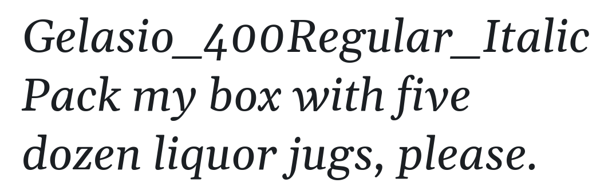](https://github.com/expo/google-fonts/tree/master/font-packages/gelasio#readme)|||
||[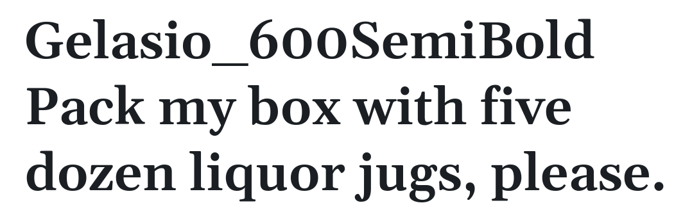](https://github.com/expo/google-fonts/tree/master/font-packages/gelasio#readme)|||
||[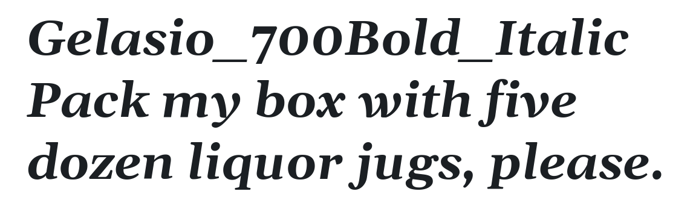](https://github.com/expo/google-fonts/tree/master/font-packages/gelasio#readme)|||
### [Gupter](https://github.com/expo/google-fonts/tree/master/font-packages/gupter#readme)

||||
|-|-|-|
|||[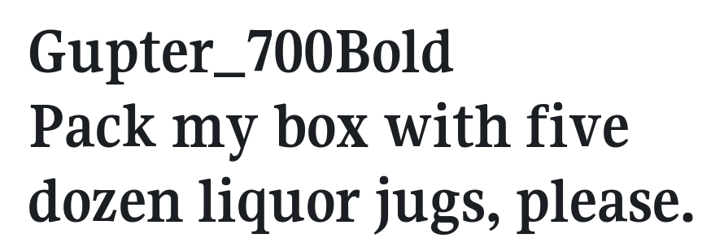](https://github.com/expo/google-fonts/tree/master/font-packages/gupter#readme)||
### [Alata](https://github.com/expo/google-fonts/tree/master/font-packages/alata#readme)

||||
|-|-|-|
|||||
### [Odibee Sans](https://github.com/expo/google-fonts/tree/master/font-packages/odibee-sans#readme)

||||
|-|-|-|
|||||
### [Alatsi](https://github.com/expo/google-fonts/tree/master/font-packages/alatsi#readme)

||||
|-|-|-|
|[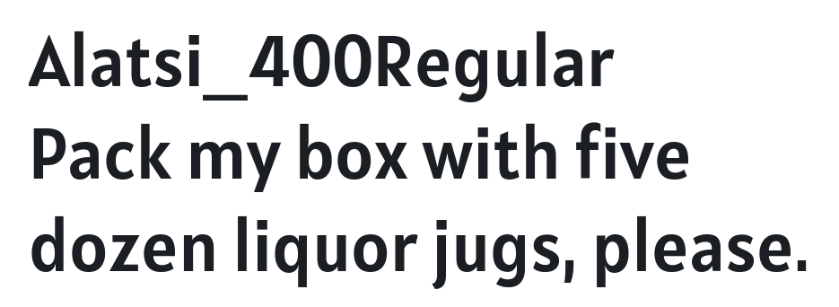](https://github.com/expo/google-fonts/tree/master/font-packages/alatsi#readme)||||
### [Viaoda Libre](https://github.com/expo/google-fonts/tree/master/font-packages/viaoda-libre#readme)

||||
|-|-|-|
|[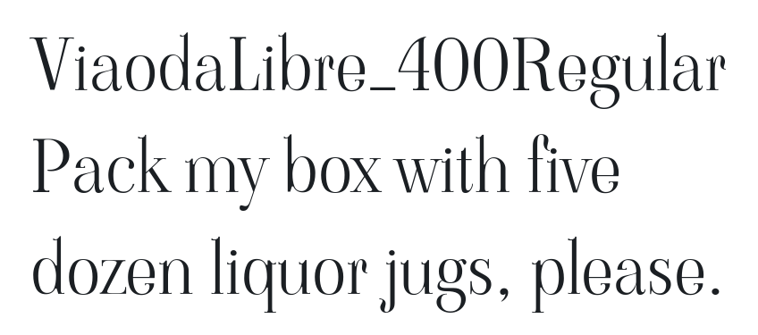](https://github.com/expo/google-fonts/tree/master/font-packages/viaoda-libre#readme)||||
### [Calistoga](https://github.com/expo/google-fonts/tree/master/font-packages/calistoga#readme)

||||
|-|-|-|
|||||
### [Ibarra Real Nova](https://github.com/expo/google-fonts/tree/master/font-packages/ibarra-real-nova#readme)

||||
|-|-|-|
||[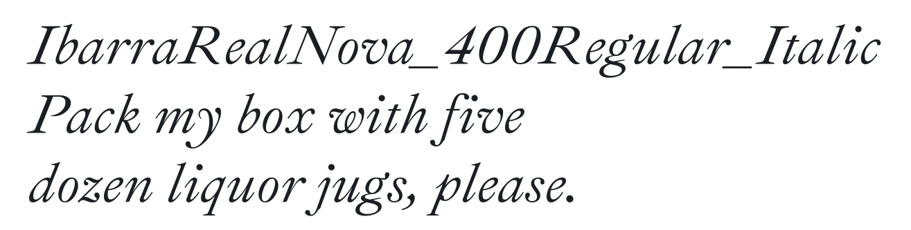](https://github.com/expo/google-fonts/tree/master/font-packages/ibarra-real-nova#readme)|||
|||||
### [Bebas Neue](https://github.com/expo/google-fonts/tree/master/font-packages/bebas-neue#readme)

||||
|-|-|-|
|[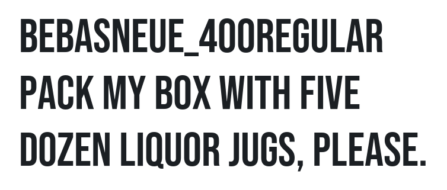](https://github.com/expo/google-fonts/tree/master/font-packages/bebas-neue#readme)||||
### [Baskervville](https://github.com/expo/google-fonts/tree/master/font-packages/baskervville#readme)

||||
|-|-|-|
|||||
### [Manrope](https://github.com/expo/google-fonts/tree/master/font-packages/manrope#readme)

||||
|-|-|-|
|[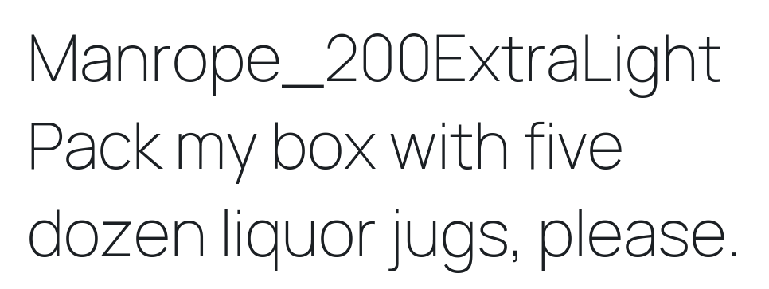](https://github.com/expo/google-fonts/tree/master/font-packages/manrope#readme)||||
|||||
|[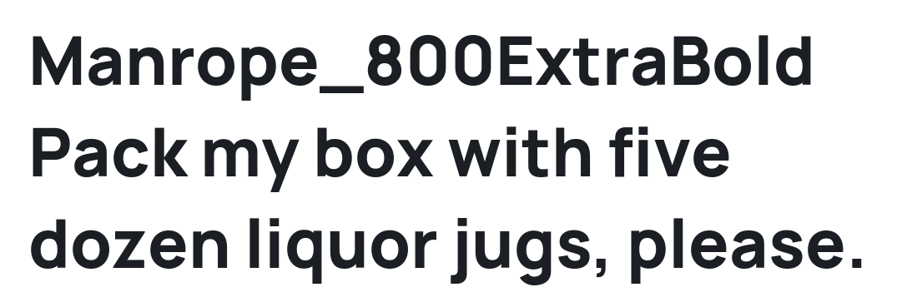](https://github.com/expo/google-fonts/tree/master/font-packages/manrope#readme)||||
### [Tomorrow](https://github.com/expo/google-fonts/tree/master/font-packages/tomorrow#readme)

||||
|-|-|-|
|||||
|||[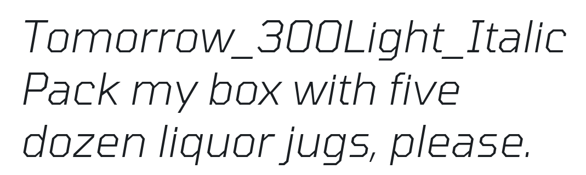](https://github.com/expo/google-fonts/tree/master/font-packages/tomorrow#readme)||
|||||
|||||
|||||
|||||
### [Kulim Park](https://github.com/expo/google-fonts/tree/master/font-packages/kulim-park#readme)

||||
|-|-|-|
|[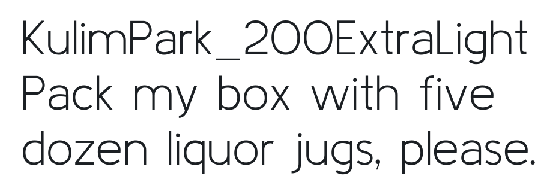](https://github.com/expo/google-fonts/tree/master/font-packages/kulim-park#readme)||||
|[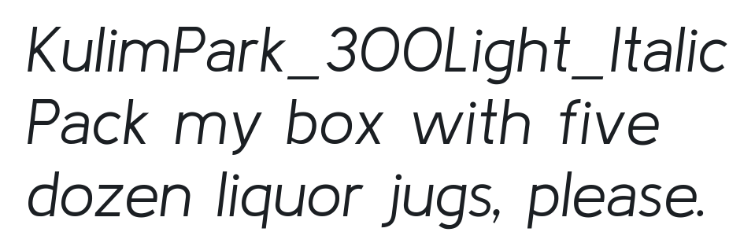](https://github.com/expo/google-fonts/tree/master/font-packages/kulim-park#readme)||||
|||||
|||||
### [Sulphur Point](https://github.com/expo/google-fonts/tree/master/font-packages/sulphur-point#readme)

||||
|-|-|-|
|||||
### [Big Shoulders Display](https://github.com/expo/google-fonts/tree/master/font-packages/big-shoulders-display#readme)

||||
|-|-|-|
|||||
|||||
|||||
### [Big Shoulders Text](https://github.com/expo/google-fonts/tree/master/font-packages/big-shoulders-text#readme)

||||
|-|-|-|
|||||
|||||
|||||
### [Jomolhari](https://github.com/expo/google-fonts/tree/master/font-packages/jomolhari#readme)

||||
|-|-|-|
|||||
### [Turret Road](https://github.com/expo/google-fonts/tree/master/font-packages/turret-road#readme)

||||
|-|-|-|
|[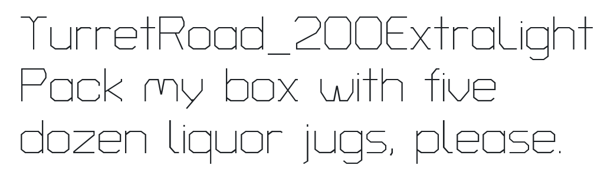](https://github.com/expo/google-fonts/tree/master/font-packages/turret-road#readme)|[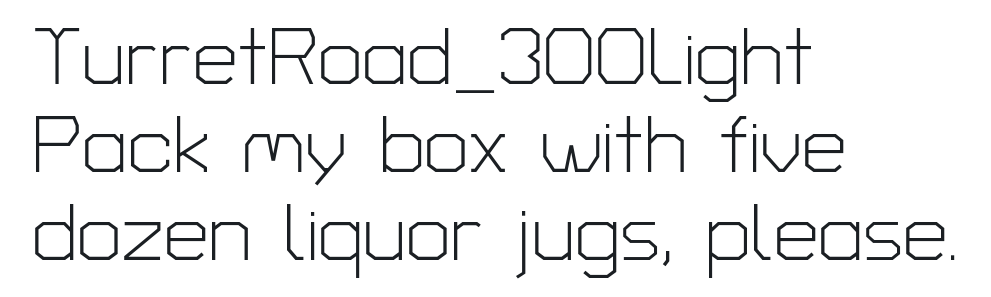](https://github.com/expo/google-fonts/tree/master/font-packages/turret-road#readme)|||
||[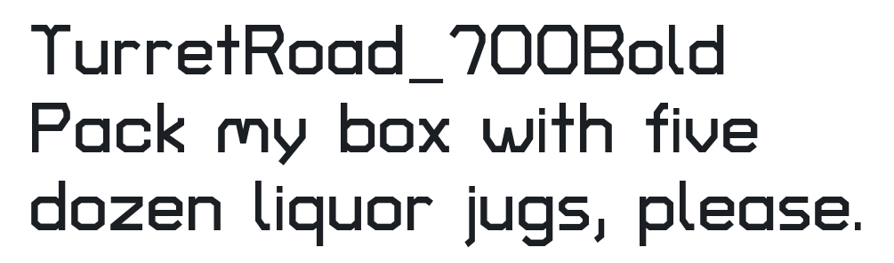](https://github.com/expo/google-fonts/tree/master/font-packages/turret-road#readme)|[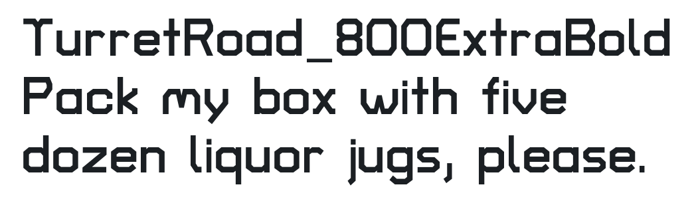](https://github.com/expo/google-fonts/tree/master/font-packages/turret-road#readme)||
### [Mansalva](https://github.com/expo/google-fonts/tree/master/font-packages/mansalva#readme)

||||
|-|-|-|
|||||
### [Be Vietnam](https://github.com/expo/google-fonts/tree/master/font-packages/be-vietnam#readme)

||||
|-|-|-|
|||||
|||||
|||||
|||||
|||||
### [Lexend Deca](https://github.com/expo/google-fonts/tree/master/font-packages/lexend-deca#readme)

||||
|-|-|-|
|||||
### [Lexend Exa](https://github.com/expo/google-fonts/tree/master/font-packages/lexend-exa#readme)

||||
|-|-|-|
|||||
### [Lexend Giga](https://github.com/expo/google-fonts/tree/master/font-packages/lexend-giga#readme)

||||
|-|-|-|
|[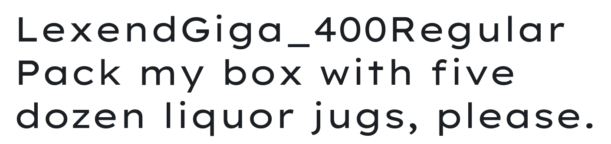](https://github.com/expo/google-fonts/tree/master/font-packages/lexend-giga#readme)||||
### [Lexend Mega](https://github.com/expo/google-fonts/tree/master/font-packages/lexend-mega#readme)

||||
|-|-|-|
|[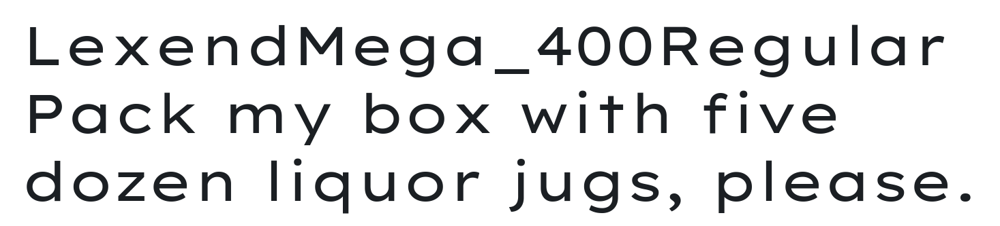](https://github.com/expo/google-fonts/tree/master/font-packages/lexend-mega#readme)||||
### [Lexend Peta](https://github.com/expo/google-fonts/tree/master/font-packages/lexend-peta#readme)

||||
|-|-|-|
|[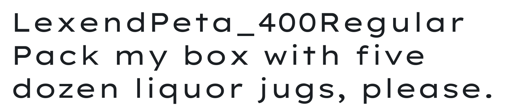](https://github.com/expo/google-fonts/tree/master/font-packages/lexend-peta#readme)||||
### [Lexend Tera](https://github.com/expo/google-fonts/tree/master/font-packages/lexend-tera#readme)

||||
|-|-|-|
|||||
### [Lexend Zetta](https://github.com/expo/google-fonts/tree/master/font-packages/lexend-zetta#readme)

||||
|-|-|-|
|||||
### [Farro](https://github.com/expo/google-fonts/tree/master/font-packages/farro#readme)

||||
|-|-|-|
|||||
|||||
### [Lacquer](https://github.com/expo/google-fonts/tree/master/font-packages/lacquer#readme)

||||
|-|-|-|
|||||
### [Blinker](https://github.com/expo/google-fonts/tree/master/font-packages/blinker#readme)

||||
|-|-|-|
||[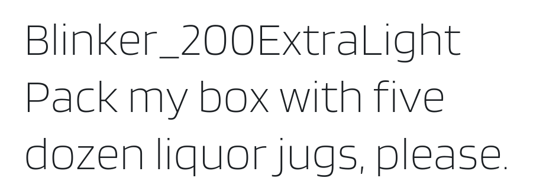](https://github.com/expo/google-fonts/tree/master/font-packages/blinker#readme)|||
|||||
||[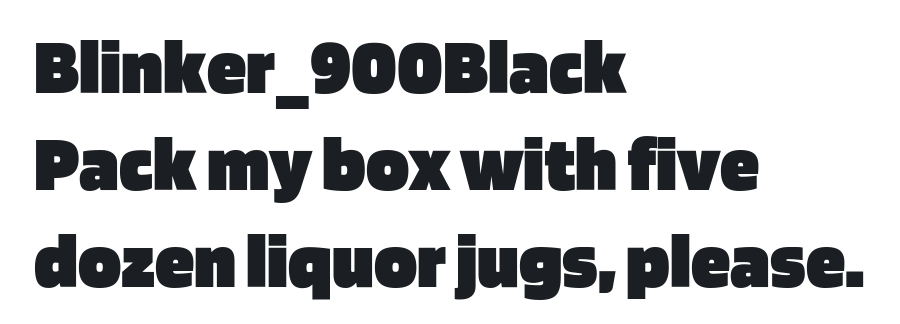](https://github.com/expo/google-fonts/tree/master/font-packages/blinker#readme)|||
### [Livvic](https://github.com/expo/google-fonts/tree/master/font-packages/livvic#readme)

||||
|-|-|-|
|[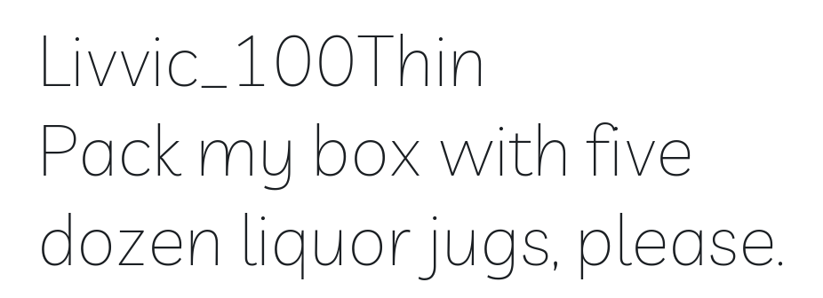](https://github.com/expo/google-fonts/tree/master/font-packages/livvic#readme)||||
||[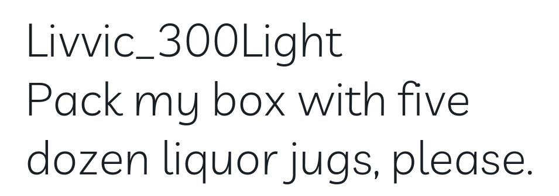](https://github.com/expo/google-fonts/tree/master/font-packages/livvic#readme)|[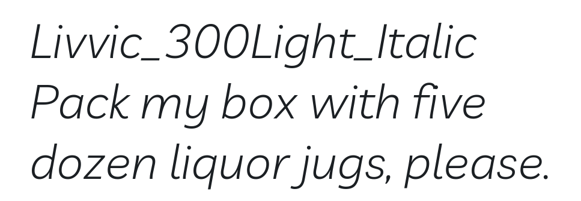](https://github.com/expo/google-fonts/tree/master/font-packages/livvic#readme)||
|||||
|||||
||[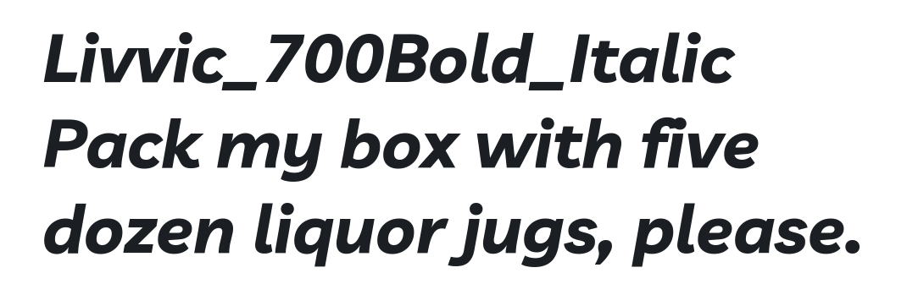](https://github.com/expo/google-fonts/tree/master/font-packages/livvic#readme)|||
|[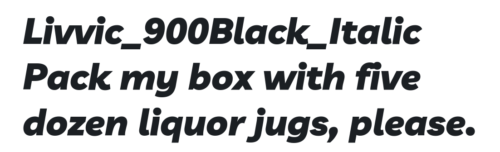](https://github.com/expo/google-fonts/tree/master/font-packages/livvic#readme)||||
### [Darker Grotesque](https://github.com/expo/google-fonts/tree/master/font-packages/darker-grotesque#readme)

||||
|-|-|-|
|[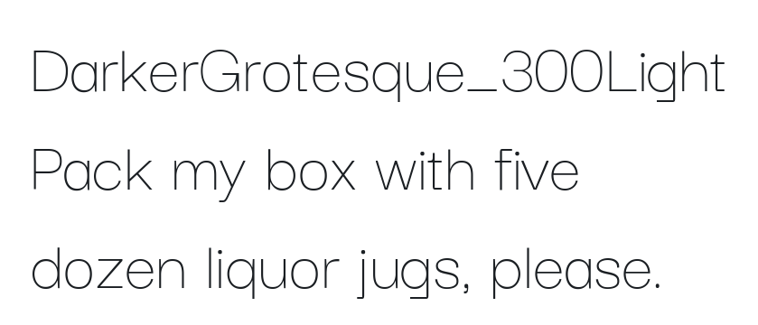](https://github.com/expo/google-fonts/tree/master/font-packages/darker-grotesque#readme)||||
|[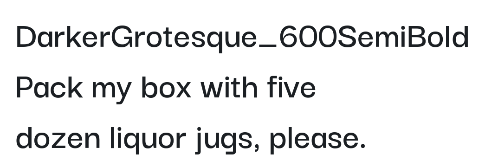](https://github.com/expo/google-fonts/tree/master/font-packages/darker-grotesque#readme)|[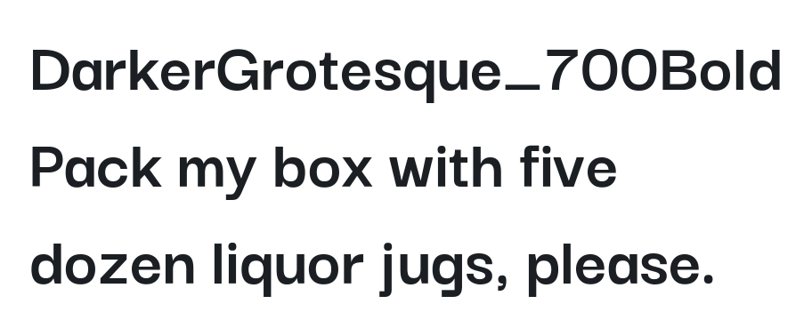](https://github.com/expo/google-fonts/tree/master/font-packages/darker-grotesque#readme)|||
|[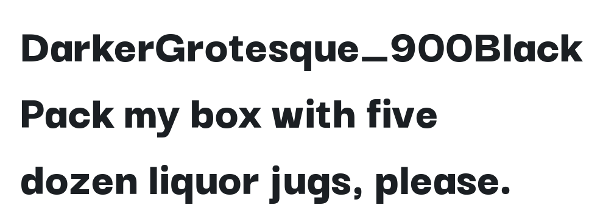](https://github.com/expo/google-fonts/tree/master/font-packages/darker-grotesque#readme)||||
### [Saira Stencil One](https://github.com/expo/google-fonts/tree/master/font-packages/saira-stencil-one#readme)

||||
|-|-|-|
|[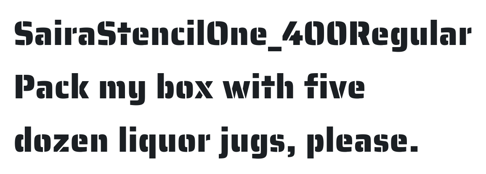](https://github.com/expo/google-fonts/tree/master/font-packages/saira-stencil-one#readme)||||
### [Bahianita](https://github.com/expo/google-fonts/tree/master/font-packages/bahianita#readme)

||||
|-|-|-|
|[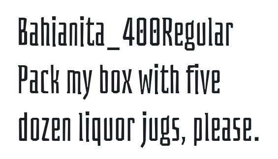](https://github.com/expo/google-fonts/tree/master/font-packages/bahianita#readme)||||
### [Barriecito](https://github.com/expo/google-fonts/tree/master/font-packages/barriecito#readme)

||||
|-|-|-|
|[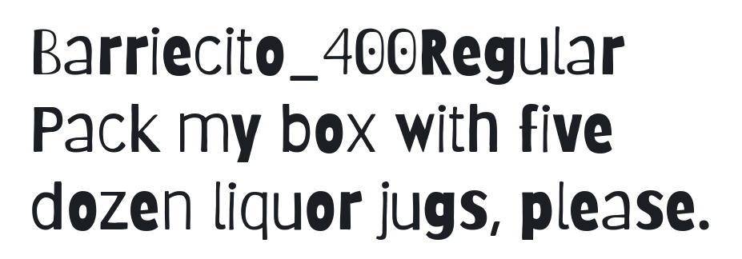](https://github.com/expo/google-fonts/tree/master/font-packages/barriecito#readme)||||
### [DM Sans](https://github.com/expo/google-fonts/tree/master/font-packages/dm-sans#readme)

||||
|-|-|-|
|[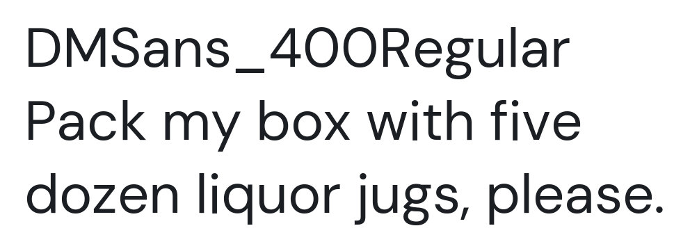](https://github.com/expo/google-fonts/tree/master/font-packages/dm-sans#readme)||||
|||||
### [DM Serif Display](https://github.com/expo/google-fonts/tree/master/font-packages/dm-serif-display#readme)

||||
|-|-|-|
|[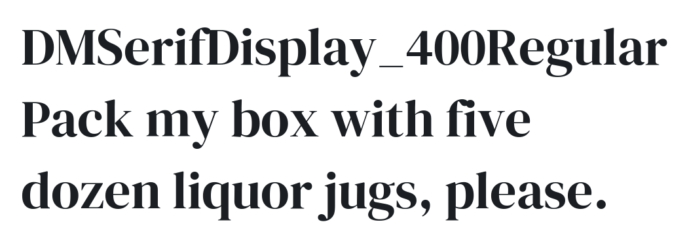](https://github.com/expo/google-fonts/tree/master/font-packages/dm-serif-display#readme)||||
### [DM Serif Text](https://github.com/expo/google-fonts/tree/master/font-packages/dm-serif-text#readme)

||||
|-|-|-|
|||||
### [Gayathri](https://github.com/expo/google-fonts/tree/master/font-packages/gayathri#readme)

||||
|-|-|-|
|||[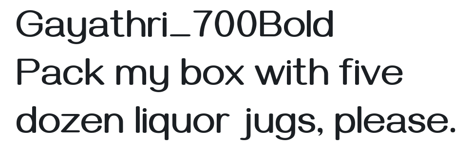](https://github.com/expo/google-fonts/tree/master/font-packages/gayathri#readme)||
### [Public Sans](https://github.com/expo/google-fonts/tree/master/font-packages/public-sans#readme)

||||
|-|-|-|
|||[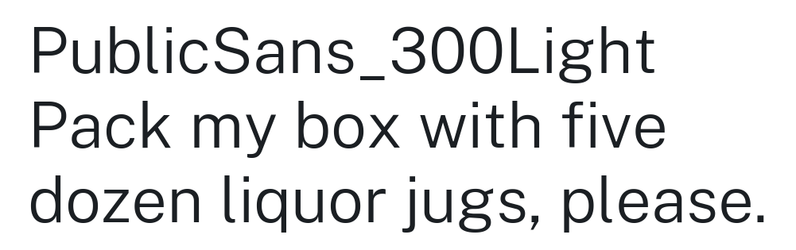](https://github.com/expo/google-fonts/tree/master/font-packages/public-sans#readme)||
|||||
||[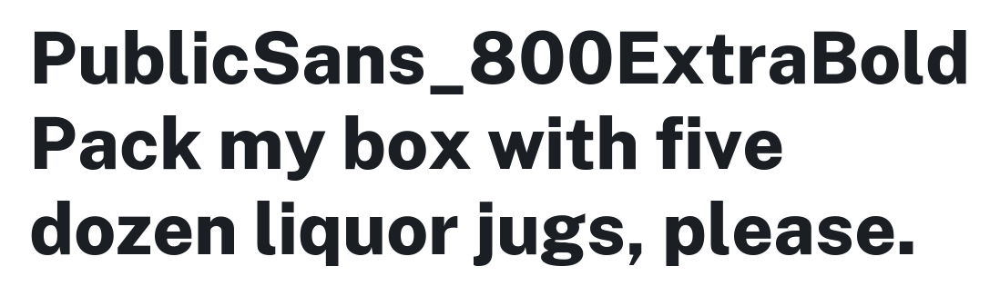](https://github.com/expo/google-fonts/tree/master/font-packages/public-sans#readme)|[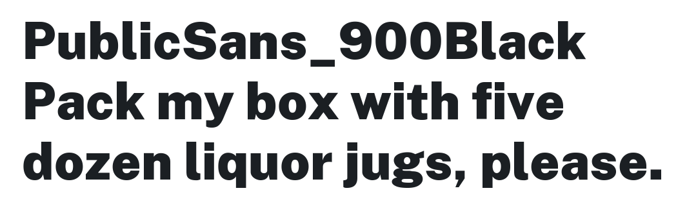](https://github.com/expo/google-fonts/tree/master/font-packages/public-sans#readme)||
||[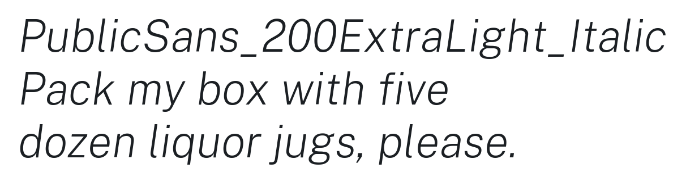](https://github.com/expo/google-fonts/tree/master/font-packages/public-sans#readme)|||
|||||
||[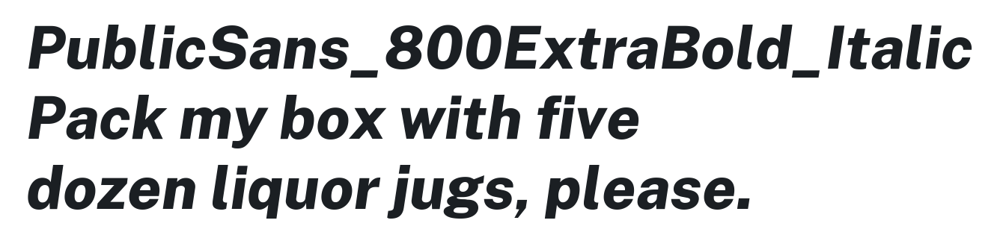](https://github.com/expo/google-fonts/tree/master/font-packages/public-sans#readme)|[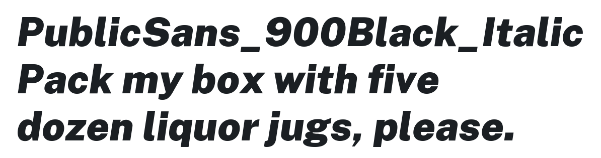](https://github.com/expo/google-fonts/tree/master/font-packages/public-sans#readme)||
### [Almarai](https://github.com/expo/google-fonts/tree/master/font-packages/almarai#readme)

||||
|-|-|-|
|||||
|||||
### [Beth Ellen](https://github.com/expo/google-fonts/tree/master/font-packages/beth-ellen#readme)

||||
|-|-|-|
|[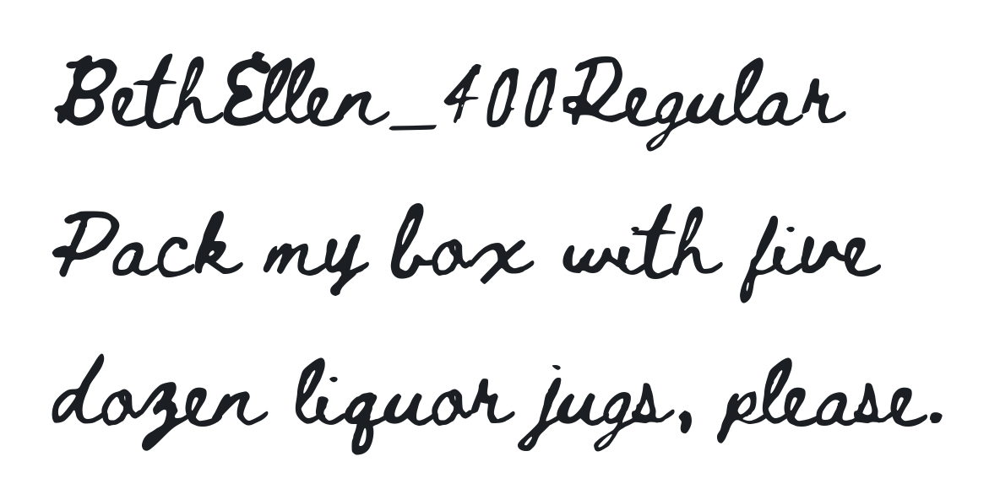](https://github.com/expo/google-fonts/tree/master/font-packages/beth-ellen#readme)||||
### [Vibes](https://github.com/expo/google-fonts/tree/master/font-packages/vibes#readme)

||||
|-|-|-|
|[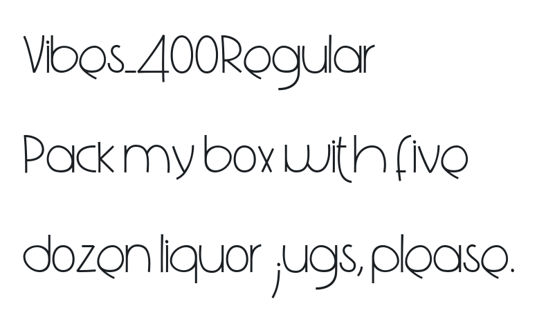](https://github.com/expo/google-fonts/tree/master/font-packages/vibes#readme)||||
### [Red Hat Display](https://github.com/expo/google-fonts/tree/master/font-packages/red-hat-display#readme)

||||
|-|-|-|
|||[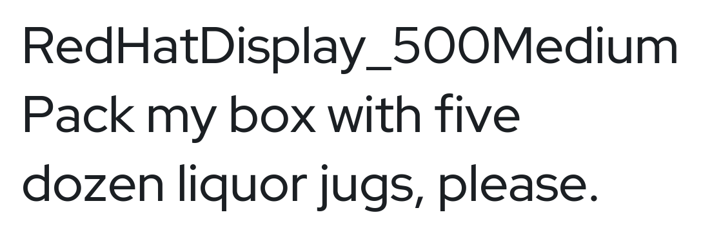](https://github.com/expo/google-fonts/tree/master/font-packages/red-hat-display#readme)||
|||[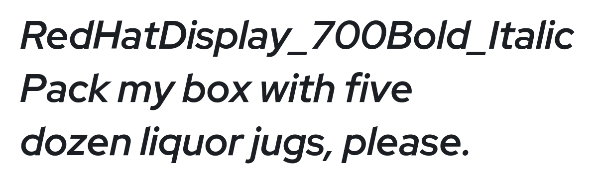](https://github.com/expo/google-fonts/tree/master/font-packages/red-hat-display#readme)||
||[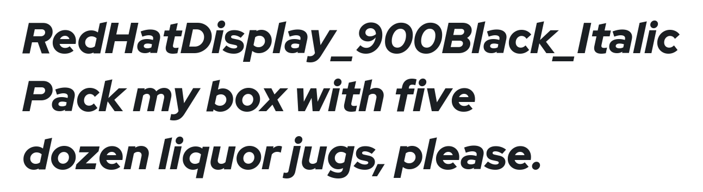](https://github.com/expo/google-fonts/tree/master/font-packages/red-hat-display#readme)|||
### [Red Hat Text](https://github.com/expo/google-fonts/tree/master/font-packages/red-hat-text#readme)

||||
|-|-|-|
|||||
|||||
### [Fira Code](https://github.com/expo/google-fonts/tree/master/font-packages/fira-code#readme)

||||
|-|-|-|
|[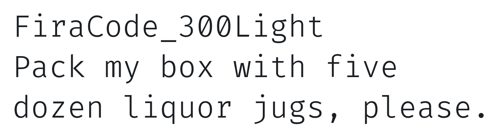](https://github.com/expo/google-fonts/tree/master/font-packages/fira-code#readme)||||
|||||
### [Liu Jian Mao Cao](https://github.com/expo/google-fonts/tree/master/font-packages/liu-jian-mao-cao#readme)

||||
|-|-|-|
|||||
### [Long Cang](https://github.com/expo/google-fonts/tree/master/font-packages/long-cang#readme)

||||
|-|-|-|
|||||
### [Ma Shan Zheng](https://github.com/expo/google-fonts/tree/master/font-packages/ma-shan-zheng#readme)

||||
|-|-|-|
|||||
### [Zhi Mang Xing](https://github.com/expo/google-fonts/tree/master/font-packages/zhi-mang-xing#readme)

||||
|-|-|-|
|||||
### [Noto Sans HK](https://github.com/expo/google-fonts/tree/master/font-packages/noto-sans-hk#readme)

||||
|-|-|-|
|||[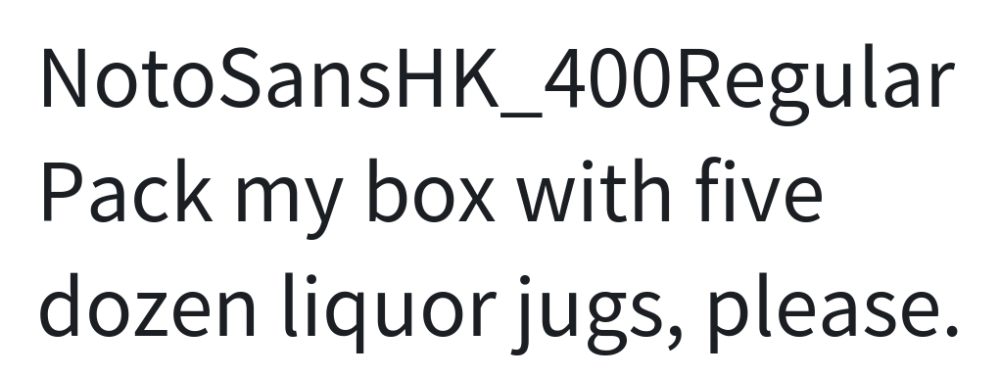](https://github.com/expo/google-fonts/tree/master/font-packages/noto-sans-hk#readme)||
||[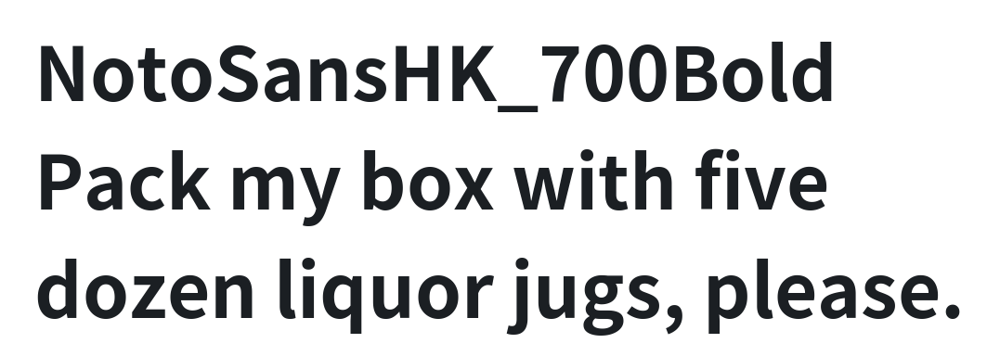](https://github.com/expo/google-fonts/tree/master/font-packages/noto-sans-hk#readme)|||
### [Aleo](https://github.com/expo/google-fonts/tree/master/font-packages/aleo#readme)

||||
|-|-|-|
|||||
|[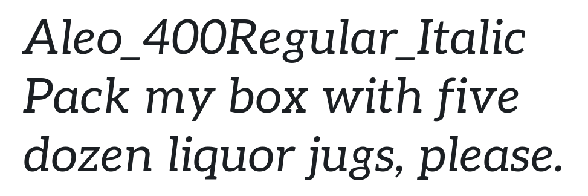](https://github.com/expo/google-fonts/tree/master/font-packages/aleo#readme)||||
### [B612](https://github.com/expo/google-fonts/tree/master/font-packages/b612#readme)

||||
|-|-|-|
|||[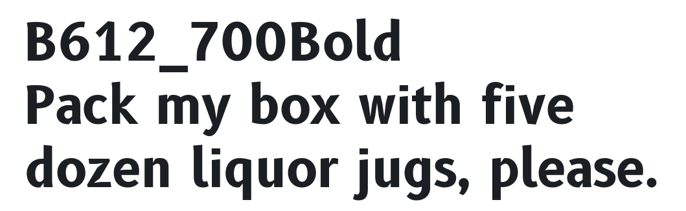](https://github.com/expo/google-fonts/tree/master/font-packages/b612#readme)||
|[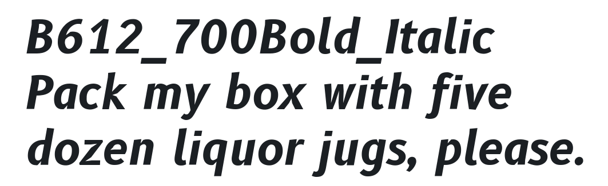](https://github.com/expo/google-fonts/tree/master/font-packages/b612#readme)||||
### [B612 Mono](https://github.com/expo/google-fonts/tree/master/font-packages/b612-mono#readme)

||||
|-|-|-|
|[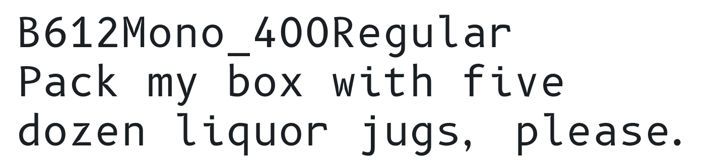](https://github.com/expo/google-fonts/tree/master/font-packages/b612-mono#readme)|[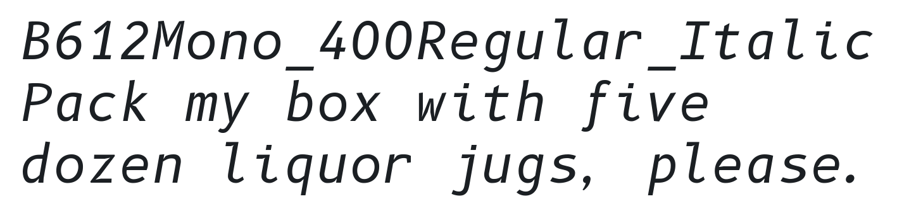](https://github.com/expo/google-fonts/tree/master/font-packages/b612-mono#readme)|||
|||||
### [Charm](https://github.com/expo/google-fonts/tree/master/font-packages/charm#readme)

||||
|-|-|-|
|[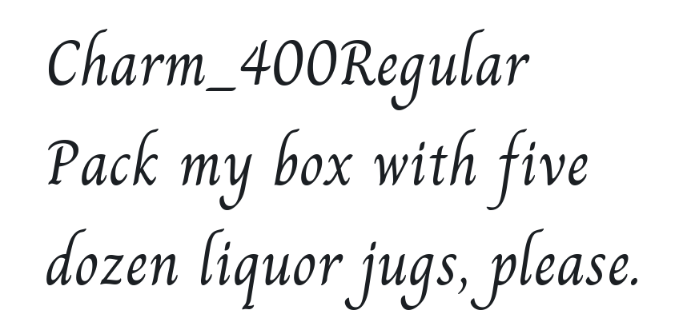](https://github.com/expo/google-fonts/tree/master/font-packages/charm#readme)|[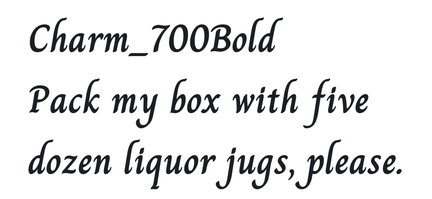](https://github.com/expo/google-fonts/tree/master/font-packages/charm#readme)|||
### [Major Mono Display](https://github.com/expo/google-fonts/tree/master/font-packages/major-mono-display#readme)

||||
|-|-|-|
|||||
### [ZCOOL KuaiLe](https://github.com/expo/google-fonts/tree/master/font-packages/zcool-kuaile#readme)

||||
|-|-|-|
|||||
### [ZCOOL QingKe HuangYou](https://github.com/expo/google-fonts/tree/master/font-packages/zcool-qingke-huangyou#readme)

||||
|-|-|-|
|||||
### [ZCOOL XiaoWei](https://github.com/expo/google-fonts/tree/master/font-packages/zcool-xiaowei#readme)

||||
|-|-|-|
|||||
### [Staatliches](https://github.com/expo/google-fonts/tree/master/font-packages/staatliches#readme)

||||
|-|-|-|
|[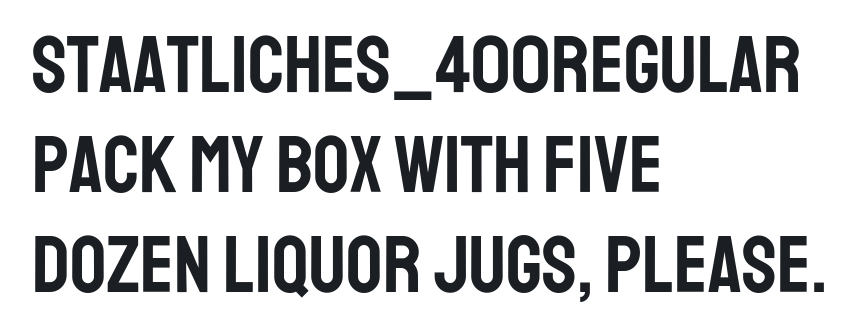](https://github.com/expo/google-fonts/tree/master/font-packages/staatliches#readme)||||
### [Literata](https://github.com/expo/google-fonts/tree/master/font-packages/literata#readme)

||||
|-|-|-|
|[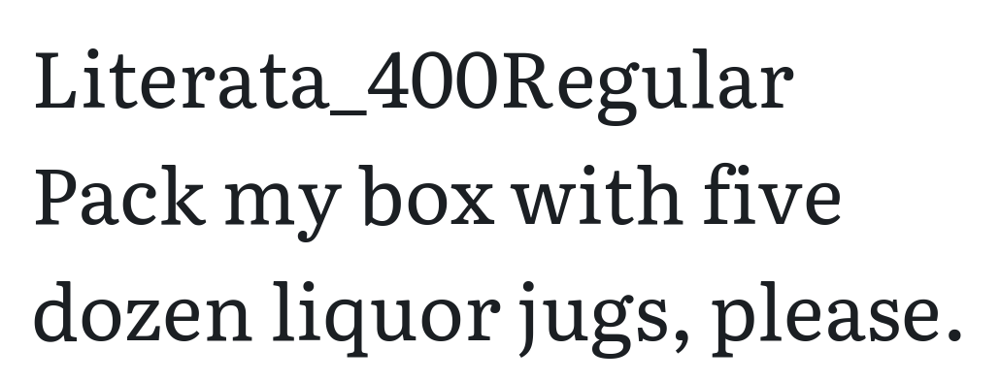](https://github.com/expo/google-fonts/tree/master/font-packages/literata#readme)||||
|||||
|||||
### [Crimson Pro](https://github.com/expo/google-fonts/tree/master/font-packages/crimson-pro#readme)

||||
|-|-|-|
||[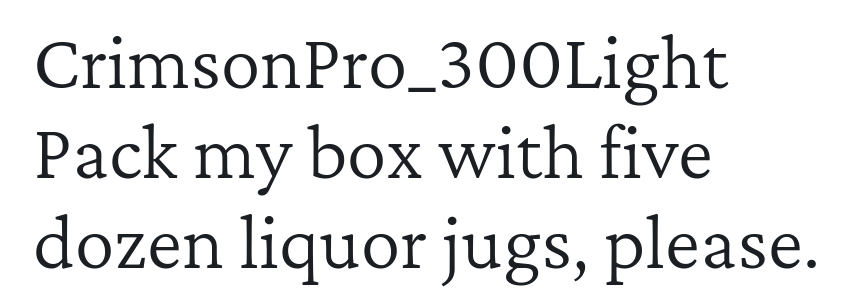](https://github.com/expo/google-fonts/tree/master/font-packages/crimson-pro#readme)|[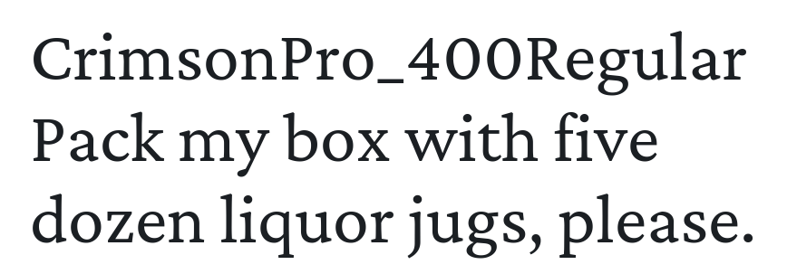](https://github.com/expo/google-fonts/tree/master/font-packages/crimson-pro#readme)||
|||||
|||||
|[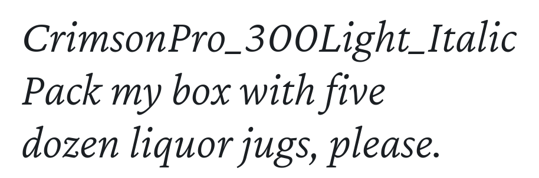](https://github.com/expo/google-fonts/tree/master/font-packages/crimson-pro#readme)||||
|||||
|||||
### [Noto Serif TC](https://github.com/expo/google-fonts/tree/master/font-packages/noto-serif-tc#readme)

||||
|-|-|-|
|||||
|||[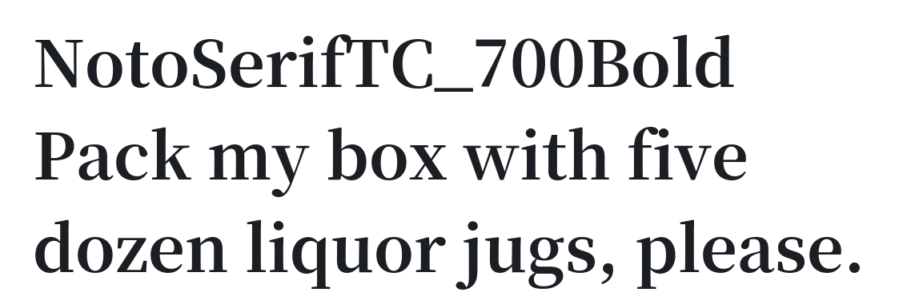](https://github.com/expo/google-fonts/tree/master/font-packages/noto-serif-tc#readme)||
|||||
### [Noto Serif SC](https://github.com/expo/google-fonts/tree/master/font-packages/noto-serif-sc#readme)

||||
|-|-|-|
|||[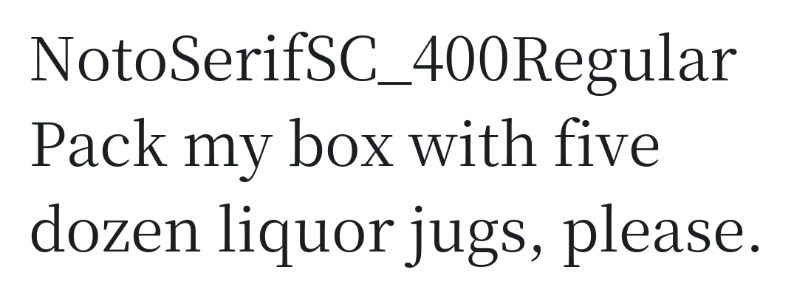](https://github.com/expo/google-fonts/tree/master/font-packages/noto-serif-sc#readme)||
|[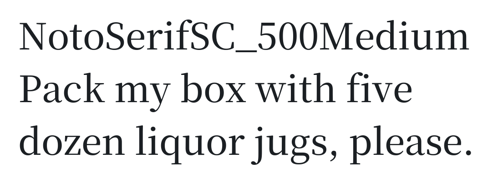](https://github.com/expo/google-fonts/tree/master/font-packages/noto-serif-sc#readme)|[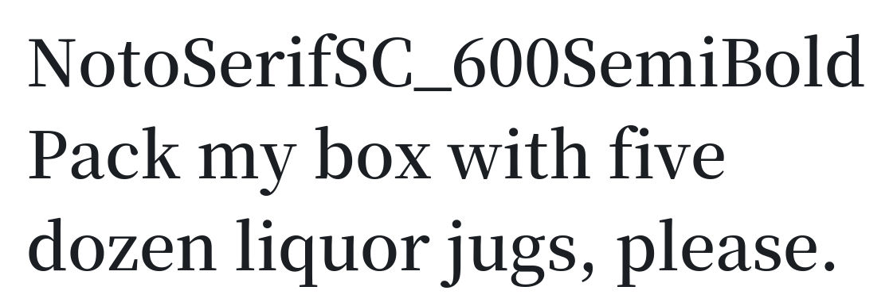](https://github.com/expo/google-fonts/tree/master/font-packages/noto-serif-sc#readme)|[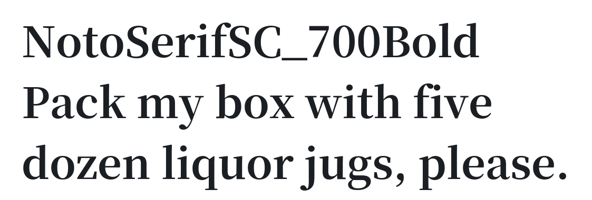](https://github.com/expo/google-fonts/tree/master/font-packages/noto-serif-sc#readme)||
|[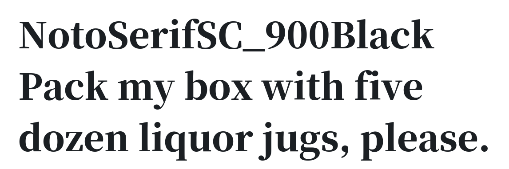](https://github.com/expo/google-fonts/tree/master/font-packages/noto-serif-sc#readme)||||
### [Manjari](https://github.com/expo/google-fonts/tree/master/font-packages/manjari#readme)

||||
|-|-|-|
|||||
### [Noto Sans SC](https://github.com/expo/google-fonts/tree/master/font-packages/noto-sans-sc#readme)

||||
|-|-|-|
|||||
|||||
### [Noto Sans TC](https://github.com/expo/google-fonts/tree/master/font-packages/noto-sans-tc#readme)

||||
|-|-|-|
|[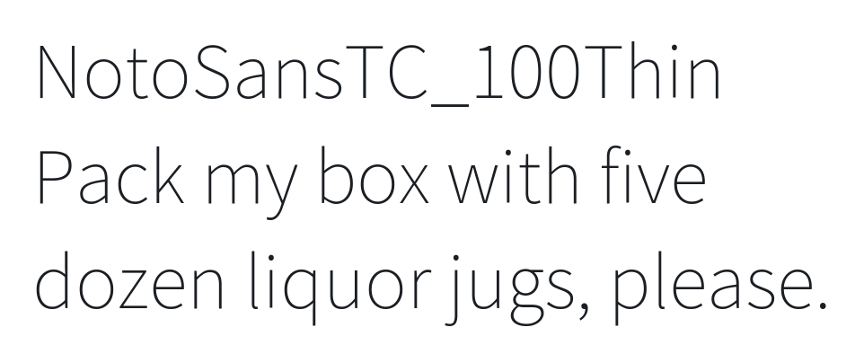](https://github.com/expo/google-fonts/tree/master/font-packages/noto-sans-tc#readme)||[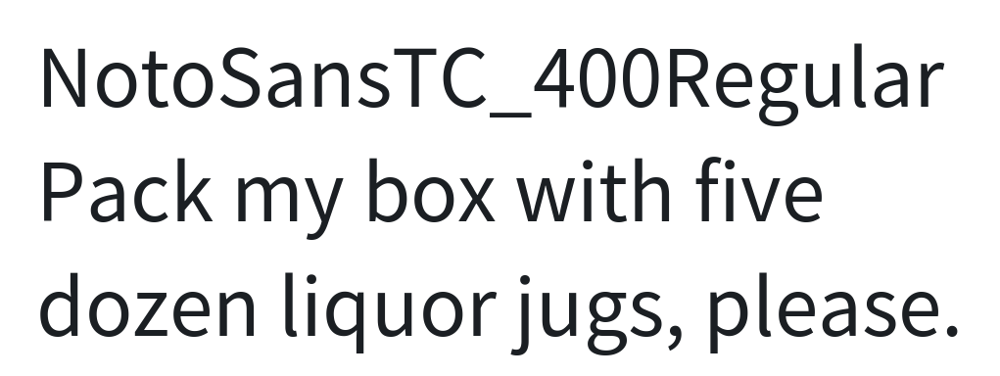](https://github.com/expo/google-fonts/tree/master/font-packages/noto-sans-tc#readme)||
|||[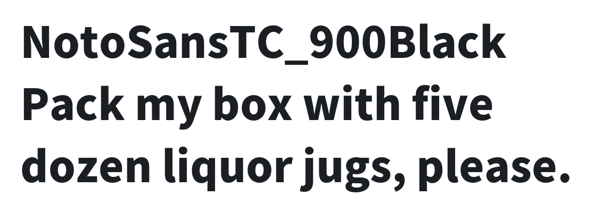](https://github.com/expo/google-fonts/tree/master/font-packages/noto-sans-tc#readme)||
### [Hepta Slab](https://github.com/expo/google-fonts/tree/master/font-packages/hepta-slab#readme)

||||
|-|-|-|
|||||
||[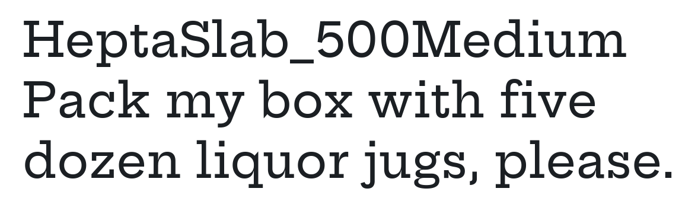](https://github.com/expo/google-fonts/tree/master/font-packages/hepta-slab#readme)|||
|||||
### [Grenze](https://github.com/expo/google-fonts/tree/master/font-packages/grenze#readme)

||||
|-|-|-|
|||[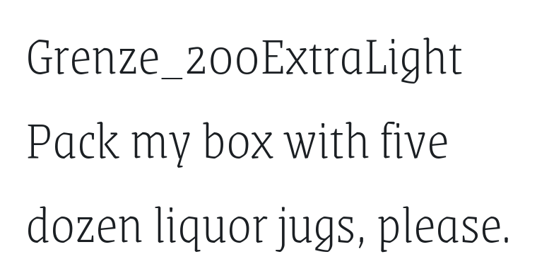](https://github.com/expo/google-fonts/tree/master/font-packages/grenze#readme)||
|||||
|||[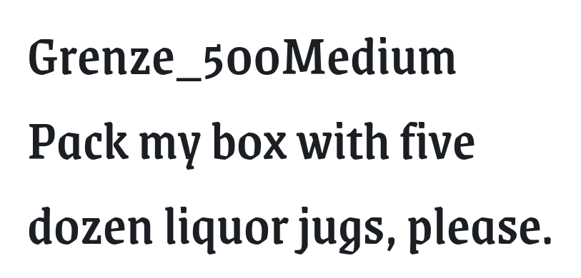](https://github.com/expo/google-fonts/tree/master/font-packages/grenze#readme)||
|||||
||[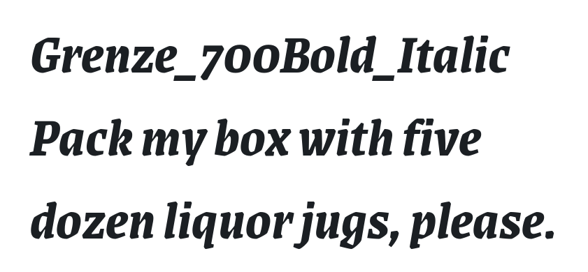](https://github.com/expo/google-fonts/tree/master/font-packages/grenze#readme)|||
||[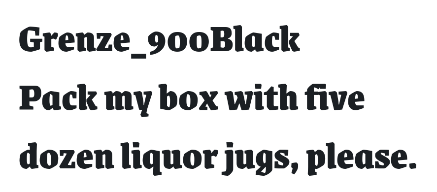](https://github.com/expo/google-fonts/tree/master/font-packages/grenze#readme)|||
### [Bai Jamjuree](https://github.com/expo/google-fonts/tree/master/font-packages/bai-jamjuree#readme)

||||
|-|-|-|
||[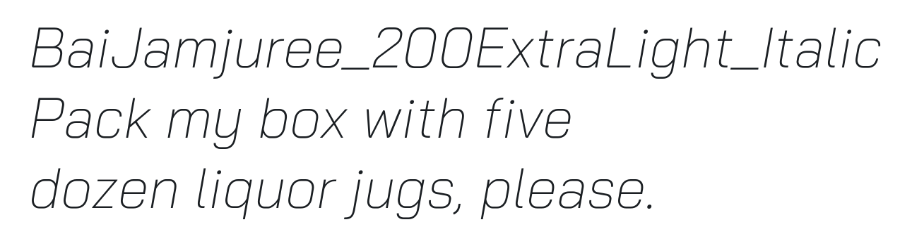](https://github.com/expo/google-fonts/tree/master/font-packages/bai-jamjuree#readme)|||
|||||
|||||
|[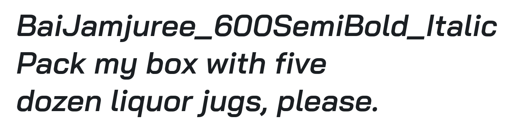](https://github.com/expo/google-fonts/tree/master/font-packages/bai-jamjuree#readme)|[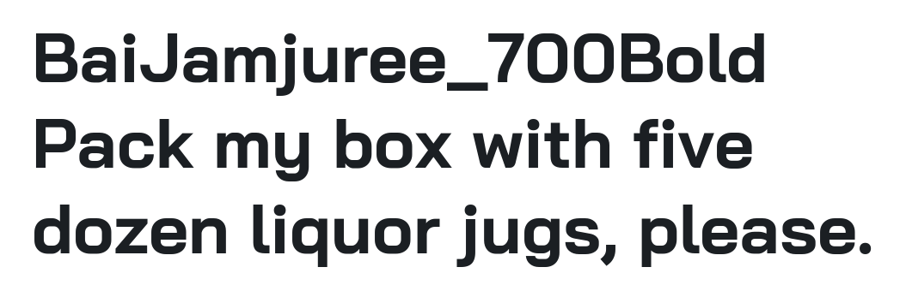](https://github.com/expo/google-fonts/tree/master/font-packages/bai-jamjuree#readme)|||
### [Chakra Petch](https://github.com/expo/google-fonts/tree/master/font-packages/chakra-petch#readme)

||||
|-|-|-|
||[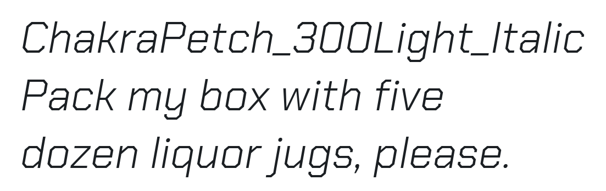](https://github.com/expo/google-fonts/tree/master/font-packages/chakra-petch#readme)|[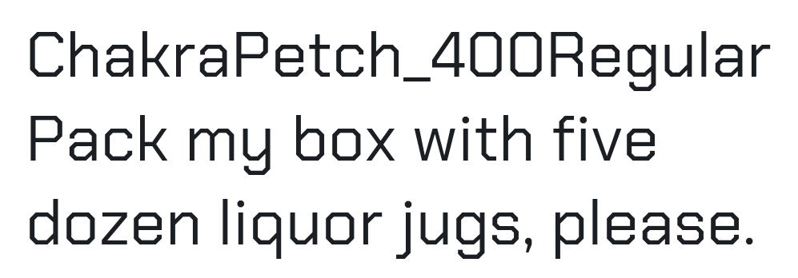](https://github.com/expo/google-fonts/tree/master/font-packages/chakra-petch#readme)||
|||||
|||||
|||||
### [Charmonman](https://github.com/expo/google-fonts/tree/master/font-packages/charmonman#readme)

||||
|-|-|-|
|||||
### [Fahkwang](https://github.com/expo/google-fonts/tree/master/font-packages/fahkwang#readme)

||||
|-|-|-|
|||||
|||||
|||||
|||||
### [K2D](https://github.com/expo/google-fonts/tree/master/font-packages/k2d#readme)

||||
|-|-|-|
|||||
|[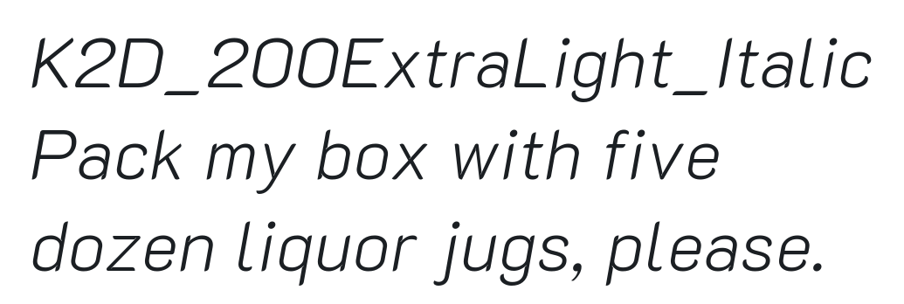](https://github.com/expo/google-fonts/tree/master/font-packages/k2d#readme)||||
|||||
|||[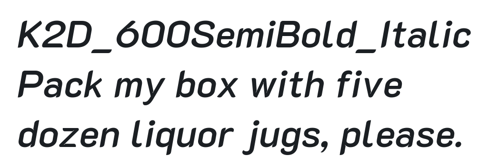](https://github.com/expo/google-fonts/tree/master/font-packages/k2d#readme)||
||[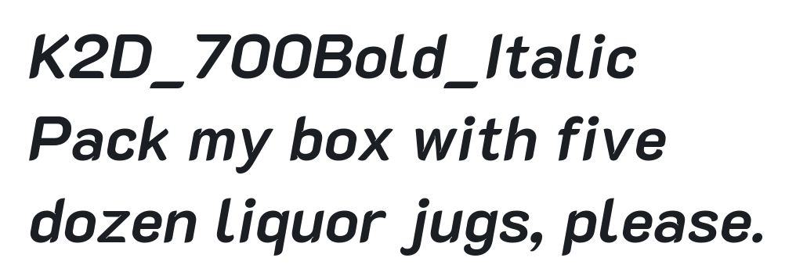](https://github.com/expo/google-fonts/tree/master/font-packages/k2d#readme)|||
|||||
### [KoHo](https://github.com/expo/google-fonts/tree/master/font-packages/koho#readme)

||||
|-|-|-|
|||||
|||||
|||||
|||||
### [Kodchasan](https://github.com/expo/google-fonts/tree/master/font-packages/kodchasan#readme)

||||
|-|-|-|
|||||
|||[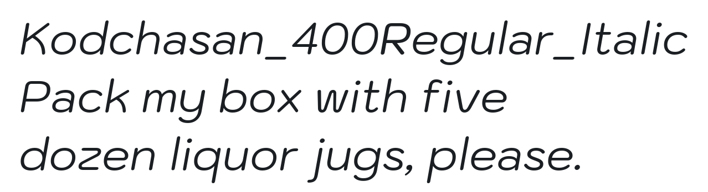](https://github.com/expo/google-fonts/tree/master/font-packages/kodchasan#readme)||
|||||
|[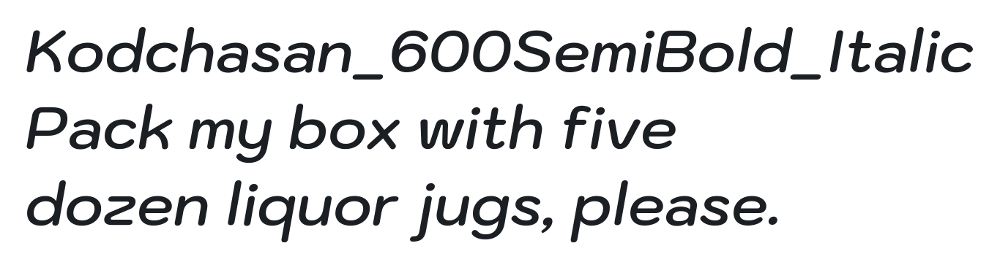](https://github.com/expo/google-fonts/tree/master/font-packages/kodchasan#readme)||||
### [Krub](https://github.com/expo/google-fonts/tree/master/font-packages/krub#readme)

||||
|-|-|-|
|||||
|||||
|||||
|||||
### [Mali](https://github.com/expo/google-fonts/tree/master/font-packages/mali#readme)

||||
|-|-|-|
|||||
|||||
|||||
|||||
### [Niramit](https://github.com/expo/google-fonts/tree/master/font-packages/niramit#readme)

||||
|-|-|-|
||[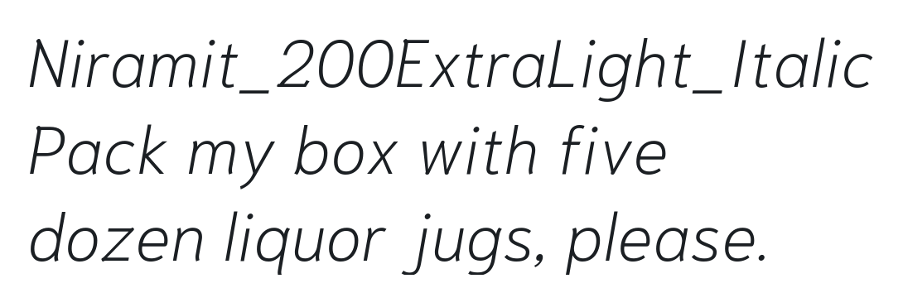](https://github.com/expo/google-fonts/tree/master/font-packages/niramit#readme)|[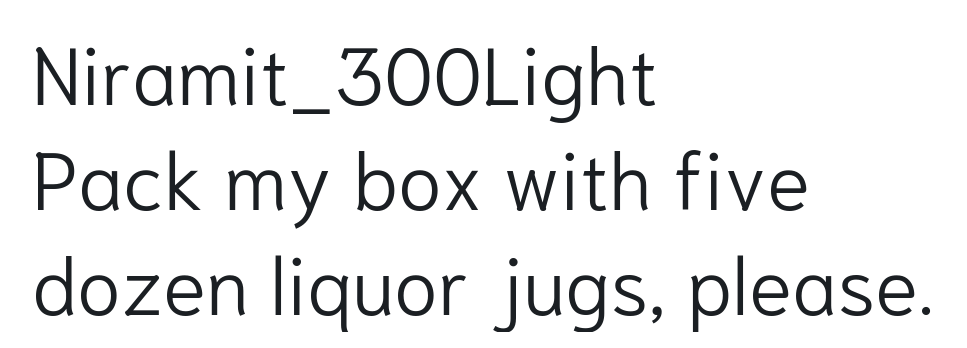](https://github.com/expo/google-fonts/tree/master/font-packages/niramit#readme)||
|||||
|[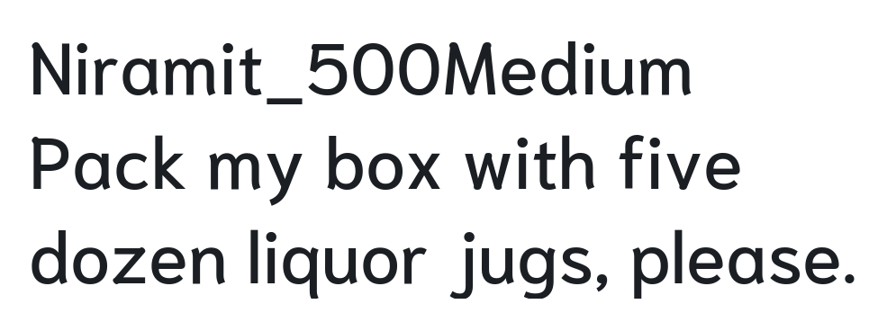](https://github.com/expo/google-fonts/tree/master/font-packages/niramit#readme)|[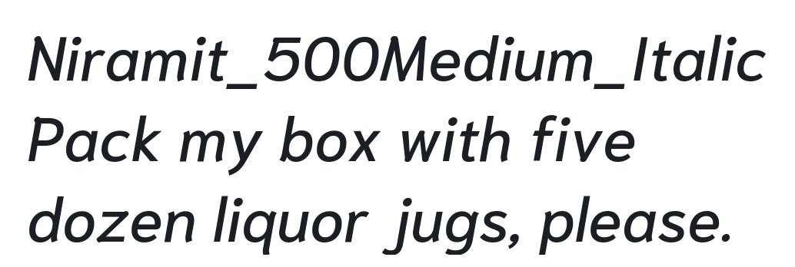](https://github.com/expo/google-fonts/tree/master/font-packages/niramit#readme)|[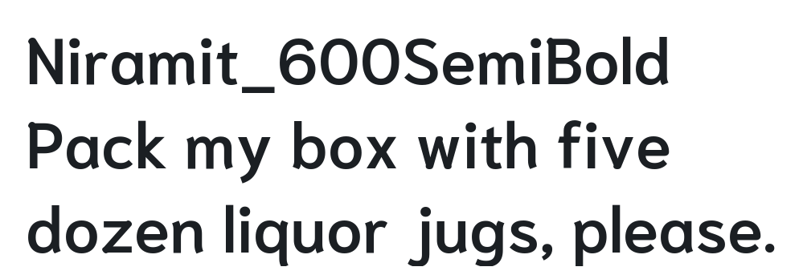](https://github.com/expo/google-fonts/tree/master/font-packages/niramit#readme)||
|[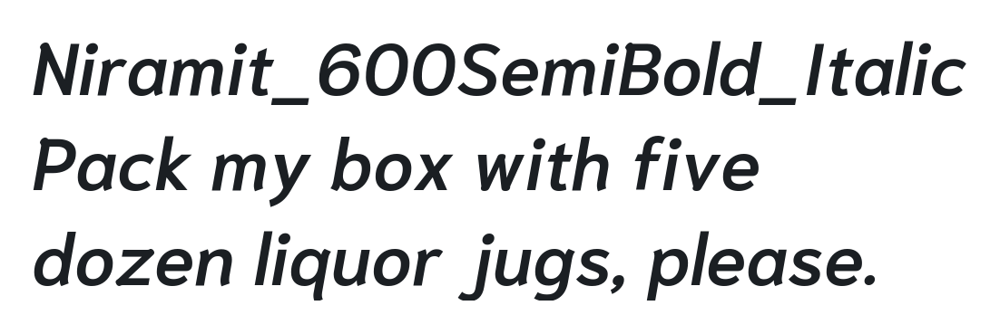](https://github.com/expo/google-fonts/tree/master/font-packages/niramit#readme)||||
### [Srisakdi](https://github.com/expo/google-fonts/tree/master/font-packages/srisakdi#readme)

||||
|-|-|-|
|||||
### [Thasadith](https://github.com/expo/google-fonts/tree/master/font-packages/thasadith#readme)

||||
|-|-|-|
|[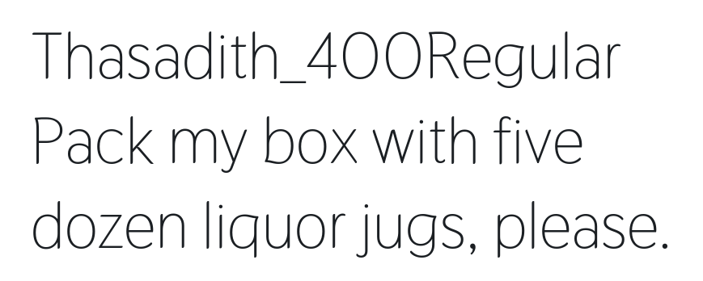](https://github.com/expo/google-fonts/tree/master/font-packages/thasadith#readme)||||
|||||
### [Noto Serif KR](https://github.com/expo/google-fonts/tree/master/font-packages/noto-serif-kr#readme)

||||
|-|-|-|
|||||
|||[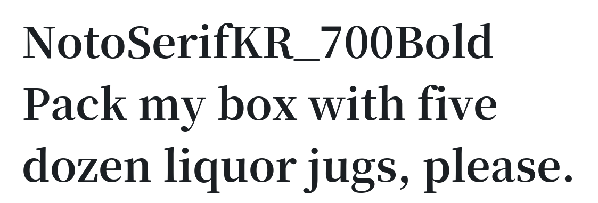](https://github.com/expo/google-fonts/tree/master/font-packages/noto-serif-kr#readme)||
|||||
### [Noto Serif JP](https://github.com/expo/google-fonts/tree/master/font-packages/noto-serif-jp#readme)

||||
|-|-|-|
|||[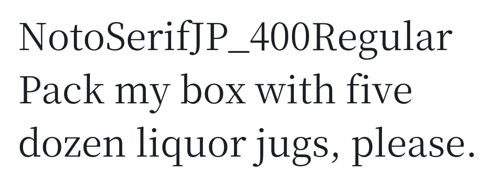](https://github.com/expo/google-fonts/tree/master/font-packages/noto-serif-jp#readme)||
|||||
|[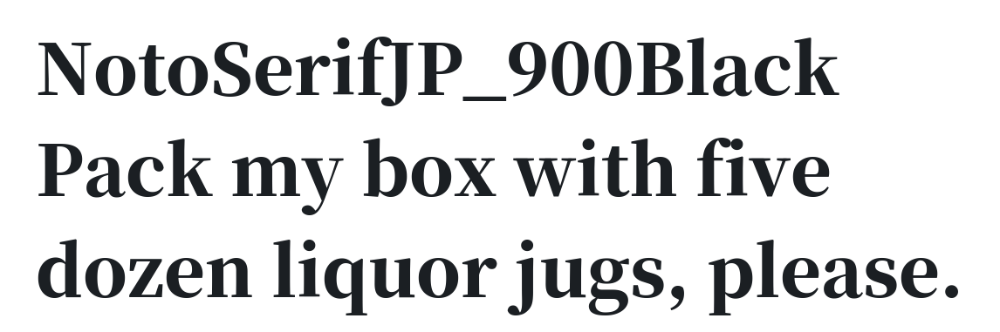](https://github.com/expo/google-fonts/tree/master/font-packages/noto-serif-jp#readme)||||
### [Solway](https://github.com/expo/google-fonts/tree/master/font-packages/solway#readme)

||||
|-|-|-|
|||[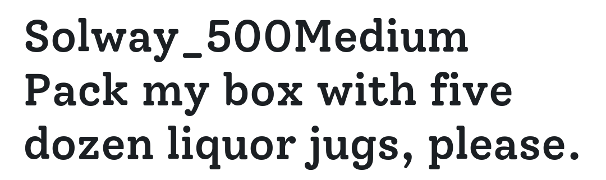](https://github.com/expo/google-fonts/tree/master/font-packages/solway#readme)||
|||||
### [Notable](https://github.com/expo/google-fonts/tree/master/font-packages/notable#readme)

||||
|-|-|-|
|||||
### [Markazi Text](https://github.com/expo/google-fonts/tree/master/font-packages/markazi-text#readme)

||||
|-|-|-|
||[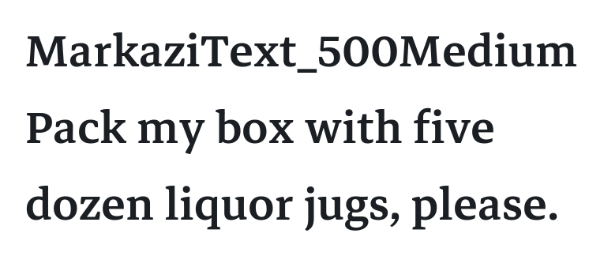](https://github.com/expo/google-fonts/tree/master/font-packages/markazi-text#readme)|||
|||||
### [Sawarabi Mincho](https://github.com/expo/google-fonts/tree/master/font-packages/sawarabi-mincho#readme)

||||
|-|-|-|
|[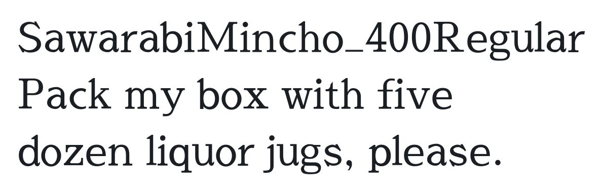](https://github.com/expo/google-fonts/tree/master/font-packages/sawarabi-mincho#readme)||||
### [Sawarabi Gothic](https://github.com/expo/google-fonts/tree/master/font-packages/sawarabi-gothic#readme)

||||
|-|-|-|
|[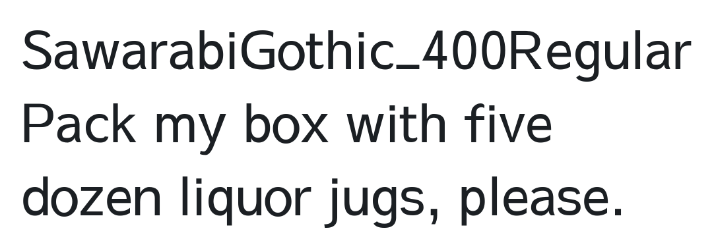](https://github.com/expo/google-fonts/tree/master/font-packages/sawarabi-gothic#readme)||||
### [M PLUS Rounded 1c](https://github.com/expo/google-fonts/tree/master/font-packages/m-plus-rounded-1c#readme)

||||
|-|-|-|
|[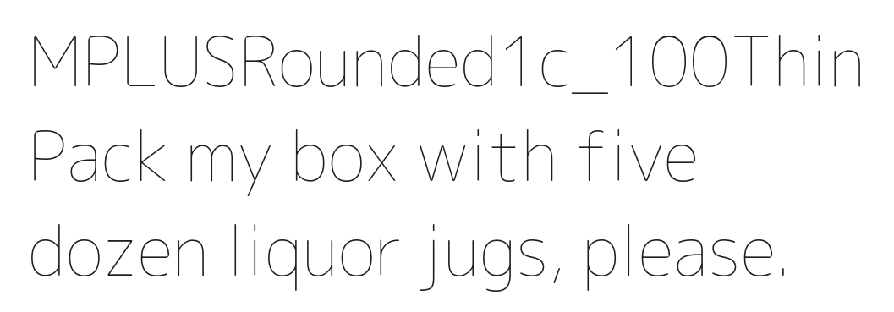](https://github.com/expo/google-fonts/tree/master/font-packages/m-plus-rounded-1c#readme)||||
|||||
|||||
### [Tajawal](https://github.com/expo/google-fonts/tree/master/font-packages/tajawal#readme)

||||
|-|-|-|
|||||
|||||
|||||
### [East Sea Dokdo](https://github.com/expo/google-fonts/tree/master/font-packages/east-sea-dokdo#readme)

||||
|-|-|-|
|[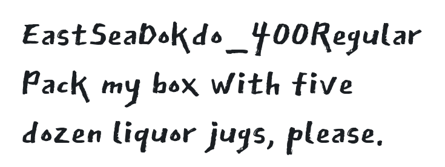](https://github.com/expo/google-fonts/tree/master/font-packages/east-sea-dokdo#readme)||||
### [IBM Plex Mono](https://github.com/expo/google-fonts/tree/master/font-packages/ibm-plex-mono#readme)

||||
|-|-|-|
|||||
||[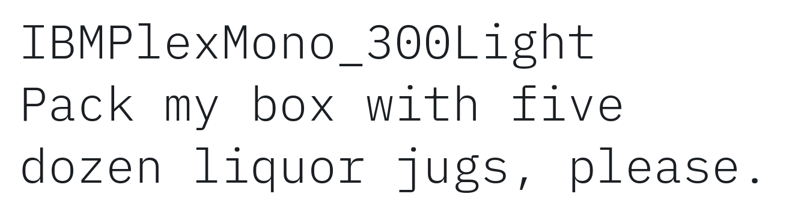](https://github.com/expo/google-fonts/tree/master/font-packages/ibm-plex-mono#readme)|[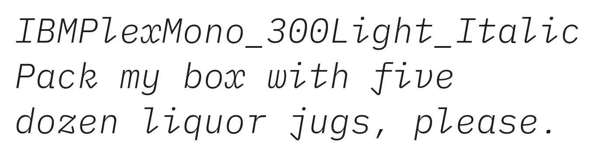](https://github.com/expo/google-fonts/tree/master/font-packages/ibm-plex-mono#readme)||
|||[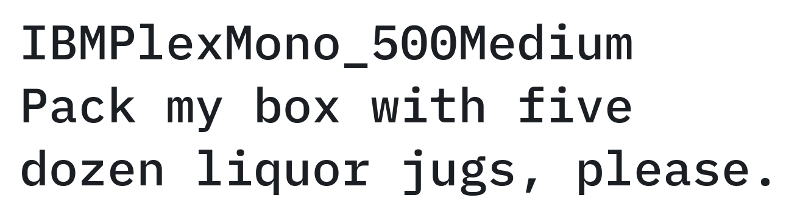](https://github.com/expo/google-fonts/tree/master/font-packages/ibm-plex-mono#readme)||
|[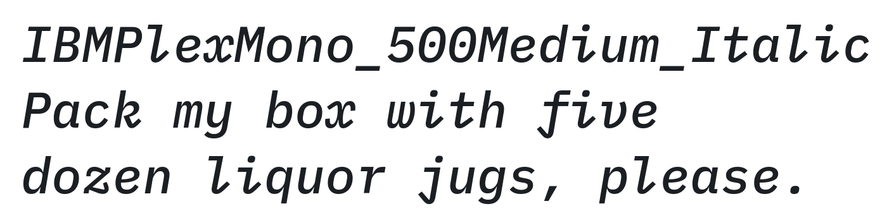](https://github.com/expo/google-fonts/tree/master/font-packages/ibm-plex-mono#readme)||||
|||||
### [IBM Plex Sans Condensed](https://github.com/expo/google-fonts/tree/master/font-packages/ibm-plex-sans-condensed#readme)

||||
|-|-|-|
|[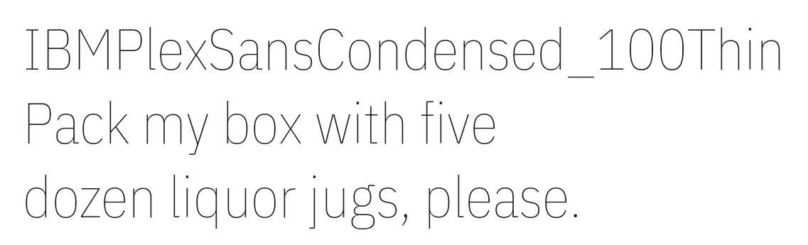](https://github.com/expo/google-fonts/tree/master/font-packages/ibm-plex-sans-condensed#readme)||[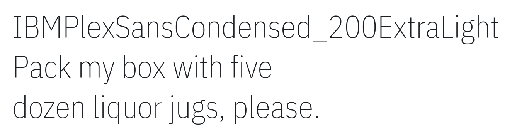](https://github.com/expo/google-fonts/tree/master/font-packages/ibm-plex-sans-condensed#readme)||
|||||
||[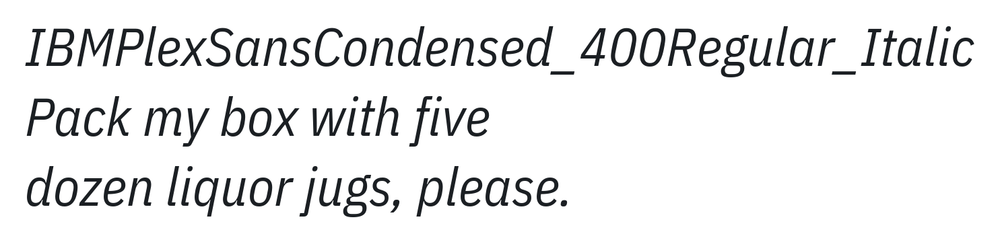](https://github.com/expo/google-fonts/tree/master/font-packages/ibm-plex-sans-condensed#readme)|||
|||[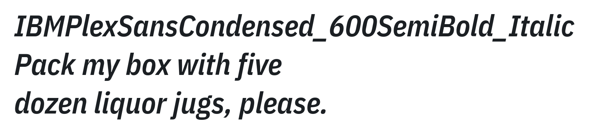](https://github.com/expo/google-fonts/tree/master/font-packages/ibm-plex-sans-condensed#readme)||
|||||
### [IBM Plex Sans](https://github.com/expo/google-fonts/tree/master/font-packages/ibm-plex-sans#readme)

||||
|-|-|-|
|[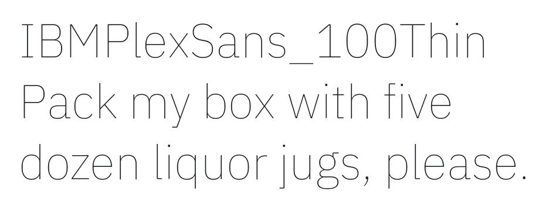](https://github.com/expo/google-fonts/tree/master/font-packages/ibm-plex-sans#readme)||||
|||||
|[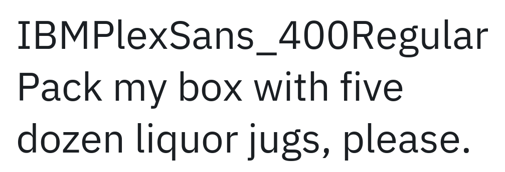](https://github.com/expo/google-fonts/tree/master/font-packages/ibm-plex-sans#readme)|[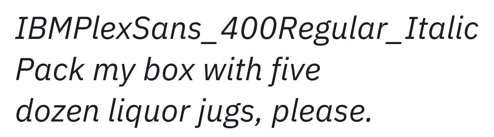](https://github.com/expo/google-fonts/tree/master/font-packages/ibm-plex-sans#readme)|||
|[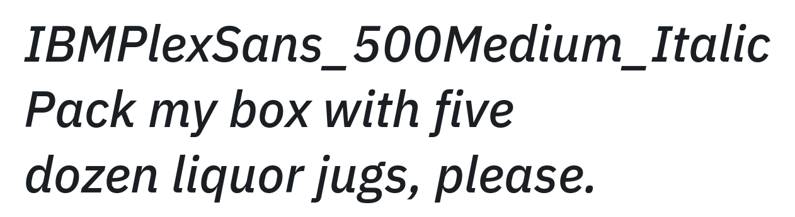](https://github.com/expo/google-fonts/tree/master/font-packages/ibm-plex-sans#readme)||||
|||||
### [IBM Plex Serif](https://github.com/expo/google-fonts/tree/master/font-packages/ibm-plex-serif#readme)

||||
|-|-|-|
|[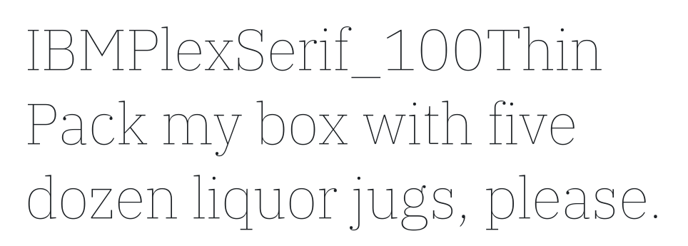](https://github.com/expo/google-fonts/tree/master/font-packages/ibm-plex-serif#readme)||||
|||||
|||||
|||||
|||||
### [Mina](https://github.com/expo/google-fonts/tree/master/font-packages/mina#readme)

||||
|-|-|-|
|||||
### [Gaegu](https://github.com/expo/google-fonts/tree/master/font-packages/gaegu#readme)

||||
|-|-|-|
|||||
### [Black And White Picture](https://github.com/expo/google-fonts/tree/master/font-packages/black-and-white-picture#readme)

||||
|-|-|-|
|||||
### [Stylish](https://github.com/expo/google-fonts/tree/master/font-packages/stylish#readme)

||||
|-|-|-|
|||||
### [Sunflower](https://github.com/expo/google-fonts/tree/master/font-packages/sunflower#readme)

||||
|-|-|-|
|||||
### [Do Hyeon](https://github.com/expo/google-fonts/tree/master/font-packages/do-hyeon#readme)

||||
|-|-|-|
|||||
### [Gothic A1](https://github.com/expo/google-fonts/tree/master/font-packages/gothic-a1#readme)

||||
|-|-|-|
|||||
|||||
|||||
### [Jua](https://github.com/expo/google-fonts/tree/master/font-packages/jua#readme)

||||
|-|-|-|
|||||
### [Kirang Haerang](https://github.com/expo/google-fonts/tree/master/font-packages/kirang-haerang#readme)

||||
|-|-|-|
|[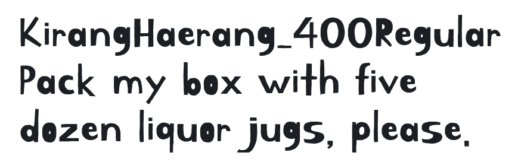](https://github.com/expo/google-fonts/tree/master/font-packages/kirang-haerang#readme)||||
### [Black Han Sans](https://github.com/expo/google-fonts/tree/master/font-packages/black-han-sans#readme)

||||
|-|-|-|
|||||
### [Cute Font](https://github.com/expo/google-fonts/tree/master/font-packages/cute-font#readme)

||||
|-|-|-|
|||||
### [Dokdo](https://github.com/expo/google-fonts/tree/master/font-packages/dokdo#readme)

||||
|-|-|-|
|||||
### [Gamja Flower](https://github.com/expo/google-fonts/tree/master/font-packages/gamja-flower#readme)

||||
|-|-|-|
|||||
### [Gugi](https://github.com/expo/google-fonts/tree/master/font-packages/gugi#readme)

||||
|-|-|-|
|||||
### [Hi Melody](https://github.com/expo/google-fonts/tree/master/font-packages/hi-melody#readme)

||||
|-|-|-|
|||||
### [Poor Story](https://github.com/expo/google-fonts/tree/master/font-packages/poor-story#readme)

||||
|-|-|-|
|[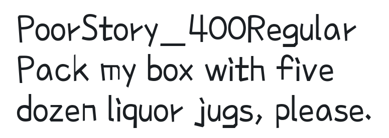](https://github.com/expo/google-fonts/tree/master/font-packages/poor-story#readme)||||
### [Song Myung](https://github.com/expo/google-fonts/tree/master/font-packages/song-myung#readme)

||||
|-|-|-|
|[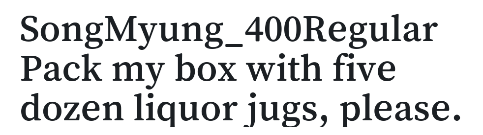](https://github.com/expo/google-fonts/tree/master/font-packages/song-myung#readme)||||
### [Yeon Sung](https://github.com/expo/google-fonts/tree/master/font-packages/yeon-sung#readme)

||||
|-|-|-|
|||||
### [Single Day](https://github.com/expo/google-fonts/tree/master/font-packages/single-day#readme)

||||
|-|-|-|
|||||
### [Nanum Brush Script](https://github.com/expo/google-fonts/tree/master/font-packages/nanum-brush-script#readme)

||||
|-|-|-|
|||||
### [Nanum Gothic](https://github.com/expo/google-fonts/tree/master/font-packages/nanum-gothic#readme)

||||
|-|-|-|
||[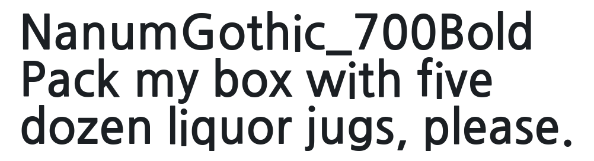](https://github.com/expo/google-fonts/tree/master/font-packages/nanum-gothic#readme)|||
### [Nanum Gothic Coding](https://github.com/expo/google-fonts/tree/master/font-packages/nanum-gothic-coding#readme)

||||
|-|-|-|
||[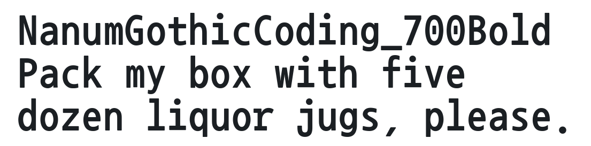](https://github.com/expo/google-fonts/tree/master/font-packages/nanum-gothic-coding#readme)|||
### [Nanum Myeongjo](https://github.com/expo/google-fonts/tree/master/font-packages/nanum-myeongjo#readme)

||||
|-|-|-|
|||[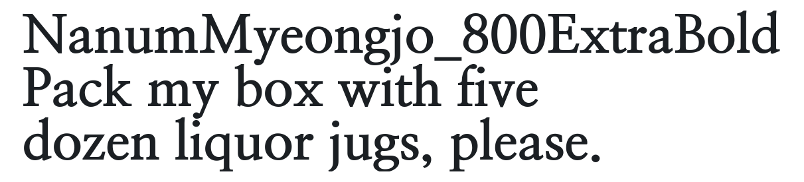](https://github.com/expo/google-fonts/tree/master/font-packages/nanum-myeongjo#readme)||
### [Nanum Pen Script](https://github.com/expo/google-fonts/tree/master/font-packages/nanum-pen-script#readme)

||||
|-|-|-|
|||||
### [Noto Sans KR](https://github.com/expo/google-fonts/tree/master/font-packages/noto-sans-kr#readme)

||||
|-|-|-|
|||[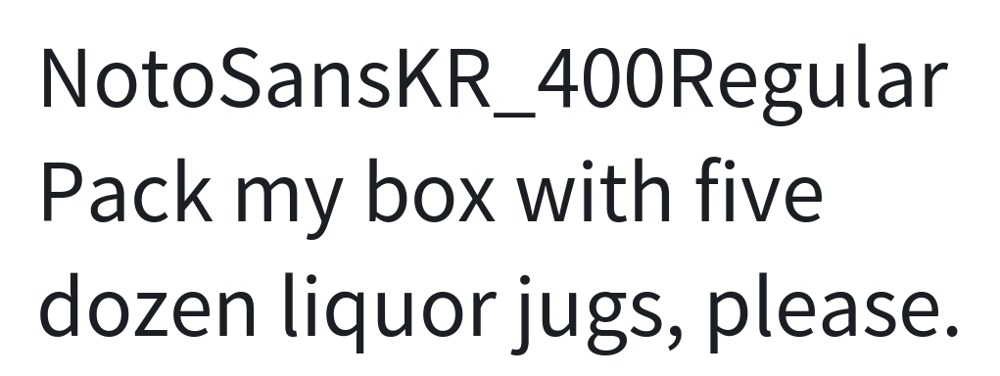](https://github.com/expo/google-fonts/tree/master/font-packages/noto-sans-kr#readme)||
|[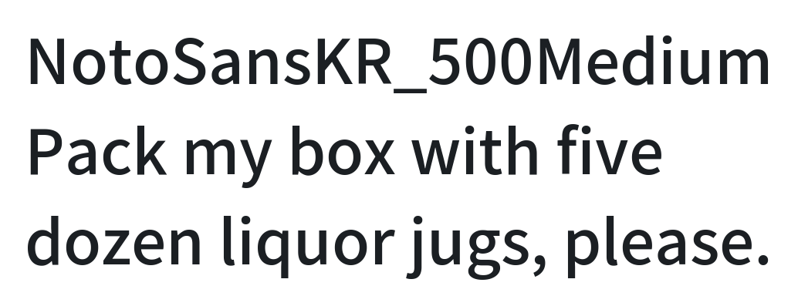](https://github.com/expo/google-fonts/tree/master/font-packages/noto-sans-kr#readme)||||
### [Libre Caslon Display](https://github.com/expo/google-fonts/tree/master/font-packages/libre-caslon-display#readme)

||||
|-|-|-|
|||||
### [Barlow](https://github.com/expo/google-fonts/tree/master/font-packages/barlow#readme)

||||
|-|-|-|
|||[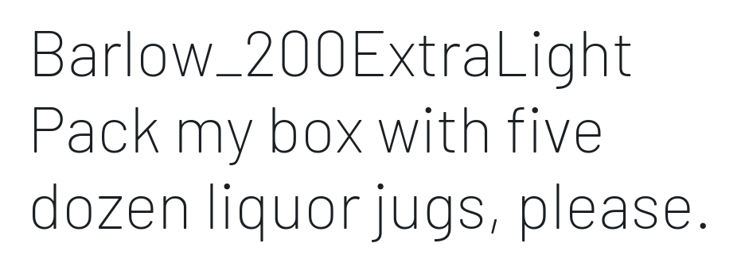](https://github.com/expo/google-fonts/tree/master/font-packages/barlow#readme)||
|||||
|||||
||[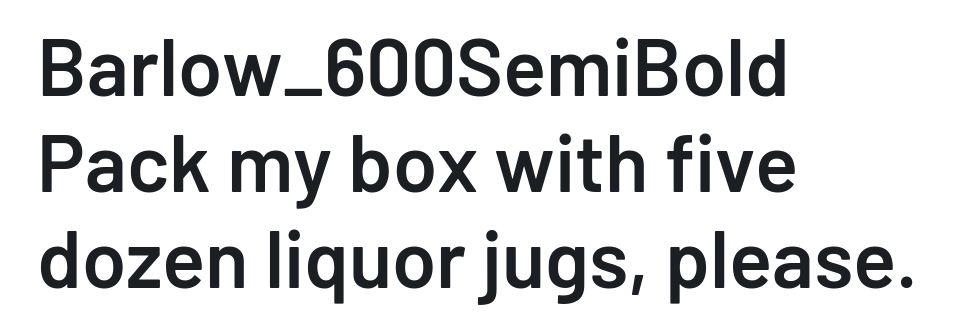](https://github.com/expo/google-fonts/tree/master/font-packages/barlow#readme)|||
||[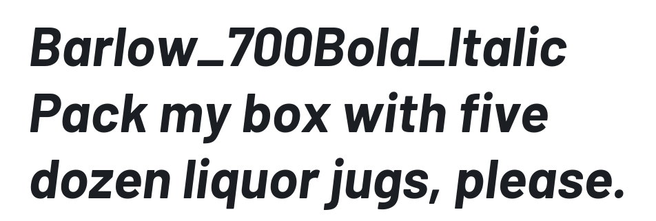](https://github.com/expo/google-fonts/tree/master/font-packages/barlow#readme)|||
||[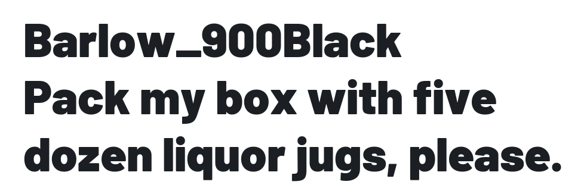](https://github.com/expo/google-fonts/tree/master/font-packages/barlow#readme)|||
### [Barlow Condensed](https://github.com/expo/google-fonts/tree/master/font-packages/barlow-condensed#readme)

||||
|-|-|-|
|||||
||[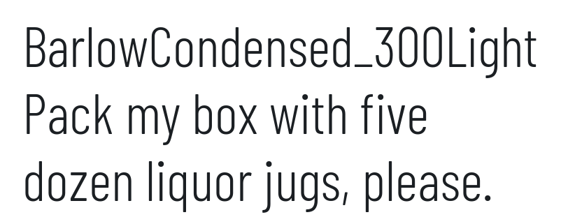](https://github.com/expo/google-fonts/tree/master/font-packages/barlow-condensed#readme)|||
|[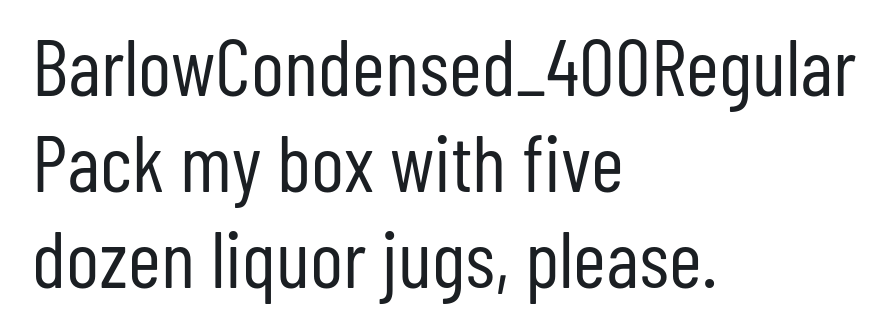](https://github.com/expo/google-fonts/tree/master/font-packages/barlow-condensed#readme)||||
|[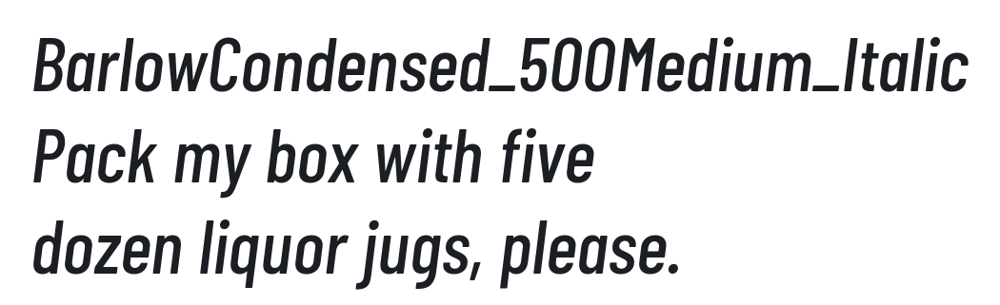](https://github.com/expo/google-fonts/tree/master/font-packages/barlow-condensed#readme)||||
||[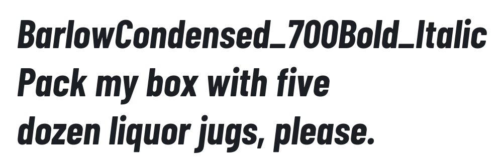](https://github.com/expo/google-fonts/tree/master/font-packages/barlow-condensed#readme)|[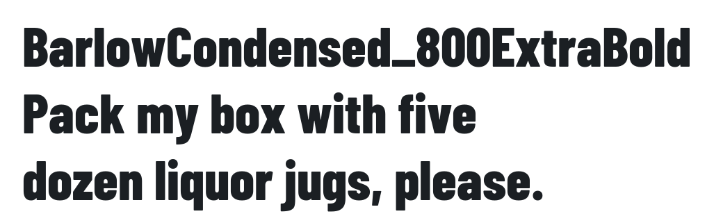](https://github.com/expo/google-fonts/tree/master/font-packages/barlow-condensed#readme)||
|[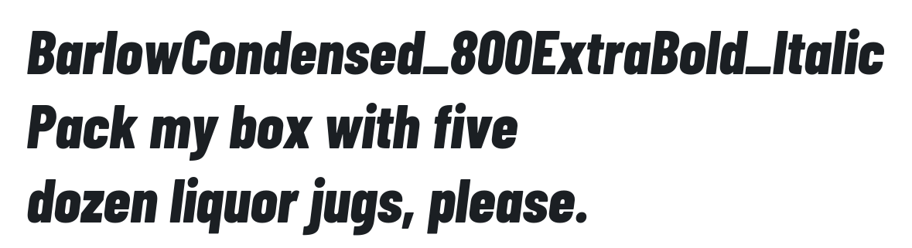](https://github.com/expo/google-fonts/tree/master/font-packages/barlow-condensed#readme)||[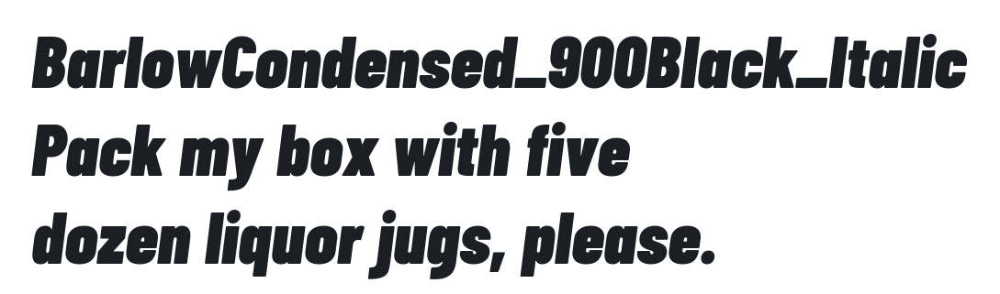](https://github.com/expo/google-fonts/tree/master/font-packages/barlow-condensed#readme)||
### [Barlow Semi Condensed](https://github.com/expo/google-fonts/tree/master/font-packages/barlow-semi-condensed#readme)

||||
|-|-|-|
||[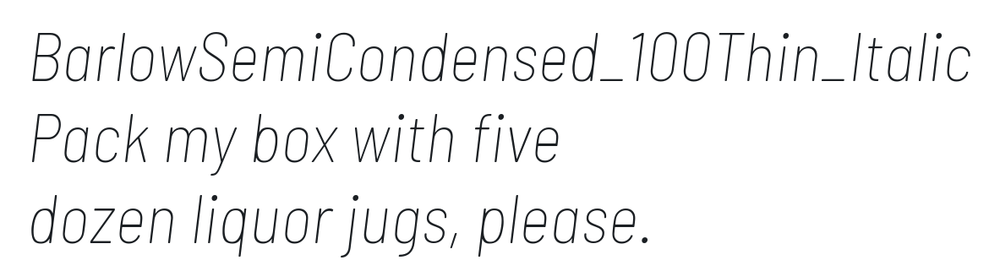](https://github.com/expo/google-fonts/tree/master/font-packages/barlow-semi-condensed#readme)|||
||[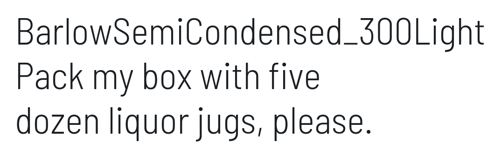](https://github.com/expo/google-fonts/tree/master/font-packages/barlow-semi-condensed#readme)|||
|||||
|||||
|[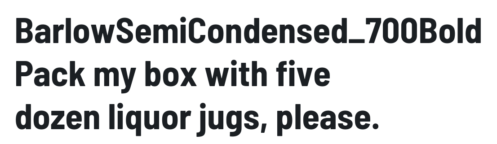](https://github.com/expo/google-fonts/tree/master/font-packages/barlow-semi-condensed#readme)||||
|||||
### [Spectral SC](https://github.com/expo/google-fonts/tree/master/font-packages/spectral-sc#readme)

||||
|-|-|-|
|||[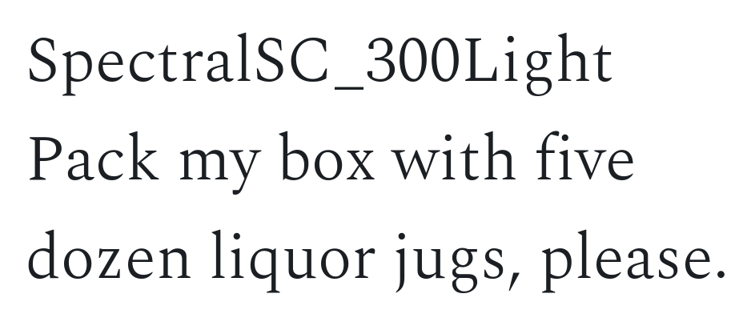](https://github.com/expo/google-fonts/tree/master/font-packages/spectral-sc#readme)||
|||||
|[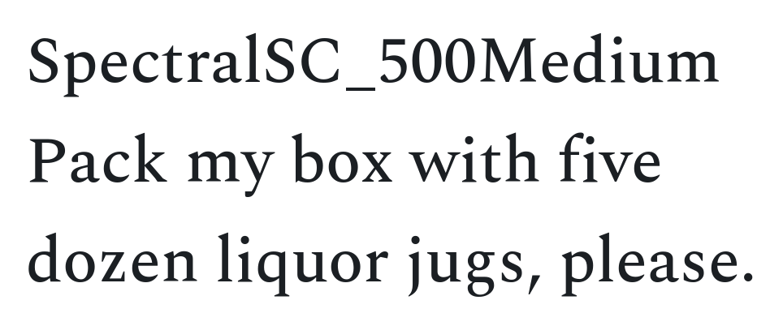](https://github.com/expo/google-fonts/tree/master/font-packages/spectral-sc#readme)||||
||[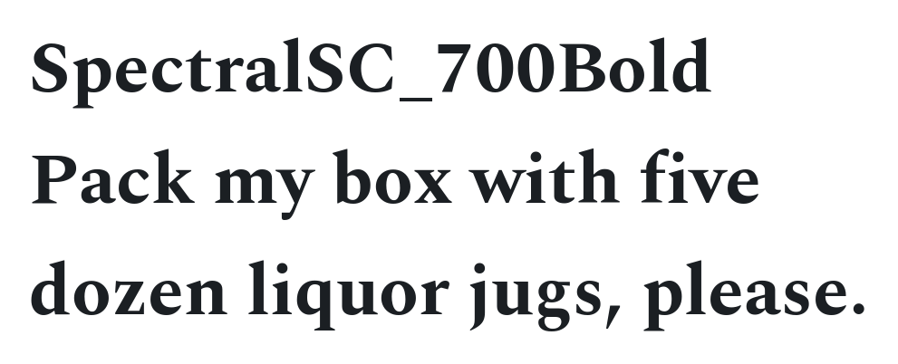](https://github.com/expo/google-fonts/tree/master/font-packages/spectral-sc#readme)|||
|||||
### [Vollkorn SC](https://github.com/expo/google-fonts/tree/master/font-packages/vollkorn-sc#readme)

||||
|-|-|-|
|||||
|[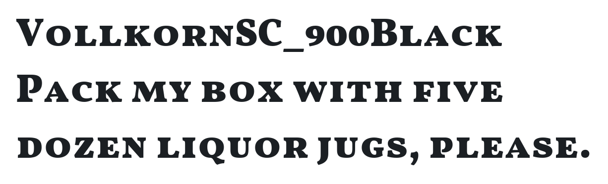](https://github.com/expo/google-fonts/tree/master/font-packages/vollkorn-sc#readme)||||
### [Libre Barcode 39 Extended](https://github.com/expo/google-fonts/tree/master/font-packages/libre-barcode-39-extended#readme)

||||
|-|-|-|
|||||
### [Libre Barcode 39 Extended Text](https://github.com/expo/google-fonts/tree/master/font-packages/libre-barcode-39-extended-text#readme)

||||
|-|-|-|
|[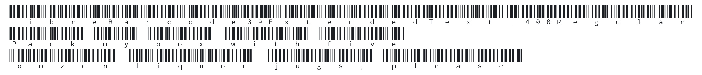](https://github.com/expo/google-fonts/tree/master/font-packages/libre-barcode-39-extended-text#readme)||||
### [Sedgwick Ave](https://github.com/expo/google-fonts/tree/master/font-packages/sedgwick-ave#readme)

||||
|-|-|-|
|||||
### [Sedgwick Ave Display](https://github.com/expo/google-fonts/tree/master/font-packages/sedgwick-ave-display#readme)

||||
|-|-|-|
|||||
### [Asap Condensed](https://github.com/expo/google-fonts/tree/master/font-packages/asap-condensed#readme)

||||
|-|-|-|
|||[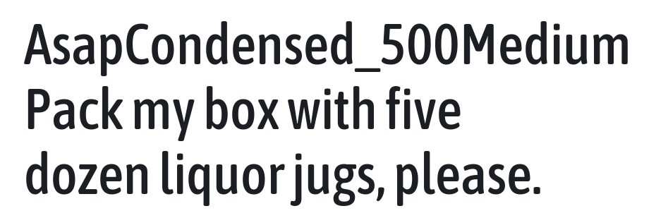](https://github.com/expo/google-fonts/tree/master/font-packages/asap-condensed#readme)||
|||||
|||||
### [Faustina](https://github.com/expo/google-fonts/tree/master/font-packages/faustina#readme)

||||
|-|-|-|
|||||
|||||
||[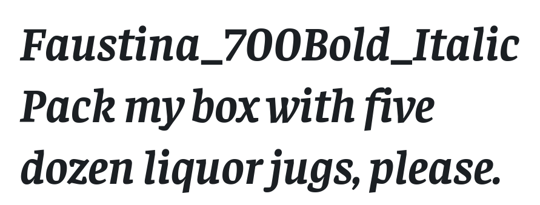](https://github.com/expo/google-fonts/tree/master/font-packages/faustina#readme)|||
### [Manuale](https://github.com/expo/google-fonts/tree/master/font-packages/manuale#readme)

||||
|-|-|-|
|||||
|[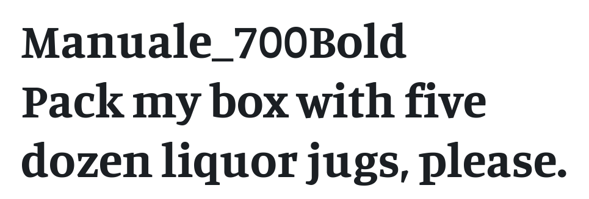](https://github.com/expo/google-fonts/tree/master/font-packages/manuale#readme)|[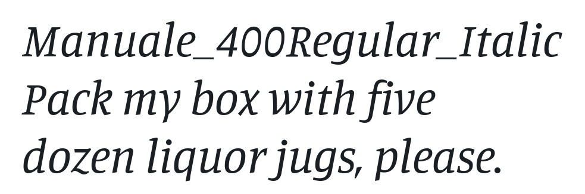](https://github.com/expo/google-fonts/tree/master/font-packages/manuale#readme)|[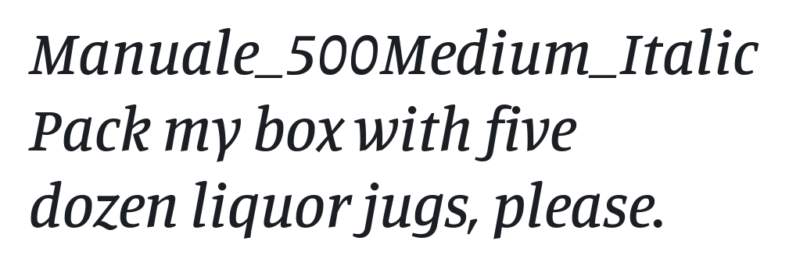](https://github.com/expo/google-fonts/tree/master/font-packages/manuale#readme)||
|[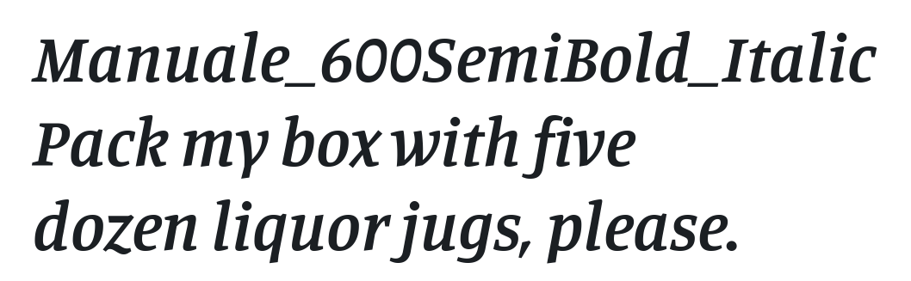](https://github.com/expo/google-fonts/tree/master/font-packages/manuale#readme)|[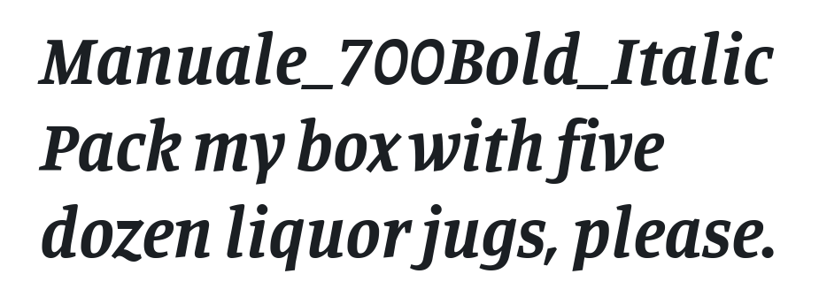](https://github.com/expo/google-fonts/tree/master/font-packages/manuale#readme)|||
### [Saira](https://github.com/expo/google-fonts/tree/master/font-packages/saira#readme)

||||
|-|-|-|
|[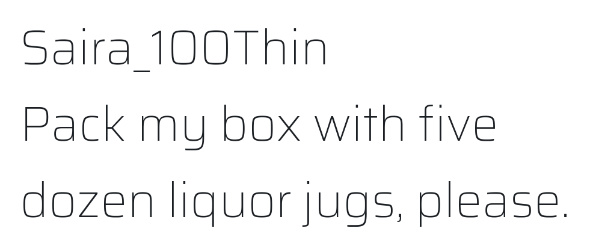](https://github.com/expo/google-fonts/tree/master/font-packages/saira#readme)||||
|||||
|||||
### [Saira Condensed](https://github.com/expo/google-fonts/tree/master/font-packages/saira-condensed#readme)

||||
|-|-|-|
|[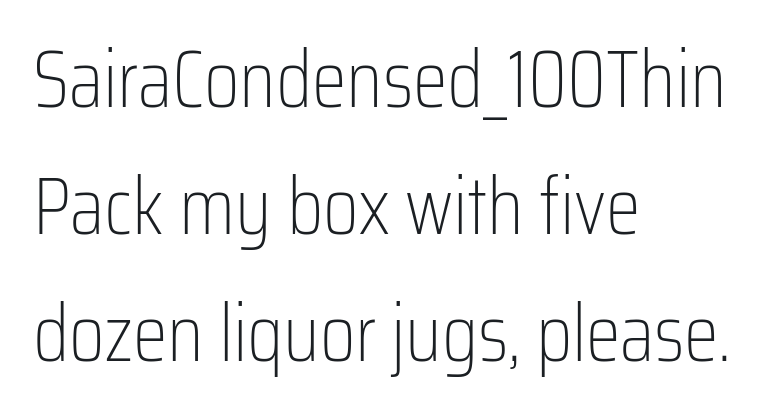](https://github.com/expo/google-fonts/tree/master/font-packages/saira-condensed#readme)|[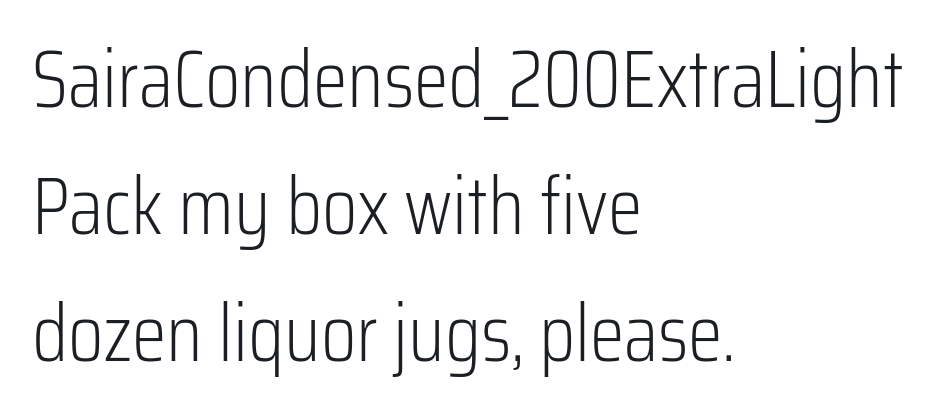](https://github.com/expo/google-fonts/tree/master/font-packages/saira-condensed#readme)|[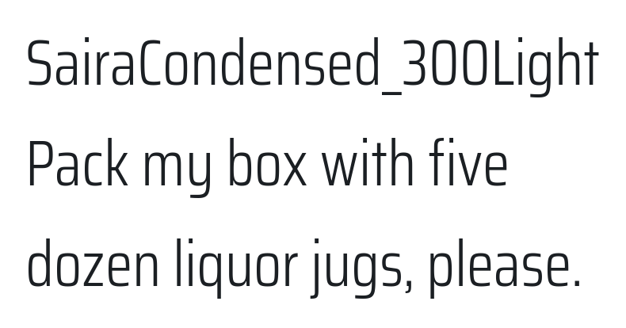](https://github.com/expo/google-fonts/tree/master/font-packages/saira-condensed#readme)||
|[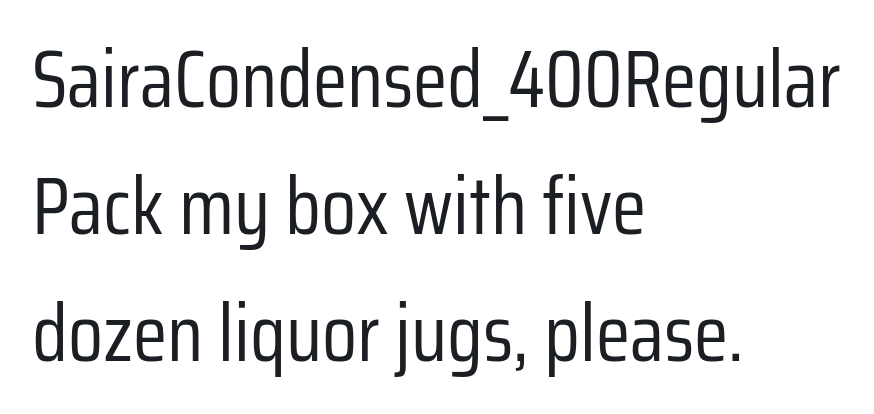](https://github.com/expo/google-fonts/tree/master/font-packages/saira-condensed#readme)||||
||[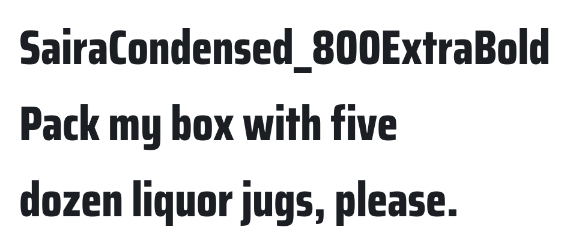](https://github.com/expo/google-fonts/tree/master/font-packages/saira-condensed#readme)|[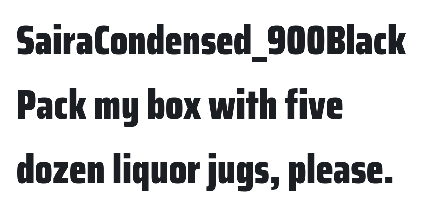](https://github.com/expo/google-fonts/tree/master/font-packages/saira-condensed#readme)||
### [Saira Extra Condensed](https://github.com/expo/google-fonts/tree/master/font-packages/saira-extra-condensed#readme)

||||
|-|-|-|
|||[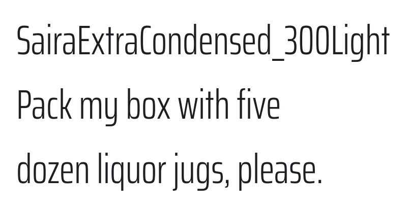](https://github.com/expo/google-fonts/tree/master/font-packages/saira-extra-condensed#readme)||
|||||
|[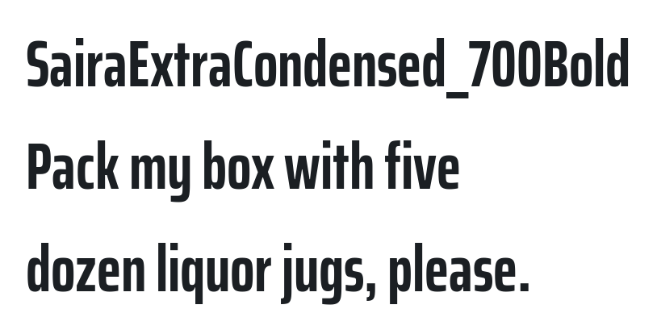](https://github.com/expo/google-fonts/tree/master/font-packages/saira-extra-condensed#readme)||||
### [Saira Semi Condensed](https://github.com/expo/google-fonts/tree/master/font-packages/saira-semi-condensed#readme)

||||
|-|-|-|
|||[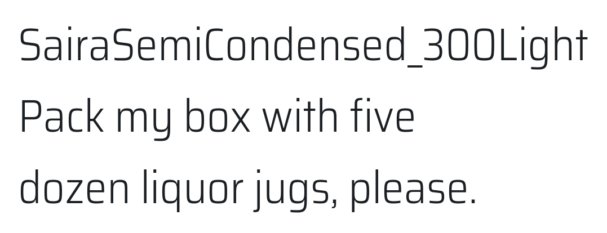](https://github.com/expo/google-fonts/tree/master/font-packages/saira-semi-condensed#readme)||
|||||
|[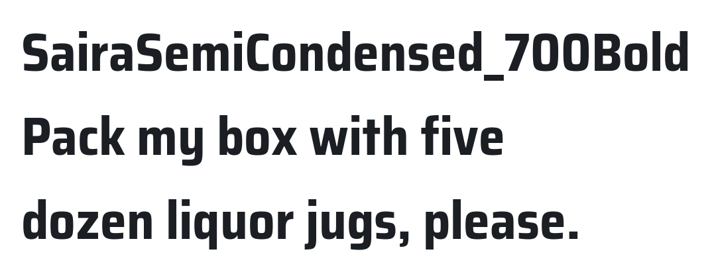](https://github.com/expo/google-fonts/tree/master/font-packages/saira-semi-condensed#readme)||||
### [Libre Barcode 128](https://github.com/expo/google-fonts/tree/master/font-packages/libre-barcode-128#readme)

||||
|-|-|-|
|||||
### [Libre Barcode 128 Text](https://github.com/expo/google-fonts/tree/master/font-packages/libre-barcode-128-text#readme)

||||
|-|-|-|
|[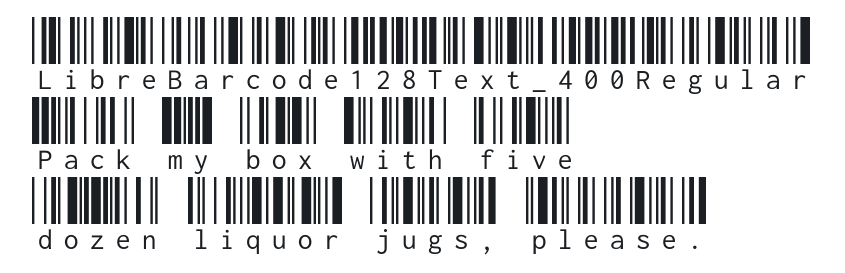](https://github.com/expo/google-fonts/tree/master/font-packages/libre-barcode-128-text#readme)||||
### [Libre Barcode 39](https://github.com/expo/google-fonts/tree/master/font-packages/libre-barcode-39#readme)

||||
|-|-|-|
|||||
### [Libre Barcode 39 Text](https://github.com/expo/google-fonts/tree/master/font-packages/libre-barcode-39-text#readme)

||||
|-|-|-|
|[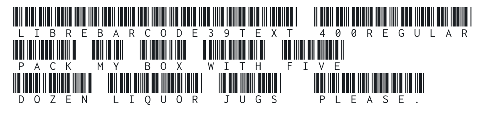](https://github.com/expo/google-fonts/tree/master/font-packages/libre-barcode-39-text#readme)||||
### [Mada](https://github.com/expo/google-fonts/tree/master/font-packages/mada#readme)

||||
|-|-|-|
|||||
||[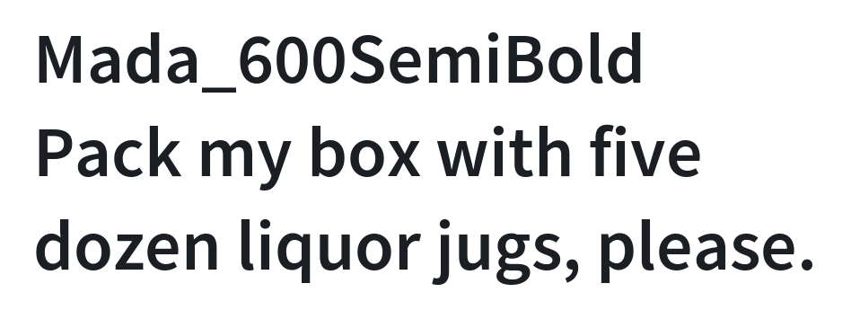](https://github.com/expo/google-fonts/tree/master/font-packages/mada#readme)|||
|||||
### [Zilla Slab Highlight](https://github.com/expo/google-fonts/tree/master/font-packages/zilla-slab-highlight#readme)

||||
|-|-|-|
|||||
### [Bellefair](https://github.com/expo/google-fonts/tree/master/font-packages/bellefair#readme)

||||
|-|-|-|
|||||
### [Zilla Slab](https://github.com/expo/google-fonts/tree/master/font-packages/zilla-slab#readme)

||||
|-|-|-|
|[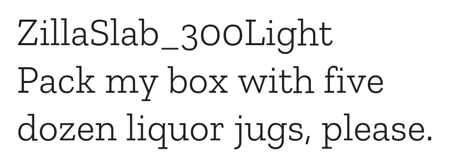](https://github.com/expo/google-fonts/tree/master/font-packages/zilla-slab#readme)||||
|||||
|[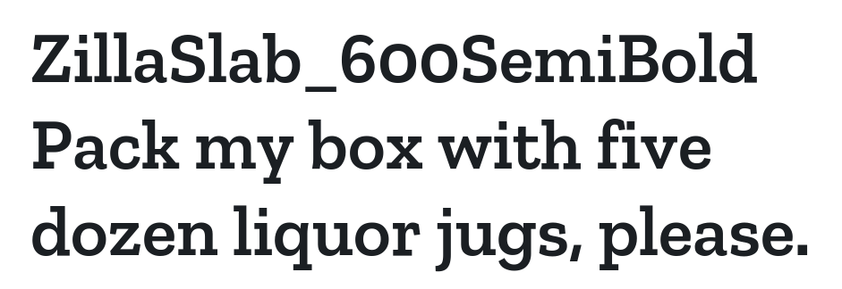](https://github.com/expo/google-fonts/tree/master/font-packages/zilla-slab#readme)||||
|||||
### [M PLUS 1p](https://github.com/expo/google-fonts/tree/master/font-packages/m-plus-1p#readme)

||||
|-|-|-|
|[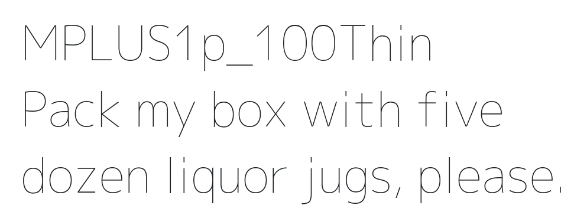](https://github.com/expo/google-fonts/tree/master/font-packages/m-plus-1p#readme)||||
|||[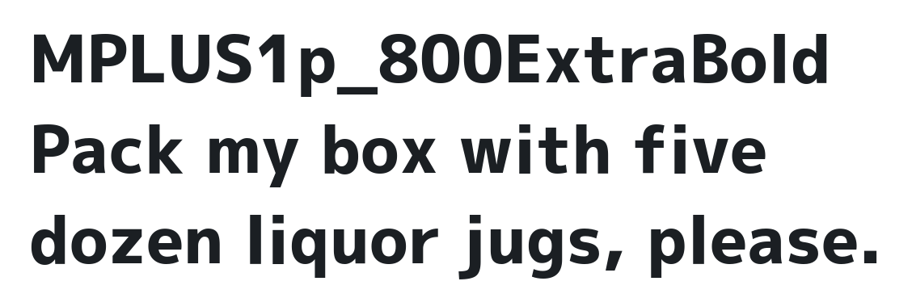](https://github.com/expo/google-fonts/tree/master/font-packages/m-plus-1p#readme)||
|||||
### [Spectral](https://github.com/expo/google-fonts/tree/master/font-packages/spectral#readme)

||||
|-|-|-|
|||||
|||||
|||[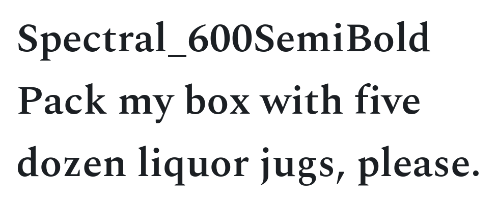](https://github.com/expo/google-fonts/tree/master/font-packages/spectral#readme)||
|||[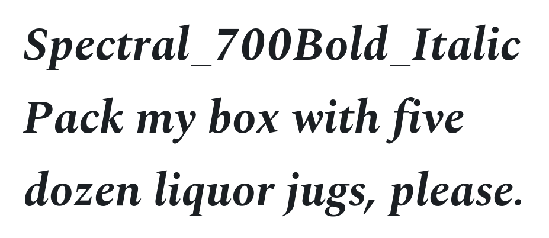](https://github.com/expo/google-fonts/tree/master/font-packages/spectral#readme)||
||[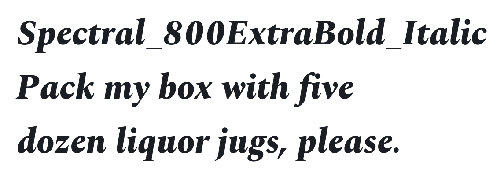](https://github.com/expo/google-fonts/tree/master/font-packages/spectral#readme)|||
### [Mukta Mahee](https://github.com/expo/google-fonts/tree/master/font-packages/mukta-mahee#readme)

||||
|-|-|-|
|||||
|||||
|||||
### [Mukta Malar](https://github.com/expo/google-fonts/tree/master/font-packages/mukta-malar#readme)

||||
|-|-|-|
|||||
|||||
|[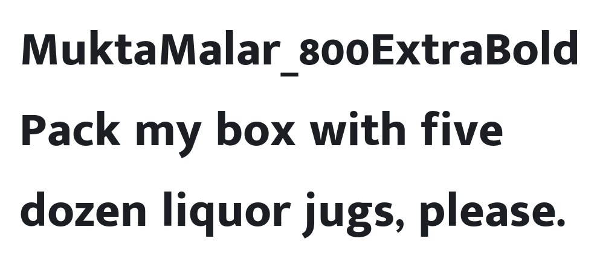](https://github.com/expo/google-fonts/tree/master/font-packages/mukta-malar#readme)||||
### [Encode Sans](https://github.com/expo/google-fonts/tree/master/font-packages/encode-sans#readme)

||||
|-|-|-|
|[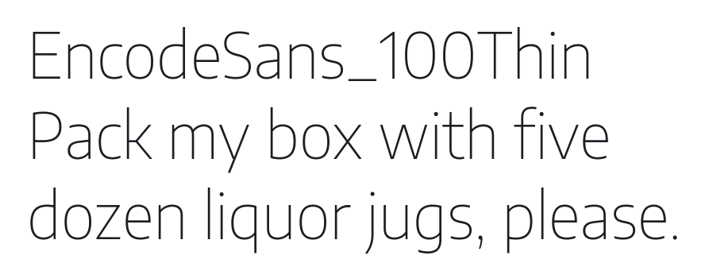](https://github.com/expo/google-fonts/tree/master/font-packages/encode-sans#readme)||[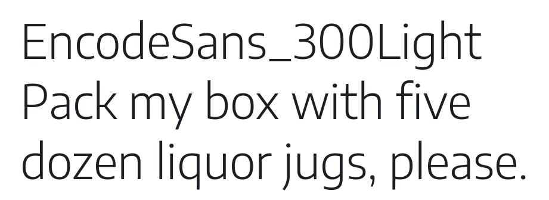](https://github.com/expo/google-fonts/tree/master/font-packages/encode-sans#readme)||
|||[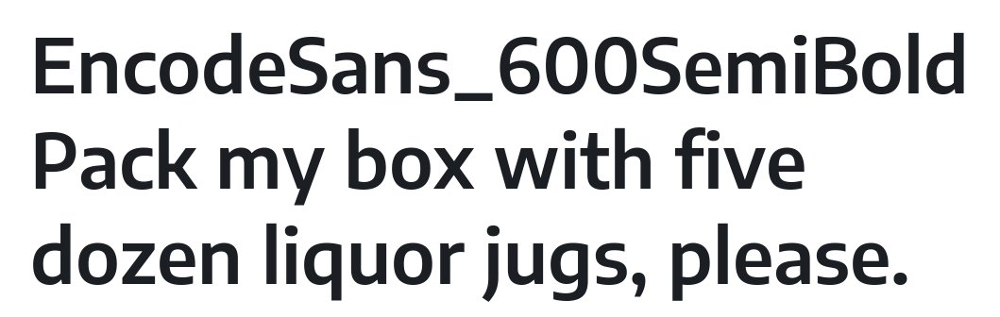](https://github.com/expo/google-fonts/tree/master/font-packages/encode-sans#readme)||
|[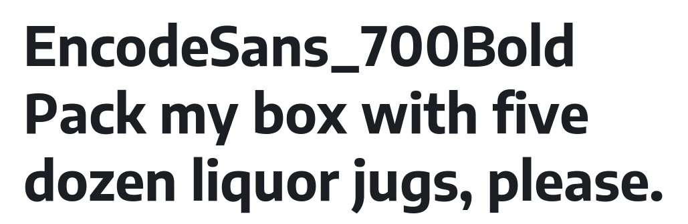](https://github.com/expo/google-fonts/tree/master/font-packages/encode-sans#readme)||[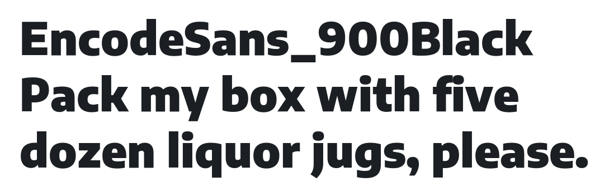](https://github.com/expo/google-fonts/tree/master/font-packages/encode-sans#readme)||
### [Encode Sans Condensed](https://github.com/expo/google-fonts/tree/master/font-packages/encode-sans-condensed#readme)

||||
|-|-|-|
|||||
|[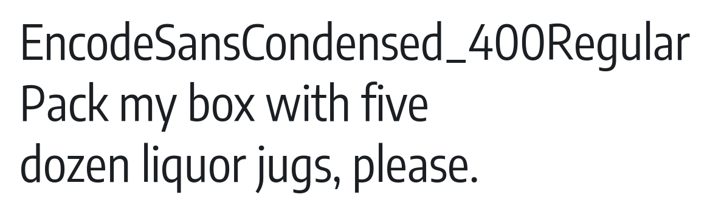](https://github.com/expo/google-fonts/tree/master/font-packages/encode-sans-condensed#readme)|[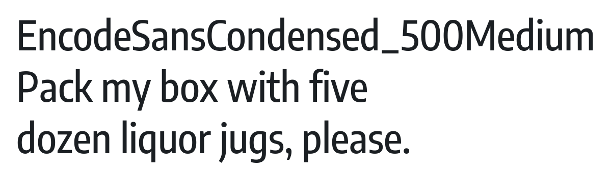](https://github.com/expo/google-fonts/tree/master/font-packages/encode-sans-condensed#readme)|[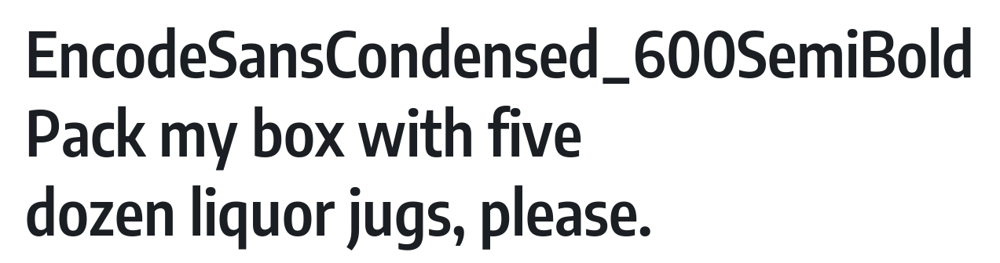](https://github.com/expo/google-fonts/tree/master/font-packages/encode-sans-condensed#readme)||
|[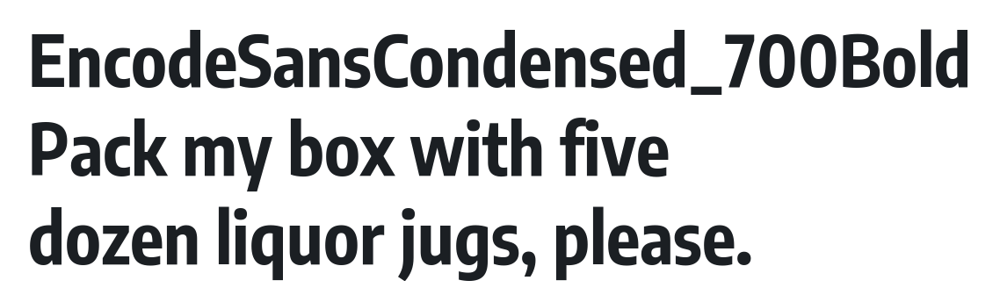](https://github.com/expo/google-fonts/tree/master/font-packages/encode-sans-condensed#readme)|[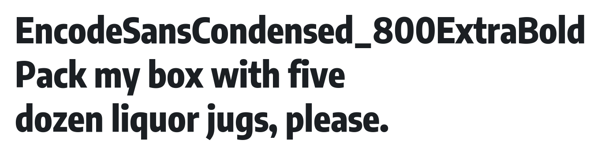](https://github.com/expo/google-fonts/tree/master/font-packages/encode-sans-condensed#readme)|||
### [Encode Sans Expanded](https://github.com/expo/google-fonts/tree/master/font-packages/encode-sans-expanded#readme)

||||
|-|-|-|
|[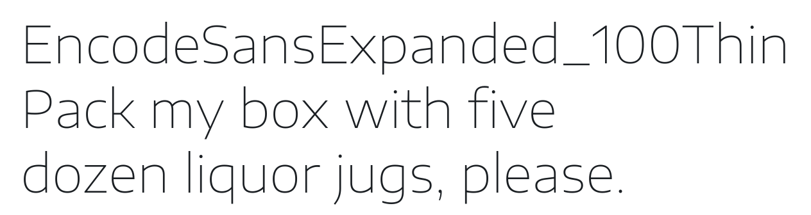](https://github.com/expo/google-fonts/tree/master/font-packages/encode-sans-expanded#readme)||||
|||||
|[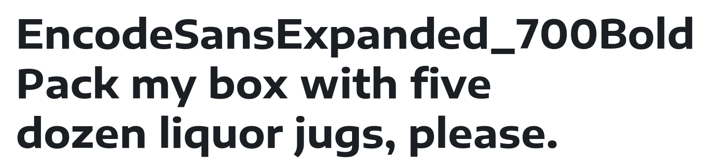](https://github.com/expo/google-fonts/tree/master/font-packages/encode-sans-expanded#readme)||||
### [Encode Sans Semi Condensed](https://github.com/expo/google-fonts/tree/master/font-packages/encode-sans-semi-condensed#readme)

||||
|-|-|-|
||[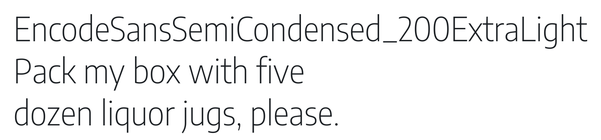](https://github.com/expo/google-fonts/tree/master/font-packages/encode-sans-semi-condensed#readme)|||
||[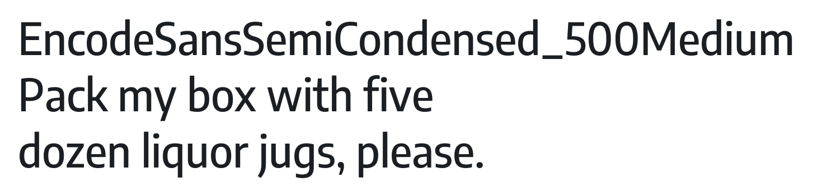](https://github.com/expo/google-fonts/tree/master/font-packages/encode-sans-semi-condensed#readme)|||
|||||
### [Encode Sans Semi Expanded](https://github.com/expo/google-fonts/tree/master/font-packages/encode-sans-semi-expanded#readme)

||||
|-|-|-|
||[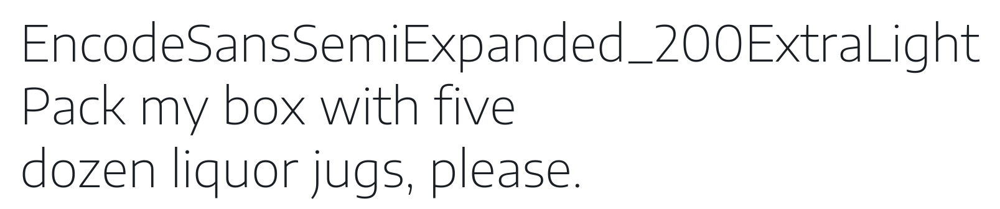](https://github.com/expo/google-fonts/tree/master/font-packages/encode-sans-semi-expanded#readme)|[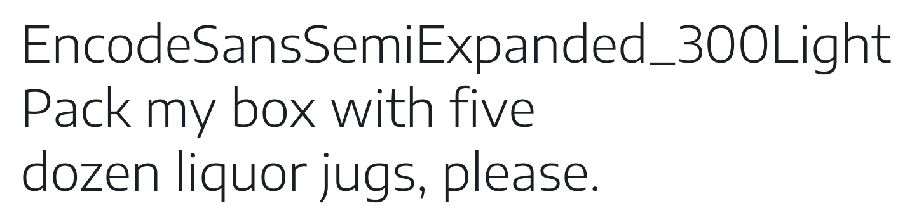](https://github.com/expo/google-fonts/tree/master/font-packages/encode-sans-semi-expanded#readme)||
|||||
||[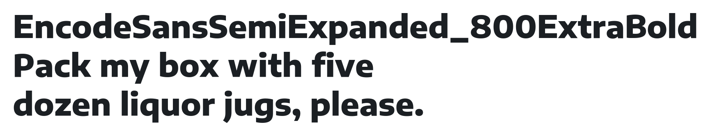](https://github.com/expo/google-fonts/tree/master/font-packages/encode-sans-semi-expanded#readme)|||
### [Mukta](https://github.com/expo/google-fonts/tree/master/font-packages/mukta#readme)

||||
|-|-|-|
|||||
|||||
|||||
### [Pangolin](https://github.com/expo/google-fonts/tree/master/font-packages/pangolin#readme)

||||
|-|-|-|
|||||
### [Nunito Sans](https://github.com/expo/google-fonts/tree/master/font-packages/nunito-sans#readme)

||||
|-|-|-|
|[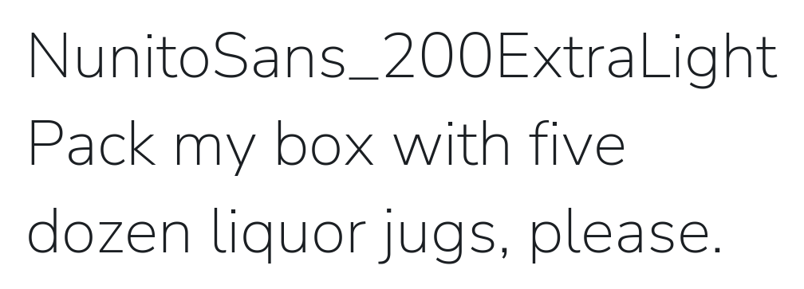](https://github.com/expo/google-fonts/tree/master/font-packages/nunito-sans#readme)||||
|||||
|||||
|||||
||[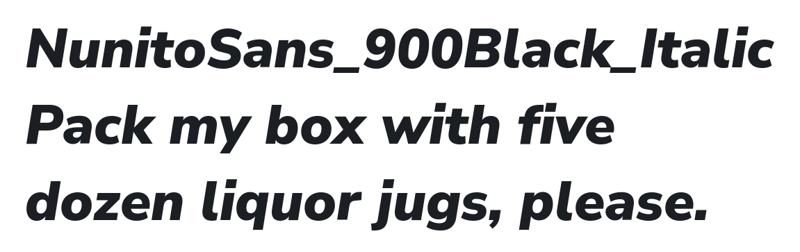](https://github.com/expo/google-fonts/tree/master/font-packages/nunito-sans#readme)|||
### [Fira Sans Condensed](https://github.com/expo/google-fonts/tree/master/font-packages/fira-sans-condensed#readme)

||||
|-|-|-|
|[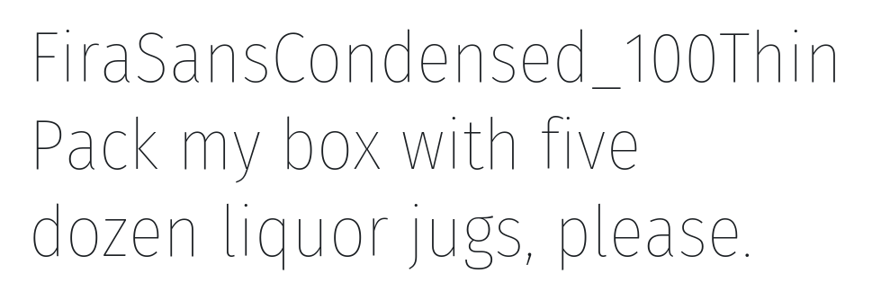](https://github.com/expo/google-fonts/tree/master/font-packages/fira-sans-condensed#readme)||||
|[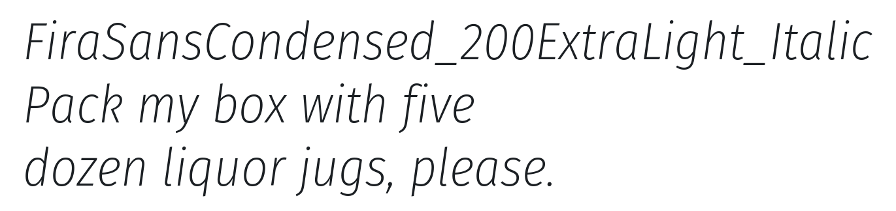](https://github.com/expo/google-fonts/tree/master/font-packages/fira-sans-condensed#readme)|[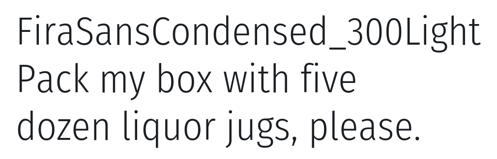](https://github.com/expo/google-fonts/tree/master/font-packages/fira-sans-condensed#readme)|[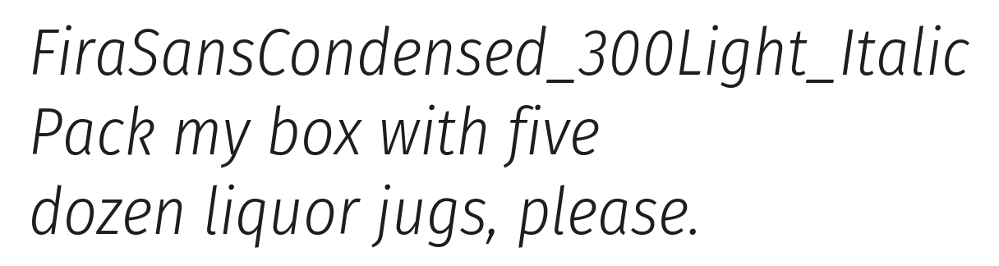](https://github.com/expo/google-fonts/tree/master/font-packages/fira-sans-condensed#readme)||
|||||
||[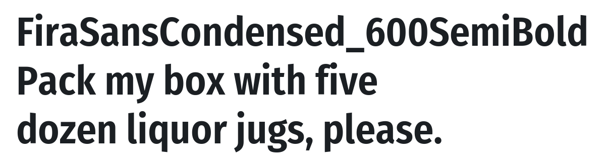](https://github.com/expo/google-fonts/tree/master/font-packages/fira-sans-condensed#readme)|[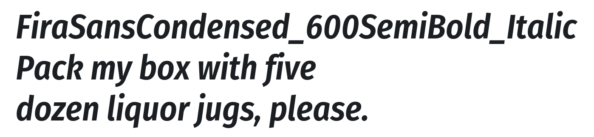](https://github.com/expo/google-fonts/tree/master/font-packages/fira-sans-condensed#readme)||
|||||
|[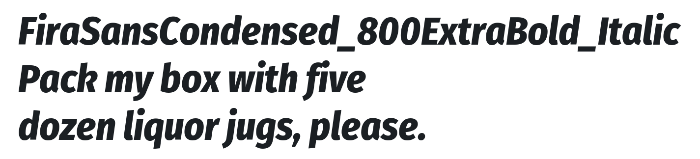](https://github.com/expo/google-fonts/tree/master/font-packages/fira-sans-condensed#readme)||||
### [Fira Sans Extra Condensed](https://github.com/expo/google-fonts/tree/master/font-packages/fira-sans-extra-condensed#readme)

||||
|-|-|-|
||[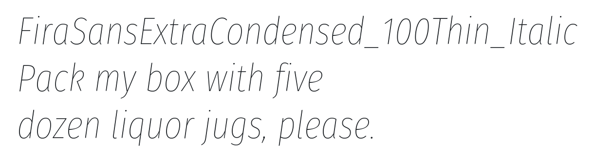](https://github.com/expo/google-fonts/tree/master/font-packages/fira-sans-extra-condensed#readme)|||
|||||
|||||
|||[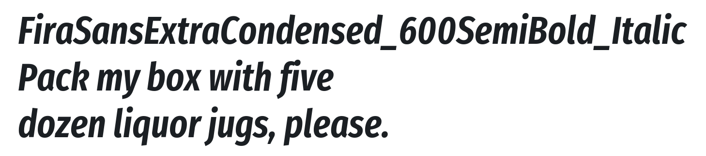](https://github.com/expo/google-fonts/tree/master/font-packages/fira-sans-extra-condensed#readme)||
|[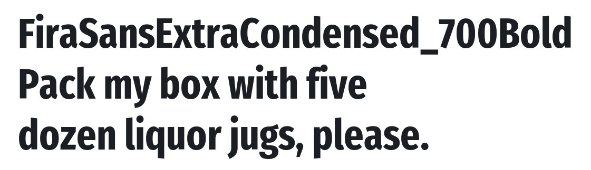](https://github.com/expo/google-fonts/tree/master/font-packages/fira-sans-extra-condensed#readme)||[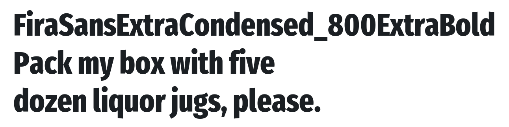](https://github.com/expo/google-fonts/tree/master/font-packages/fira-sans-extra-condensed#readme)||
|||||
### [Arsenal](https://github.com/expo/google-fonts/tree/master/font-packages/arsenal#readme)

||||
|-|-|-|
|||||
|[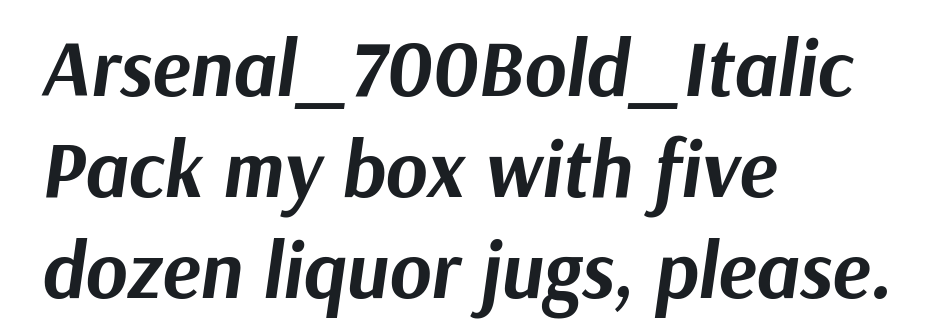](https://github.com/expo/google-fonts/tree/master/font-packages/arsenal#readme)||||
### [Sansita](https://github.com/expo/google-fonts/tree/master/font-packages/sansita#readme)

||||
|-|-|-|
|||||
||[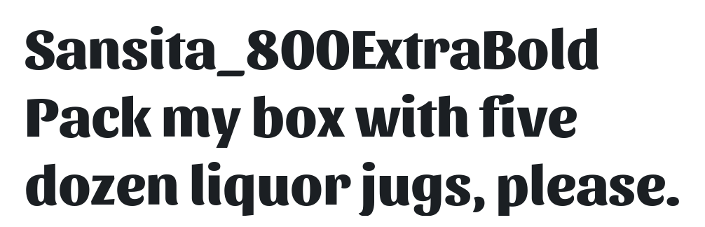](https://github.com/expo/google-fonts/tree/master/font-packages/sansita#readme)|||
|||||
### [Archivo](https://github.com/expo/google-fonts/tree/master/font-packages/archivo#readme)

||||
|-|-|-|
|||||
|||||
|||||
### [Bahiana](https://github.com/expo/google-fonts/tree/master/font-packages/bahiana#readme)

||||
|-|-|-|
|||||
### [Barrio](https://github.com/expo/google-fonts/tree/master/font-packages/barrio#readme)

||||
|-|-|-|
|[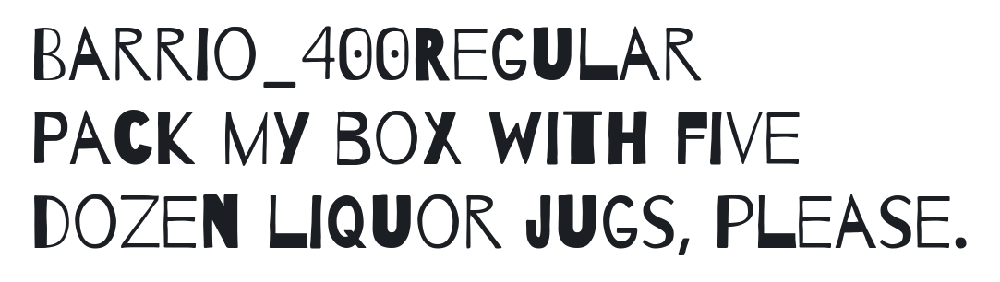](https://github.com/expo/google-fonts/tree/master/font-packages/barrio#readme)||||
### [Overpass](https://github.com/expo/google-fonts/tree/master/font-packages/overpass#readme)

||||
|-|-|-|
|[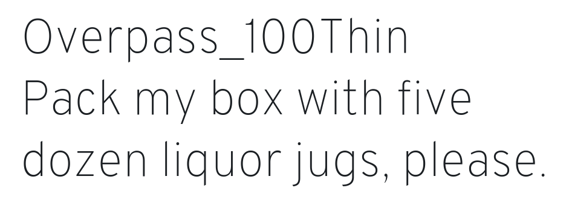](https://github.com/expo/google-fonts/tree/master/font-packages/overpass#readme)||||
|||||
|||||
|[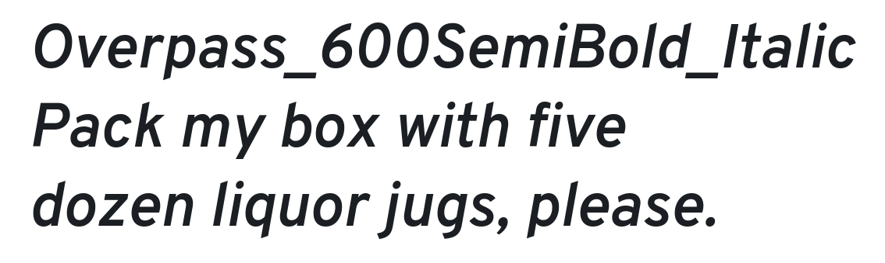](https://github.com/expo/google-fonts/tree/master/font-packages/overpass#readme)||||
|[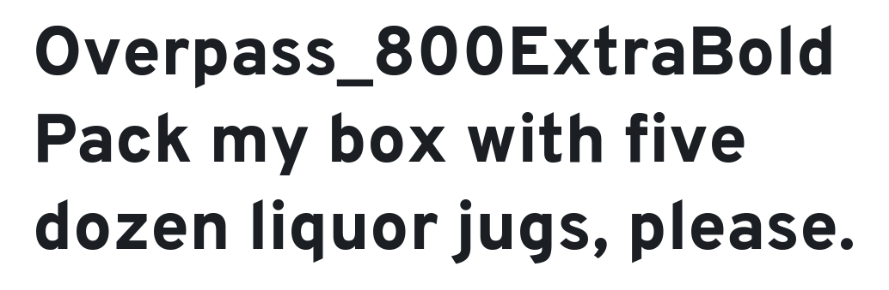](https://github.com/expo/google-fonts/tree/master/font-packages/overpass#readme)||||
|||||
### [Overpass Mono](https://github.com/expo/google-fonts/tree/master/font-packages/overpass-mono#readme)

||||
|-|-|-|
||[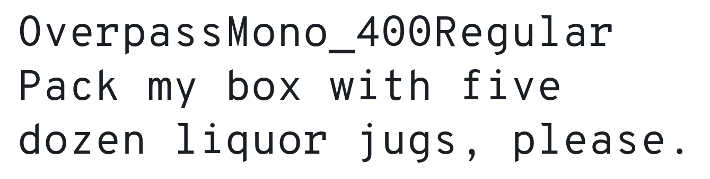](https://github.com/expo/google-fonts/tree/master/font-packages/overpass-mono#readme)|[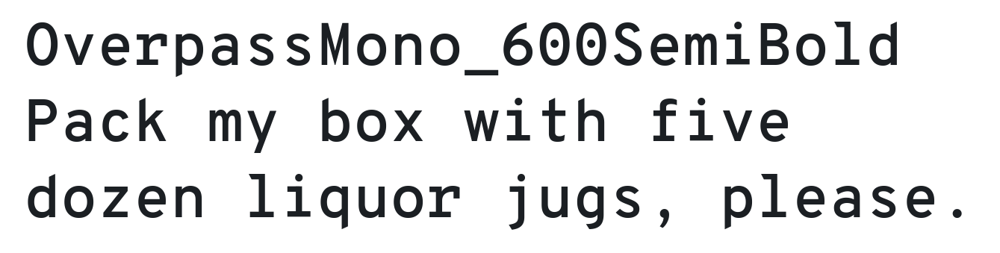](https://github.com/expo/google-fonts/tree/master/font-packages/overpass-mono#readme)||
|||||
### [Padauk](https://github.com/expo/google-fonts/tree/master/font-packages/padauk#readme)

||||
|-|-|-|
|||||
### [Abhaya Libre](https://github.com/expo/google-fonts/tree/master/font-packages/abhaya-libre#readme)

||||
|-|-|-|
|||||
|||||
### [Aref Ruqaa](https://github.com/expo/google-fonts/tree/master/font-packages/aref-ruqaa#readme)

||||
|-|-|-|
||[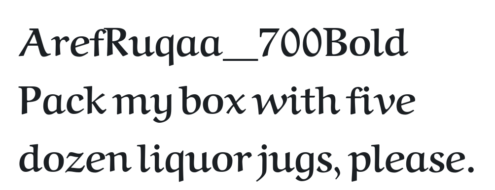](https://github.com/expo/google-fonts/tree/master/font-packages/aref-ruqaa#readme)|||
### [Coiny](https://github.com/expo/google-fonts/tree/master/font-packages/coiny#readme)

||||
|-|-|-|
|||||
### [Farsan](https://github.com/expo/google-fonts/tree/master/font-packages/farsan#readme)

||||
|-|-|-|
|[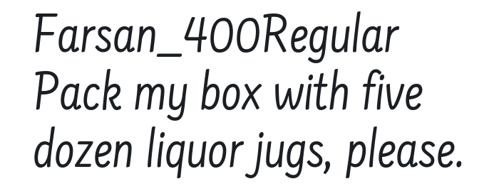](https://github.com/expo/google-fonts/tree/master/font-packages/farsan#readme)||||
### [Frank Ruhl Libre](https://github.com/expo/google-fonts/tree/master/font-packages/frank-ruhl-libre#readme)

||||
|-|-|-|
|||[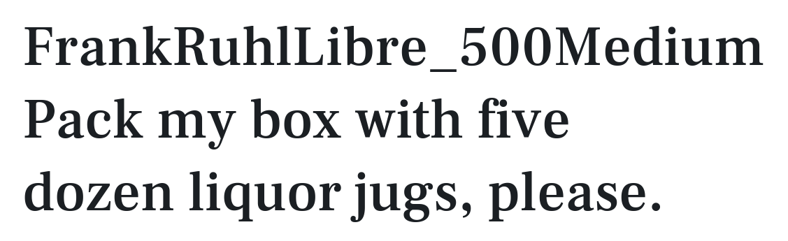](https://github.com/expo/google-fonts/tree/master/font-packages/frank-ruhl-libre#readme)||
|||||
### [Galada](https://github.com/expo/google-fonts/tree/master/font-packages/galada#readme)

||||
|-|-|-|
|||||
### [Kavivanar](https://github.com/expo/google-fonts/tree/master/font-packages/kavivanar#readme)

||||
|-|-|-|
|[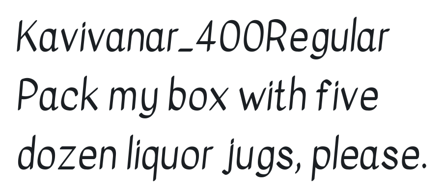](https://github.com/expo/google-fonts/tree/master/font-packages/kavivanar#readme)||||
### [Miriam Libre](https://github.com/expo/google-fonts/tree/master/font-packages/miriam-libre#readme)

||||
|-|-|-|
|[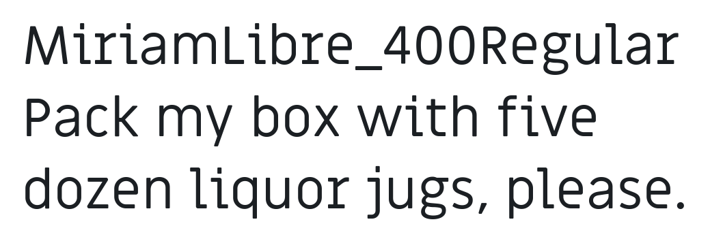](https://github.com/expo/google-fonts/tree/master/font-packages/miriam-libre#readme)||||
### [Arima Madurai](https://github.com/expo/google-fonts/tree/master/font-packages/arima-madurai#readme)

||||
|-|-|-|
|||||
|||||
|||||
### [Athiti](https://github.com/expo/google-fonts/tree/master/font-packages/athiti#readme)

||||
|-|-|-|
|||[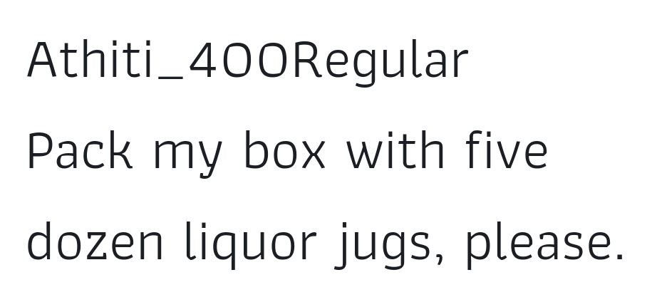](https://github.com/expo/google-fonts/tree/master/font-packages/athiti#readme)||
|||||
### [Atma](https://github.com/expo/google-fonts/tree/master/font-packages/atma#readme)

||||
|-|-|-|
||[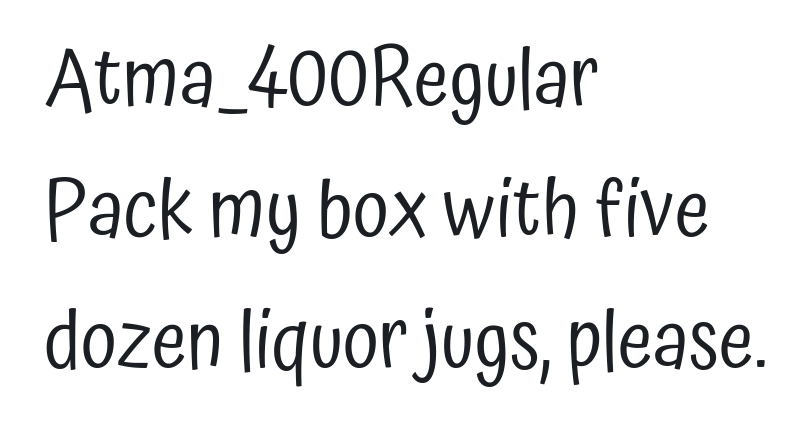](https://github.com/expo/google-fonts/tree/master/font-packages/atma#readme)|||
|||||
### [BioRhyme Expanded](https://github.com/expo/google-fonts/tree/master/font-packages/biorhyme-expanded#readme)

||||
|-|-|-|
|||||
|||||
### [Bungee](https://github.com/expo/google-fonts/tree/master/font-packages/bungee#readme)

||||
|-|-|-|
|||||
### [Bungee Hairline](https://github.com/expo/google-fonts/tree/master/font-packages/bungee-hairline#readme)

||||
|-|-|-|
|||||
### [Bungee Inline](https://github.com/expo/google-fonts/tree/master/font-packages/bungee-inline#readme)

||||
|-|-|-|
|||||
### [Bungee Outline](https://github.com/expo/google-fonts/tree/master/font-packages/bungee-outline#readme)

||||
|-|-|-|
|||||
### [Bungee Shade](https://github.com/expo/google-fonts/tree/master/font-packages/bungee-shade#readme)

||||
|-|-|-|
|||||
### [Cairo](https://github.com/expo/google-fonts/tree/master/font-packages/cairo#readme)

||||
|-|-|-|
|||||
||[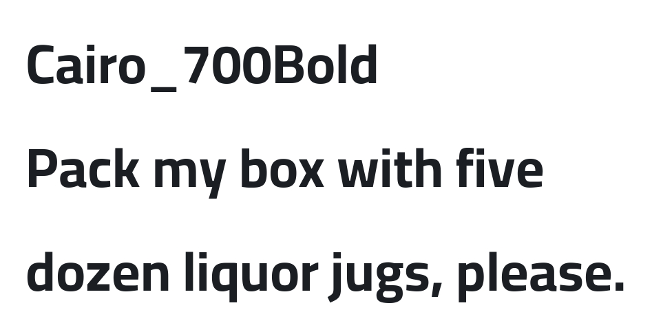](https://github.com/expo/google-fonts/tree/master/font-packages/cairo#readme)|||
### [Changa](https://github.com/expo/google-fonts/tree/master/font-packages/changa#readme)

||||
|-|-|-|
|||||
||[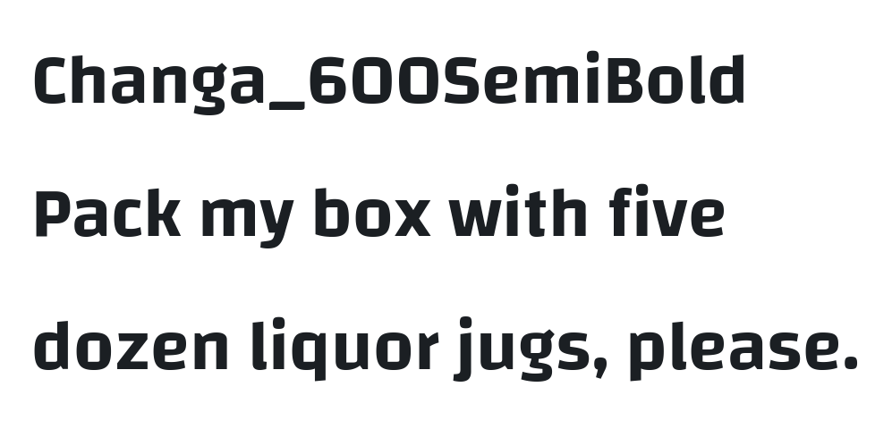](https://github.com/expo/google-fonts/tree/master/font-packages/changa#readme)|||
|||||
### [Chathura](https://github.com/expo/google-fonts/tree/master/font-packages/chathura#readme)

||||
|-|-|-|
|||[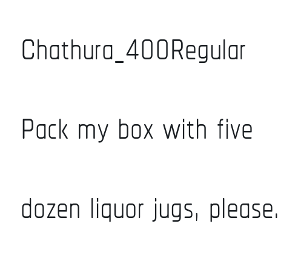](https://github.com/expo/google-fonts/tree/master/font-packages/chathura#readme)||
|||||
### [Cormorant](https://github.com/expo/google-fonts/tree/master/font-packages/cormorant#readme)

||||
|-|-|-|
|[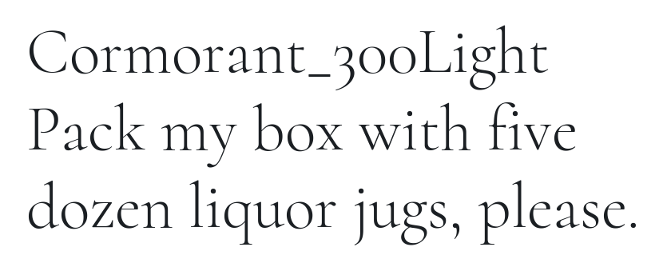](https://github.com/expo/google-fonts/tree/master/font-packages/cormorant#readme)||[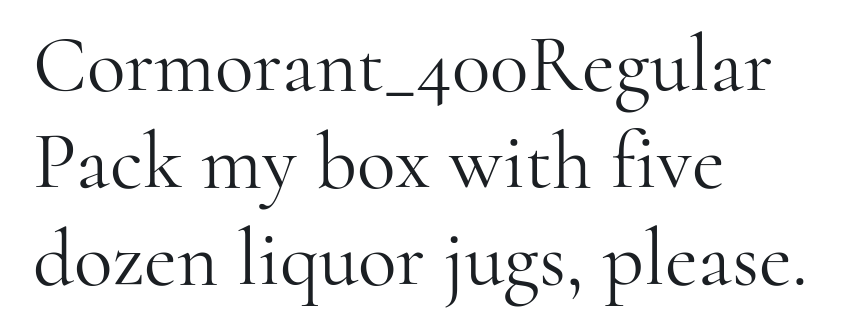](https://github.com/expo/google-fonts/tree/master/font-packages/cormorant#readme)||
|[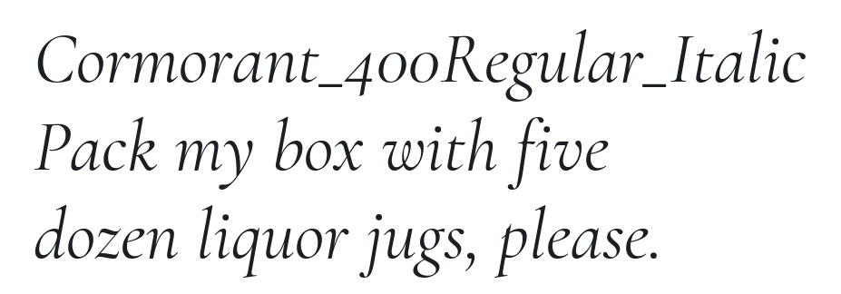](https://github.com/expo/google-fonts/tree/master/font-packages/cormorant#readme)|[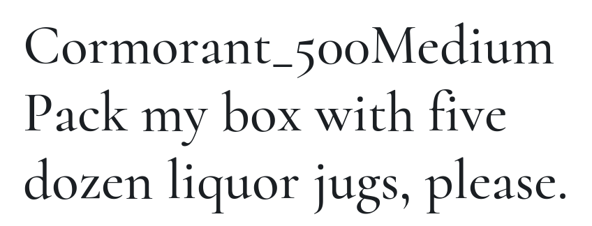](https://github.com/expo/google-fonts/tree/master/font-packages/cormorant#readme)|||
|[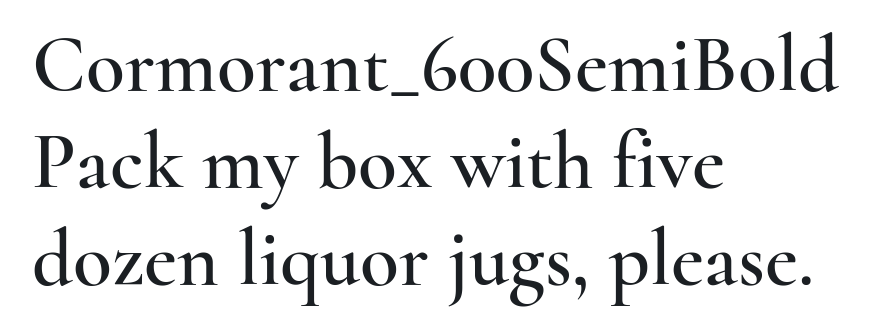](https://github.com/expo/google-fonts/tree/master/font-packages/cormorant#readme)||||
|||||
### [Cormorant Garamond](https://github.com/expo/google-fonts/tree/master/font-packages/cormorant-garamond#readme)

||||
|-|-|-|
|||||
||[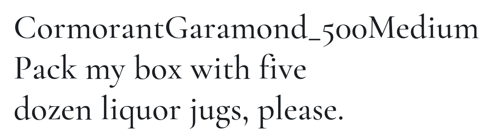](https://github.com/expo/google-fonts/tree/master/font-packages/cormorant-garamond#readme)|||
|[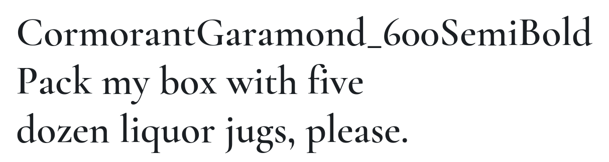](https://github.com/expo/google-fonts/tree/master/font-packages/cormorant-garamond#readme)|[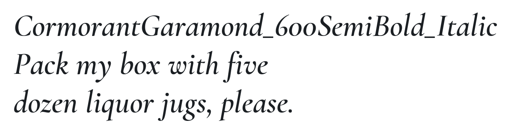](https://github.com/expo/google-fonts/tree/master/font-packages/cormorant-garamond#readme)|||
|||||
### [Cormorant Infant](https://github.com/expo/google-fonts/tree/master/font-packages/cormorant-infant#readme)

||||
|-|-|-|
|||||
|||[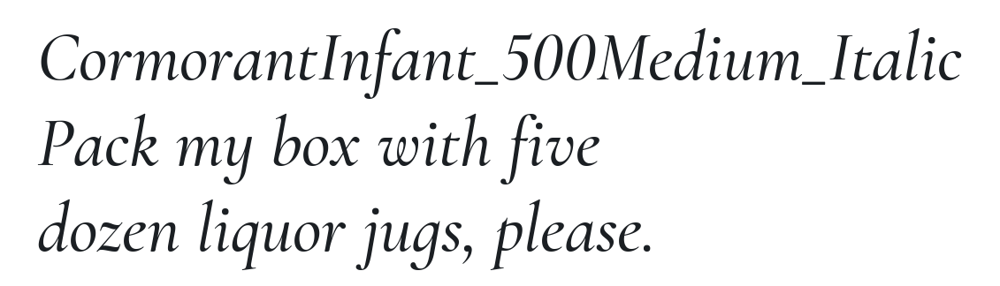](https://github.com/expo/google-fonts/tree/master/font-packages/cormorant-infant#readme)||
|||||
|[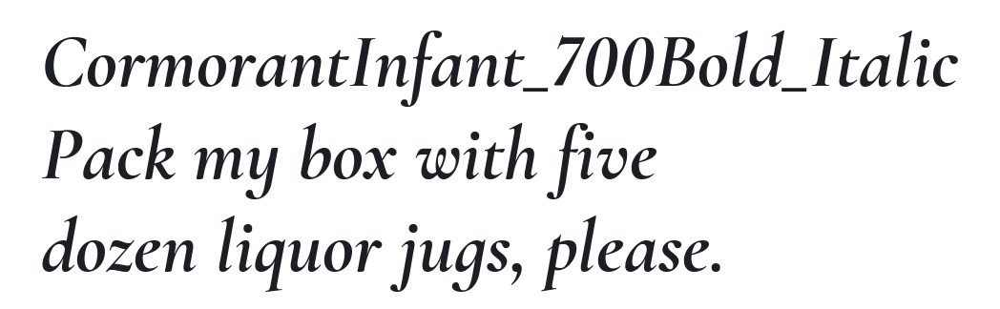](https://github.com/expo/google-fonts/tree/master/font-packages/cormorant-infant#readme)||||
### [Cormorant SC](https://github.com/expo/google-fonts/tree/master/font-packages/cormorant-sc#readme)

||||
|-|-|-|
|[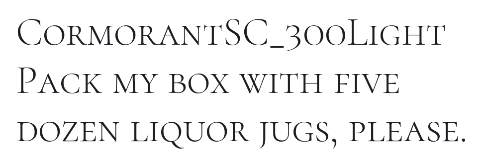](https://github.com/expo/google-fonts/tree/master/font-packages/cormorant-sc#readme)||||
|||||
### [Cormorant Unicase](https://github.com/expo/google-fonts/tree/master/font-packages/cormorant-unicase#readme)

||||
|-|-|-|
|||||
|[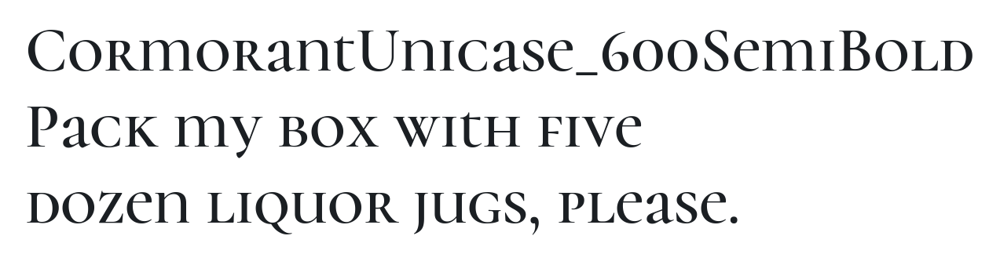](https://github.com/expo/google-fonts/tree/master/font-packages/cormorant-unicase#readme)||||
### [Cormorant Upright](https://github.com/expo/google-fonts/tree/master/font-packages/cormorant-upright#readme)

||||
|-|-|-|
||[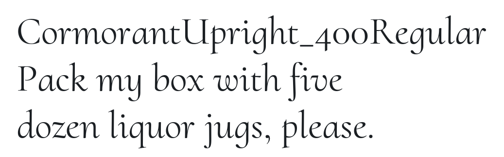](https://github.com/expo/google-fonts/tree/master/font-packages/cormorant-upright#readme)|||
||[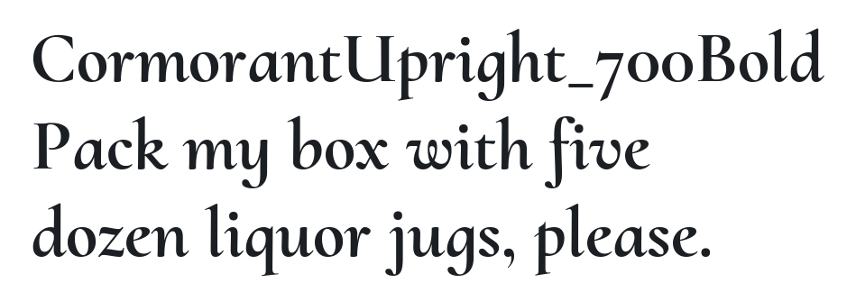](https://github.com/expo/google-fonts/tree/master/font-packages/cormorant-upright#readme)|||
### [David Libre](https://github.com/expo/google-fonts/tree/master/font-packages/david-libre#readme)

||||
|-|-|-|
|||[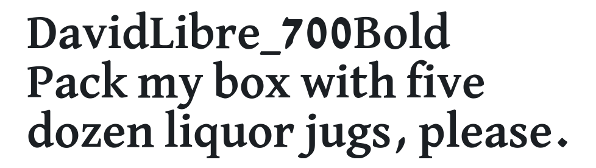](https://github.com/expo/google-fonts/tree/master/font-packages/david-libre#readme)||
### [Harmattan](https://github.com/expo/google-fonts/tree/master/font-packages/harmattan#readme)

||||
|-|-|-|
|||||
### [Heebo](https://github.com/expo/google-fonts/tree/master/font-packages/heebo#readme)

||||
|-|-|-|
|[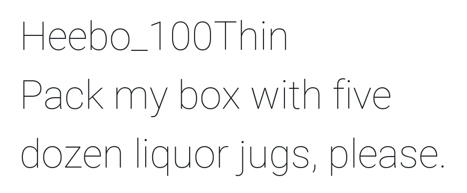](https://github.com/expo/google-fonts/tree/master/font-packages/heebo#readme)||||
|||||
|||||
### [Hind Guntur](https://github.com/expo/google-fonts/tree/master/font-packages/hind-guntur#readme)

||||
|-|-|-|
|[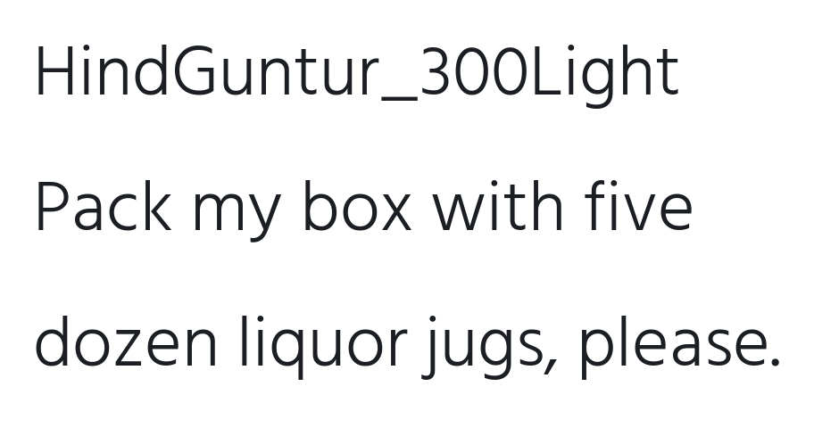](https://github.com/expo/google-fonts/tree/master/font-packages/hind-guntur#readme)||||
|||||
### [Hind Madurai](https://github.com/expo/google-fonts/tree/master/font-packages/hind-madurai#readme)

||||
|-|-|-|
|||||
|||||
### [Hind Siliguri](https://github.com/expo/google-fonts/tree/master/font-packages/hind-siliguri#readme)

||||
|-|-|-|
||[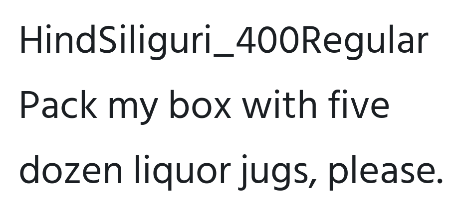](https://github.com/expo/google-fonts/tree/master/font-packages/hind-siliguri#readme)|||
|||||
### [Hind Vadodara](https://github.com/expo/google-fonts/tree/master/font-packages/hind-vadodara#readme)

||||
|-|-|-|
|[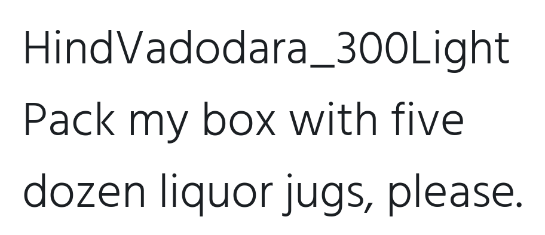](https://github.com/expo/google-fonts/tree/master/font-packages/hind-vadodara#readme)|[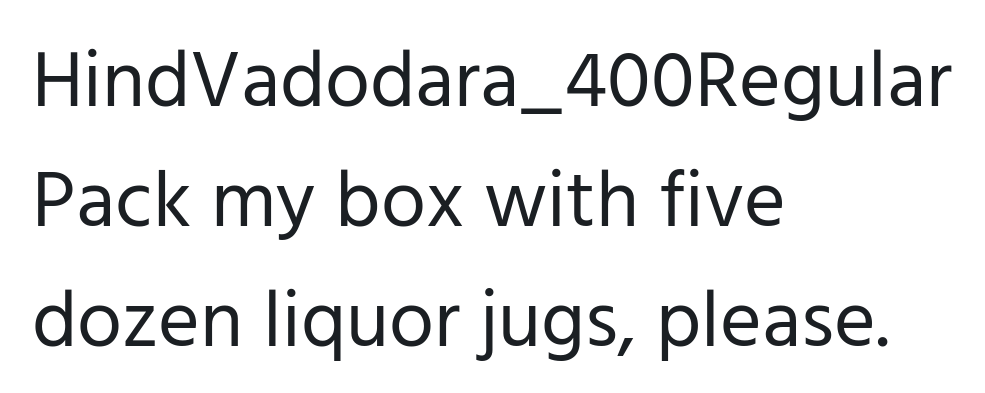](https://github.com/expo/google-fonts/tree/master/font-packages/hind-vadodara#readme)|[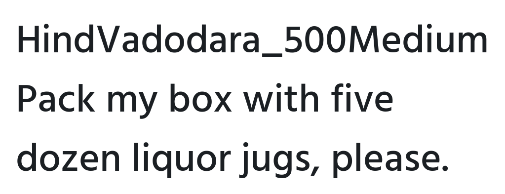](https://github.com/expo/google-fonts/tree/master/font-packages/hind-vadodara#readme)||
|[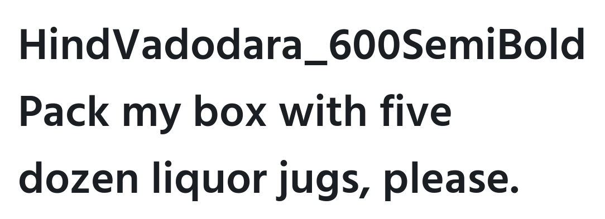](https://github.com/expo/google-fonts/tree/master/font-packages/hind-vadodara#readme)||||
### [Jomhuria](https://github.com/expo/google-fonts/tree/master/font-packages/jomhuria#readme)

||||
|-|-|-|
|||||
### [Katibeh](https://github.com/expo/google-fonts/tree/master/font-packages/katibeh#readme)

||||
|-|-|-|
|||||
### [Kumar One](https://github.com/expo/google-fonts/tree/master/font-packages/kumar-one#readme)

||||
|-|-|-|
|[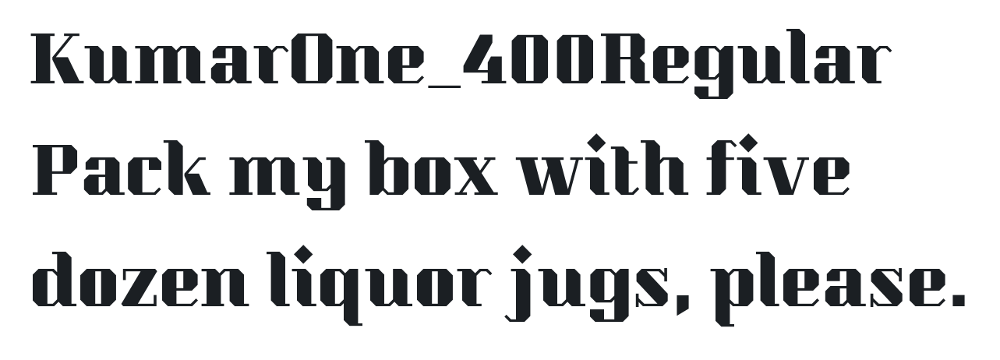](https://github.com/expo/google-fonts/tree/master/font-packages/kumar-one#readme)||||
### [Kumar One Outline](https://github.com/expo/google-fonts/tree/master/font-packages/kumar-one-outline#readme)

||||
|-|-|-|
|||||
### [Lalezar](https://github.com/expo/google-fonts/tree/master/font-packages/lalezar#readme)

||||
|-|-|-|
|||||
### [Lemonada](https://github.com/expo/google-fonts/tree/master/font-packages/lemonada#readme)

||||
|-|-|-|
|[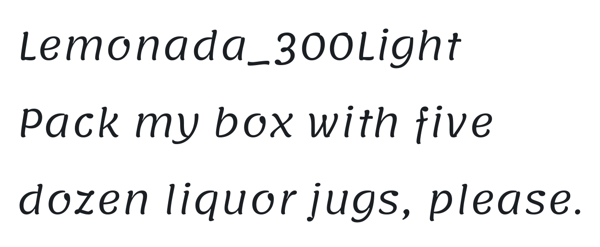](https://github.com/expo/google-fonts/tree/master/font-packages/lemonada#readme)||||
|[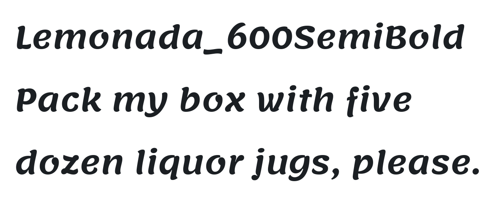](https://github.com/expo/google-fonts/tree/master/font-packages/lemonada#readme)||||
### [Libre Franklin](https://github.com/expo/google-fonts/tree/master/font-packages/libre-franklin#readme)

||||
|-|-|-|
|[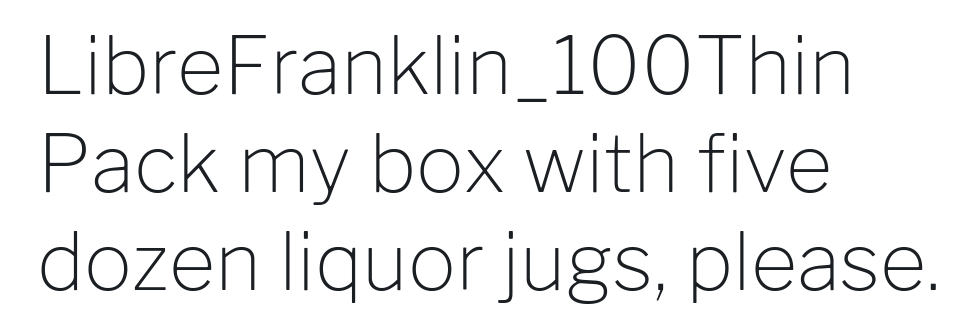](https://github.com/expo/google-fonts/tree/master/font-packages/libre-franklin#readme)||[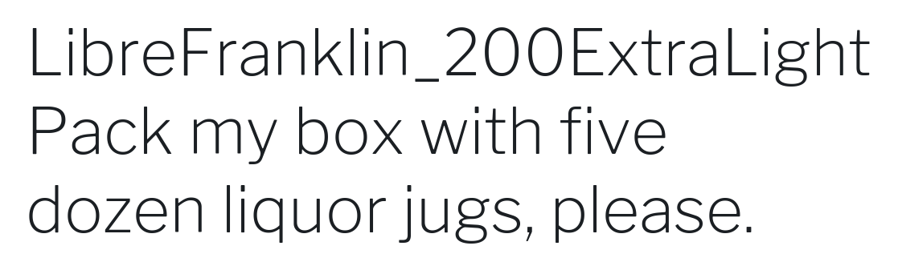](https://github.com/expo/google-fonts/tree/master/font-packages/libre-franklin#readme)||
|[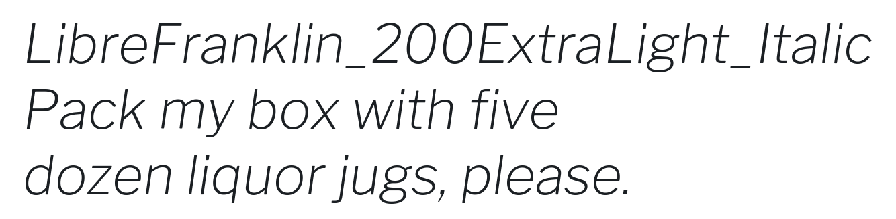](https://github.com/expo/google-fonts/tree/master/font-packages/libre-franklin#readme)|[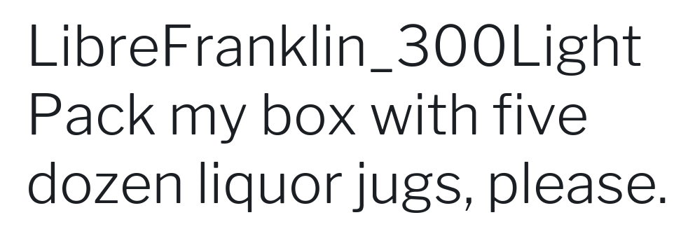](https://github.com/expo/google-fonts/tree/master/font-packages/libre-franklin#readme)|[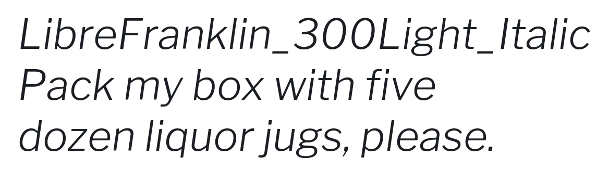](https://github.com/expo/google-fonts/tree/master/font-packages/libre-franklin#readme)||
|||||
|||||
|[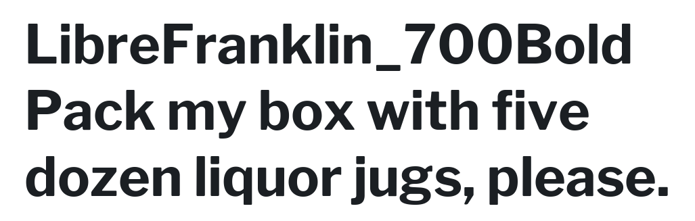](https://github.com/expo/google-fonts/tree/master/font-packages/libre-franklin#readme)||||
|[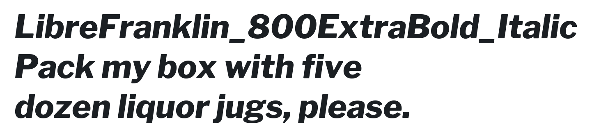](https://github.com/expo/google-fonts/tree/master/font-packages/libre-franklin#readme)||||
### [Maitree](https://github.com/expo/google-fonts/tree/master/font-packages/maitree#readme)

||||
|-|-|-|
||[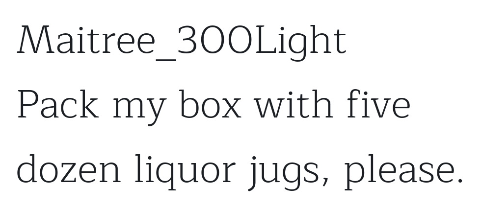](https://github.com/expo/google-fonts/tree/master/font-packages/maitree#readme)|[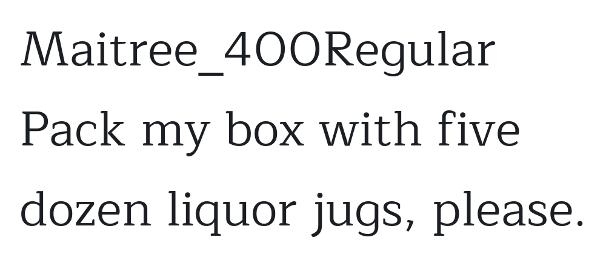](https://github.com/expo/google-fonts/tree/master/font-packages/maitree#readme)||
|[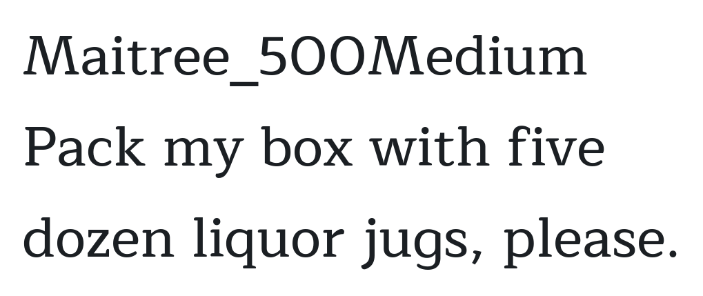](https://github.com/expo/google-fonts/tree/master/font-packages/maitree#readme)|[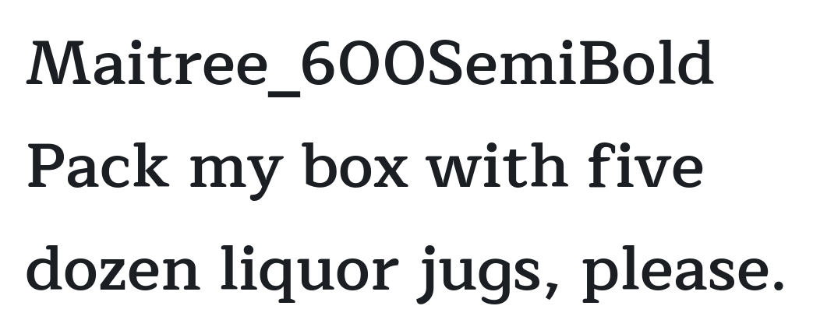](https://github.com/expo/google-fonts/tree/master/font-packages/maitree#readme)|||
### [Mirza](https://github.com/expo/google-fonts/tree/master/font-packages/mirza#readme)

||||
|-|-|-|
|||||
|||||
### [Mitr](https://github.com/expo/google-fonts/tree/master/font-packages/mitr#readme)

||||
|-|-|-|
|||||
|||[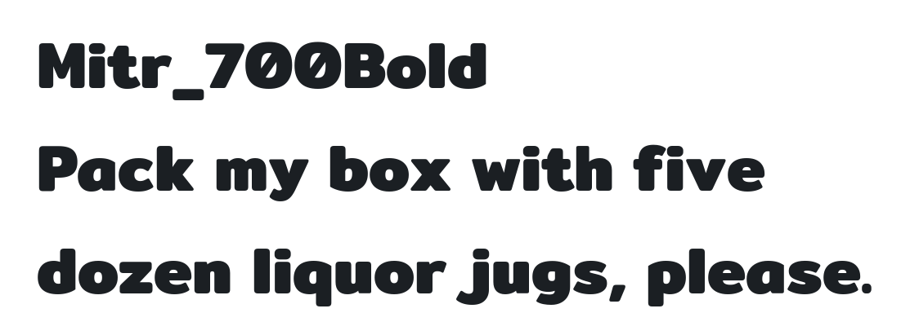](https://github.com/expo/google-fonts/tree/master/font-packages/mitr#readme)||
### [Mogra](https://github.com/expo/google-fonts/tree/master/font-packages/mogra#readme)

||||
|-|-|-|
|||||
### [Mukta Vaani](https://github.com/expo/google-fonts/tree/master/font-packages/mukta-vaani#readme)

||||
|-|-|-|
|||||
|||||
|[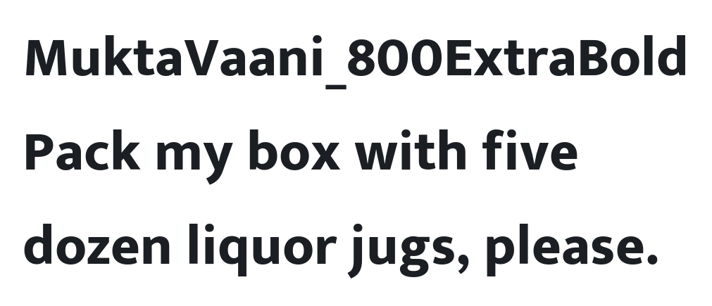](https://github.com/expo/google-fonts/tree/master/font-packages/mukta-vaani#readme)||||
### [Pavanam](https://github.com/expo/google-fonts/tree/master/font-packages/pavanam#readme)

||||
|-|-|-|
|[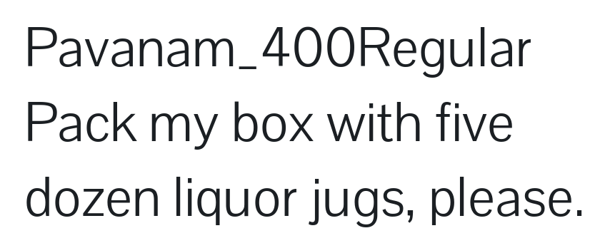](https://github.com/expo/google-fonts/tree/master/font-packages/pavanam#readme)||||
### [Pridi](https://github.com/expo/google-fonts/tree/master/font-packages/pridi#readme)

||||
|-|-|-|
|||[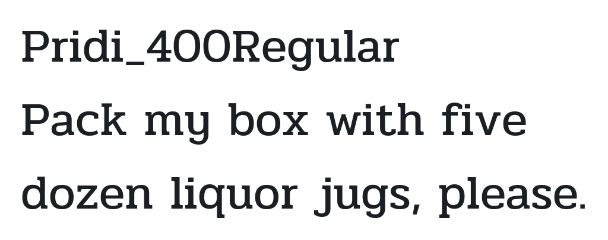](https://github.com/expo/google-fonts/tree/master/font-packages/pridi#readme)||
|||[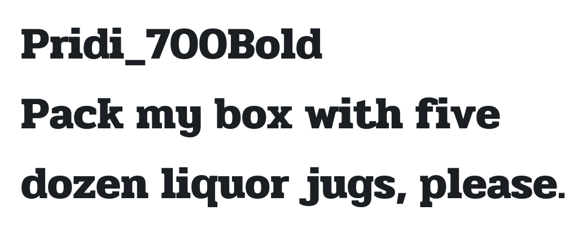](https://github.com/expo/google-fonts/tree/master/font-packages/pridi#readme)||
### [Prompt](https://github.com/expo/google-fonts/tree/master/font-packages/prompt#readme)

||||
|-|-|-|
|||[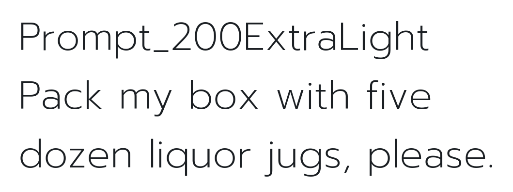](https://github.com/expo/google-fonts/tree/master/font-packages/prompt#readme)||
|[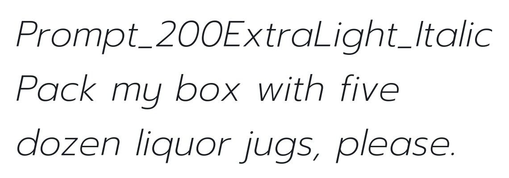](https://github.com/expo/google-fonts/tree/master/font-packages/prompt#readme)||||
|||||
|[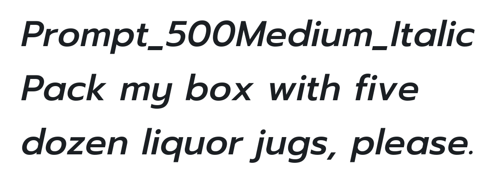](https://github.com/expo/google-fonts/tree/master/font-packages/prompt#readme)||||
|||[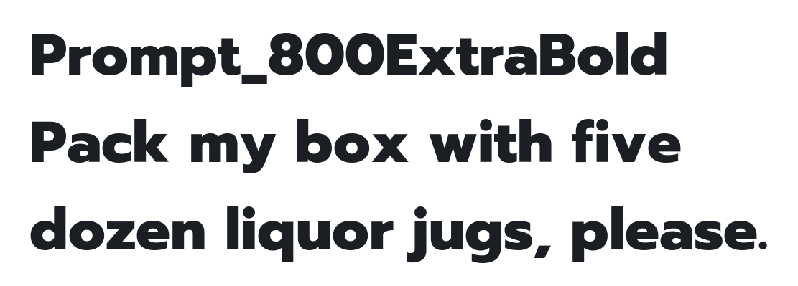](https://github.com/expo/google-fonts/tree/master/font-packages/prompt#readme)||
|||||
### [Proza Libre](https://github.com/expo/google-fonts/tree/master/font-packages/proza-libre#readme)

||||
|-|-|-|
|||||
|[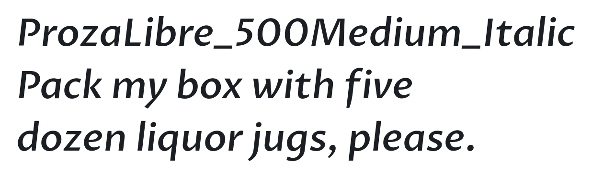](https://github.com/expo/google-fonts/tree/master/font-packages/proza-libre#readme)|[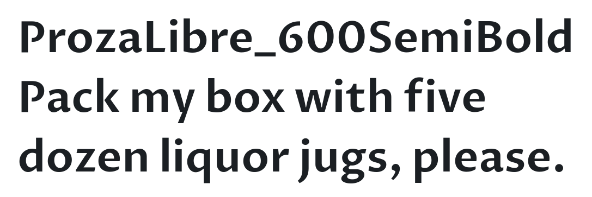](https://github.com/expo/google-fonts/tree/master/font-packages/proza-libre#readme)|||
|||||
|||||
### [Rakkas](https://github.com/expo/google-fonts/tree/master/font-packages/rakkas#readme)

||||
|-|-|-|
|[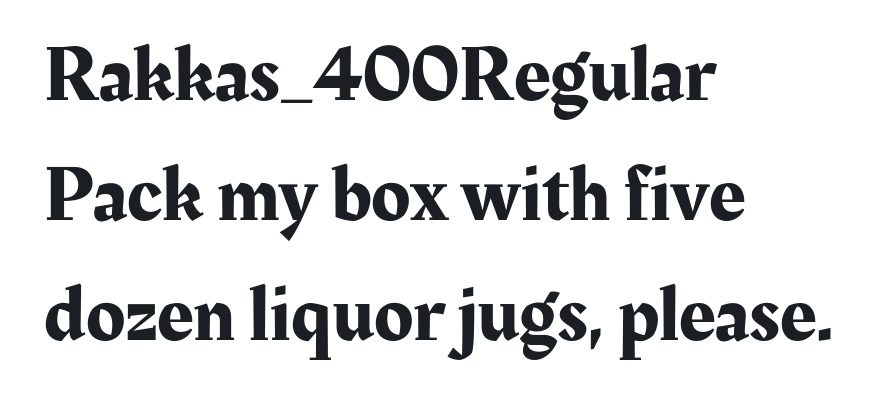](https://github.com/expo/google-fonts/tree/master/font-packages/rakkas#readme)||||
### [Rasa](https://github.com/expo/google-fonts/tree/master/font-packages/rasa#readme)

||||
|-|-|-|
|||||
|||||
### [Scope One](https://github.com/expo/google-fonts/tree/master/font-packages/scope-one#readme)

||||
|-|-|-|
|||||
### [Shrikhand](https://github.com/expo/google-fonts/tree/master/font-packages/shrikhand#readme)

||||
|-|-|-|
|||||
### [Space Mono](https://github.com/expo/google-fonts/tree/master/font-packages/space-mono#readme)

||||
|-|-|-|
|||||
|[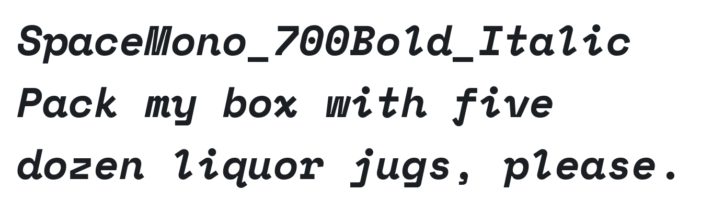](https://github.com/expo/google-fonts/tree/master/font-packages/space-mono#readme)||||
### [Taviraj](https://github.com/expo/google-fonts/tree/master/font-packages/taviraj#readme)

||||
|-|-|-|
|||||
|||||
||[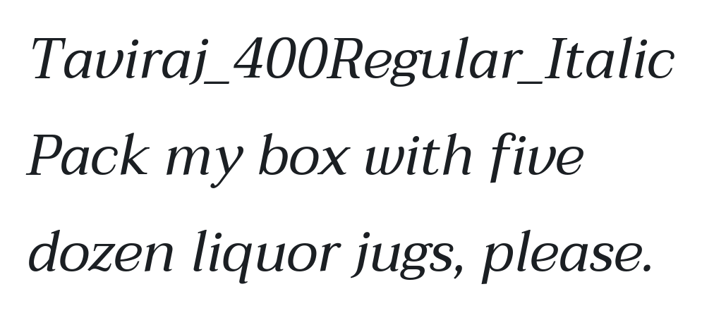](https://github.com/expo/google-fonts/tree/master/font-packages/taviraj#readme)|[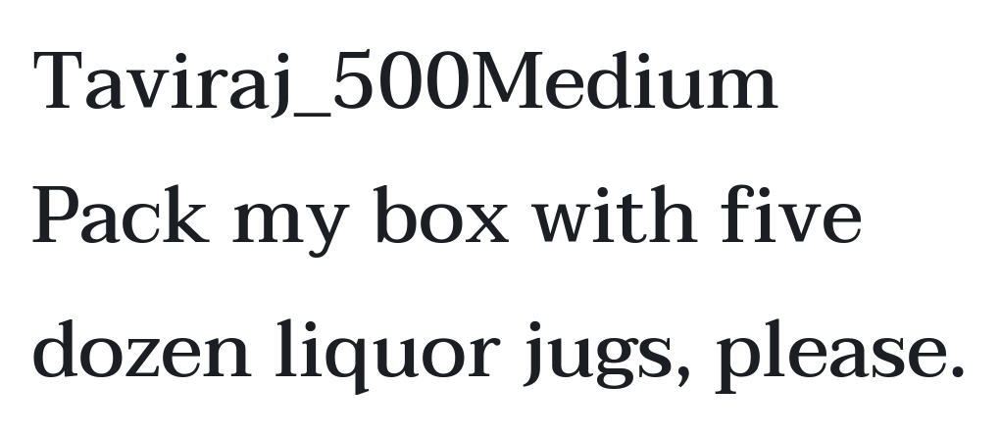](https://github.com/expo/google-fonts/tree/master/font-packages/taviraj#readme)||
|||[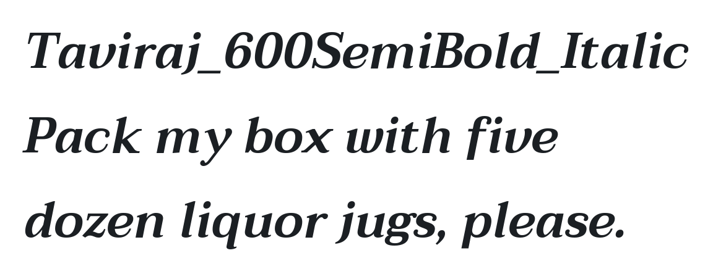](https://github.com/expo/google-fonts/tree/master/font-packages/taviraj#readme)||
|||[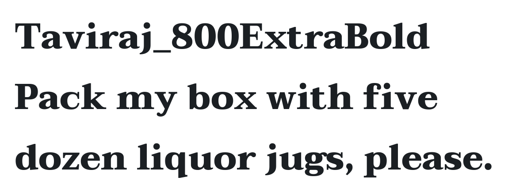](https://github.com/expo/google-fonts/tree/master/font-packages/taviraj#readme)||
|[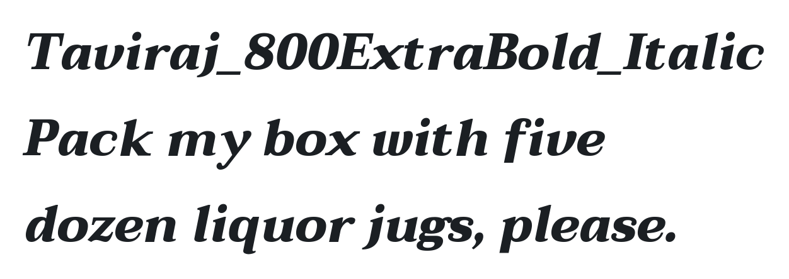](https://github.com/expo/google-fonts/tree/master/font-packages/taviraj#readme)||||
### [Trirong](https://github.com/expo/google-fonts/tree/master/font-packages/trirong#readme)

||||
|-|-|-|
||[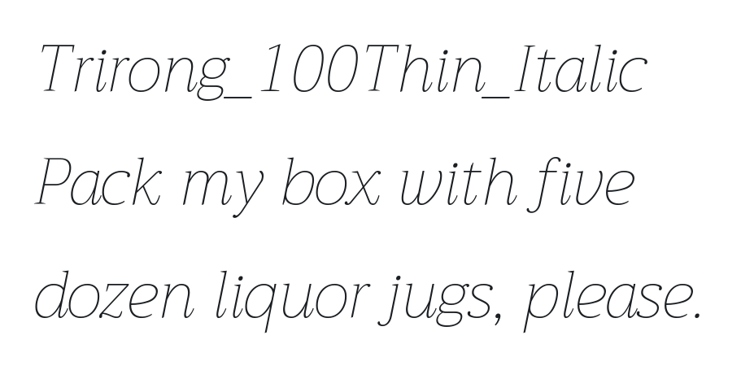](https://github.com/expo/google-fonts/tree/master/font-packages/trirong#readme)|||
|[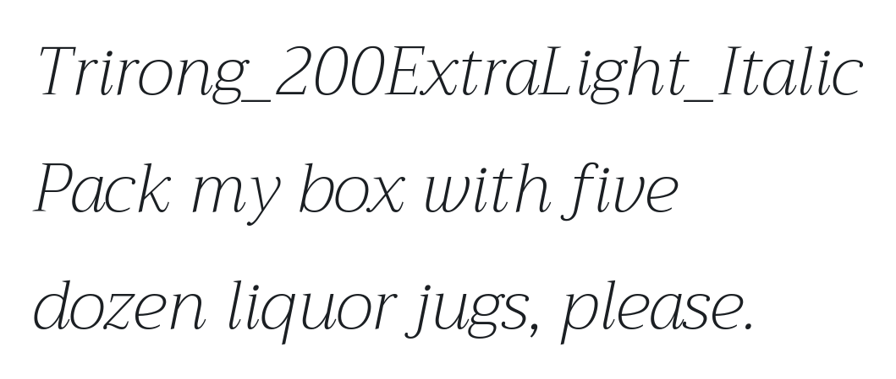](https://github.com/expo/google-fonts/tree/master/font-packages/trirong#readme)||||
|||||
||[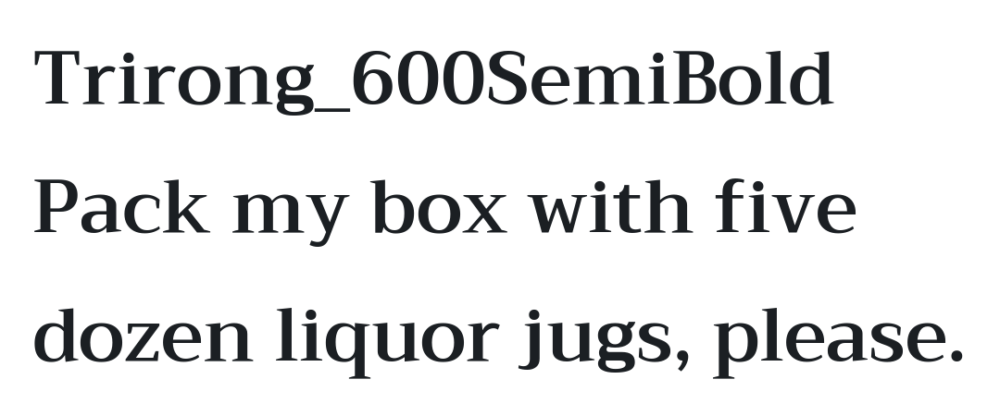](https://github.com/expo/google-fonts/tree/master/font-packages/trirong#readme)|||
|||||
|||[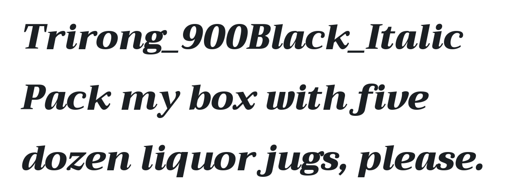](https://github.com/expo/google-fonts/tree/master/font-packages/trirong#readme)||
### [Yatra One](https://github.com/expo/google-fonts/tree/master/font-packages/yatra-one#readme)

||||
|-|-|-|
|||||
### [Yrsa](https://github.com/expo/google-fonts/tree/master/font-packages/yrsa#readme)

||||
|-|-|-|
|[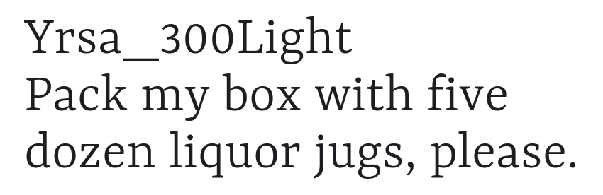](https://github.com/expo/google-fonts/tree/master/font-packages/yrsa#readme)|[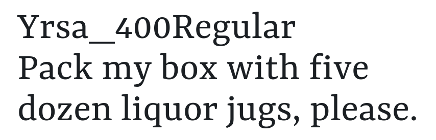](https://github.com/expo/google-fonts/tree/master/font-packages/yrsa#readme)|||
|[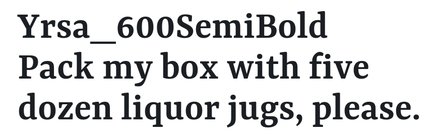](https://github.com/expo/google-fonts/tree/master/font-packages/yrsa#readme)||||
### [El Messiri](https://github.com/expo/google-fonts/tree/master/font-packages/el-messiri#readme)

||||
|-|-|-|
|||[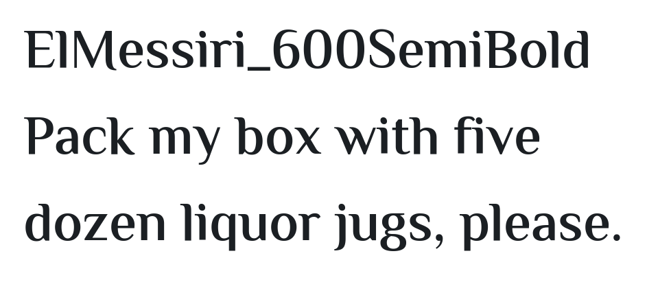](https://github.com/expo/google-fonts/tree/master/font-packages/el-messiri#readme)||
|||||
### [Meera Inimai](https://github.com/expo/google-fonts/tree/master/font-packages/meera-inimai#readme)

||||
|-|-|-|
|||||
### [Pattaya](https://github.com/expo/google-fonts/tree/master/font-packages/pattaya#readme)

||||
|-|-|-|
|||||
### [Reem Kufi](https://github.com/expo/google-fonts/tree/master/font-packages/reem-kufi#readme)

||||
|-|-|-|
|||||
### [Chilanka](https://github.com/expo/google-fonts/tree/master/font-packages/chilanka#readme)

||||
|-|-|-|
|||||
### [Assistant](https://github.com/expo/google-fonts/tree/master/font-packages/assistant#readme)

||||
|-|-|-|
|||||
|||||
### [Secular One](https://github.com/expo/google-fonts/tree/master/font-packages/secular-one#readme)

||||
|-|-|-|
|||||
### [Suez One](https://github.com/expo/google-fonts/tree/master/font-packages/suez-one#readme)

||||
|-|-|-|
|||||
### [Amiko](https://github.com/expo/google-fonts/tree/master/font-packages/amiko#readme)

||||
|-|-|-|
|||||
### [BioRhyme](https://github.com/expo/google-fonts/tree/master/font-packages/biorhyme#readme)

||||
|-|-|-|
|||[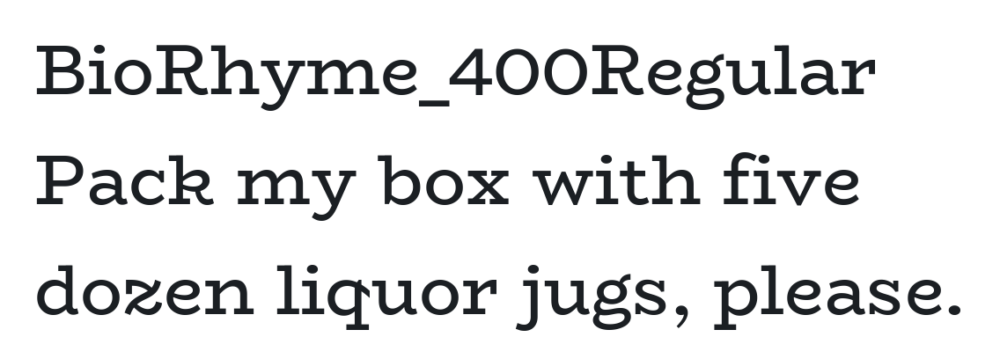](https://github.com/expo/google-fonts/tree/master/font-packages/biorhyme#readme)||
|||||
### [Kosugi](https://github.com/expo/google-fonts/tree/master/font-packages/kosugi#readme)

||||
|-|-|-|
|||||
### [Kosugi Maru](https://github.com/expo/google-fonts/tree/master/font-packages/kosugi-maru#readme)

||||
|-|-|-|
|||||
### [Baloo 2](https://github.com/expo/google-fonts/tree/master/font-packages/baloo-2#readme)

||||
|-|-|-|
|||[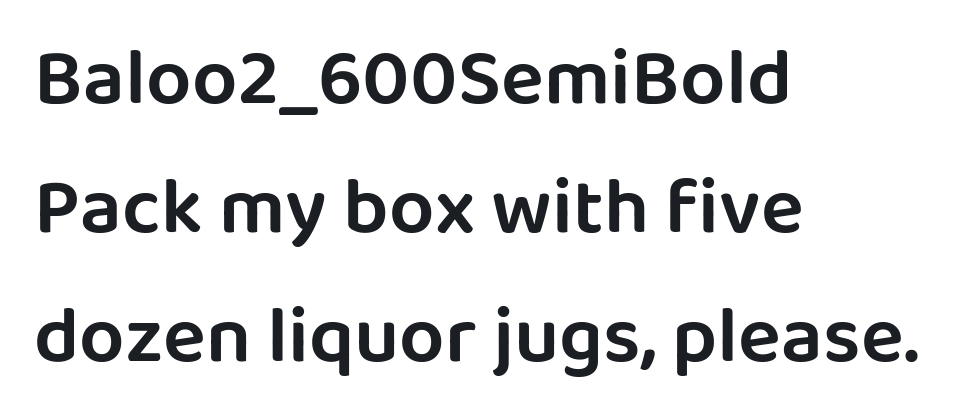](https://github.com/expo/google-fonts/tree/master/font-packages/baloo-2#readme)||
||[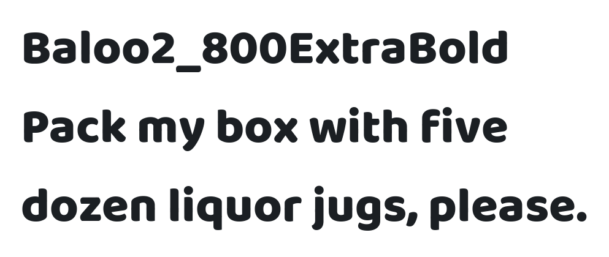](https://github.com/expo/google-fonts/tree/master/font-packages/baloo-2#readme)|||
### [Baloo Bhai 2](https://github.com/expo/google-fonts/tree/master/font-packages/baloo-bhai-2#readme)

||||
|-|-|-|
||[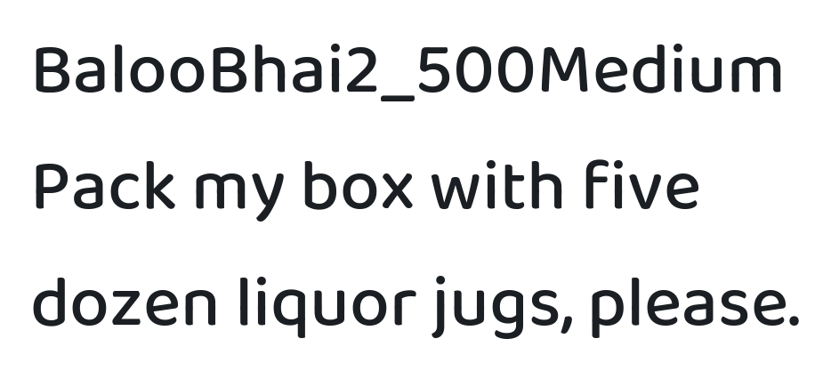](https://github.com/expo/google-fonts/tree/master/font-packages/baloo-bhai-2#readme)|||
|||||
### [Baloo Bhaina 2](https://github.com/expo/google-fonts/tree/master/font-packages/baloo-bhaina-2#readme)

||||
|-|-|-|
||[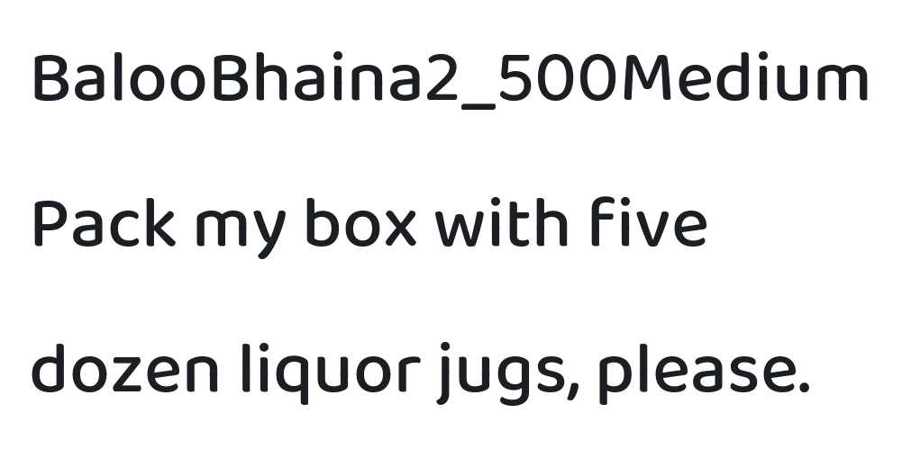](https://github.com/expo/google-fonts/tree/master/font-packages/baloo-bhaina-2#readme)|||
|[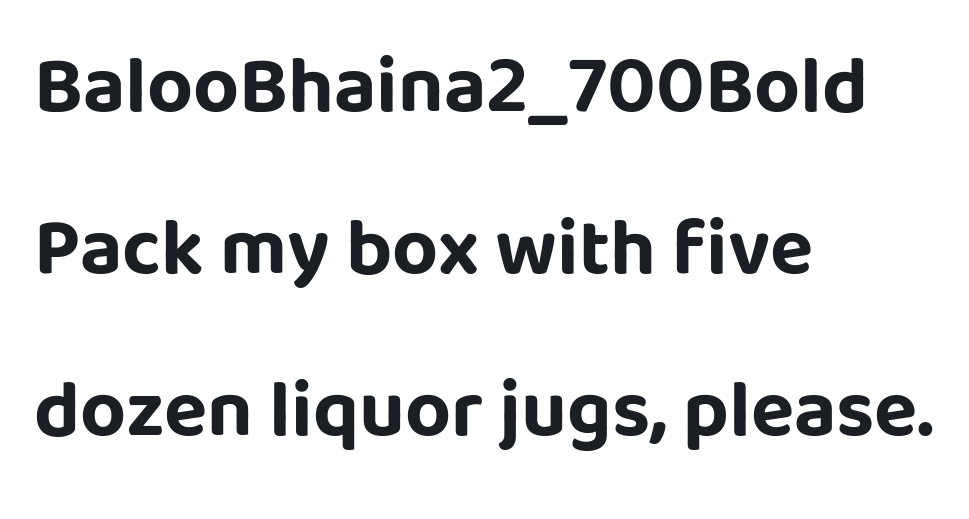](https://github.com/expo/google-fonts/tree/master/font-packages/baloo-bhaina-2#readme)|[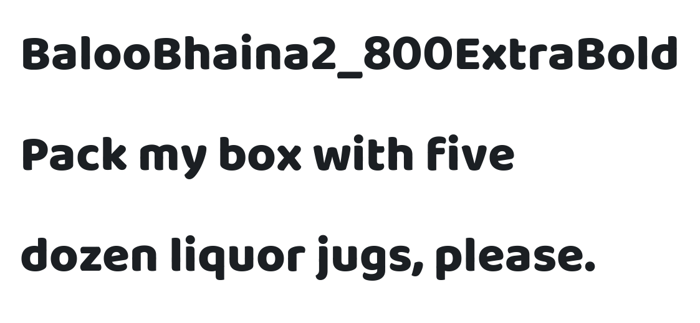](https://github.com/expo/google-fonts/tree/master/font-packages/baloo-bhaina-2#readme)|||
### [Baloo Chettan 2](https://github.com/expo/google-fonts/tree/master/font-packages/baloo-chettan-2#readme)

||||
|-|-|-|
||[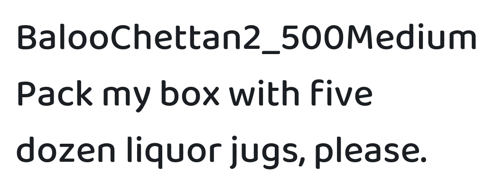](https://github.com/expo/google-fonts/tree/master/font-packages/baloo-chettan-2#readme)|||
|||||
### [Baloo Da 2](https://github.com/expo/google-fonts/tree/master/font-packages/baloo-da-2#readme)

||||
|-|-|-|
||[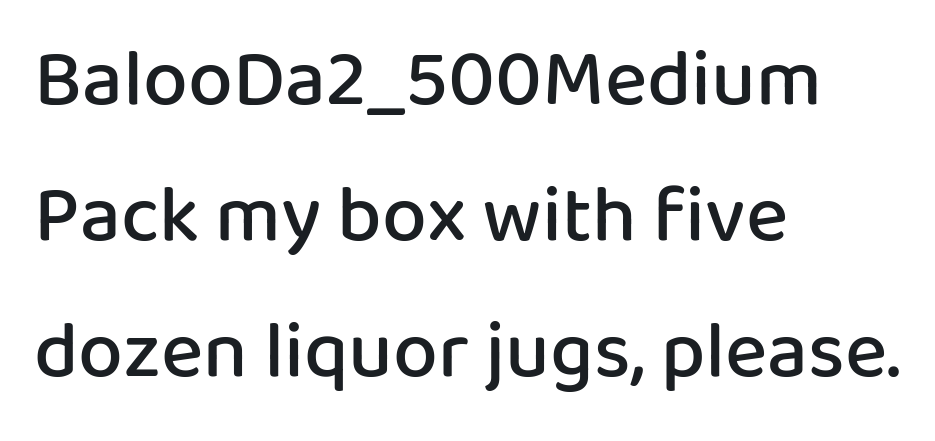](https://github.com/expo/google-fonts/tree/master/font-packages/baloo-da-2#readme)|||
||[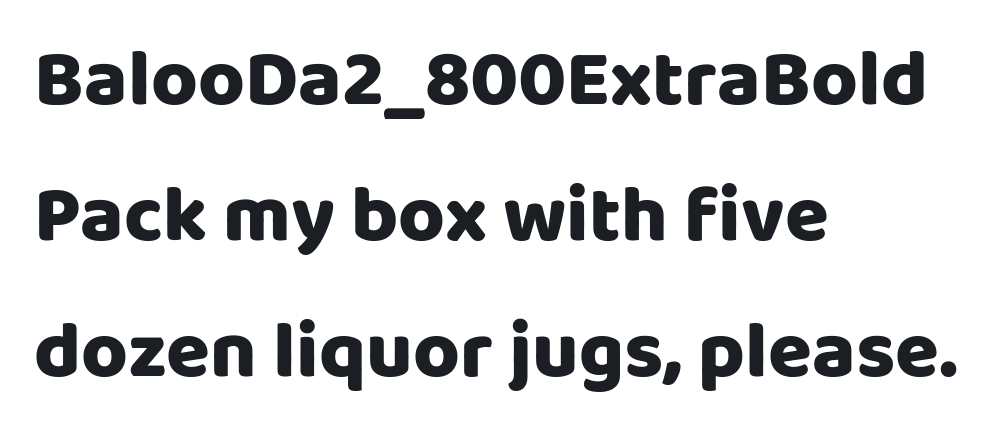](https://github.com/expo/google-fonts/tree/master/font-packages/baloo-da-2#readme)|||
### [Baloo Paaji 2](https://github.com/expo/google-fonts/tree/master/font-packages/baloo-paaji-2#readme)

||||
|-|-|-|
|||||
|||||
### [Baloo Tamma 2](https://github.com/expo/google-fonts/tree/master/font-packages/baloo-tamma-2#readme)

||||
|-|-|-|
|||[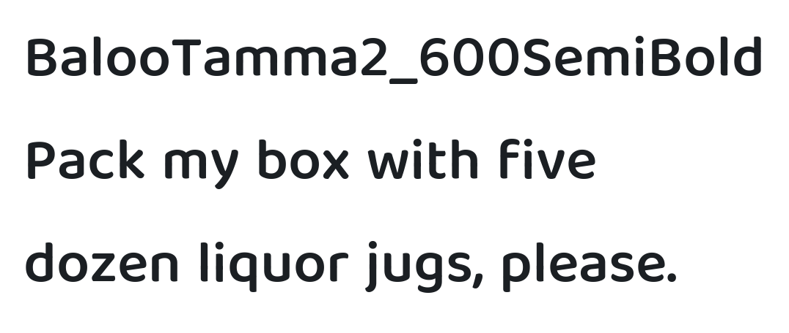](https://github.com/expo/google-fonts/tree/master/font-packages/baloo-tamma-2#readme)||
|||||
### [Baloo Tammudu 2](https://github.com/expo/google-fonts/tree/master/font-packages/baloo-tammudu-2#readme)

||||
|-|-|-|
|[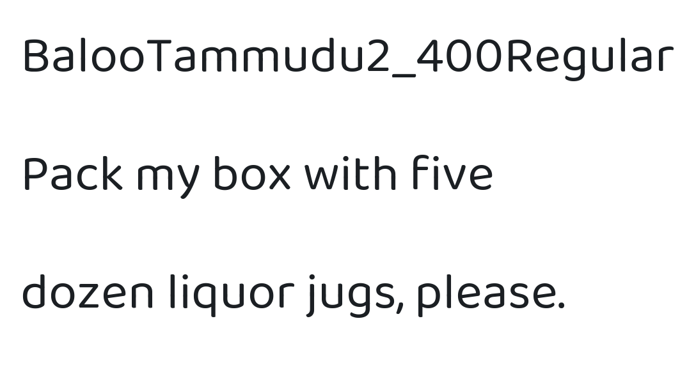](https://github.com/expo/google-fonts/tree/master/font-packages/baloo-tammudu-2#readme)||||
|||||
### [Baloo Thambi 2](https://github.com/expo/google-fonts/tree/master/font-packages/baloo-thambi-2#readme)

||||
|-|-|-|
|[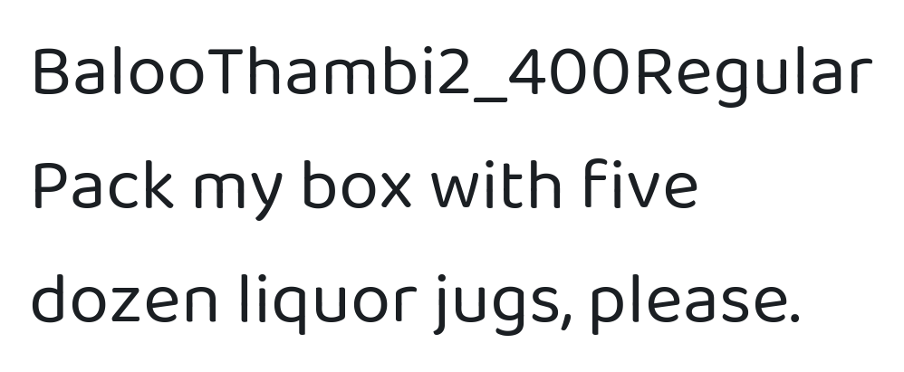](https://github.com/expo/google-fonts/tree/master/font-packages/baloo-thambi-2#readme)||||
||[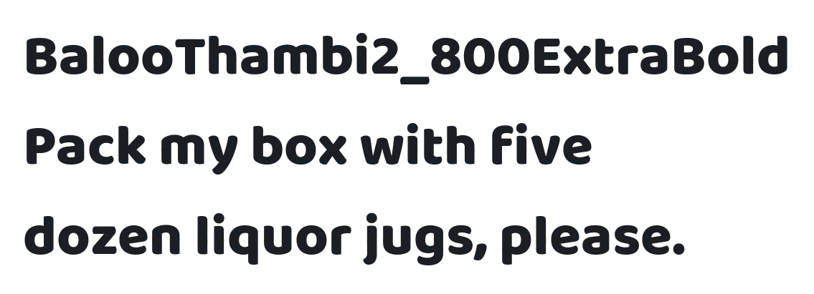](https://github.com/expo/google-fonts/tree/master/font-packages/baloo-thambi-2#readme)|||
### [Kanit](https://github.com/expo/google-fonts/tree/master/font-packages/kanit#readme)

||||
|-|-|-|
|||||
|||||
||[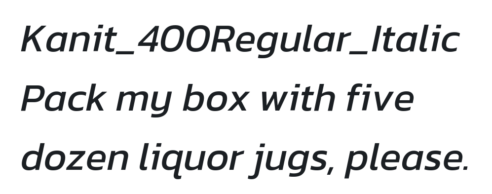](https://github.com/expo/google-fonts/tree/master/font-packages/kanit#readme)|||
|||||
||[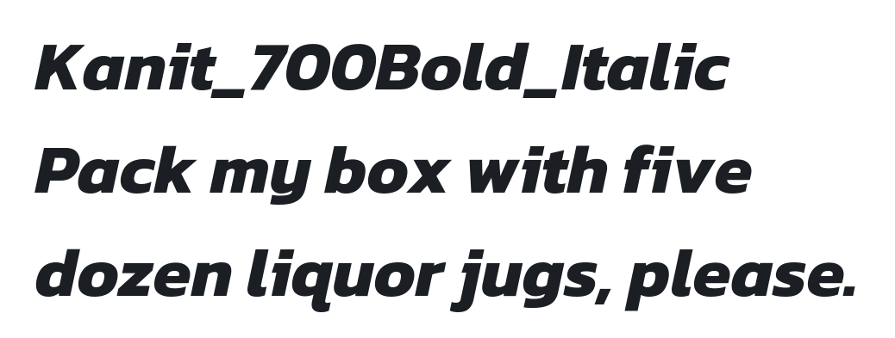](https://github.com/expo/google-fonts/tree/master/font-packages/kanit#readme)|||
|||[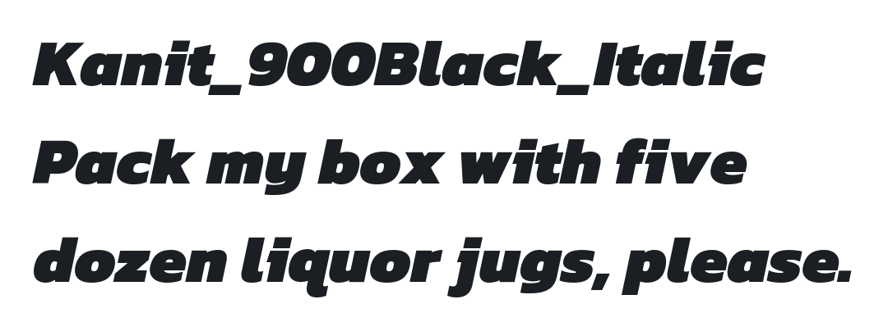](https://github.com/expo/google-fonts/tree/master/font-packages/kanit#readme)||
### [Caveat](https://github.com/expo/google-fonts/tree/master/font-packages/caveat#readme)

||||
|-|-|-|
|[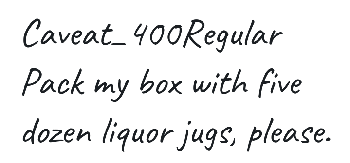](https://github.com/expo/google-fonts/tree/master/font-packages/caveat#readme)|[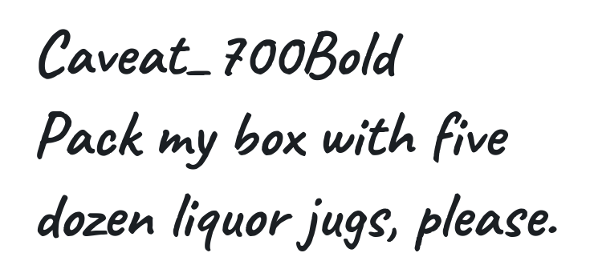](https://github.com/expo/google-fonts/tree/master/font-packages/caveat#readme)|||
### [Caveat Brush](https://github.com/expo/google-fonts/tree/master/font-packages/caveat-brush#readme)

||||
|-|-|-|
|||||
### [Rubik](https://github.com/expo/google-fonts/tree/master/font-packages/rubik#readme)

||||
|-|-|-|
|[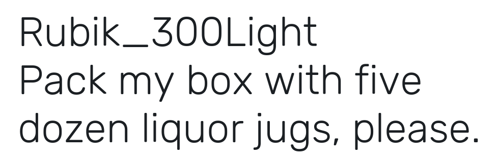](https://github.com/expo/google-fonts/tree/master/font-packages/rubik#readme)|[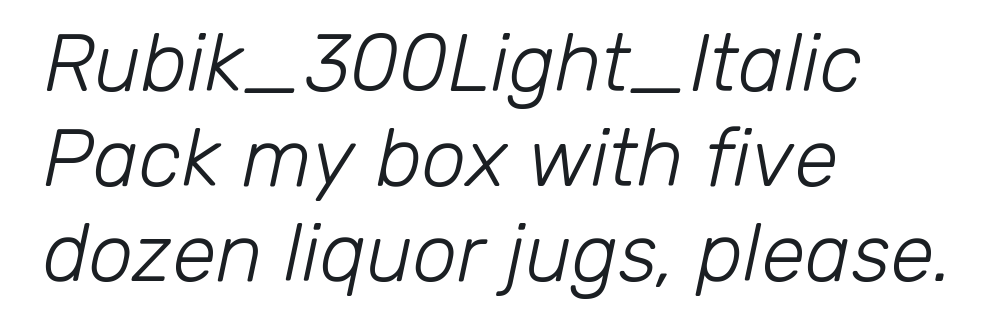](https://github.com/expo/google-fonts/tree/master/font-packages/rubik#readme)|||
|||||
|||||
|[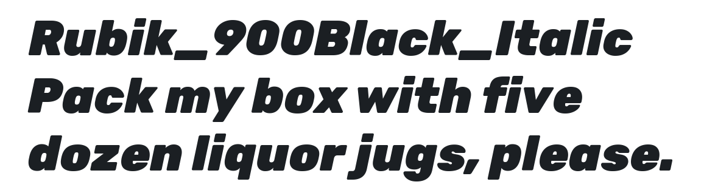](https://github.com/expo/google-fonts/tree/master/font-packages/rubik#readme)||||
### [Catamaran](https://github.com/expo/google-fonts/tree/master/font-packages/catamaran#readme)

||||
|-|-|-|
|[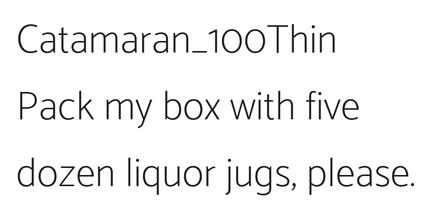](https://github.com/expo/google-fonts/tree/master/font-packages/catamaran#readme)|[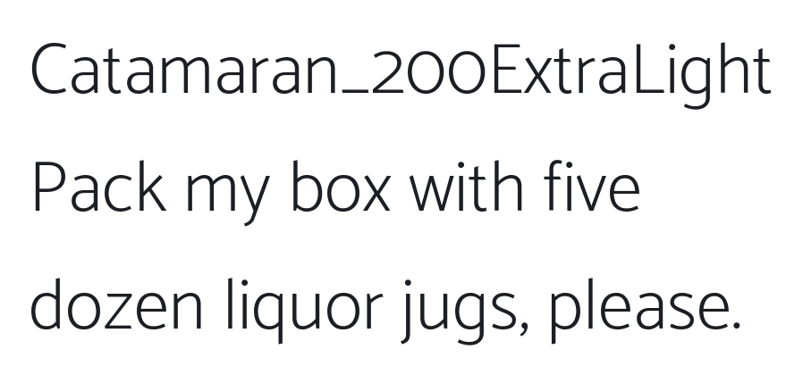](https://github.com/expo/google-fonts/tree/master/font-packages/catamaran#readme)|[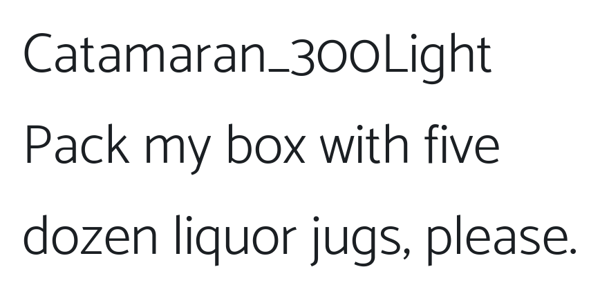](https://github.com/expo/google-fonts/tree/master/font-packages/catamaran#readme)||
|||[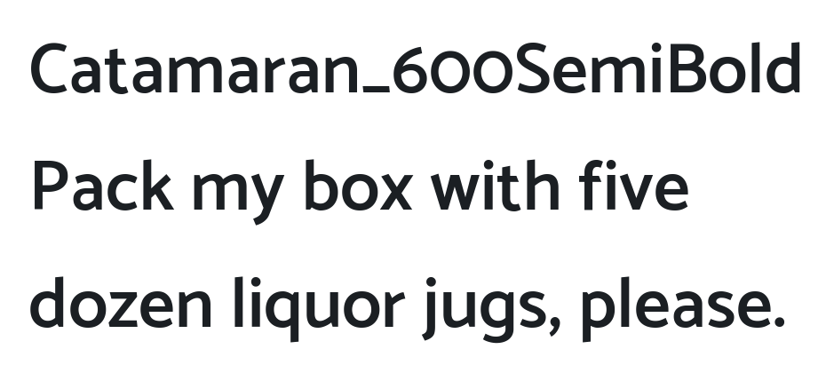](https://github.com/expo/google-fonts/tree/master/font-packages/catamaran#readme)||
|[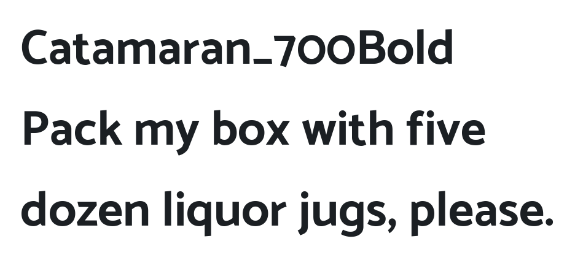](https://github.com/expo/google-fonts/tree/master/font-packages/catamaran#readme)|[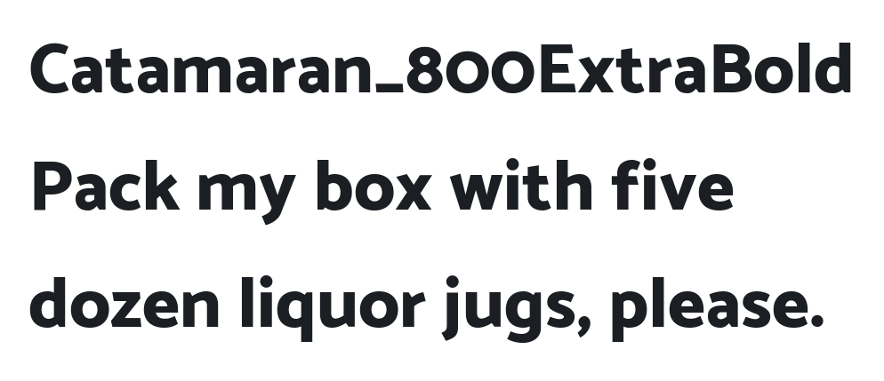](https://github.com/expo/google-fonts/tree/master/font-packages/catamaran#readme)|||
### [Chonburi](https://github.com/expo/google-fonts/tree/master/font-packages/chonburi#readme)

||||
|-|-|-|
|[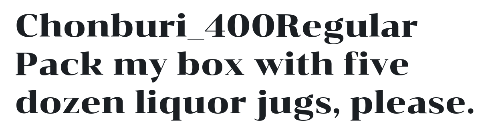](https://github.com/expo/google-fonts/tree/master/font-packages/chonburi#readme)||||
### [Work Sans](https://github.com/expo/google-fonts/tree/master/font-packages/work-sans#readme)

||||
|-|-|-|
||[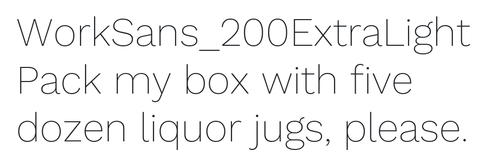](https://github.com/expo/google-fonts/tree/master/font-packages/work-sans#readme)|||
|||||
|||||
|||||
|[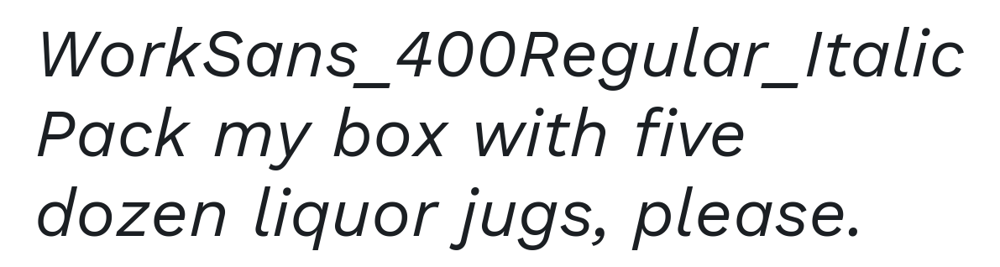](https://github.com/expo/google-fonts/tree/master/font-packages/work-sans#readme)||||
||[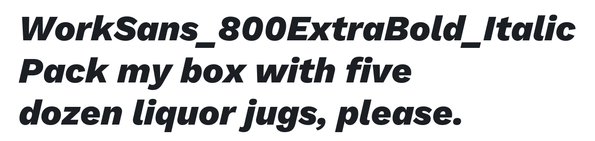](https://github.com/expo/google-fonts/tree/master/font-packages/work-sans#readme)|||
### [Itim](https://github.com/expo/google-fonts/tree/master/font-packages/itim#readme)

||||
|-|-|-|
|||||
### [Sriracha](https://github.com/expo/google-fonts/tree/master/font-packages/sriracha#readme)

||||
|-|-|-|
|||||
### [Asar](https://github.com/expo/google-fonts/tree/master/font-packages/asar#readme)

||||
|-|-|-|
|||||
### [Kadwa](https://github.com/expo/google-fonts/tree/master/font-packages/kadwa#readme)

||||
|-|-|-|
|[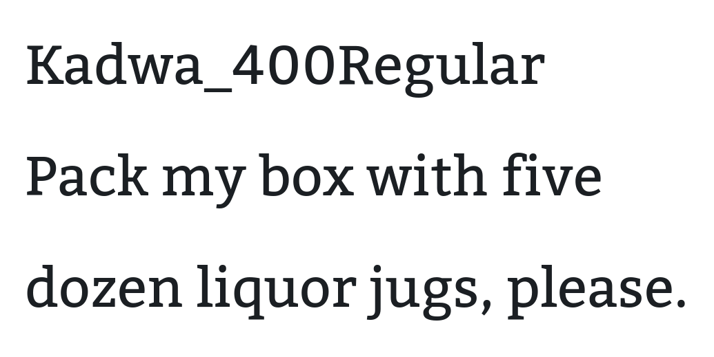](https://github.com/expo/google-fonts/tree/master/font-packages/kadwa#readme)||||
### [Sahitya](https://github.com/expo/google-fonts/tree/master/font-packages/sahitya#readme)

||||
|-|-|-|
|||||
### [Sarala](https://github.com/expo/google-fonts/tree/master/font-packages/sarala#readme)

||||
|-|-|-|
|||||
### [Sura](https://github.com/expo/google-fonts/tree/master/font-packages/sura#readme)

||||
|-|-|-|
|||||
### [Eczar](https://github.com/expo/google-fonts/tree/master/font-packages/eczar#readme)

||||
|-|-|-|
||[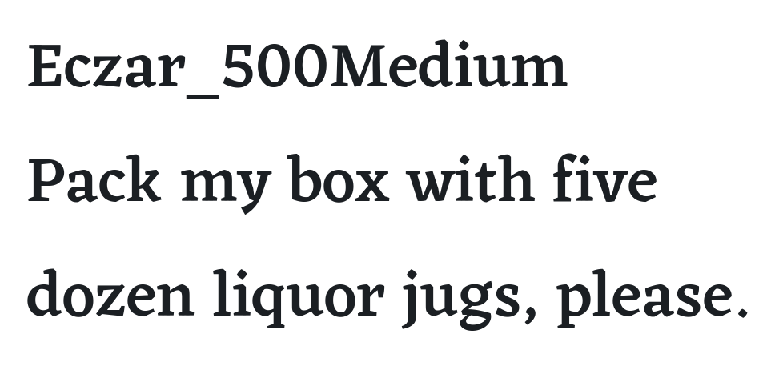](https://github.com/expo/google-fonts/tree/master/font-packages/eczar#readme)|||
|[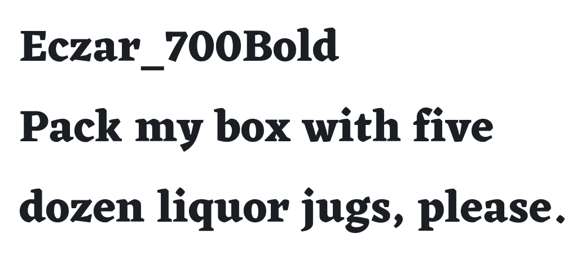](https://github.com/expo/google-fonts/tree/master/font-packages/eczar#readme)||||
### [Poppins](https://github.com/expo/google-fonts/tree/master/font-packages/poppins#readme)

||||
|-|-|-|
|||[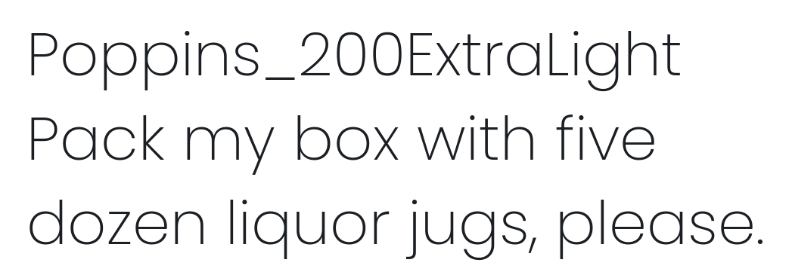](https://github.com/expo/google-fonts/tree/master/font-packages/poppins#readme)||
|[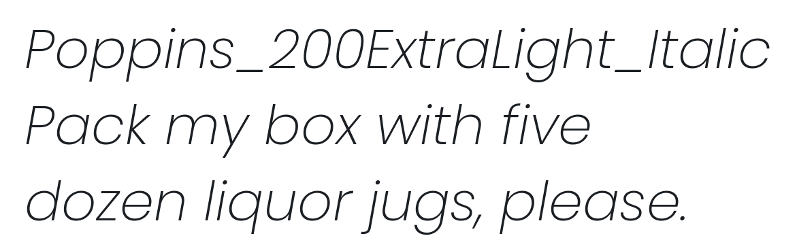](https://github.com/expo/google-fonts/tree/master/font-packages/poppins#readme)||||
|||||
|||||
|[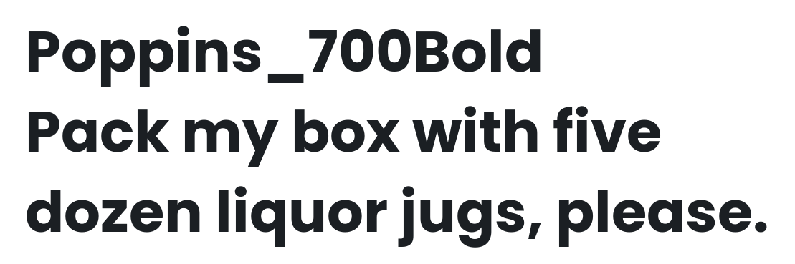](https://github.com/expo/google-fonts/tree/master/font-packages/poppins#readme)||[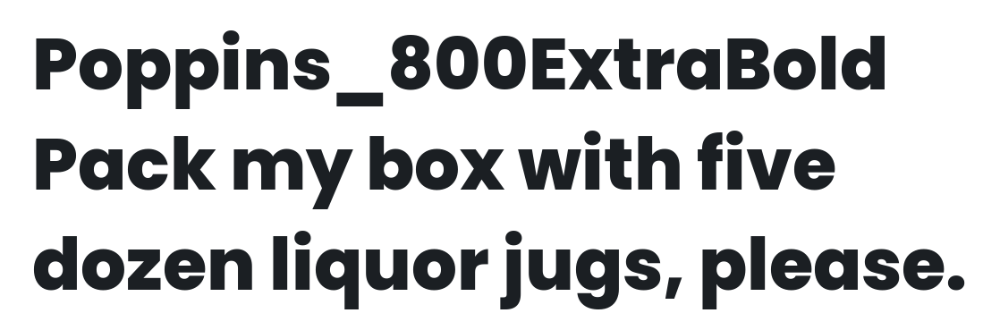](https://github.com/expo/google-fonts/tree/master/font-packages/poppins#readme)||
|||||
### [Rhodium Libre](https://github.com/expo/google-fonts/tree/master/font-packages/rhodium-libre#readme)

||||
|-|-|-|
|[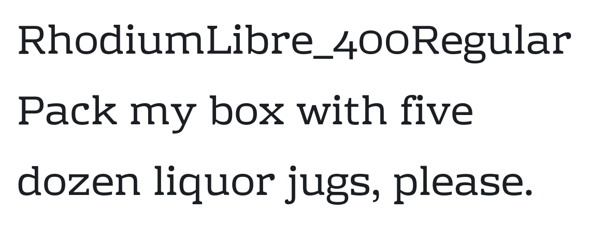](https://github.com/expo/google-fonts/tree/master/font-packages/rhodium-libre#readme)||||
### [Tillana](https://github.com/expo/google-fonts/tree/master/font-packages/tillana#readme)

||||
|-|-|-|
|||||
|||||
### [Yantramanav](https://github.com/expo/google-fonts/tree/master/font-packages/yantramanav#readme)

||||
|-|-|-|
|||||
|||[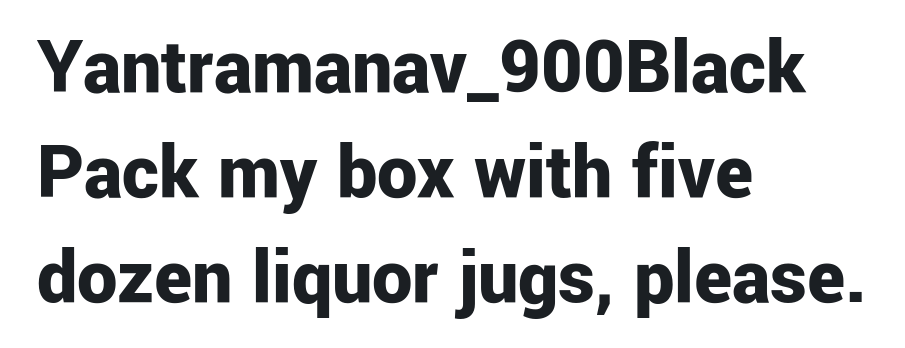](https://github.com/expo/google-fonts/tree/master/font-packages/yantramanav#readme)||
### [Amita](https://github.com/expo/google-fonts/tree/master/font-packages/amita#readme)

||||
|-|-|-|
|[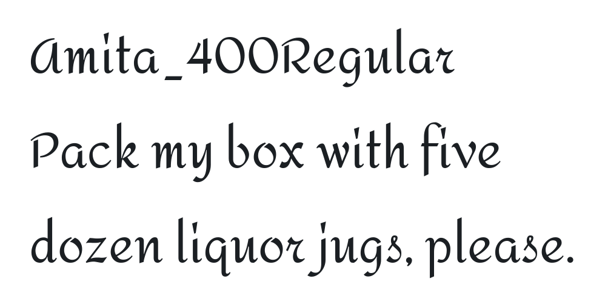](https://github.com/expo/google-fonts/tree/master/font-packages/amita#readme)|[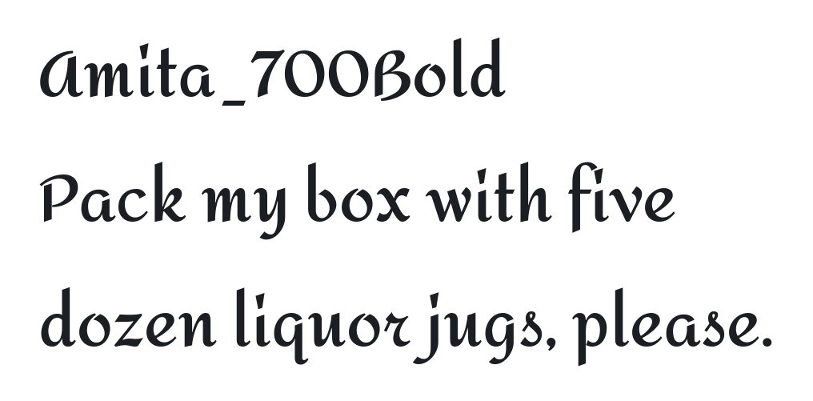](https://github.com/expo/google-fonts/tree/master/font-packages/amita#readme)|||
### [Arya](https://github.com/expo/google-fonts/tree/master/font-packages/arya#readme)

||||
|-|-|-|
|||||
### [Inknut Antiqua](https://github.com/expo/google-fonts/tree/master/font-packages/inknut-antiqua#readme)

||||
|-|-|-|
|||||
|||||
|||||
### [Kurale](https://github.com/expo/google-fonts/tree/master/font-packages/kurale#readme)

||||
|-|-|-|
|||||
### [Roboto Mono](https://github.com/expo/google-fonts/tree/master/font-packages/roboto-mono#readme)

||||
|-|-|-|
|||[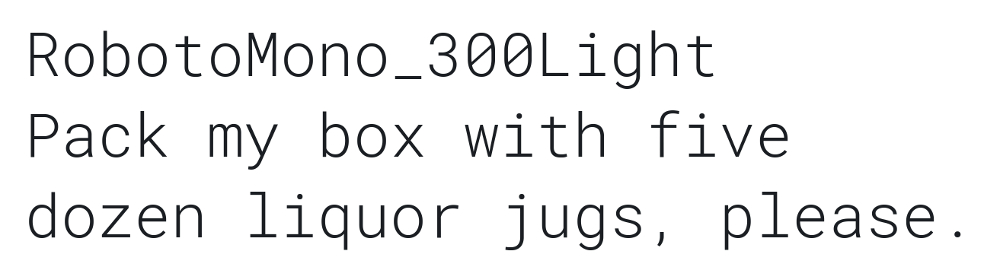](https://github.com/expo/google-fonts/tree/master/font-packages/roboto-mono#readme)||
|||||
||[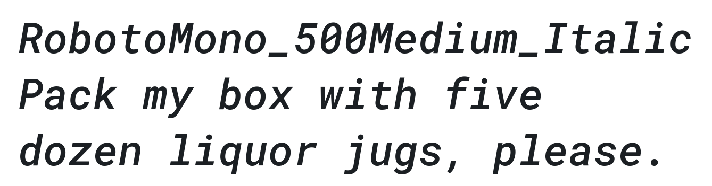](https://github.com/expo/google-fonts/tree/master/font-packages/roboto-mono#readme)|||
|||||
### [Sumana](https://github.com/expo/google-fonts/tree/master/font-packages/sumana#readme)

||||
|-|-|-|
|||||
### [Biryani](https://github.com/expo/google-fonts/tree/master/font-packages/biryani#readme)

||||
|-|-|-|
|[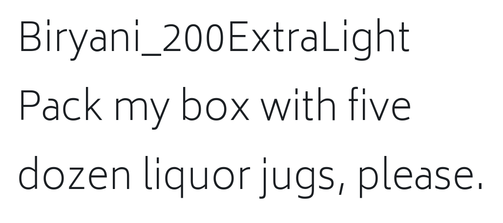](https://github.com/expo/google-fonts/tree/master/font-packages/biryani#readme)||||
|||[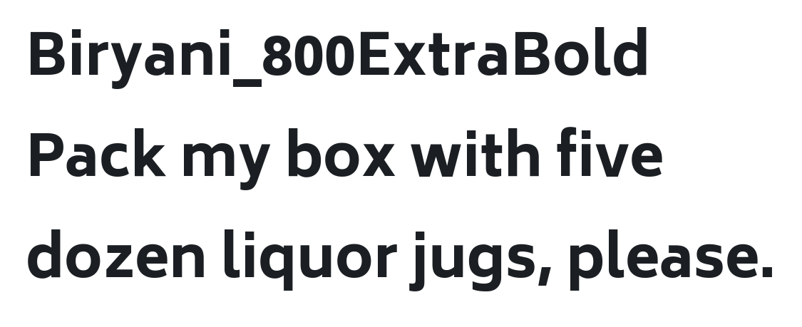](https://github.com/expo/google-fonts/tree/master/font-packages/biryani#readme)||
|||||
### [Jaldi](https://github.com/expo/google-fonts/tree/master/font-packages/jaldi#readme)

||||
|-|-|-|
|||||
### [Pragati Narrow](https://github.com/expo/google-fonts/tree/master/font-packages/pragati-narrow#readme)

||||
|-|-|-|
|[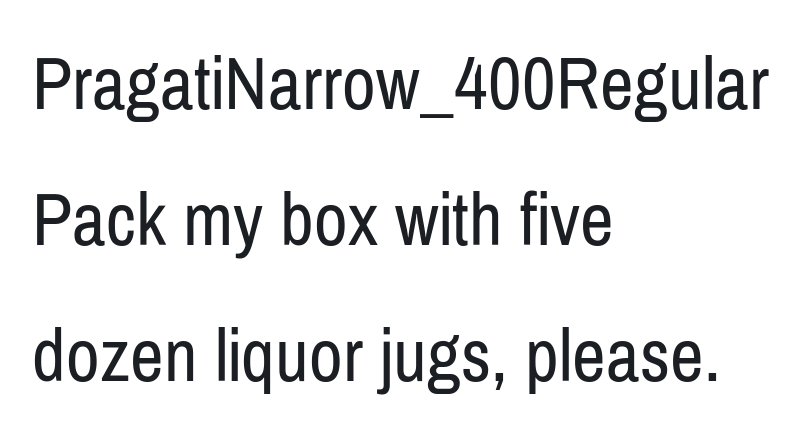](https://github.com/expo/google-fonts/tree/master/font-packages/pragati-narrow#readme)||||
### [Martel](https://github.com/expo/google-fonts/tree/master/font-packages/martel#readme)

||||
|-|-|-|
|||||
|||||
|||||
### [Martel Sans](https://github.com/expo/google-fonts/tree/master/font-packages/martel-sans#readme)

||||
|-|-|-|
|[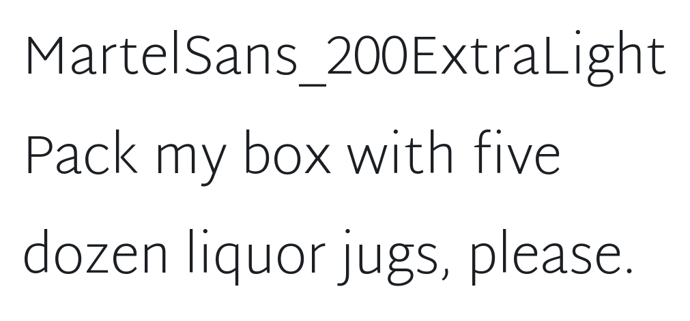](https://github.com/expo/google-fonts/tree/master/font-packages/martel-sans#readme)|[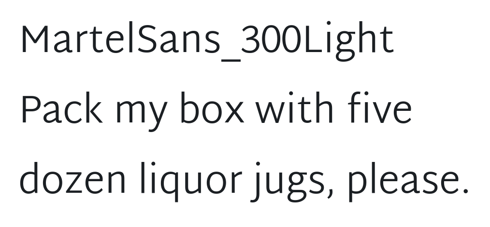](https://github.com/expo/google-fonts/tree/master/font-packages/martel-sans#readme)|||
|[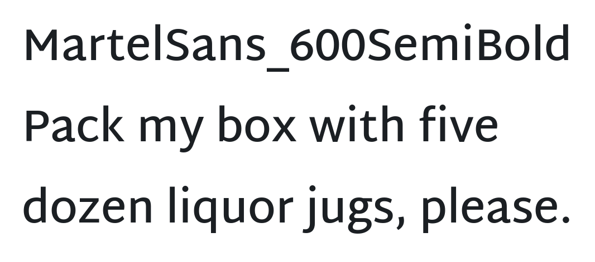](https://github.com/expo/google-fonts/tree/master/font-packages/martel-sans#readme)||||
|||||
### [Lateef](https://github.com/expo/google-fonts/tree/master/font-packages/lateef#readme)

||||
|-|-|-|
|||||
### [Modak](https://github.com/expo/google-fonts/tree/master/font-packages/modak#readme)

||||
|-|-|-|
|||||
### [Noto Sans JP](https://github.com/expo/google-fonts/tree/master/font-packages/noto-sans-jp#readme)

||||
|-|-|-|
|||||
|[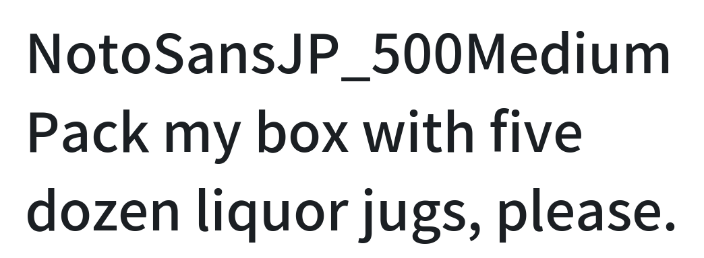](https://github.com/expo/google-fonts/tree/master/font-packages/noto-sans-jp#readme)||||
### [Cambay](https://github.com/expo/google-fonts/tree/master/font-packages/cambay#readme)

||||
|-|-|-|
|||||
|||||
### [Dekko](https://github.com/expo/google-fonts/tree/master/font-packages/dekko#readme)

||||
|-|-|-|
|||||
### [Khula](https://github.com/expo/google-fonts/tree/master/font-packages/khula#readme)

||||
|-|-|-|
|[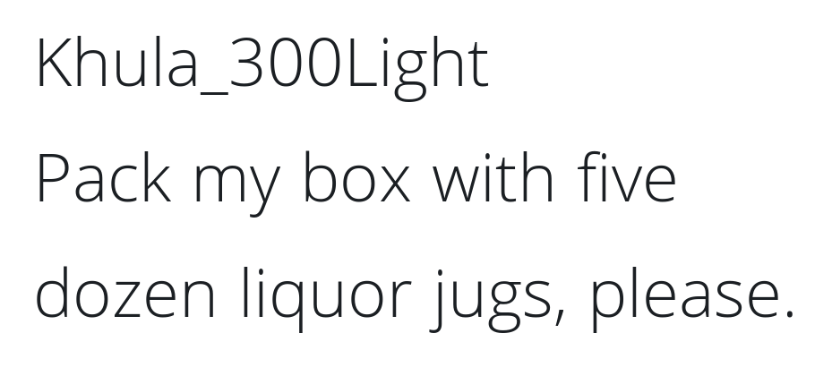](https://github.com/expo/google-fonts/tree/master/font-packages/khula#readme)||||
|||||
### [Palanquin](https://github.com/expo/google-fonts/tree/master/font-packages/palanquin#readme)

||||
|-|-|-|
|[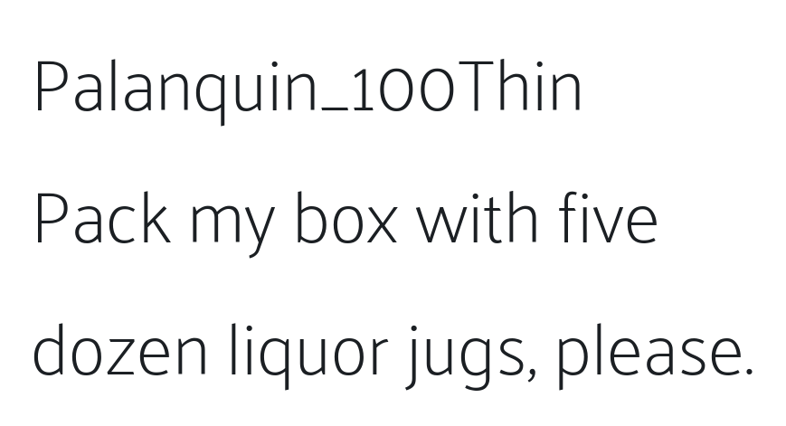](https://github.com/expo/google-fonts/tree/master/font-packages/palanquin#readme)||||
|||||
|||||
### [Palanquin Dark](https://github.com/expo/google-fonts/tree/master/font-packages/palanquin-dark#readme)

||||
|-|-|-|
||[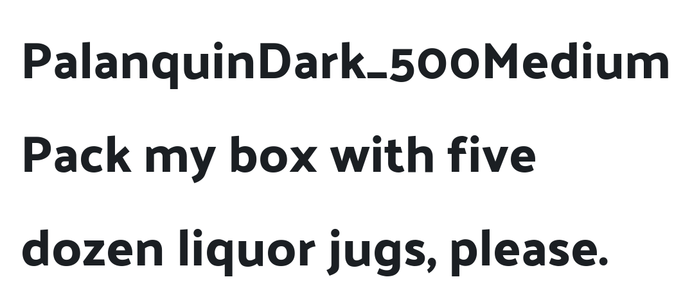](https://github.com/expo/google-fonts/tree/master/font-packages/palanquin-dark#readme)|||
|||||
### [Ranga](https://github.com/expo/google-fonts/tree/master/font-packages/ranga#readme)

||||
|-|-|-|
|||||
### [Lakki Reddy](https://github.com/expo/google-fonts/tree/master/font-packages/lakki-reddy#readme)

||||
|-|-|-|
|||||
### [Ravi Prakash](https://github.com/expo/google-fonts/tree/master/font-packages/ravi-prakash#readme)

||||
|-|-|-|
|||||
### [Sree Krushnadevaraya](https://github.com/expo/google-fonts/tree/master/font-packages/sree-krushnadevaraya#readme)

||||
|-|-|-|
|||||
### [Suranna](https://github.com/expo/google-fonts/tree/master/font-packages/suranna#readme)

||||
|-|-|-|
|[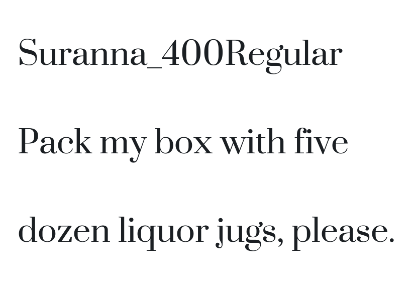](https://github.com/expo/google-fonts/tree/master/font-packages/suranna#readme)||||
### [Suravaram](https://github.com/expo/google-fonts/tree/master/font-packages/suravaram#readme)

||||
|-|-|-|
|||||
### [Timmana](https://github.com/expo/google-fonts/tree/master/font-packages/timmana#readme)

||||
|-|-|-|
|||||
### [Gurajada](https://github.com/expo/google-fonts/tree/master/font-packages/gurajada#readme)

||||
|-|-|-|
|||||
### [Ramaraja](https://github.com/expo/google-fonts/tree/master/font-packages/ramaraja#readme)

||||
|-|-|-|
|[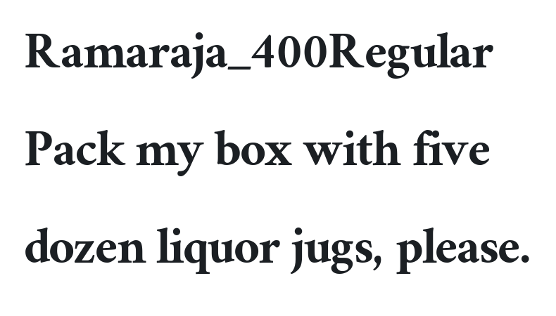](https://github.com/expo/google-fonts/tree/master/font-packages/ramaraja#readme)||||
### [Dhurjati](https://github.com/expo/google-fonts/tree/master/font-packages/dhurjati#readme)

||||
|-|-|-|
|||||
### [Gidugu](https://github.com/expo/google-fonts/tree/master/font-packages/gidugu#readme)

||||
|-|-|-|
|||||
### [Mallanna](https://github.com/expo/google-fonts/tree/master/font-packages/mallanna#readme)

||||
|-|-|-|
|[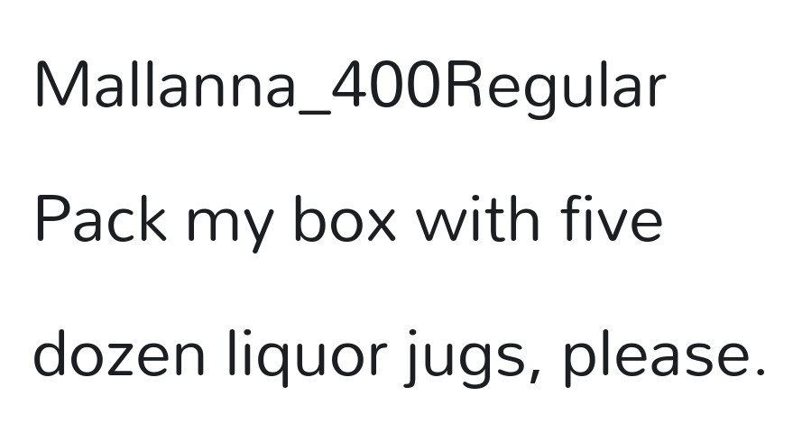](https://github.com/expo/google-fonts/tree/master/font-packages/mallanna#readme)||||
### [Mandali](https://github.com/expo/google-fonts/tree/master/font-packages/mandali#readme)

||||
|-|-|-|
|||||
### [NTR](https://github.com/expo/google-fonts/tree/master/font-packages/ntr#readme)

||||
|-|-|-|
|[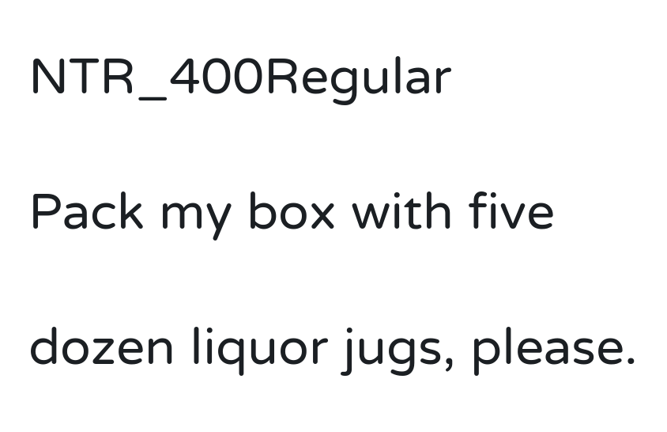](https://github.com/expo/google-fonts/tree/master/font-packages/ntr#readme)||||
### [Peddana](https://github.com/expo/google-fonts/tree/master/font-packages/peddana#readme)

||||
|-|-|-|
|[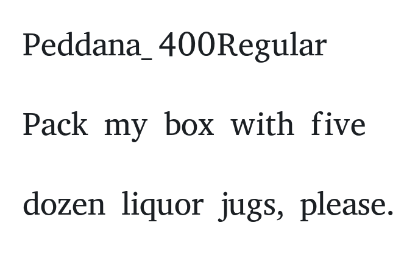](https://github.com/expo/google-fonts/tree/master/font-packages/peddana#readme)||||
### [Ramabhadra](https://github.com/expo/google-fonts/tree/master/font-packages/ramabhadra#readme)

||||
|-|-|-|
|[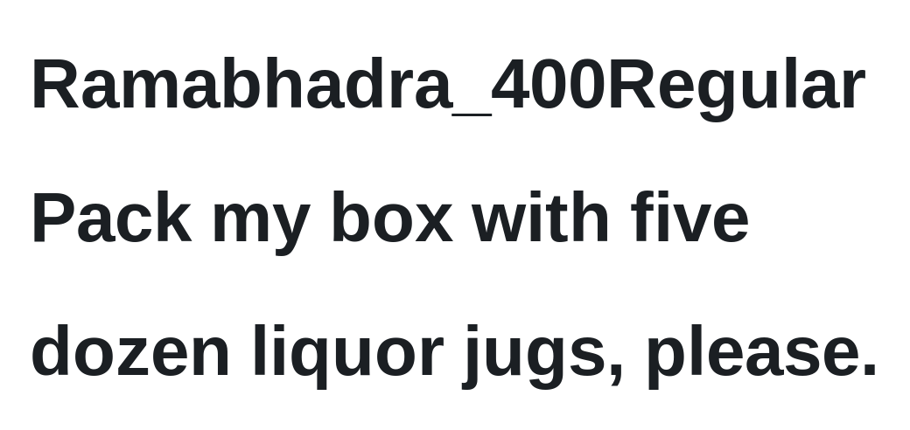](https://github.com/expo/google-fonts/tree/master/font-packages/ramabhadra#readme)||||
### [Tenali Ramakrishna](https://github.com/expo/google-fonts/tree/master/font-packages/tenali-ramakrishna#readme)

||||
|-|-|-|
|||||
### [Kalam](https://github.com/expo/google-fonts/tree/master/font-packages/kalam#readme)

||||
|-|-|-|
|||||
### [Sarpanch](https://github.com/expo/google-fonts/tree/master/font-packages/sarpanch#readme)

||||
|-|-|-|
|[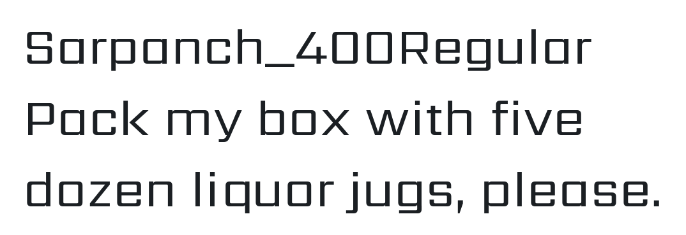](https://github.com/expo/google-fonts/tree/master/font-packages/sarpanch#readme)||[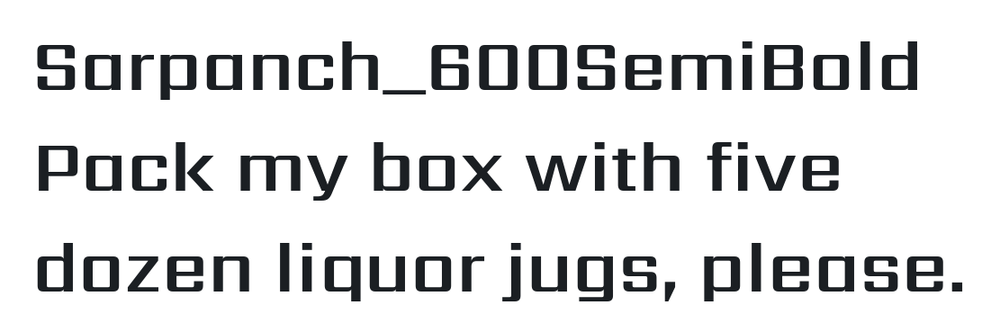](https://github.com/expo/google-fonts/tree/master/font-packages/sarpanch#readme)||
|[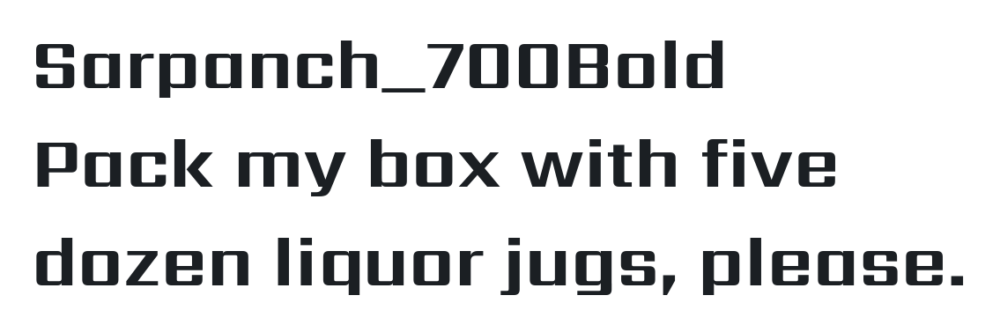](https://github.com/expo/google-fonts/tree/master/font-packages/sarpanch#readme)||||
### [Halant](https://github.com/expo/google-fonts/tree/master/font-packages/halant#readme)

||||
|-|-|-|
|||[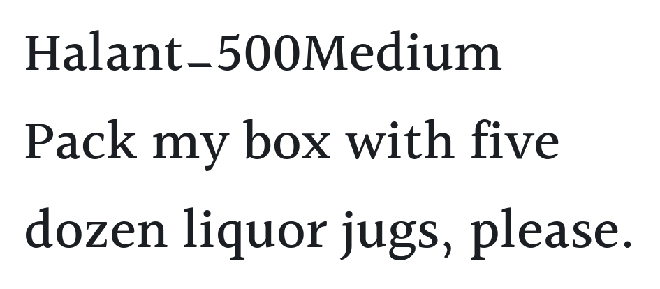](https://github.com/expo/google-fonts/tree/master/font-packages/halant#readme)||
|||||
### [Laila](https://github.com/expo/google-fonts/tree/master/font-packages/laila#readme)

||||
|-|-|-|
|||[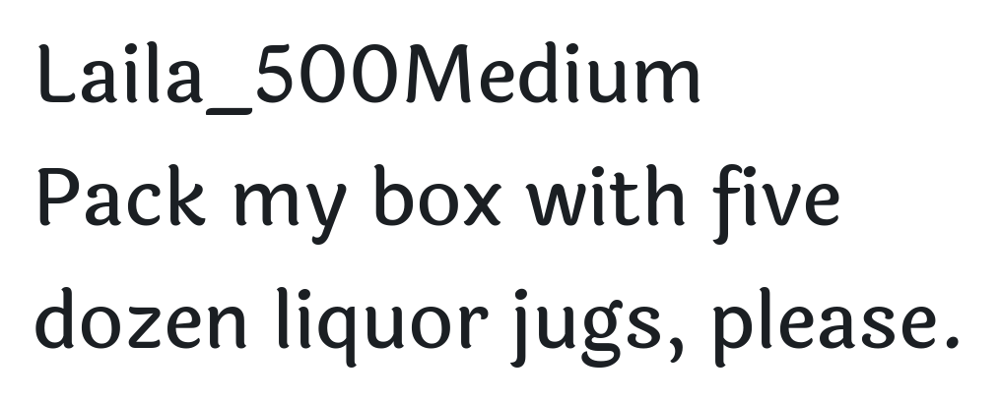](https://github.com/expo/google-fonts/tree/master/font-packages/laila#readme)||
|||||
### [Rozha One](https://github.com/expo/google-fonts/tree/master/font-packages/rozha-one#readme)

||||
|-|-|-|
|||||
### [Khand](https://github.com/expo/google-fonts/tree/master/font-packages/khand#readme)

||||
|-|-|-|
|[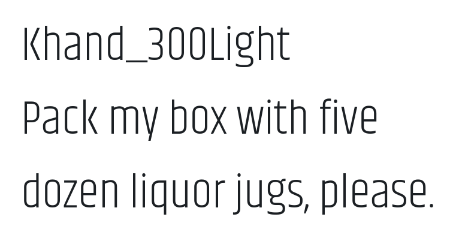](https://github.com/expo/google-fonts/tree/master/font-packages/khand#readme)||||
|||||
### [Vesper Libre](https://github.com/expo/google-fonts/tree/master/font-packages/vesper-libre#readme)

||||
|-|-|-|
|[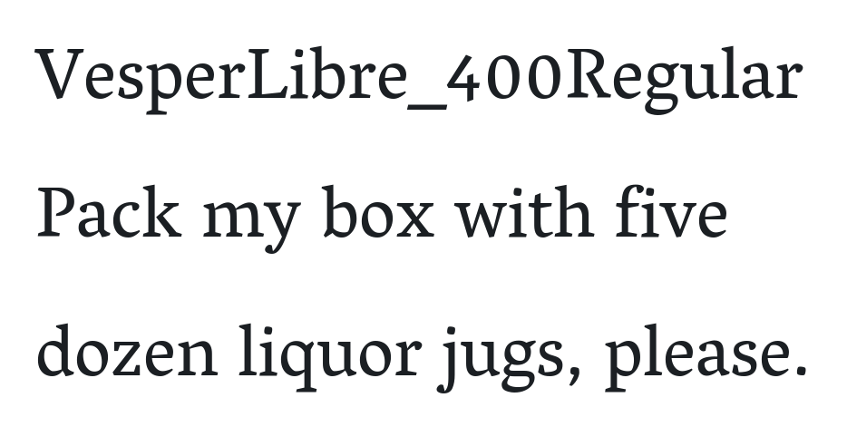](https://github.com/expo/google-fonts/tree/master/font-packages/vesper-libre#readme)||||
|||||
### [Rajdhani](https://github.com/expo/google-fonts/tree/master/font-packages/rajdhani#readme)

||||
|-|-|-|
|[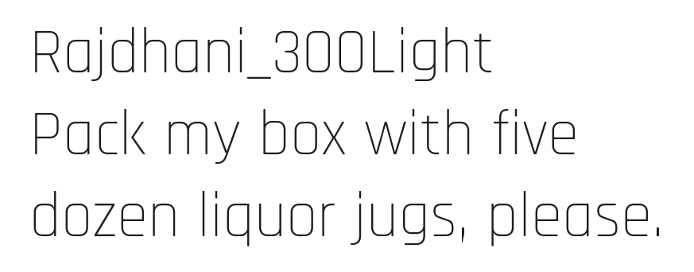](https://github.com/expo/google-fonts/tree/master/font-packages/rajdhani#readme)||||
||[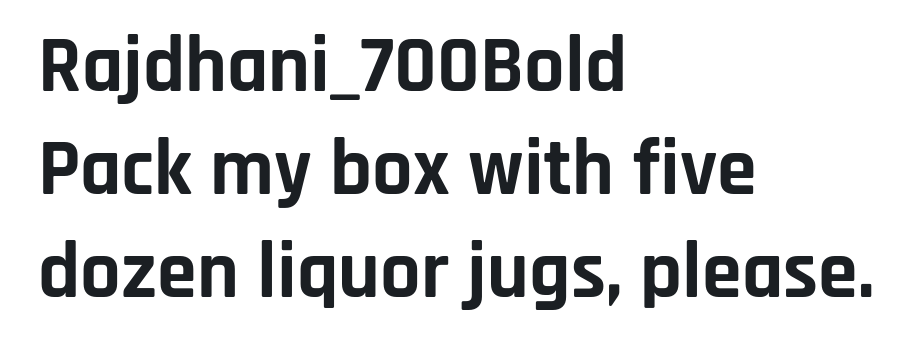](https://github.com/expo/google-fonts/tree/master/font-packages/rajdhani#readme)|||
### [Hind](https://github.com/expo/google-fonts/tree/master/font-packages/hind#readme)

||||
|-|-|-|
|||||
|||||
### [Karma](https://github.com/expo/google-fonts/tree/master/font-packages/karma#readme)

||||
|-|-|-|
|||||
|||||
### [Teko](https://github.com/expo/google-fonts/tree/master/font-packages/teko#readme)

||||
|-|-|-|
|||||
|||||
### [Fira Mono](https://github.com/expo/google-fonts/tree/master/font-packages/fira-mono#readme)

||||
|-|-|-|
|[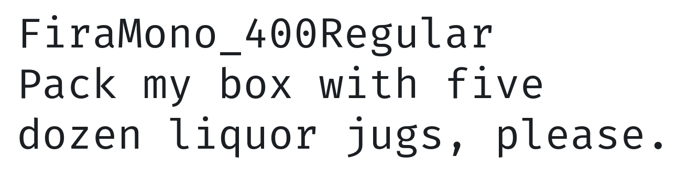](https://github.com/expo/google-fonts/tree/master/font-packages/fira-mono#readme)||||
### [Fira Sans](https://github.com/expo/google-fonts/tree/master/font-packages/fira-sans#readme)

||||
|-|-|-|
|||||
|||||
||[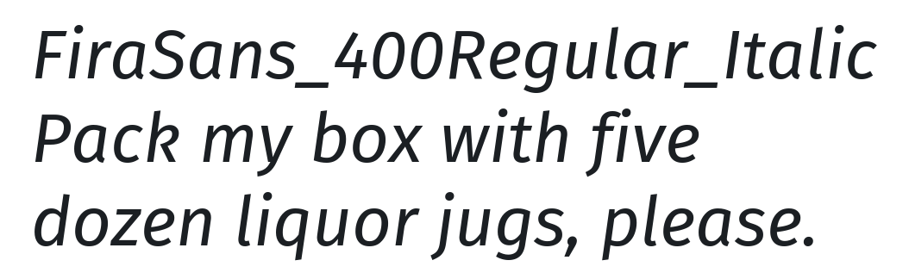](https://github.com/expo/google-fonts/tree/master/font-packages/fira-sans#readme)|||
|||||
|||||
|||||
### [Slabo 13px](https://github.com/expo/google-fonts/tree/master/font-packages/slabo-13px#readme)

||||
|-|-|-|
|||||
### [Slabo 27px](https://github.com/expo/google-fonts/tree/master/font-packages/slabo-27px#readme)

||||
|-|-|-|
|[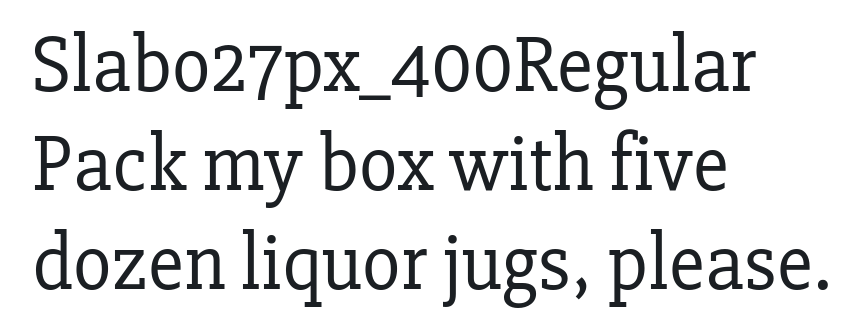](https://github.com/expo/google-fonts/tree/master/font-packages/slabo-27px#readme)||||
### [Source Serif Pro](https://github.com/expo/google-fonts/tree/master/font-packages/source-serif-pro#readme)

||||
|-|-|-|
|||||
### [Rubik Mono One](https://github.com/expo/google-fonts/tree/master/font-packages/rubik-mono-one#readme)

||||
|-|-|-|
|||||
### [Alegreya Sans](https://github.com/expo/google-fonts/tree/master/font-packages/alegreya-sans#readme)

||||
|-|-|-|
|[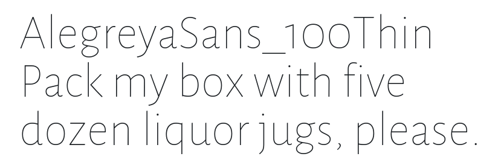](https://github.com/expo/google-fonts/tree/master/font-packages/alegreya-sans#readme)||||
||[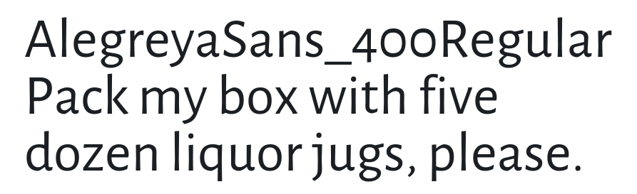](https://github.com/expo/google-fonts/tree/master/font-packages/alegreya-sans#readme)|||
||[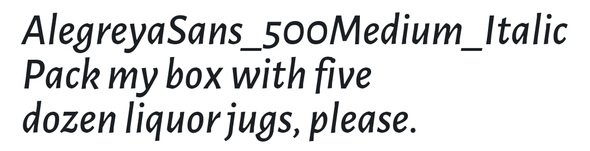](https://github.com/expo/google-fonts/tree/master/font-packages/alegreya-sans#readme)|||
|||||
|||||
### [Alegreya Sans SC](https://github.com/expo/google-fonts/tree/master/font-packages/alegreya-sans-sc#readme)

||||
|-|-|-|
|||[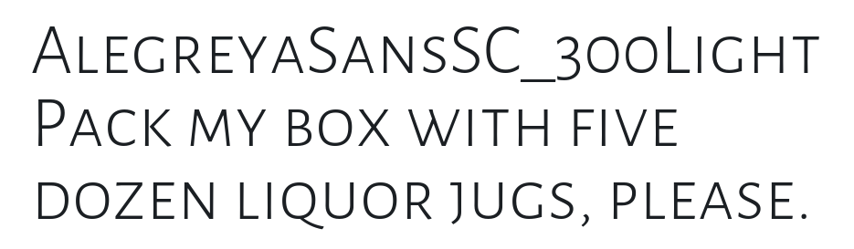](https://github.com/expo/google-fonts/tree/master/font-packages/alegreya-sans-sc#readme)||
|||||
|||||
||[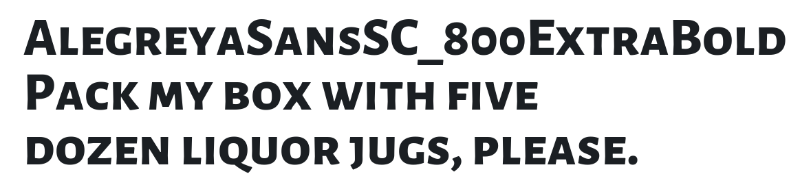](https://github.com/expo/google-fonts/tree/master/font-packages/alegreya-sans-sc#readme)|||
|||||
### [Exo 2](https://github.com/expo/google-fonts/tree/master/font-packages/exo-2#readme)

||||
|-|-|-|
||[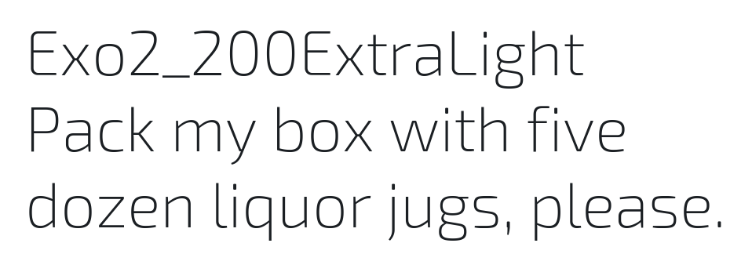](https://github.com/expo/google-fonts/tree/master/font-packages/exo-2#readme)|[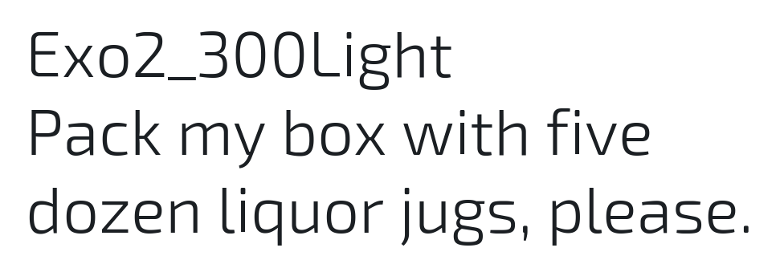](https://github.com/expo/google-fonts/tree/master/font-packages/exo-2#readme)||
|||||
|||||
|||[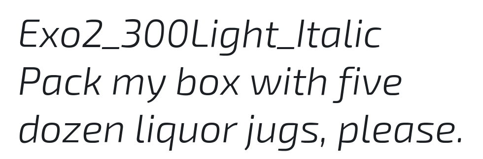](https://github.com/expo/google-fonts/tree/master/font-packages/exo-2#readme)||
|[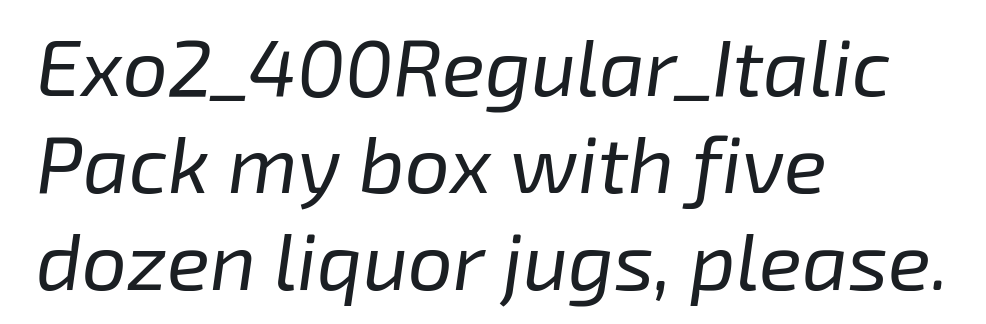](https://github.com/expo/google-fonts/tree/master/font-packages/exo-2#readme)|[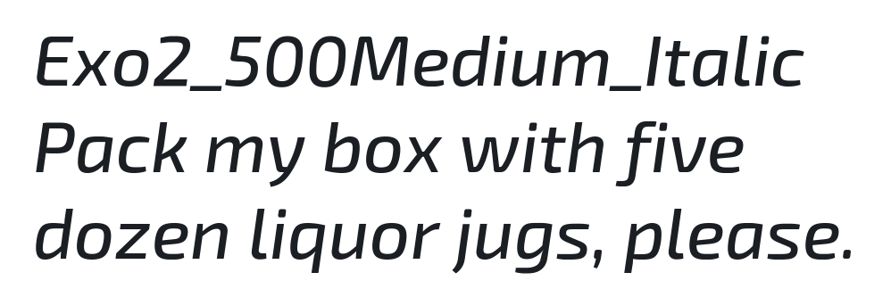](https://github.com/expo/google-fonts/tree/master/font-packages/exo-2#readme)|||
|||[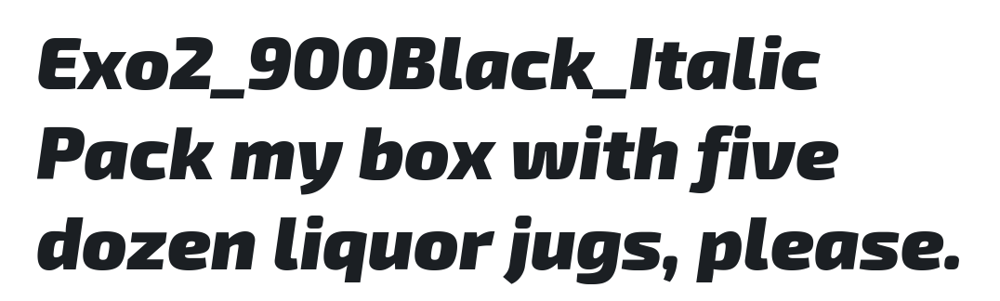](https://github.com/expo/google-fonts/tree/master/font-packages/exo-2#readme)||
### [Kdam Thmor](https://github.com/expo/google-fonts/tree/master/font-packages/kdam-thmor#readme)

||||
|-|-|-|
|||||
### [Sarabun](https://github.com/expo/google-fonts/tree/master/font-packages/sarabun#readme)

||||
|-|-|-|
|[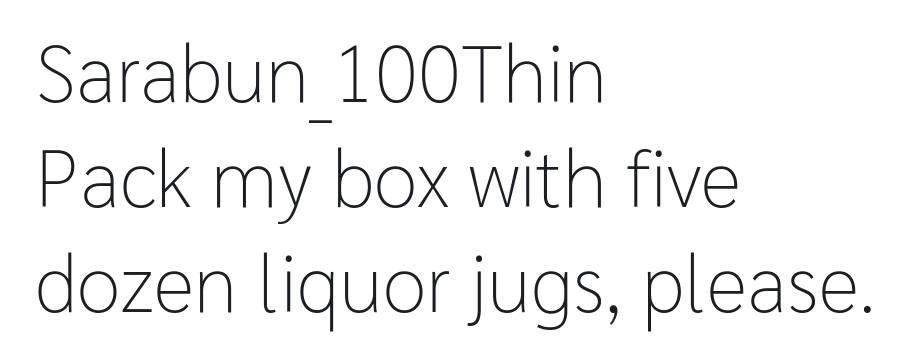](https://github.com/expo/google-fonts/tree/master/font-packages/sarabun#readme)||||
|[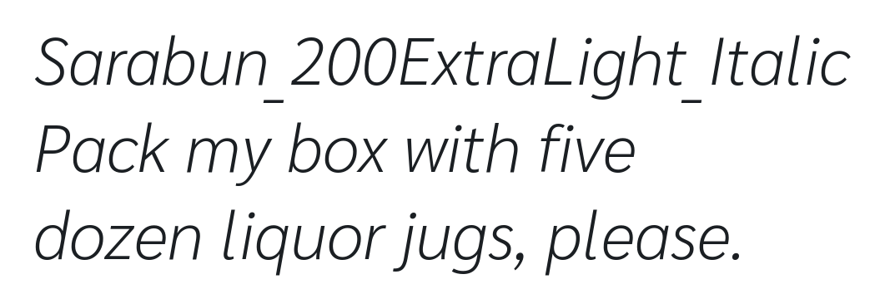](https://github.com/expo/google-fonts/tree/master/font-packages/sarabun#readme)||[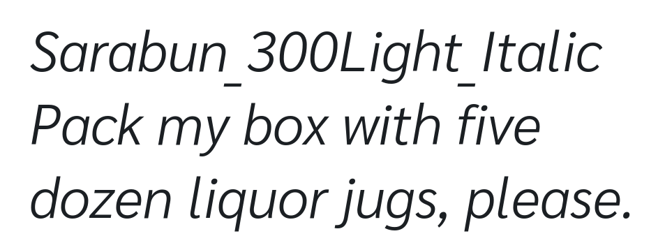](https://github.com/expo/google-fonts/tree/master/font-packages/sarabun#readme)||
|||||
|||[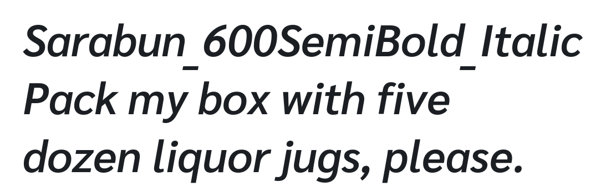](https://github.com/expo/google-fonts/tree/master/font-packages/sarabun#readme)||
|||||
|||||
### [Kantumruy](https://github.com/expo/google-fonts/tree/master/font-packages/kantumruy#readme)

||||
|-|-|-|
|||||
### [Fauna One](https://github.com/expo/google-fonts/tree/master/font-packages/fauna-one#readme)

||||
|-|-|-|
|||||
### [Lily Script One](https://github.com/expo/google-fonts/tree/master/font-packages/lily-script-one#readme)

||||
|-|-|-|
|||||
### [Pathway Gothic One](https://github.com/expo/google-fonts/tree/master/font-packages/pathway-gothic-one#readme)

||||
|-|-|-|
|||||
### [Alef](https://github.com/expo/google-fonts/tree/master/font-packages/alef#readme)

||||
|-|-|-|
|||||
### [Roboto Slab](https://github.com/expo/google-fonts/tree/master/font-packages/roboto-slab#readme)

||||
|-|-|-|
||[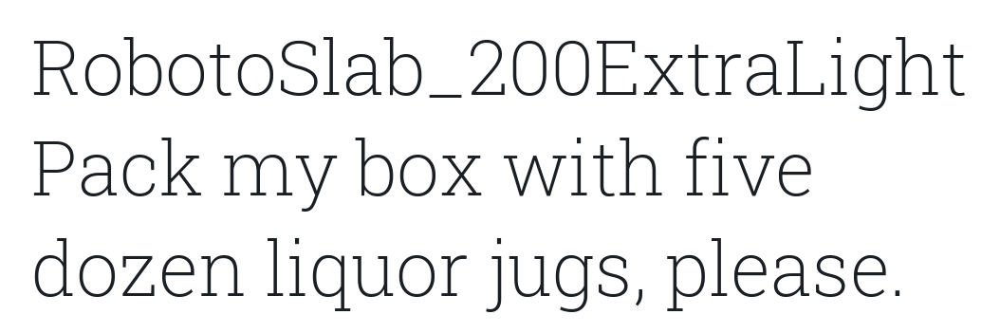](https://github.com/expo/google-fonts/tree/master/font-packages/roboto-slab#readme)|||
||[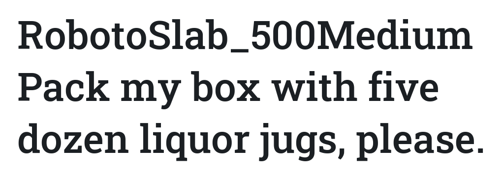](https://github.com/expo/google-fonts/tree/master/font-packages/roboto-slab#readme)|||
|||||
### [Libre Caslon Text](https://github.com/expo/google-fonts/tree/master/font-packages/libre-caslon-text#readme)

||||
|-|-|-|
|[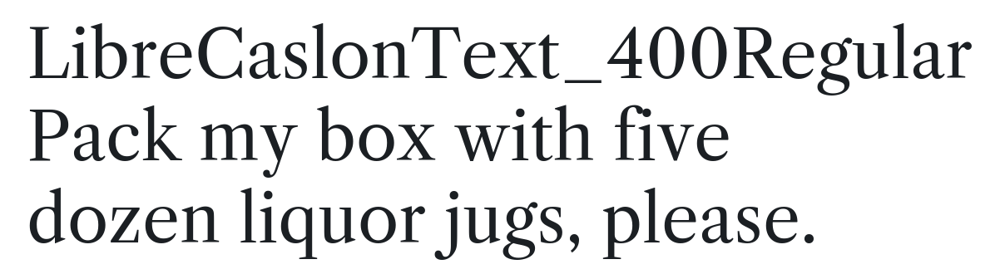](https://github.com/expo/google-fonts/tree/master/font-packages/libre-caslon-text#readme)||[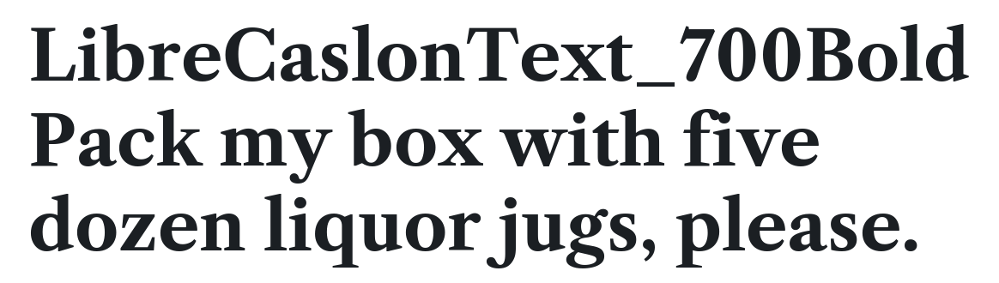](https://github.com/expo/google-fonts/tree/master/font-packages/libre-caslon-text#readme)||
### [Gabriela](https://github.com/expo/google-fonts/tree/master/font-packages/gabriela#readme)

||||
|-|-|-|
|||||
### [Merriweather Sans](https://github.com/expo/google-fonts/tree/master/font-packages/merriweather-sans#readme)

||||
|-|-|-|
|||[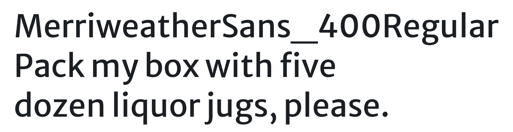](https://github.com/expo/google-fonts/tree/master/font-packages/merriweather-sans#readme)||
|||||
||[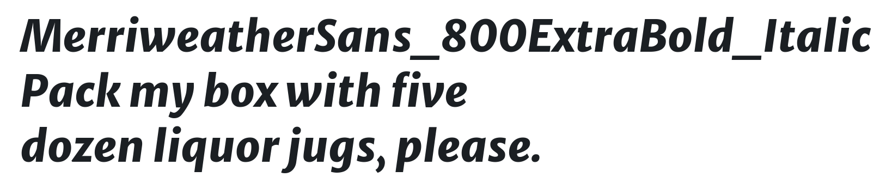](https://github.com/expo/google-fonts/tree/master/font-packages/merriweather-sans#readme)|||
### [Noto Sans](https://github.com/expo/google-fonts/tree/master/font-packages/noto-sans#readme)

||||
|-|-|-|
||[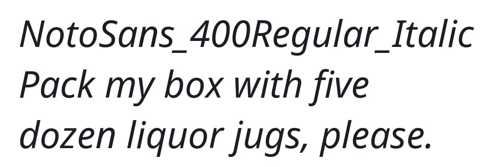](https://github.com/expo/google-fonts/tree/master/font-packages/noto-sans#readme)|||
|||||
### [Noto Serif](https://github.com/expo/google-fonts/tree/master/font-packages/noto-serif#readme)

||||
|-|-|-|
|||[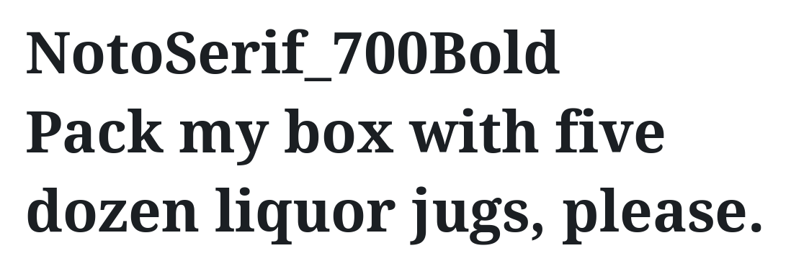](https://github.com/expo/google-fonts/tree/master/font-packages/noto-serif#readme)||
|||||
### [Patrick Hand SC](https://github.com/expo/google-fonts/tree/master/font-packages/patrick-hand-sc#readme)

||||
|-|-|-|
|[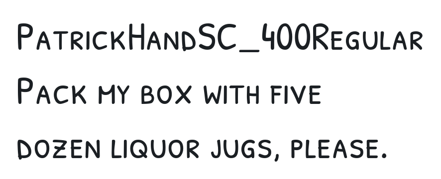](https://github.com/expo/google-fonts/tree/master/font-packages/patrick-hand-sc#readme)||||
### [Tauri](https://github.com/expo/google-fonts/tree/master/font-packages/tauri#readme)

||||
|-|-|-|
|||||
### [Sintony](https://github.com/expo/google-fonts/tree/master/font-packages/sintony#readme)

||||
|-|-|-|
|||||
### [Kavoon](https://github.com/expo/google-fonts/tree/master/font-packages/kavoon#readme)

||||
|-|-|-|
|||||
### [Fruktur](https://github.com/expo/google-fonts/tree/master/font-packages/fruktur#readme)

||||
|-|-|-|
|||||
### [Roboto](https://github.com/expo/google-fonts/tree/master/font-packages/roboto#readme)

||||
|-|-|-|
||[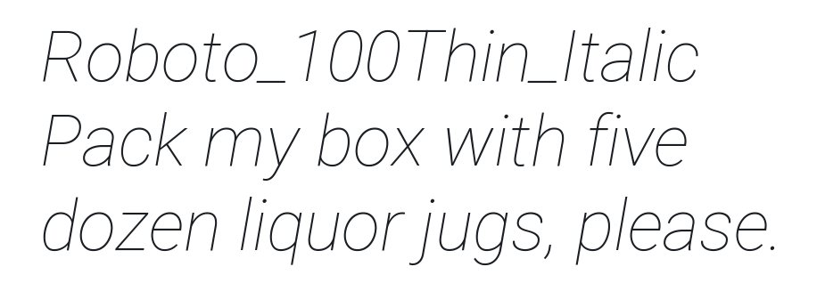](https://github.com/expo/google-fonts/tree/master/font-packages/roboto#readme)|||
|||||
|||||
|||||
### [Denk One](https://github.com/expo/google-fonts/tree/master/font-packages/denk-one#readme)

||||
|-|-|-|
|||||
### [Donegal One](https://github.com/expo/google-fonts/tree/master/font-packages/donegal-one#readme)

||||
|-|-|-|
|||||
### [Elsie](https://github.com/expo/google-fonts/tree/master/font-packages/elsie#readme)

||||
|-|-|-|
|||||
### [Elsie Swash Caps](https://github.com/expo/google-fonts/tree/master/font-packages/elsie-swash-caps#readme)

||||
|-|-|-|
|[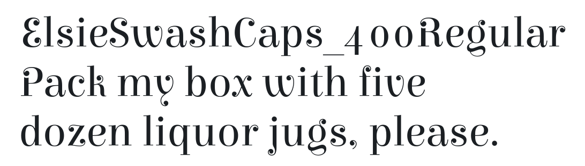](https://github.com/expo/google-fonts/tree/master/font-packages/elsie-swash-caps#readme)||||
### [Wendy One](https://github.com/expo/google-fonts/tree/master/font-packages/wendy-one#readme)

||||
|-|-|-|
|||||
### [Domine](https://github.com/expo/google-fonts/tree/master/font-packages/domine#readme)

||||
|-|-|-|
|||||
### [Grand Hotel](https://github.com/expo/google-fonts/tree/master/font-packages/grand-hotel#readme)

||||
|-|-|-|
|||||
### [Libre Baskerville](https://github.com/expo/google-fonts/tree/master/font-packages/libre-baskerville#readme)

||||
|-|-|-|
|||||
### [Milonga](https://github.com/expo/google-fonts/tree/master/font-packages/milonga#readme)

||||
|-|-|-|
|||||
### [Monda](https://github.com/expo/google-fonts/tree/master/font-packages/monda#readme)

||||
|-|-|-|
|||||
### [New Rocker](https://github.com/expo/google-fonts/tree/master/font-packages/new-rocker#readme)

||||
|-|-|-|
|||||
### [Freckle Face](https://github.com/expo/google-fonts/tree/master/font-packages/freckle-face#readme)

||||
|-|-|-|
|||||
### [Hanalei](https://github.com/expo/google-fonts/tree/master/font-packages/hanalei#readme)

||||
|-|-|-|
|[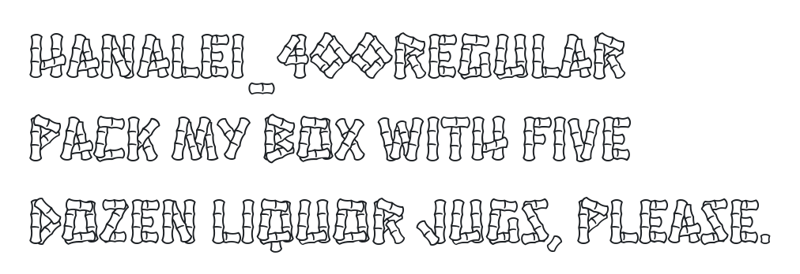](https://github.com/expo/google-fonts/tree/master/font-packages/hanalei#readme)||||
### [Hanalei Fill](https://github.com/expo/google-fonts/tree/master/font-packages/hanalei-fill#readme)

||||
|-|-|-|
|||||
### [Snowburst One](https://github.com/expo/google-fonts/tree/master/font-packages/snowburst-one#readme)

||||
|-|-|-|
|||||
### [Vampiro One](https://github.com/expo/google-fonts/tree/master/font-packages/vampiro-one#readme)

||||
|-|-|-|
|||||
### [Margarine](https://github.com/expo/google-fonts/tree/master/font-packages/margarine#readme)

||||
|-|-|-|
|||||
### [Purple Purse](https://github.com/expo/google-fonts/tree/master/font-packages/purple-purse#readme)

||||
|-|-|-|
|[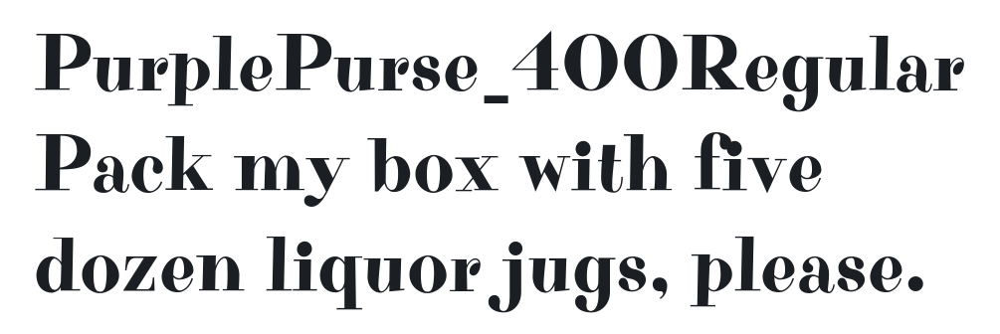](https://github.com/expo/google-fonts/tree/master/font-packages/purple-purse#readme)||||
### [Almendra Display](https://github.com/expo/google-fonts/tree/master/font-packages/almendra-display#readme)

||||
|-|-|-|
|[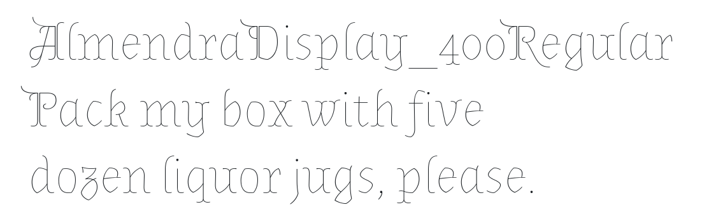](https://github.com/expo/google-fonts/tree/master/font-packages/almendra-display#readme)||||
### [Croissant One](https://github.com/expo/google-fonts/tree/master/font-packages/croissant-one#readme)

||||
|-|-|-|
|||||
### [Oleo Script Swash Caps](https://github.com/expo/google-fonts/tree/master/font-packages/oleo-script-swash-caps#readme)

||||
|-|-|-|
||[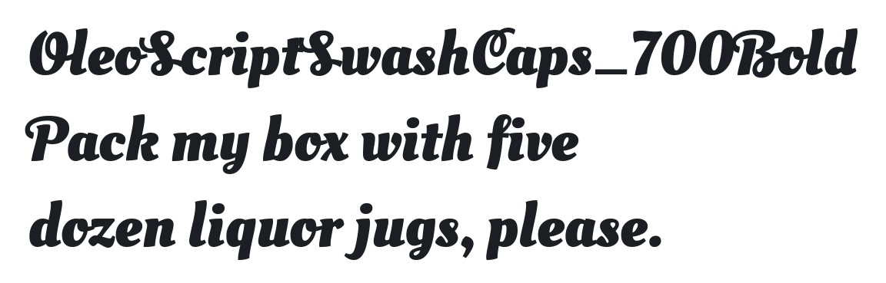](https://github.com/expo/google-fonts/tree/master/font-packages/oleo-script-swash-caps#readme)|||
### [Clicker Script](https://github.com/expo/google-fonts/tree/master/font-packages/clicker-script#readme)

||||
|-|-|-|
|||||
### [Risque](https://github.com/expo/google-fonts/tree/master/font-packages/risque#readme)

||||
|-|-|-|
|[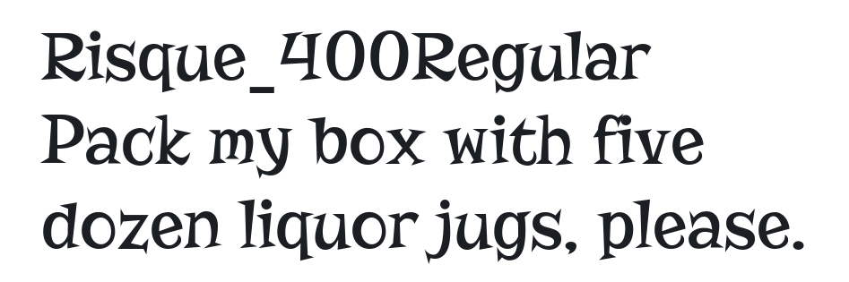](https://github.com/expo/google-fonts/tree/master/font-packages/risque#readme)||||
### [Stalemate](https://github.com/expo/google-fonts/tree/master/font-packages/stalemate#readme)

||||
|-|-|-|
|[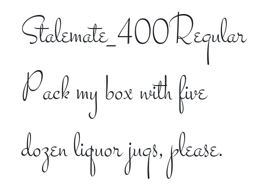](https://github.com/expo/google-fonts/tree/master/font-packages/stalemate#readme)||||
### [Bigelow Rules](https://github.com/expo/google-fonts/tree/master/font-packages/bigelow-rules#readme)

||||
|-|-|-|
|||||
### [Englebert](https://github.com/expo/google-fonts/tree/master/font-packages/englebert#readme)

||||
|-|-|-|
|||||
### [Mouse Memoirs](https://github.com/expo/google-fonts/tree/master/font-packages/mouse-memoirs#readme)

||||
|-|-|-|
|||||
### [Quintessential](https://github.com/expo/google-fonts/tree/master/font-packages/quintessential#readme)

||||
|-|-|-|
|[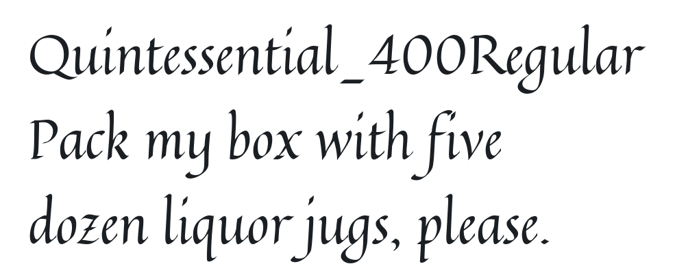](https://github.com/expo/google-fonts/tree/master/font-packages/quintessential#readme)||||
### [Rum Raisin](https://github.com/expo/google-fonts/tree/master/font-packages/rum-raisin#readme)

||||
|-|-|-|
|||||
### [Sacramento](https://github.com/expo/google-fonts/tree/master/font-packages/sacramento#readme)

||||
|-|-|-|
|||||
### [Anaheim](https://github.com/expo/google-fonts/tree/master/font-packages/anaheim#readme)

||||
|-|-|-|
|||||
### [Gafata](https://github.com/expo/google-fonts/tree/master/font-packages/gafata#readme)

||||
|-|-|-|
|||||
### [Gilda Display](https://github.com/expo/google-fonts/tree/master/font-packages/gilda-display#readme)

||||
|-|-|-|
|||||
### [Joti One](https://github.com/expo/google-fonts/tree/master/font-packages/joti-one#readme)

||||
|-|-|-|
|||||
### [Keania One](https://github.com/expo/google-fonts/tree/master/font-packages/keania-one#readme)

||||
|-|-|-|
|[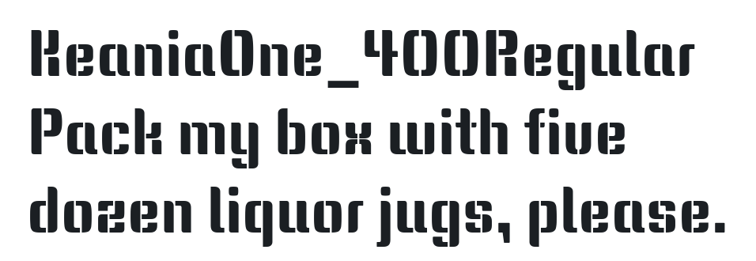](https://github.com/expo/google-fonts/tree/master/font-packages/keania-one#readme)||||
### [Merienda](https://github.com/expo/google-fonts/tree/master/font-packages/merienda#readme)

||||
|-|-|-|
|||||
### [Pirata One](https://github.com/expo/google-fonts/tree/master/font-packages/pirata-one#readme)

||||
|-|-|-|
|||||
### [Rambla](https://github.com/expo/google-fonts/tree/master/font-packages/rambla#readme)

||||
|-|-|-|
|||||
|[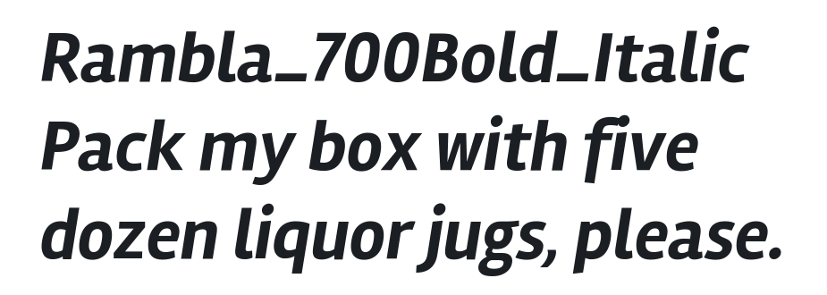](https://github.com/expo/google-fonts/tree/master/font-packages/rambla#readme)||||
### [Rufina](https://github.com/expo/google-fonts/tree/master/font-packages/rufina#readme)

||||
|-|-|-|
|[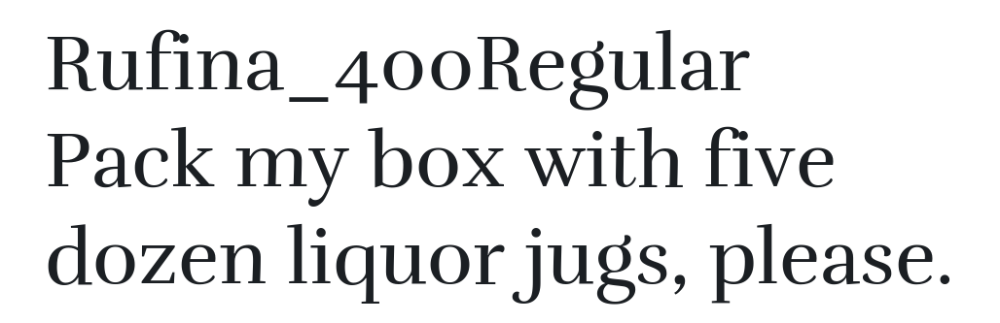](https://github.com/expo/google-fonts/tree/master/font-packages/rufina#readme)|[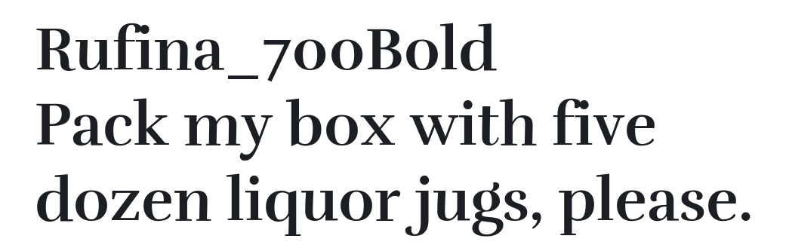](https://github.com/expo/google-fonts/tree/master/font-packages/rufina#readme)|||
### [Sanchez](https://github.com/expo/google-fonts/tree/master/font-packages/sanchez#readme)

||||
|-|-|-|
||[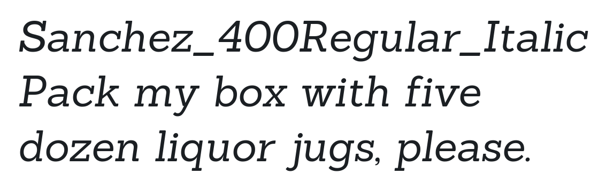](https://github.com/expo/google-fonts/tree/master/font-packages/sanchez#readme)|||
### [Share Tech](https://github.com/expo/google-fonts/tree/master/font-packages/share-tech#readme)

||||
|-|-|-|
|||||
### [Share Tech Mono](https://github.com/expo/google-fonts/tree/master/font-packages/share-tech-mono#readme)

||||
|-|-|-|
|||||
### [Text Me One](https://github.com/expo/google-fonts/tree/master/font-packages/text-me-one#readme)

||||
|-|-|-|
|||||
### [Fjalla One](https://github.com/expo/google-fonts/tree/master/font-packages/fjalla-one#readme)

||||
|-|-|-|
|[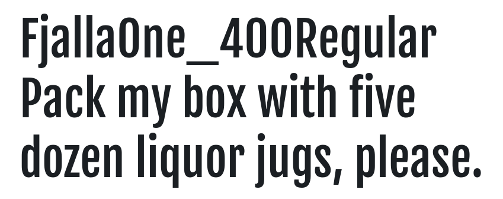](https://github.com/expo/google-fonts/tree/master/font-packages/fjalla-one#readme)||||
### [Average Sans](https://github.com/expo/google-fonts/tree/master/font-packages/average-sans#readme)

||||
|-|-|-|
|||||
### [Cutive Mono](https://github.com/expo/google-fonts/tree/master/font-packages/cutive-mono#readme)

||||
|-|-|-|
|||||
### [Faster One](https://github.com/expo/google-fonts/tree/master/font-packages/faster-one#readme)

||||
|-|-|-|
|||||
### [Kite One](https://github.com/expo/google-fonts/tree/master/font-packages/kite-one#readme)

||||
|-|-|-|
|||||
### [Offside](https://github.com/expo/google-fonts/tree/master/font-packages/offside#readme)

||||
|-|-|-|
|||||
### [Paprika](https://github.com/expo/google-fonts/tree/master/font-packages/paprika#readme)

||||
|-|-|-|
|||||
### [Playfair Display SC](https://github.com/expo/google-fonts/tree/master/font-packages/playfair-display-sc#readme)

||||
|-|-|-|
||[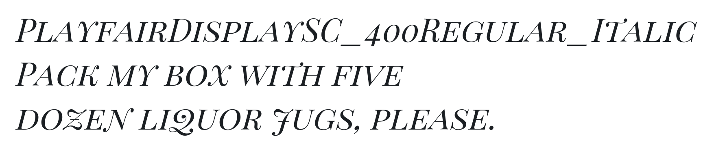](https://github.com/expo/google-fonts/tree/master/font-packages/playfair-display-sc#readme)|||
|[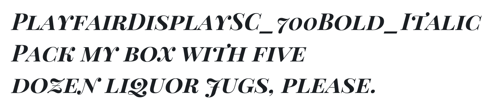](https://github.com/expo/google-fonts/tree/master/font-packages/playfair-display-sc#readme)||[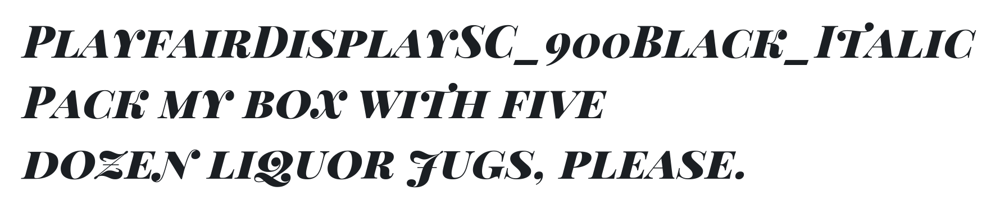](https://github.com/expo/google-fonts/tree/master/font-packages/playfair-display-sc#readme)||
### [Strait](https://github.com/expo/google-fonts/tree/master/font-packages/strait#readme)

||||
|-|-|-|
|||||
### [Unica One](https://github.com/expo/google-fonts/tree/master/font-packages/unica-one#readme)

||||
|-|-|-|
|||||
### [Cherry Swash](https://github.com/expo/google-fonts/tree/master/font-packages/cherry-swash#readme)

||||
|-|-|-|
|||||
### [Cinzel](https://github.com/expo/google-fonts/tree/master/font-packages/cinzel#readme)

||||
|-|-|-|
|||[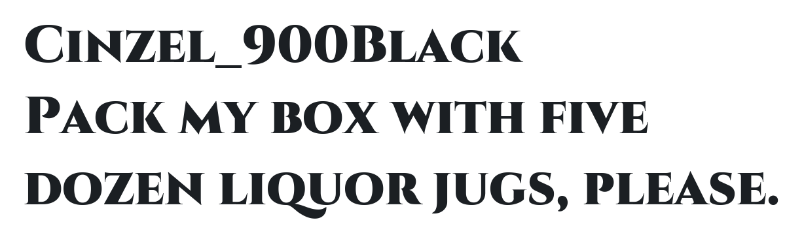](https://github.com/expo/google-fonts/tree/master/font-packages/cinzel#readme)||
### [Cinzel Decorative](https://github.com/expo/google-fonts/tree/master/font-packages/cinzel-decorative#readme)

||||
|-|-|-|
|[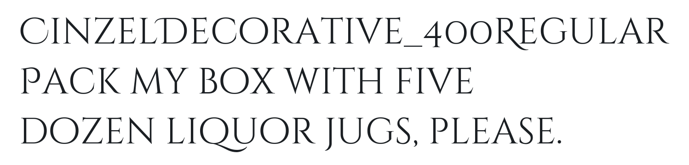](https://github.com/expo/google-fonts/tree/master/font-packages/cinzel-decorative#readme)||||
### [Seymour One](https://github.com/expo/google-fonts/tree/master/font-packages/seymour-one#readme)

||||
|-|-|-|
|||||
### [Chela One](https://github.com/expo/google-fonts/tree/master/font-packages/chela-one#readme)

||||
|-|-|-|
|||||
### [Julius Sans One](https://github.com/expo/google-fonts/tree/master/font-packages/julius-sans-one#readme)

||||
|-|-|-|
|||||
### [Montserrat Alternates](https://github.com/expo/google-fonts/tree/master/font-packages/montserrat-alternates#readme)

||||
|-|-|-|
|||||
|||||
|||||
|[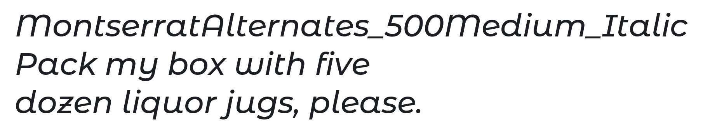](https://github.com/expo/google-fonts/tree/master/font-packages/montserrat-alternates#readme)||[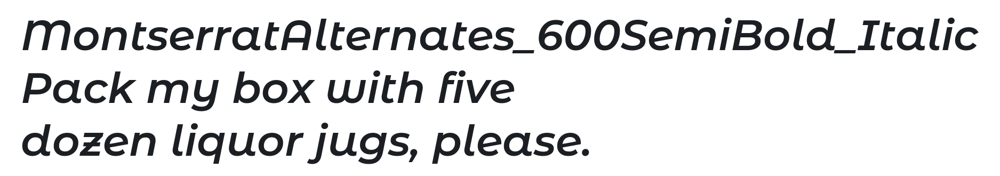](https://github.com/expo/google-fonts/tree/master/font-packages/montserrat-alternates#readme)||
|[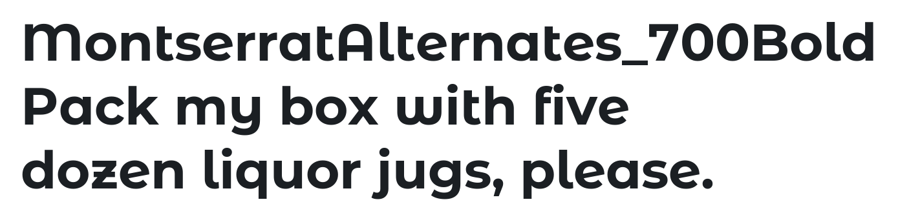](https://github.com/expo/google-fonts/tree/master/font-packages/montserrat-alternates#readme)||[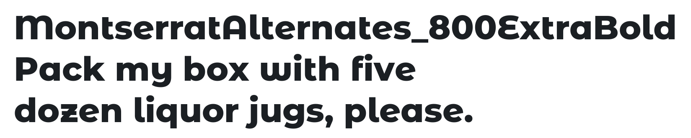](https://github.com/expo/google-fonts/tree/master/font-packages/montserrat-alternates#readme)||
|||||
### [Montserrat Subrayada](https://github.com/expo/google-fonts/tree/master/font-packages/montserrat-subrayada#readme)

||||
|-|-|-|
|||||
### [Titillium Web](https://github.com/expo/google-fonts/tree/master/font-packages/titillium-web#readme)

||||
|-|-|-|
|||||
||[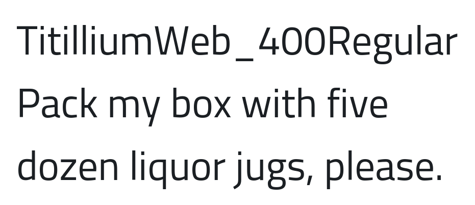](https://github.com/expo/google-fonts/tree/master/font-packages/titillium-web#readme)|||
|||||
|||||
### [ABeeZee](https://github.com/expo/google-fonts/tree/master/font-packages/abeezee#readme)

||||
|-|-|-|
|[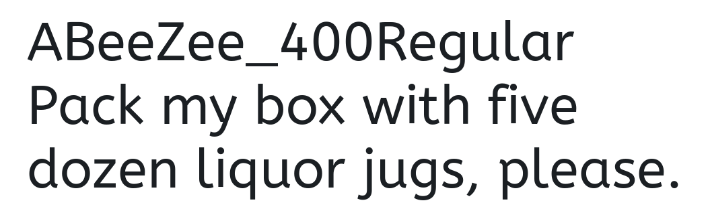](https://github.com/expo/google-fonts/tree/master/font-packages/abeezee#readme)||||
### [Carrois Gothic](https://github.com/expo/google-fonts/tree/master/font-packages/carrois-gothic#readme)

||||
|-|-|-|
|||||
### [Carrois Gothic SC](https://github.com/expo/google-fonts/tree/master/font-packages/carrois-gothic-sc#readme)

||||
|-|-|-|
|||||
### [Finger Paint](https://github.com/expo/google-fonts/tree/master/font-packages/finger-paint#readme)

||||
|-|-|-|
|||||
### [Sofadi One](https://github.com/expo/google-fonts/tree/master/font-packages/sofadi-one#readme)

||||
|-|-|-|
|||||
### [BenchNine](https://github.com/expo/google-fonts/tree/master/font-packages/benchnine#readme)

||||
|-|-|-|
|||||
### [Fenix](https://github.com/expo/google-fonts/tree/master/font-packages/fenix#readme)

||||
|-|-|-|
|||||
### [Akronim](https://github.com/expo/google-fonts/tree/master/font-packages/akronim#readme)

||||
|-|-|-|
|||||
### [Combo](https://github.com/expo/google-fonts/tree/master/font-packages/combo#readme)

||||
|-|-|-|
|||||
### [Underdog](https://github.com/expo/google-fonts/tree/master/font-packages/underdog#readme)

||||
|-|-|-|
|[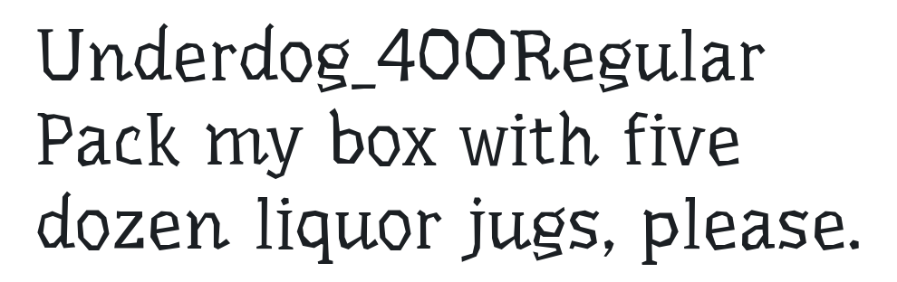](https://github.com/expo/google-fonts/tree/master/font-packages/underdog#readme)||||
### [Source Code Pro](https://github.com/expo/google-fonts/tree/master/font-packages/source-code-pro#readme)

||||
|-|-|-|
|||||
|||||
||[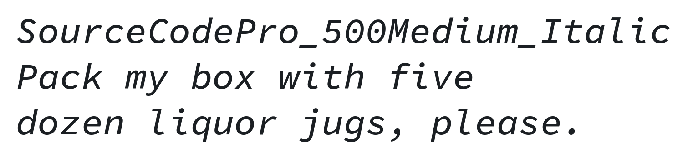](https://github.com/expo/google-fonts/tree/master/font-packages/source-code-pro#readme)|||
|||||
|||||
### [Arbutus Slab](https://github.com/expo/google-fonts/tree/master/font-packages/arbutus-slab#readme)

||||
|-|-|-|
|||||
### [Archivo Black](https://github.com/expo/google-fonts/tree/master/font-packages/archivo-black#readme)

||||
|-|-|-|
|||||
### [Archivo Narrow](https://github.com/expo/google-fonts/tree/master/font-packages/archivo-narrow#readme)

||||
|-|-|-|
|[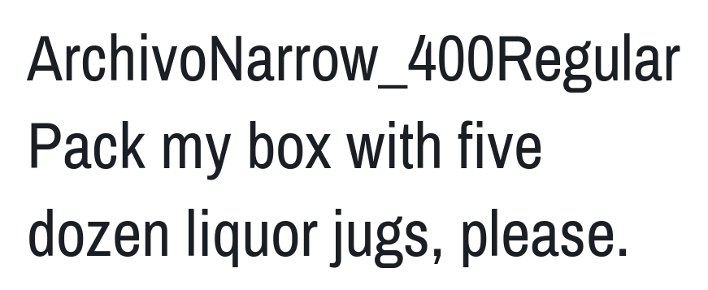](https://github.com/expo/google-fonts/tree/master/font-packages/archivo-narrow#readme)||||
||[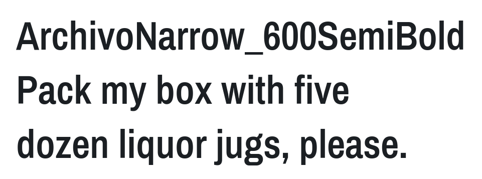](https://github.com/expo/google-fonts/tree/master/font-packages/archivo-narrow#readme)|[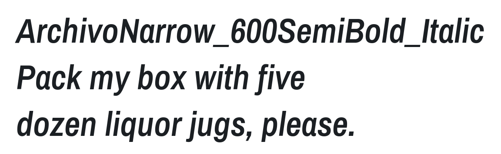](https://github.com/expo/google-fonts/tree/master/font-packages/archivo-narrow#readme)||
|[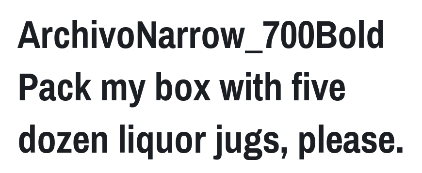](https://github.com/expo/google-fonts/tree/master/font-packages/archivo-narrow#readme)||||
### [Molle](https://github.com/expo/google-fonts/tree/master/font-packages/molle#readme)

||||
|-|-|-|
|||||
### [Oxygen Mono](https://github.com/expo/google-fonts/tree/master/font-packages/oxygen-mono#readme)

||||
|-|-|-|
|[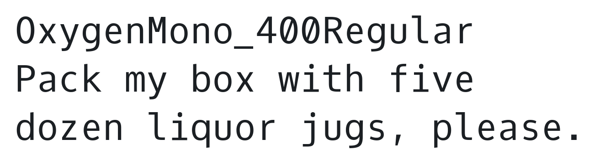](https://github.com/expo/google-fonts/tree/master/font-packages/oxygen-mono#readme)||||
### [Jacques Francois](https://github.com/expo/google-fonts/tree/master/font-packages/jacques-francois#readme)

||||
|-|-|-|
|[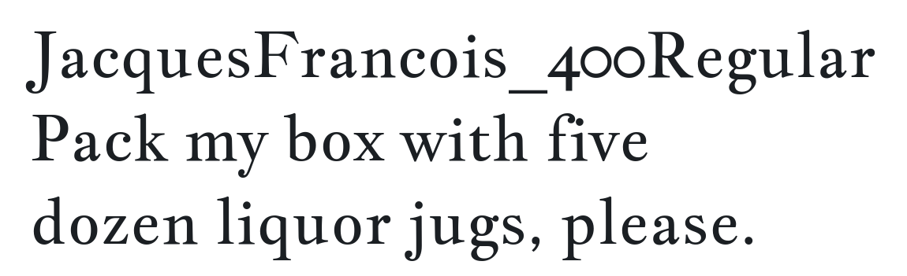](https://github.com/expo/google-fonts/tree/master/font-packages/jacques-francois#readme)||||
### [Jacques Francois Shadow](https://github.com/expo/google-fonts/tree/master/font-packages/jacques-francois-shadow#readme)

||||
|-|-|-|
|||||
### [Orienta](https://github.com/expo/google-fonts/tree/master/font-packages/orienta#readme)

||||
|-|-|-|
|||||
### [Petit Formal Script](https://github.com/expo/google-fonts/tree/master/font-packages/petit-formal-script#readme)

||||
|-|-|-|
|[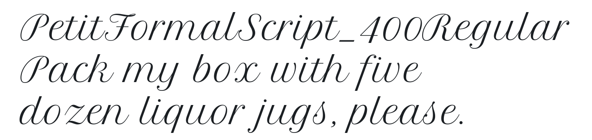](https://github.com/expo/google-fonts/tree/master/font-packages/petit-formal-script#readme)||||
### [Raleway](https://github.com/expo/google-fonts/tree/master/font-packages/raleway#readme)

||||
|-|-|-|
|||||
|[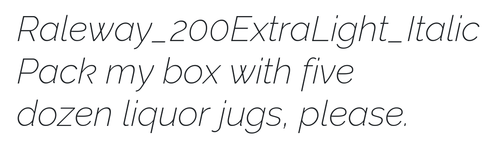](https://github.com/expo/google-fonts/tree/master/font-packages/raleway#readme)||||
|||||
||[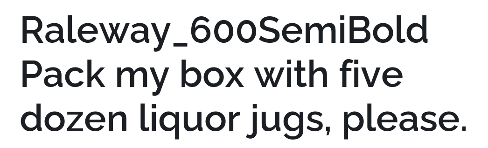](https://github.com/expo/google-fonts/tree/master/font-packages/raleway#readme)|||
|||||
|[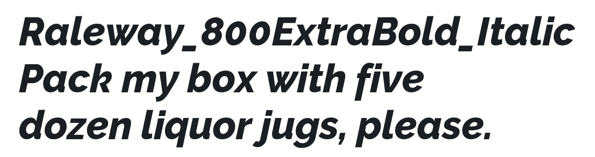](https://github.com/expo/google-fonts/tree/master/font-packages/raleway#readme)||||
### [Raleway Dots](https://github.com/expo/google-fonts/tree/master/font-packages/raleway-dots#readme)

||||
|-|-|-|
|[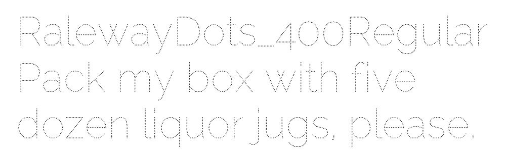](https://github.com/expo/google-fonts/tree/master/font-packages/raleway-dots#readme)||||
### [Ranchers](https://github.com/expo/google-fonts/tree/master/font-packages/ranchers#readme)

||||
|-|-|-|
|||||
### [Warnes](https://github.com/expo/google-fonts/tree/master/font-packages/warnes#readme)

||||
|-|-|-|
|||||
### [Griffy](https://github.com/expo/google-fonts/tree/master/font-packages/griffy#readme)

||||
|-|-|-|
|[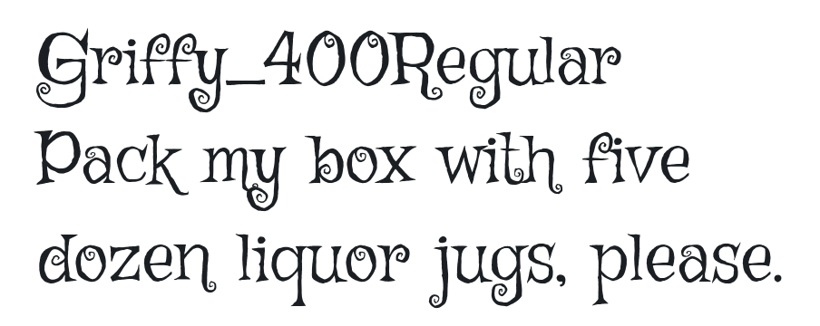](https://github.com/expo/google-fonts/tree/master/font-packages/griffy#readme)||||
### [Meie Script](https://github.com/expo/google-fonts/tree/master/font-packages/meie-script#readme)

||||
|-|-|-|
|||||
### [Rye](https://github.com/expo/google-fonts/tree/master/font-packages/rye#readme)

||||
|-|-|-|
|[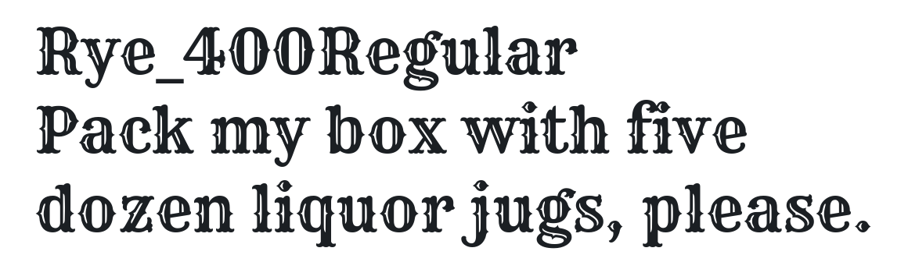](https://github.com/expo/google-fonts/tree/master/font-packages/rye#readme)||||
### [Skranji](https://github.com/expo/google-fonts/tree/master/font-packages/skranji#readme)

||||
|-|-|-|
||[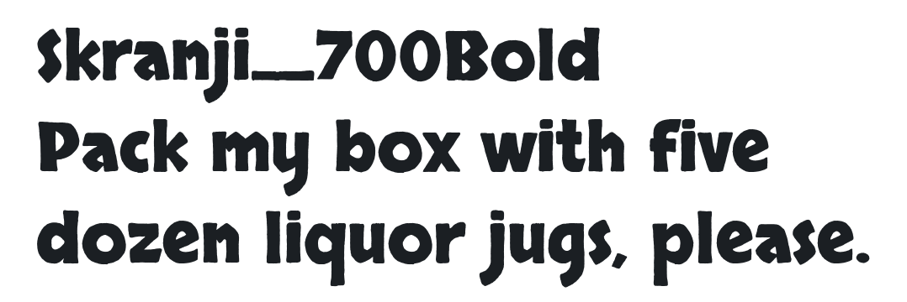](https://github.com/expo/google-fonts/tree/master/font-packages/skranji#readme)|||
### [Oranienbaum](https://github.com/expo/google-fonts/tree/master/font-packages/oranienbaum#readme)

||||
|-|-|-|
|[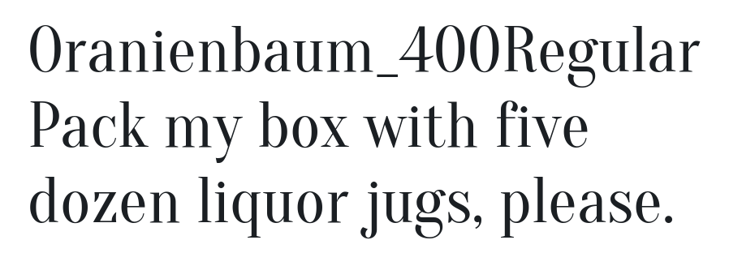](https://github.com/expo/google-fonts/tree/master/font-packages/oranienbaum#readme)||||
### [Stalinist One](https://github.com/expo/google-fonts/tree/master/font-packages/stalinist-one#readme)

||||
|-|-|-|
|[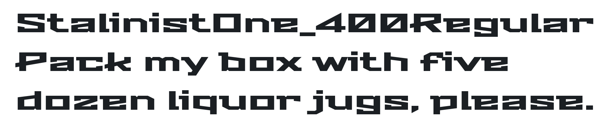](https://github.com/expo/google-fonts/tree/master/font-packages/stalinist-one#readme)||||
### [Galindo](https://github.com/expo/google-fonts/tree/master/font-packages/galindo#readme)

||||
|-|-|-|
|[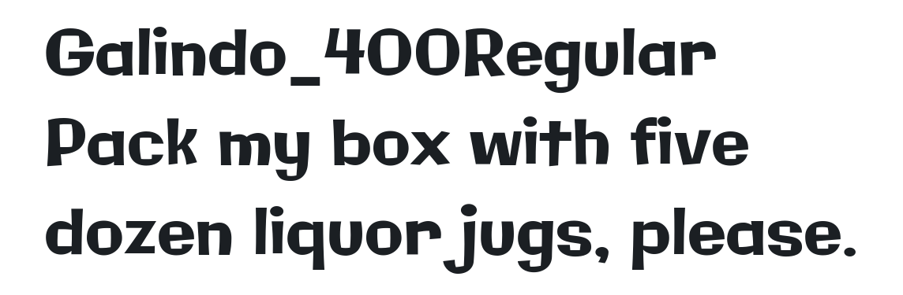](https://github.com/expo/google-fonts/tree/master/font-packages/galindo#readme)||||
### [Life Savers](https://github.com/expo/google-fonts/tree/master/font-packages/life-savers#readme)

||||
|-|-|-|
|[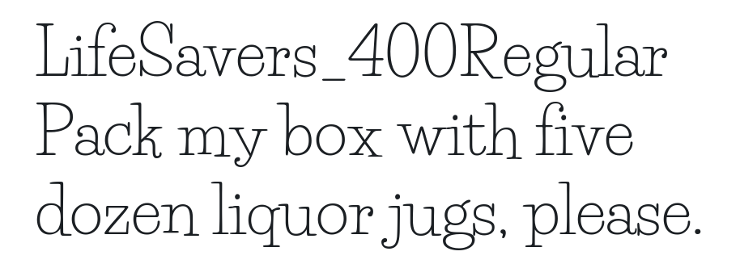](https://github.com/expo/google-fonts/tree/master/font-packages/life-savers#readme)|[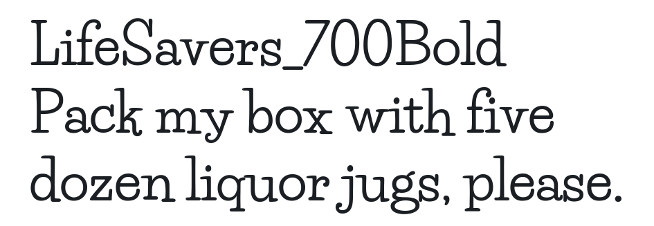](https://github.com/expo/google-fonts/tree/master/font-packages/life-savers#readme)|||
### [McLaren](https://github.com/expo/google-fonts/tree/master/font-packages/mclaren#readme)

||||
|-|-|-|
|||||
### [Oregano](https://github.com/expo/google-fonts/tree/master/font-packages/oregano#readme)

||||
|-|-|-|
|||||
### [Racing Sans One](https://github.com/expo/google-fonts/tree/master/font-packages/racing-sans-one#readme)

||||
|-|-|-|
|||||
### [Romanesco](https://github.com/expo/google-fonts/tree/master/font-packages/romanesco#readme)

||||
|-|-|-|
|||||
### [Nunito](https://github.com/expo/google-fonts/tree/master/font-packages/nunito#readme)

||||
|-|-|-|
|[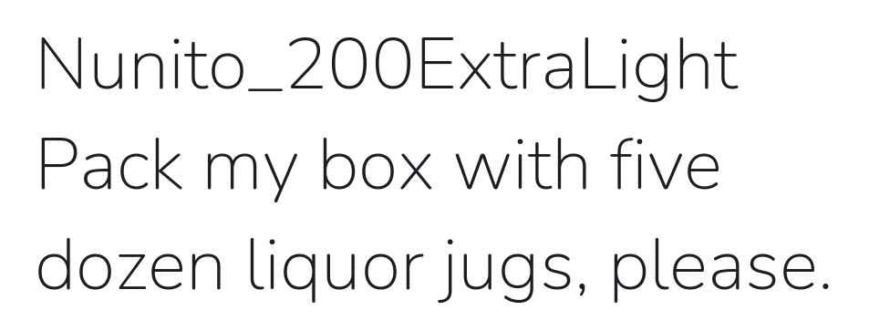](https://github.com/expo/google-fonts/tree/master/font-packages/nunito#readme)|[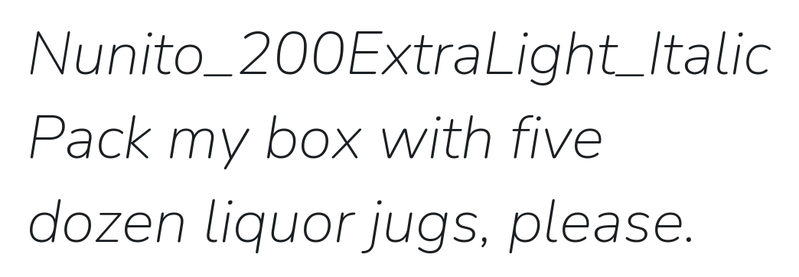](https://github.com/expo/google-fonts/tree/master/font-packages/nunito#readme)|[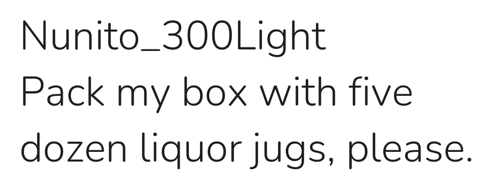](https://github.com/expo/google-fonts/tree/master/font-packages/nunito#readme)||
|||||
||[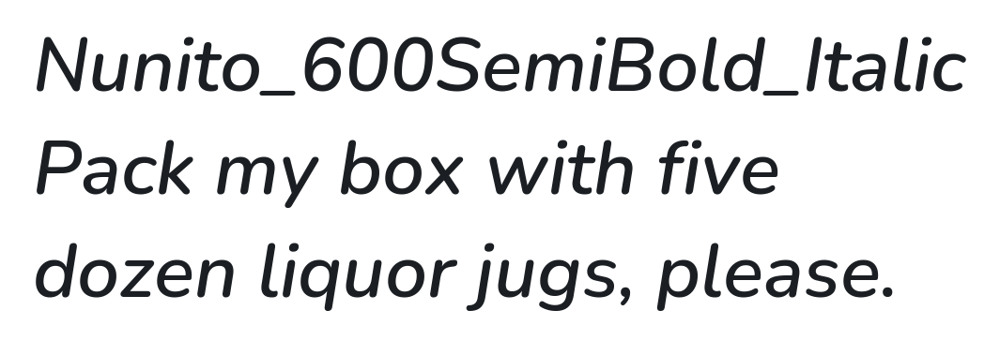](https://github.com/expo/google-fonts/tree/master/font-packages/nunito#readme)|||
|||||
|||||
### [Stoke](https://github.com/expo/google-fonts/tree/master/font-packages/stoke#readme)

||||
|-|-|-|
||[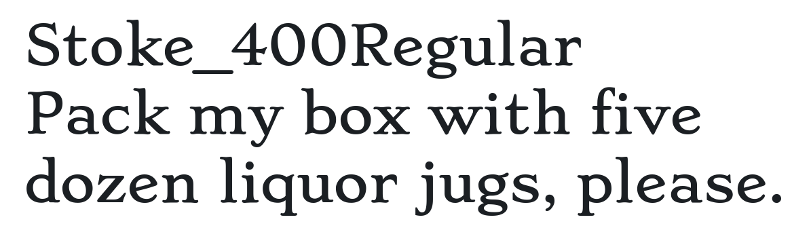](https://github.com/expo/google-fonts/tree/master/font-packages/stoke#readme)|||
### [Source Sans Pro](https://github.com/expo/google-fonts/tree/master/font-packages/source-sans-pro#readme)

||||
|-|-|-|
|||||
|||||
|||||
|||||
### [Amiri](https://github.com/expo/google-fonts/tree/master/font-packages/amiri#readme)

||||
|-|-|-|
|[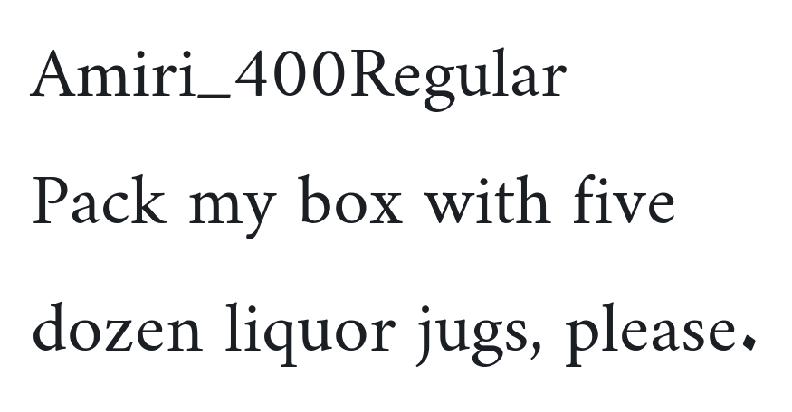](https://github.com/expo/google-fonts/tree/master/font-packages/amiri#readme)|[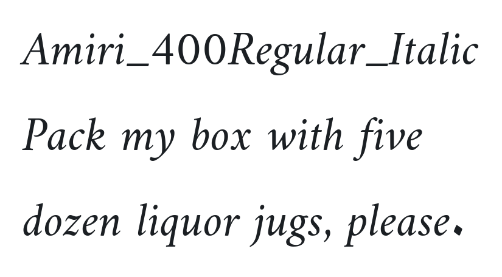](https://github.com/expo/google-fonts/tree/master/font-packages/amiri#readme)|||
|||||
### [Cantora One](https://github.com/expo/google-fonts/tree/master/font-packages/cantora-one#readme)

||||
|-|-|-|
|||||
### [Scada](https://github.com/expo/google-fonts/tree/master/font-packages/scada#readme)

||||
|-|-|-|
|[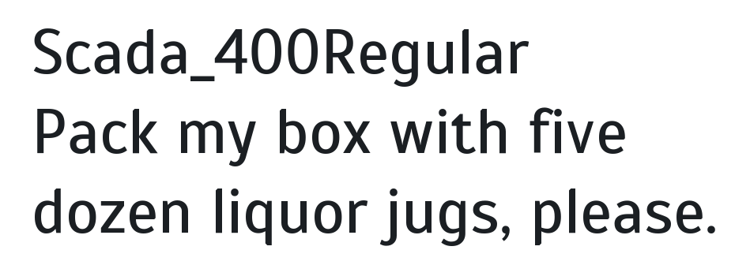](https://github.com/expo/google-fonts/tree/master/font-packages/scada#readme)|[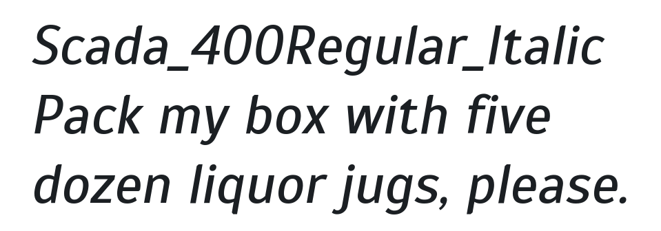](https://github.com/expo/google-fonts/tree/master/font-packages/scada#readme)|||
|||||
### [Eagle Lake](https://github.com/expo/google-fonts/tree/master/font-packages/eagle-lake#readme)

||||
|-|-|-|
|||||
### [Metal Mania](https://github.com/expo/google-fonts/tree/master/font-packages/metal-mania#readme)

||||
|-|-|-|
|[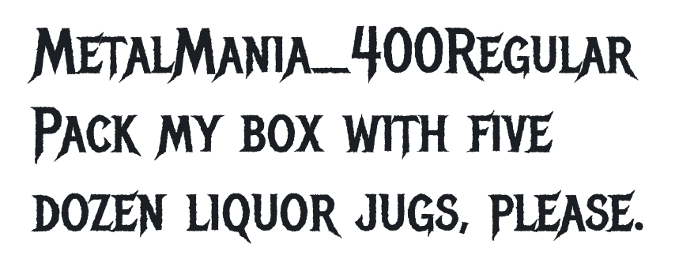](https://github.com/expo/google-fonts/tree/master/font-packages/metal-mania#readme)||||
### [Peralta](https://github.com/expo/google-fonts/tree/master/font-packages/peralta#readme)

||||
|-|-|-|
|[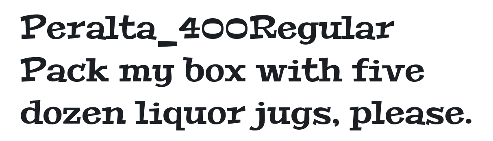](https://github.com/expo/google-fonts/tree/master/font-packages/peralta#readme)||||
### [Amarante](https://github.com/expo/google-fonts/tree/master/font-packages/amarante#readme)

||||
|-|-|-|
|[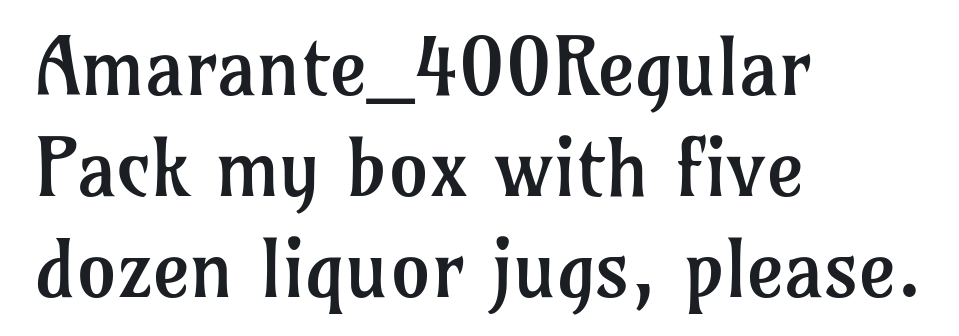](https://github.com/expo/google-fonts/tree/master/font-packages/amarante#readme)||||
### [Capriola](https://github.com/expo/google-fonts/tree/master/font-packages/capriola#readme)

||||
|-|-|-|
|||||
### [Courgette](https://github.com/expo/google-fonts/tree/master/font-packages/courgette#readme)

||||
|-|-|-|
|||||
### [Quando](https://github.com/expo/google-fonts/tree/master/font-packages/quando#readme)

||||
|-|-|-|
|||||
### [Roboto Condensed](https://github.com/expo/google-fonts/tree/master/font-packages/roboto-condensed#readme)

||||
|-|-|-|
||[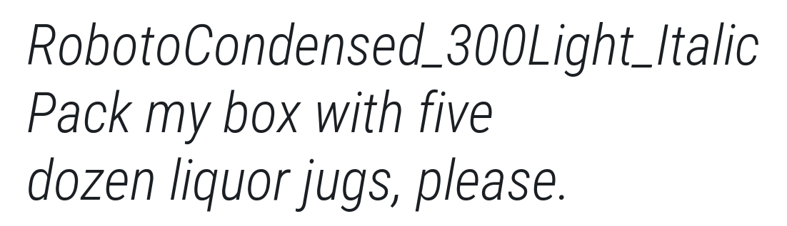](https://github.com/expo/google-fonts/tree/master/font-packages/roboto-condensed#readme)|||
|||||
### [Fasthand](https://github.com/expo/google-fonts/tree/master/font-packages/fasthand#readme)

||||
|-|-|-|
|||||
### [Autour One](https://github.com/expo/google-fonts/tree/master/font-packages/autour-one#readme)

||||
|-|-|-|
|||||
### [Bubbler One](https://github.com/expo/google-fonts/tree/master/font-packages/bubbler-one#readme)

||||
|-|-|-|
|||||
### [Headland One](https://github.com/expo/google-fonts/tree/master/font-packages/headland-one#readme)

||||
|-|-|-|
|||||
### [Marcellus](https://github.com/expo/google-fonts/tree/master/font-packages/marcellus#readme)

||||
|-|-|-|
|||||
### [Marcellus SC](https://github.com/expo/google-fonts/tree/master/font-packages/marcellus-sc#readme)

||||
|-|-|-|
|[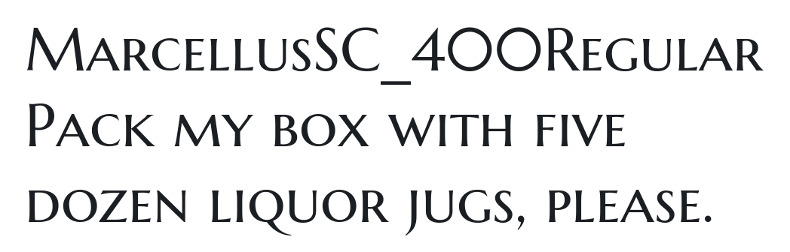](https://github.com/expo/google-fonts/tree/master/font-packages/marcellus-sc#readme)||||
### [Audiowide](https://github.com/expo/google-fonts/tree/master/font-packages/audiowide#readme)

||||
|-|-|-|
|[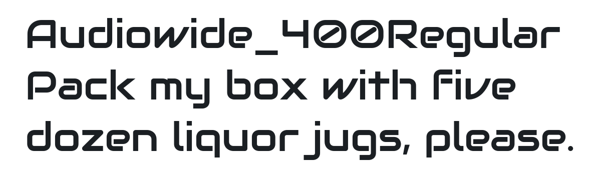](https://github.com/expo/google-fonts/tree/master/font-packages/audiowide#readme)||||
### [Chau Philomene One](https://github.com/expo/google-fonts/tree/master/font-packages/chau-philomene-one#readme)

||||
|-|-|-|
|||||
### [Cuprum](https://github.com/expo/google-fonts/tree/master/font-packages/cuprum#readme)

||||
|-|-|-|
||[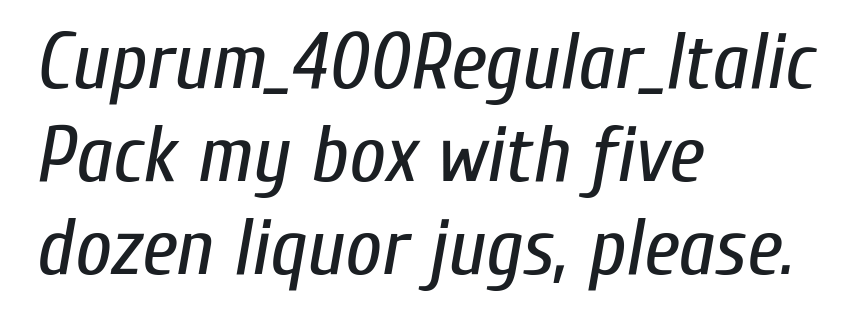](https://github.com/expo/google-fonts/tree/master/font-packages/cuprum#readme)|||
|[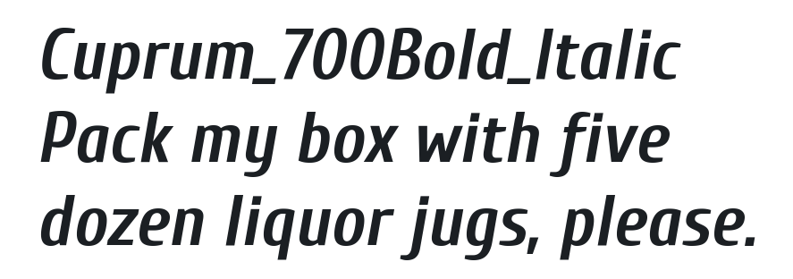](https://github.com/expo/google-fonts/tree/master/font-packages/cuprum#readme)||||
### [Della Respira](https://github.com/expo/google-fonts/tree/master/font-packages/della-respira#readme)

||||
|-|-|-|
|||||
### [Press Start 2P](https://github.com/expo/google-fonts/tree/master/font-packages/press-start-2p#readme)

||||
|-|-|-|
|||||
### [Russo One](https://github.com/expo/google-fonts/tree/master/font-packages/russo-one#readme)

||||
|-|-|-|
|||||
### [Simonetta](https://github.com/expo/google-fonts/tree/master/font-packages/simonetta#readme)

||||
|-|-|-|
|||||
|||||
### [Trocchi](https://github.com/expo/google-fonts/tree/master/font-packages/trocchi#readme)

||||
|-|-|-|
|||||
### [Belleza](https://github.com/expo/google-fonts/tree/master/font-packages/belleza#readme)

||||
|-|-|-|
|||||
### [Great Vibes](https://github.com/expo/google-fonts/tree/master/font-packages/great-vibes#readme)

||||
|-|-|-|
|||||
### [Lovers Quarrel](https://github.com/expo/google-fonts/tree/master/font-packages/lovers-quarrel#readme)

||||
|-|-|-|
|||||
### [Oleo Script](https://github.com/expo/google-fonts/tree/master/font-packages/oleo-script#readme)

||||
|-|-|-|
||[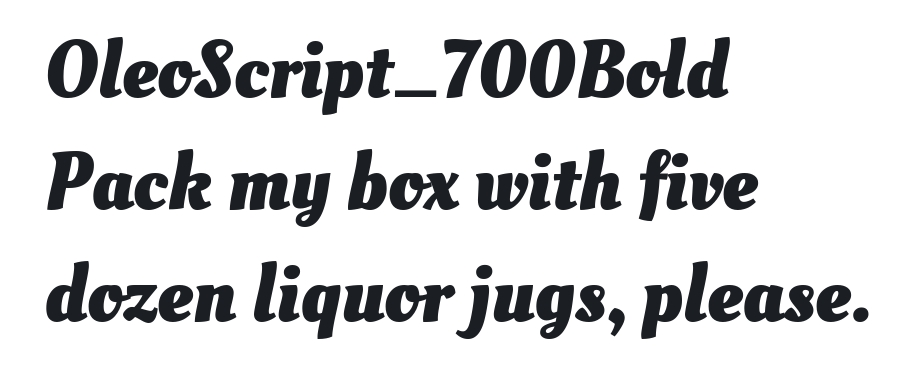](https://github.com/expo/google-fonts/tree/master/font-packages/oleo-script#readme)|||
### [Oxygen](https://github.com/expo/google-fonts/tree/master/font-packages/oxygen#readme)

||||
|-|-|-|
|||||
### [Rosarivo](https://github.com/expo/google-fonts/tree/master/font-packages/rosarivo#readme)

||||
|-|-|-|
|||||
### [Dosis](https://github.com/expo/google-fonts/tree/master/font-packages/dosis#readme)

||||
|-|-|-|
|||||
|||||
|||||
### [Quattrocento](https://github.com/expo/google-fonts/tree/master/font-packages/quattrocento#readme)

||||
|-|-|-|
|||||
### [Antic Didone](https://github.com/expo/google-fonts/tree/master/font-packages/antic-didone#readme)

||||
|-|-|-|
|||||
### [Antic Slab](https://github.com/expo/google-fonts/tree/master/font-packages/antic-slab#readme)

||||
|-|-|-|
|[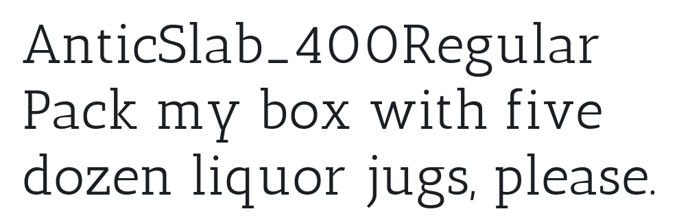](https://github.com/expo/google-fonts/tree/master/font-packages/antic-slab#readme)||||
### [Average](https://github.com/expo/google-fonts/tree/master/font-packages/average#readme)

||||
|-|-|-|
|[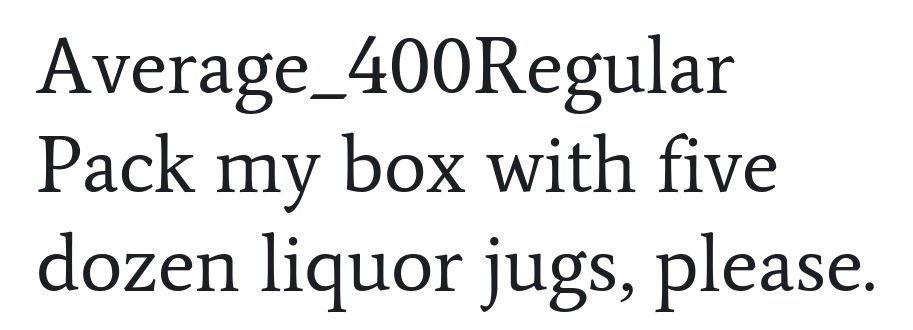](https://github.com/expo/google-fonts/tree/master/font-packages/average#readme)||||
### [Averia Gruesa Libre](https://github.com/expo/google-fonts/tree/master/font-packages/averia-gruesa-libre#readme)

||||
|-|-|-|
|||||
### [Averia Libre](https://github.com/expo/google-fonts/tree/master/font-packages/averia-libre#readme)

||||
|-|-|-|
|||||
||[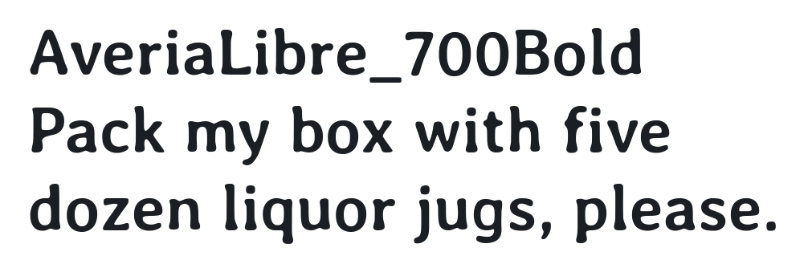](https://github.com/expo/google-fonts/tree/master/font-packages/averia-libre#readme)|[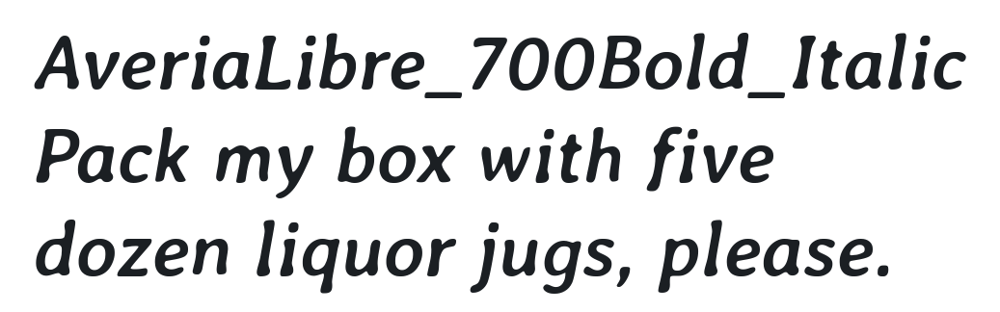](https://github.com/expo/google-fonts/tree/master/font-packages/averia-libre#readme)||
### [Averia Sans Libre](https://github.com/expo/google-fonts/tree/master/font-packages/averia-sans-libre#readme)

||||
|-|-|-|
|||||
|||[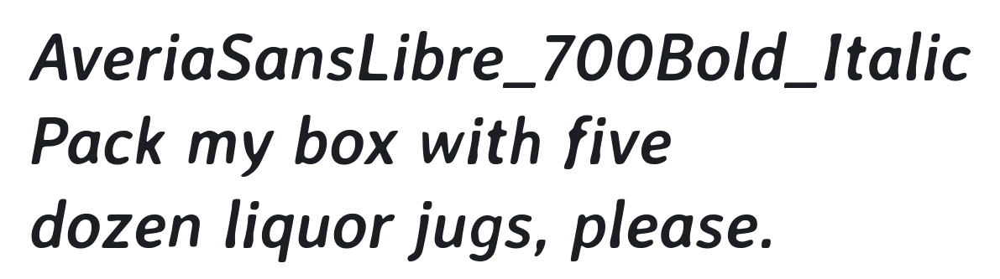](https://github.com/expo/google-fonts/tree/master/font-packages/averia-sans-libre#readme)||
### [Averia Serif Libre](https://github.com/expo/google-fonts/tree/master/font-packages/averia-serif-libre#readme)

||||
|-|-|-|
||[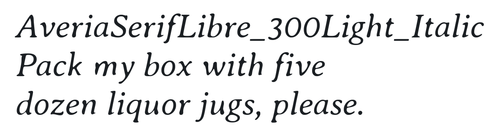](https://github.com/expo/google-fonts/tree/master/font-packages/averia-serif-libre#readme)|||
|||||
### [Berkshire Swash](https://github.com/expo/google-fonts/tree/master/font-packages/berkshire-swash#readme)

||||
|-|-|-|
|||||
### [Codystar](https://github.com/expo/google-fonts/tree/master/font-packages/codystar#readme)

||||
|-|-|-|
||[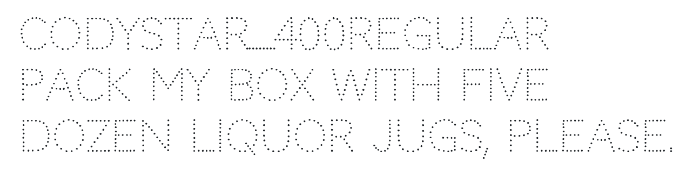](https://github.com/expo/google-fonts/tree/master/font-packages/codystar#readme)|||
### [Fredoka One](https://github.com/expo/google-fonts/tree/master/font-packages/fredoka-one#readme)

||||
|-|-|-|
|||||
### [Gorditas](https://github.com/expo/google-fonts/tree/master/font-packages/gorditas#readme)

||||
|-|-|-|
|[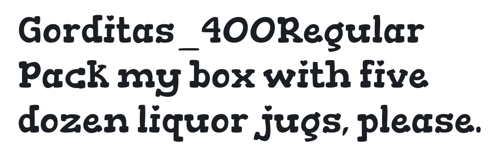](https://github.com/expo/google-fonts/tree/master/font-packages/gorditas#readme)|[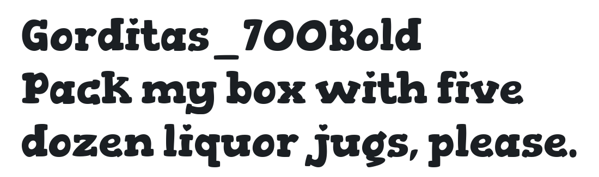](https://github.com/expo/google-fonts/tree/master/font-packages/gorditas#readme)|||
### [Graduate](https://github.com/expo/google-fonts/tree/master/font-packages/graduate#readme)

||||
|-|-|-|
|||||
### [Happy Monkey](https://github.com/expo/google-fonts/tree/master/font-packages/happy-monkey#readme)

||||
|-|-|-|
|||||
### [Imprima](https://github.com/expo/google-fonts/tree/master/font-packages/imprima#readme)

||||
|-|-|-|
|||||
### [Italiana](https://github.com/expo/google-fonts/tree/master/font-packages/italiana#readme)

||||
|-|-|-|
|||||
### [Jolly Lodger](https://github.com/expo/google-fonts/tree/master/font-packages/jolly-lodger#readme)

||||
|-|-|-|
|||||
### [Karla](https://github.com/expo/google-fonts/tree/master/font-packages/karla#readme)

||||
|-|-|-|
|||||
|[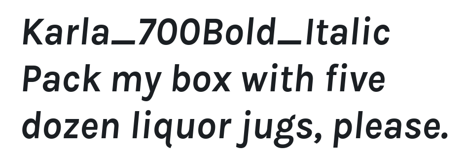](https://github.com/expo/google-fonts/tree/master/font-packages/karla#readme)||||
### [Londrina Outline](https://github.com/expo/google-fonts/tree/master/font-packages/londrina-outline#readme)

||||
|-|-|-|
|||||
### [Londrina Shadow](https://github.com/expo/google-fonts/tree/master/font-packages/londrina-shadow#readme)

||||
|-|-|-|
|||||
### [Londrina Sketch](https://github.com/expo/google-fonts/tree/master/font-packages/londrina-sketch#readme)

||||
|-|-|-|
|||||
### [Londrina Solid](https://github.com/expo/google-fonts/tree/master/font-packages/londrina-solid#readme)

||||
|-|-|-|
|||[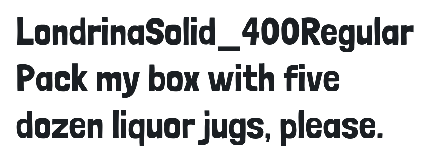](https://github.com/expo/google-fonts/tree/master/font-packages/londrina-solid#readme)||
|||||
### [Pontano Sans](https://github.com/expo/google-fonts/tree/master/font-packages/pontano-sans#readme)

||||
|-|-|-|
|||||
### [Revalia](https://github.com/expo/google-fonts/tree/master/font-packages/revalia#readme)

||||
|-|-|-|
|||||
### [Advent Pro](https://github.com/expo/google-fonts/tree/master/font-packages/advent-pro#readme)

||||
|-|-|-|
|||||
|||||
|||||
### [Cantata One](https://github.com/expo/google-fonts/tree/master/font-packages/cantata-one#readme)

||||
|-|-|-|
|[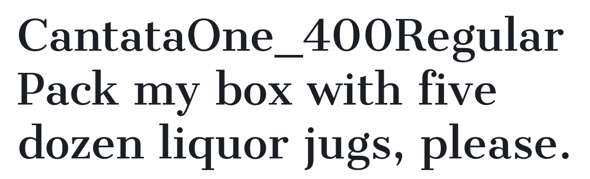](https://github.com/expo/google-fonts/tree/master/font-packages/cantata-one#readme)||||
### [Cutive](https://github.com/expo/google-fonts/tree/master/font-packages/cutive#readme)

||||
|-|-|-|
|||||
### [Economica](https://github.com/expo/google-fonts/tree/master/font-packages/economica#readme)

||||
|-|-|-|
|||||
|||||
### [Emilys Candy](https://github.com/expo/google-fonts/tree/master/font-packages/emilys-candy#readme)

||||
|-|-|-|
|||||
### [Mystery Quest](https://github.com/expo/google-fonts/tree/master/font-packages/mystery-quest#readme)

||||
|-|-|-|
|||||
### [Oswald](https://github.com/expo/google-fonts/tree/master/font-packages/oswald#readme)

||||
|-|-|-|
|[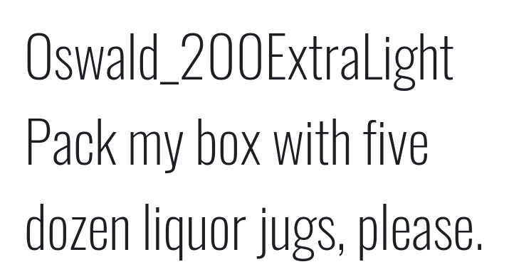](https://github.com/expo/google-fonts/tree/master/font-packages/oswald#readme)||||
|||||
### [PT Mono](https://github.com/expo/google-fonts/tree/master/font-packages/pt-mono#readme)

||||
|-|-|-|
|[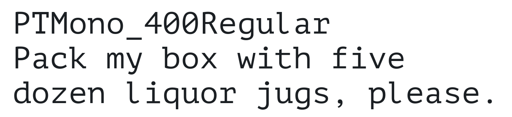](https://github.com/expo/google-fonts/tree/master/font-packages/pt-mono#readme)||||
### [Poiret One](https://github.com/expo/google-fonts/tree/master/font-packages/poiret-one#readme)

||||
|-|-|-|
|[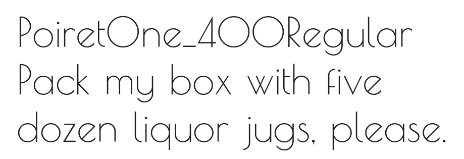](https://github.com/expo/google-fonts/tree/master/font-packages/poiret-one#readme)||||
### [Prosto One](https://github.com/expo/google-fonts/tree/master/font-packages/prosto-one#readme)

||||
|-|-|-|
|||||
### [Seaweed Script](https://github.com/expo/google-fonts/tree/master/font-packages/seaweed-script#readme)

||||
|-|-|-|
|[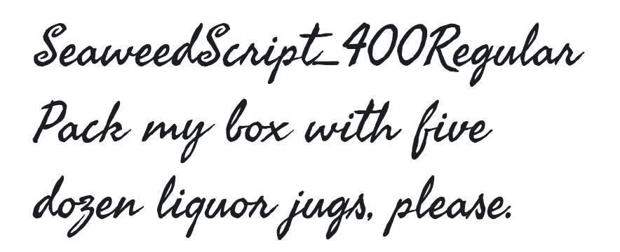](https://github.com/expo/google-fonts/tree/master/font-packages/seaweed-script#readme)||||
### [Doppio One](https://github.com/expo/google-fonts/tree/master/font-packages/doppio-one#readme)

||||
|-|-|-|
|||||
### [Glass Antiqua](https://github.com/expo/google-fonts/tree/master/font-packages/glass-antiqua#readme)

||||
|-|-|-|
|[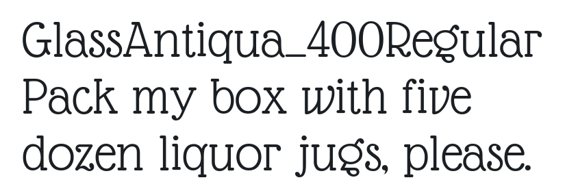](https://github.com/expo/google-fonts/tree/master/font-packages/glass-antiqua#readme)||||
### [Henny Penny](https://github.com/expo/google-fonts/tree/master/font-packages/henny-penny#readme)

||||
|-|-|-|
|[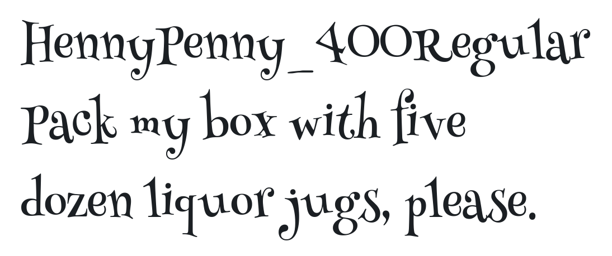](https://github.com/expo/google-fonts/tree/master/font-packages/henny-penny#readme)||||
### [Krona One](https://github.com/expo/google-fonts/tree/master/font-packages/krona-one#readme)

||||
|-|-|-|
|||||
### [Ledger](https://github.com/expo/google-fonts/tree/master/font-packages/ledger#readme)

||||
|-|-|-|
|[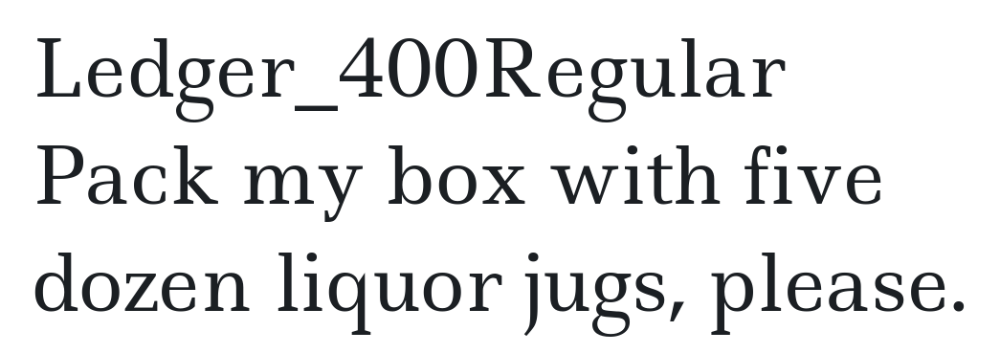](https://github.com/expo/google-fonts/tree/master/font-packages/ledger#readme)||||
### [Sevillana](https://github.com/expo/google-fonts/tree/master/font-packages/sevillana#readme)

||||
|-|-|-|
|||||
### [Shadows Into Light Two](https://github.com/expo/google-fonts/tree/master/font-packages/shadows-into-light-two#readme)

||||
|-|-|-|
|[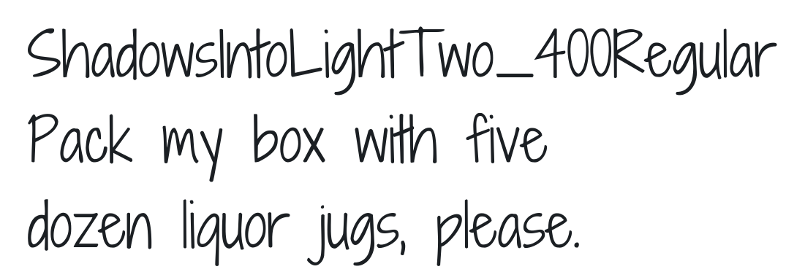](https://github.com/expo/google-fonts/tree/master/font-packages/shadows-into-light-two#readme)||||
### [Voces](https://github.com/expo/google-fonts/tree/master/font-packages/voces#readme)

||||
|-|-|-|
|||||
### [Butterfly Kids](https://github.com/expo/google-fonts/tree/master/font-packages/butterfly-kids#readme)

||||
|-|-|-|
|[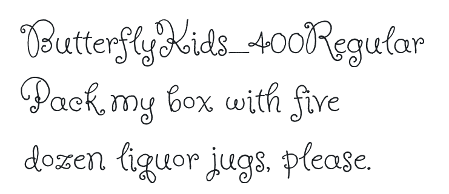](https://github.com/expo/google-fonts/tree/master/font-packages/butterfly-kids#readme)||||
### [Princess Sofia](https://github.com/expo/google-fonts/tree/master/font-packages/princess-sofia#readme)

||||
|-|-|-|
|||||
### [Quattrocento Sans](https://github.com/expo/google-fonts/tree/master/font-packages/quattrocento-sans#readme)

||||
|-|-|-|
||[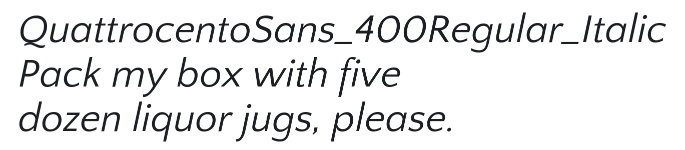](https://github.com/expo/google-fonts/tree/master/font-packages/quattrocento-sans#readme)|||
|||||
### [Stint Ultra Expanded](https://github.com/expo/google-fonts/tree/master/font-packages/stint-ultra-expanded#readme)

||||
|-|-|-|
|||||
### [Allura](https://github.com/expo/google-fonts/tree/master/font-packages/allura#readme)

||||
|-|-|-|
|||||
### [Euphoria Script](https://github.com/expo/google-fonts/tree/master/font-packages/euphoria-script#readme)

||||
|-|-|-|
|||||
### [Ewert](https://github.com/expo/google-fonts/tree/master/font-packages/ewert#readme)

||||
|-|-|-|
|||||
### [Exo](https://github.com/expo/google-fonts/tree/master/font-packages/exo#readme)

||||
|-|-|-|
||[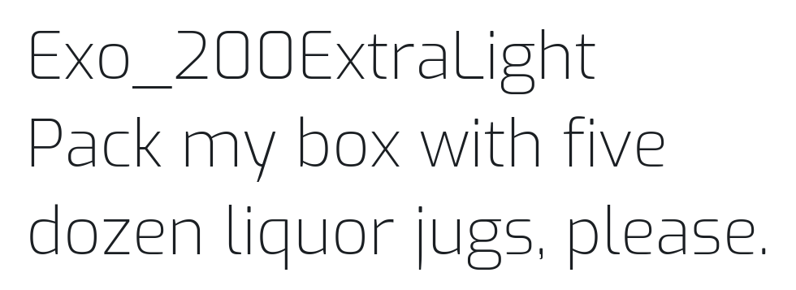](https://github.com/expo/google-fonts/tree/master/font-packages/exo#readme)|[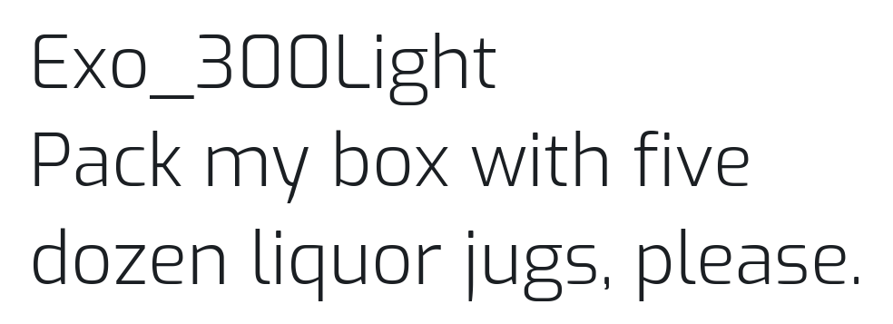](https://github.com/expo/google-fonts/tree/master/font-packages/exo#readme)||
|||||
||[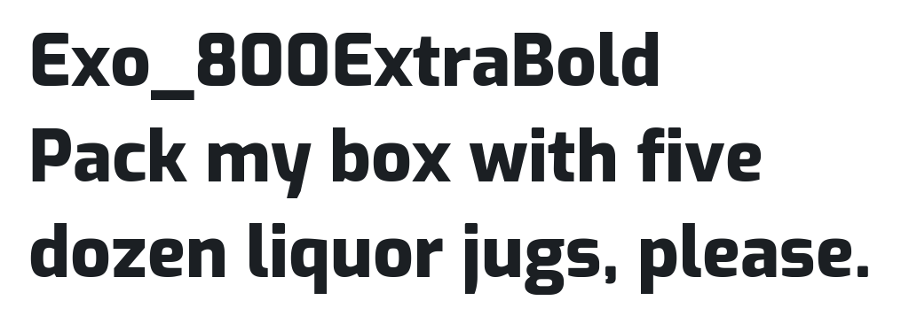](https://github.com/expo/google-fonts/tree/master/font-packages/exo#readme)|||
||[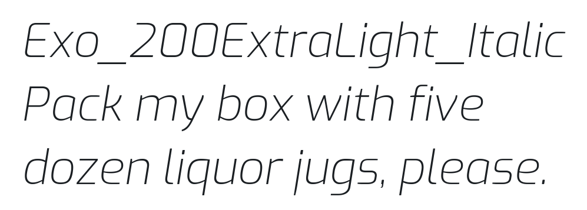](https://github.com/expo/google-fonts/tree/master/font-packages/exo#readme)|||
|||||
|||||
### [Felipa](https://github.com/expo/google-fonts/tree/master/font-packages/felipa#readme)

||||
|-|-|-|
|||||
### [Norican](https://github.com/expo/google-fonts/tree/master/font-packages/norican#readme)

||||
|-|-|-|
|[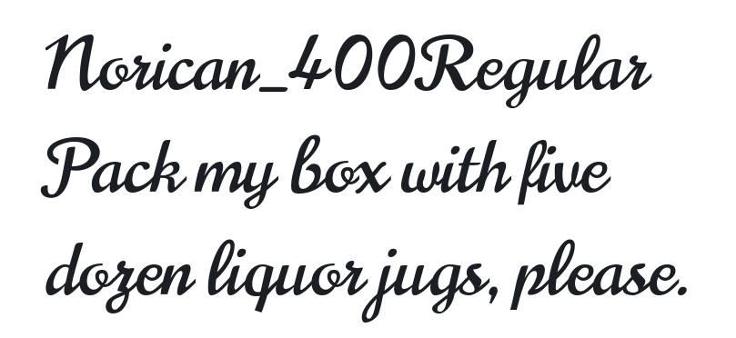](https://github.com/expo/google-fonts/tree/master/font-packages/norican#readme)||||
### [Noticia Text](https://github.com/expo/google-fonts/tree/master/font-packages/noticia-text#readme)

||||
|-|-|-|
|||||
|||||
### [Share](https://github.com/expo/google-fonts/tree/master/font-packages/share#readme)

||||
|-|-|-|
|[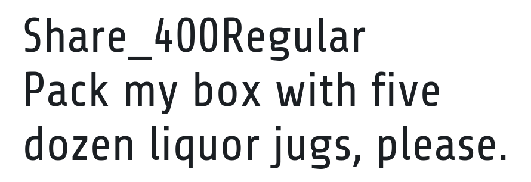](https://github.com/expo/google-fonts/tree/master/font-packages/share#readme)|[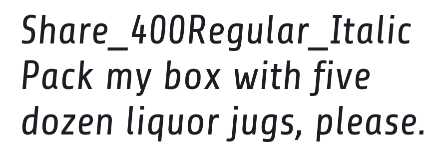](https://github.com/expo/google-fonts/tree/master/font-packages/share#readme)|||
|||||
### [Asap](https://github.com/expo/google-fonts/tree/master/font-packages/asap#readme)

||||
|-|-|-|
|[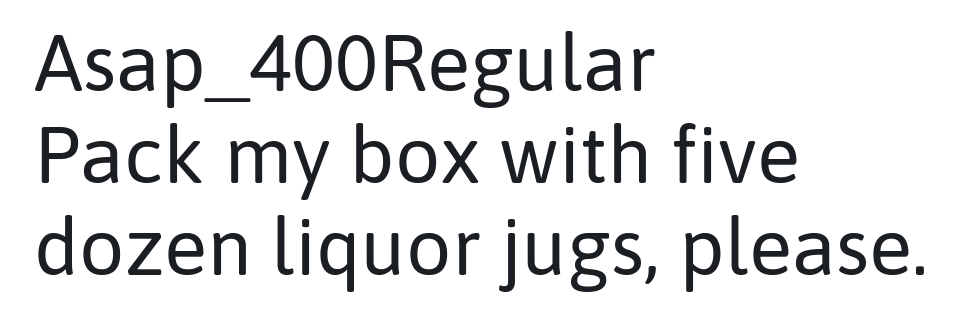](https://github.com/expo/google-fonts/tree/master/font-packages/asap#readme)||||
|||||
||[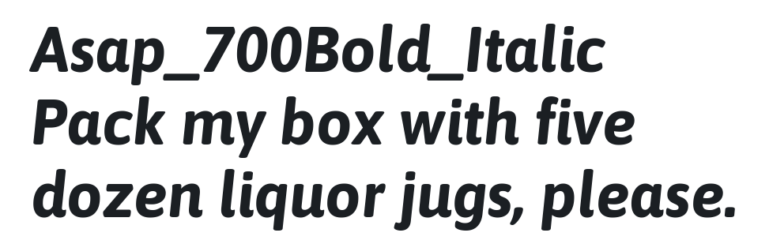](https://github.com/expo/google-fonts/tree/master/font-packages/asap#readme)|||
### [Condiment](https://github.com/expo/google-fonts/tree/master/font-packages/condiment#readme)

||||
|-|-|-|
|||||
### [Diplomata](https://github.com/expo/google-fonts/tree/master/font-packages/diplomata#readme)

||||
|-|-|-|
|||||
### [Diplomata SC](https://github.com/expo/google-fonts/tree/master/font-packages/diplomata-sc#readme)

||||
|-|-|-|
|||||
### [Glegoo](https://github.com/expo/google-fonts/tree/master/font-packages/glegoo#readme)

||||
|-|-|-|
|||||
### [Iceberg](https://github.com/expo/google-fonts/tree/master/font-packages/iceberg#readme)

||||
|-|-|-|
|||||
### [Kaushan Script](https://github.com/expo/google-fonts/tree/master/font-packages/kaushan-script#readme)

||||
|-|-|-|
|||||
### [Kotta One](https://github.com/expo/google-fonts/tree/master/font-packages/kotta-one#readme)

||||
|-|-|-|
|||||
### [Parisienne](https://github.com/expo/google-fonts/tree/master/font-packages/parisienne#readme)

||||
|-|-|-|
|||||
### [Ropa Sans](https://github.com/expo/google-fonts/tree/master/font-packages/ropa-sans#readme)

||||
|-|-|-|
|[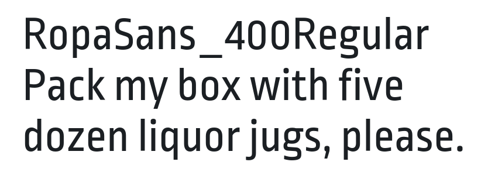](https://github.com/expo/google-fonts/tree/master/font-packages/ropa-sans#readme)||||
### [Shojumaru](https://github.com/expo/google-fonts/tree/master/font-packages/shojumaru#readme)

||||
|-|-|-|
|||||
### [Amethysta](https://github.com/expo/google-fonts/tree/master/font-packages/amethysta#readme)

||||
|-|-|-|
|[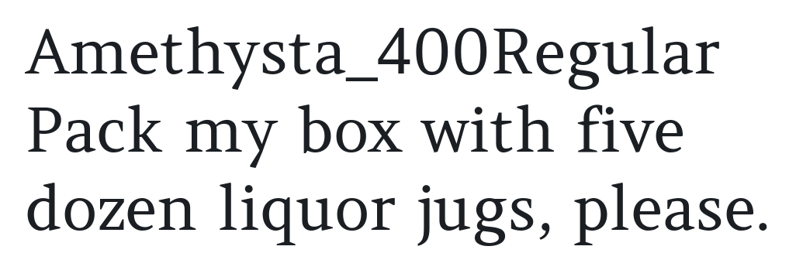](https://github.com/expo/google-fonts/tree/master/font-packages/amethysta#readme)||||
### [Emblema One](https://github.com/expo/google-fonts/tree/master/font-packages/emblema-one#readme)

||||
|-|-|-|
|||||
### [Erica One](https://github.com/expo/google-fonts/tree/master/font-packages/erica-one#readme)

||||
|-|-|-|
|||||
### [Germania One](https://github.com/expo/google-fonts/tree/master/font-packages/germania-one#readme)

||||
|-|-|-|
|||||
### [Gudea](https://github.com/expo/google-fonts/tree/master/font-packages/gudea#readme)

||||
|-|-|-|
||[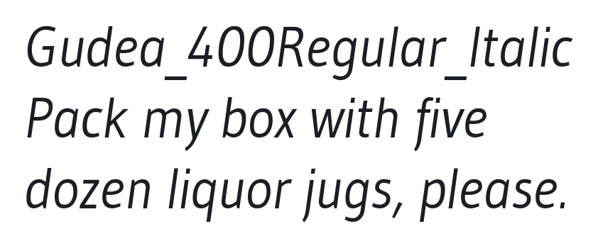](https://github.com/expo/google-fonts/tree/master/font-packages/gudea#readme)|||
### [Homenaje](https://github.com/expo/google-fonts/tree/master/font-packages/homenaje#readme)

||||
|-|-|-|
|||||
### [Junge](https://github.com/expo/google-fonts/tree/master/font-packages/junge#readme)

||||
|-|-|-|
|||||
### [Lustria](https://github.com/expo/google-fonts/tree/master/font-packages/lustria#readme)

||||
|-|-|-|
|||||
### [Macondo](https://github.com/expo/google-fonts/tree/master/font-packages/macondo#readme)

||||
|-|-|-|
|||||
### [Macondo Swash Caps](https://github.com/expo/google-fonts/tree/master/font-packages/macondo-swash-caps#readme)

||||
|-|-|-|
|||||
### [Montaga](https://github.com/expo/google-fonts/tree/master/font-packages/montaga#readme)

||||
|-|-|-|
|[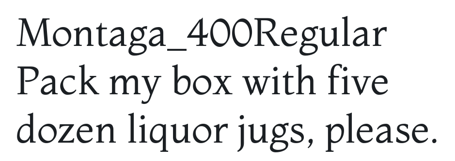](https://github.com/expo/google-fonts/tree/master/font-packages/montaga#readme)||||
### [Port Lligat Sans](https://github.com/expo/google-fonts/tree/master/font-packages/port-lligat-sans#readme)

||||
|-|-|-|
|[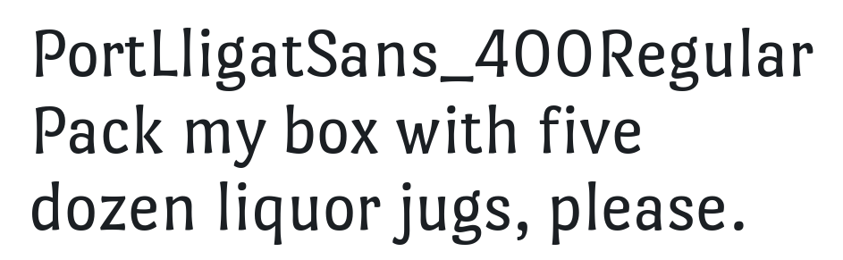](https://github.com/expo/google-fonts/tree/master/font-packages/port-lligat-sans#readme)||||
### [Port Lligat Slab](https://github.com/expo/google-fonts/tree/master/font-packages/port-lligat-slab#readme)

||||
|-|-|-|
|[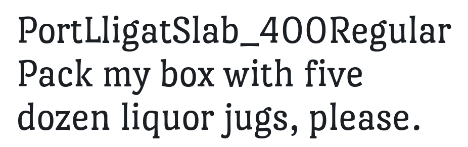](https://github.com/expo/google-fonts/tree/master/font-packages/port-lligat-slab#readme)||||
### [Scheherazade](https://github.com/expo/google-fonts/tree/master/font-packages/scheherazade#readme)

||||
|-|-|-|
|||||
### [Sirin Stencil](https://github.com/expo/google-fonts/tree/master/font-packages/sirin-stencil#readme)

||||
|-|-|-|
|||||
### [Sonsie One](https://github.com/expo/google-fonts/tree/master/font-packages/sonsie-one#readme)

||||
|-|-|-|
|||||
### [Telex](https://github.com/expo/google-fonts/tree/master/font-packages/telex#readme)

||||
|-|-|-|
|||||
### [Trochut](https://github.com/expo/google-fonts/tree/master/font-packages/trochut#readme)

||||
|-|-|-|
|||[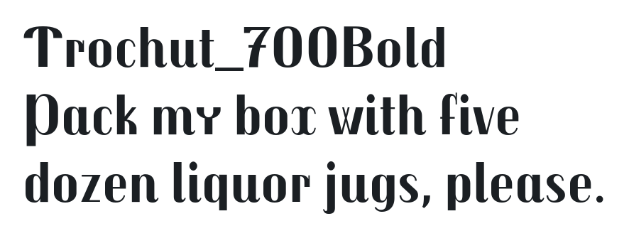](https://github.com/expo/google-fonts/tree/master/font-packages/trochut#readme)||
### [Esteban](https://github.com/expo/google-fonts/tree/master/font-packages/esteban#readme)

||||
|-|-|-|
|||||
### [Inika](https://github.com/expo/google-fonts/tree/master/font-packages/inika#readme)

||||
|-|-|-|
|[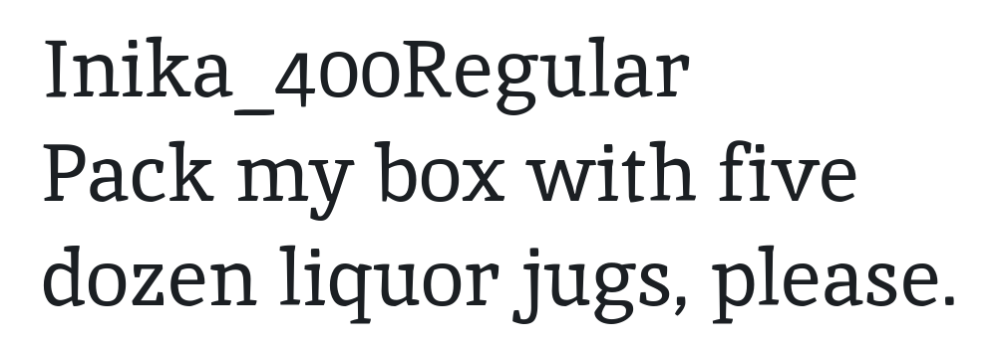](https://github.com/expo/google-fonts/tree/master/font-packages/inika#readme)||||
### [Lilita One](https://github.com/expo/google-fonts/tree/master/font-packages/lilita-one#readme)

||||
|-|-|-|
|||||
### [Lusitana](https://github.com/expo/google-fonts/tree/master/font-packages/lusitana#readme)

||||
|-|-|-|
|[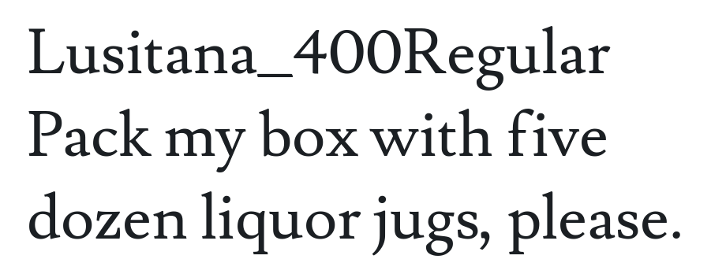](https://github.com/expo/google-fonts/tree/master/font-packages/lusitana#readme)||||
### [Magra](https://github.com/expo/google-fonts/tree/master/font-packages/magra#readme)

||||
|-|-|-|
|[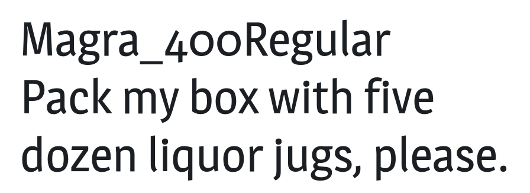](https://github.com/expo/google-fonts/tree/master/font-packages/magra#readme)||||
### [Mr Bedfort](https://github.com/expo/google-fonts/tree/master/font-packages/mr-bedfort#readme)

||||
|-|-|-|
|||||
### [Mrs Saint Delafield](https://github.com/expo/google-fonts/tree/master/font-packages/mrs-saint-delafield#readme)

||||
|-|-|-|
|[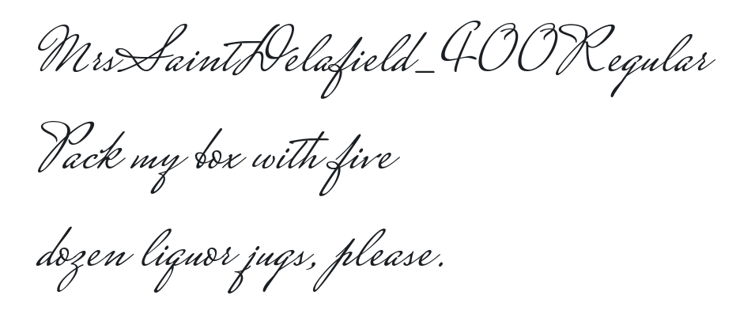](https://github.com/expo/google-fonts/tree/master/font-packages/mrs-saint-delafield#readme)||||
### [Rouge Script](https://github.com/expo/google-fonts/tree/master/font-packages/rouge-script#readme)

||||
|-|-|-|
|||||
### [Ruda](https://github.com/expo/google-fonts/tree/master/font-packages/ruda#readme)

||||
|-|-|-|
|[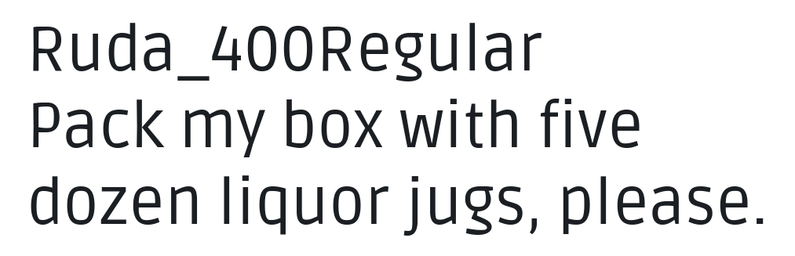](https://github.com/expo/google-fonts/tree/master/font-packages/ruda#readme)||||
|||||
### [Ruluko](https://github.com/expo/google-fonts/tree/master/font-packages/ruluko#readme)

||||
|-|-|-|
|||||
### [Titan One](https://github.com/expo/google-fonts/tree/master/font-packages/titan-one#readme)

||||
|-|-|-|
|[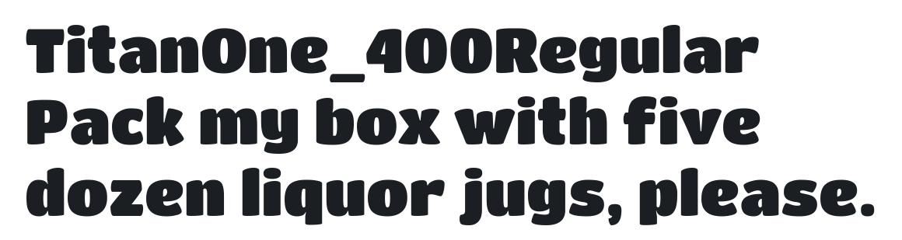](https://github.com/expo/google-fonts/tree/master/font-packages/titan-one#readme)||||
### [Wellfleet](https://github.com/expo/google-fonts/tree/master/font-packages/wellfleet#readme)

||||
|-|-|-|
|||||
### [Chelsea Market](https://github.com/expo/google-fonts/tree/master/font-packages/chelsea-market#readme)

||||
|-|-|-|
|||||
### [Jim Nightshade](https://github.com/expo/google-fonts/tree/master/font-packages/jim-nightshade#readme)

||||
|-|-|-|
|[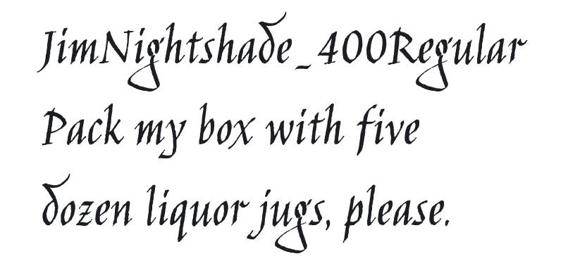](https://github.com/expo/google-fonts/tree/master/font-packages/jim-nightshade#readme)||||
### [Acme](https://github.com/expo/google-fonts/tree/master/font-packages/acme#readme)

||||
|-|-|-|
|||||
### [Alegreya](https://github.com/expo/google-fonts/tree/master/font-packages/alegreya#readme)

||||
|-|-|-|
|||[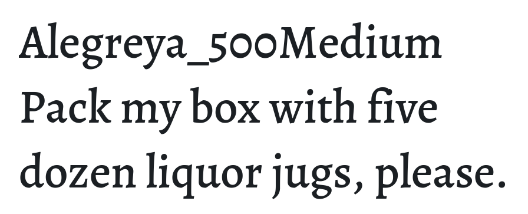](https://github.com/expo/google-fonts/tree/master/font-packages/alegreya#readme)||
||[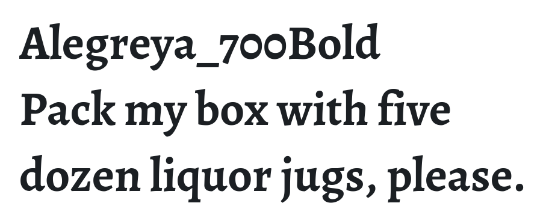](https://github.com/expo/google-fonts/tree/master/font-packages/alegreya#readme)|||
|||[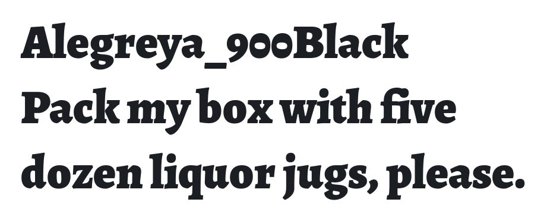](https://github.com/expo/google-fonts/tree/master/font-packages/alegreya#readme)||
|[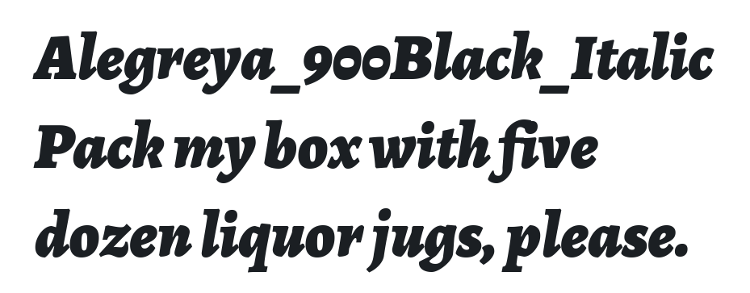](https://github.com/expo/google-fonts/tree/master/font-packages/alegreya#readme)||||
### [Alegreya SC](https://github.com/expo/google-fonts/tree/master/font-packages/alegreya-sc#readme)

||||
|-|-|-|
|||||
|||||
|||||
|||||
### [Alex Brush](https://github.com/expo/google-fonts/tree/master/font-packages/alex-brush#readme)

||||
|-|-|-|
|||||
### [Alfa Slab One](https://github.com/expo/google-fonts/tree/master/font-packages/alfa-slab-one#readme)

||||
|-|-|-|
|||||
### [Almendra](https://github.com/expo/google-fonts/tree/master/font-packages/almendra#readme)

||||
|-|-|-|
|||||
|[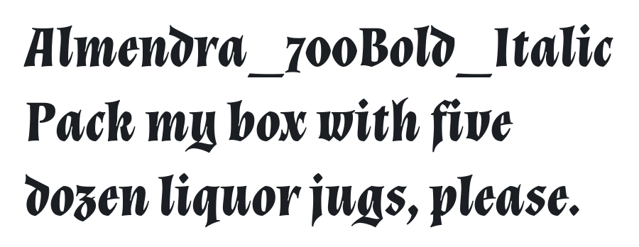](https://github.com/expo/google-fonts/tree/master/font-packages/almendra#readme)||||
### [Almendra SC](https://github.com/expo/google-fonts/tree/master/font-packages/almendra-sc#readme)

||||
|-|-|-|
|[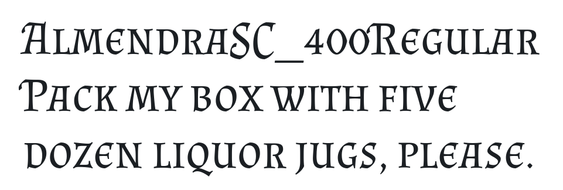](https://github.com/expo/google-fonts/tree/master/font-packages/almendra-sc#readme)||||
### [Arizonia](https://github.com/expo/google-fonts/tree/master/font-packages/arizonia#readme)

||||
|-|-|-|
|||||
### [Armata](https://github.com/expo/google-fonts/tree/master/font-packages/armata#readme)

||||
|-|-|-|
|[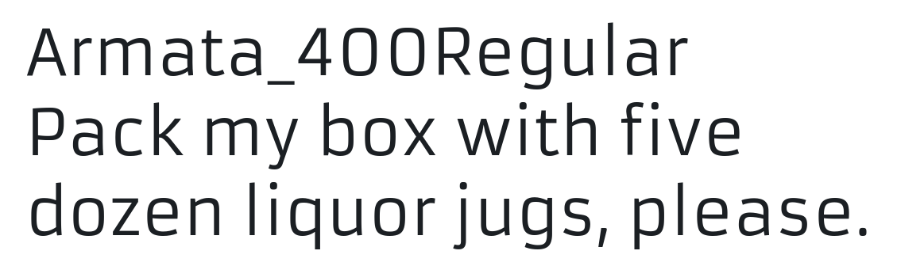](https://github.com/expo/google-fonts/tree/master/font-packages/armata#readme)||||
### [Asul](https://github.com/expo/google-fonts/tree/master/font-packages/asul#readme)

||||
|-|-|-|
|||||
### [Belgrano](https://github.com/expo/google-fonts/tree/master/font-packages/belgrano#readme)

||||
|-|-|-|
|||||
### [Bitter](https://github.com/expo/google-fonts/tree/master/font-packages/bitter#readme)

||||
|-|-|-|
||[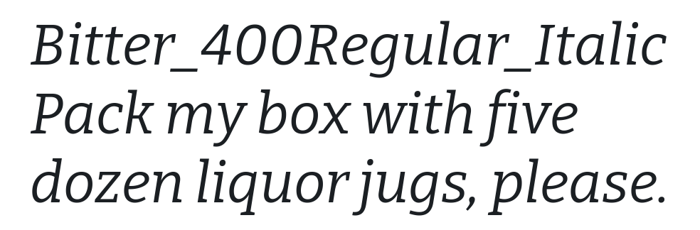](https://github.com/expo/google-fonts/tree/master/font-packages/bitter#readme)|||
### [Boogaloo](https://github.com/expo/google-fonts/tree/master/font-packages/boogaloo#readme)

||||
|-|-|-|
|||||
### [Bree Serif](https://github.com/expo/google-fonts/tree/master/font-packages/bree-serif#readme)

||||
|-|-|-|
|||||
### [Buenard](https://github.com/expo/google-fonts/tree/master/font-packages/buenard#readme)

||||
|-|-|-|
|[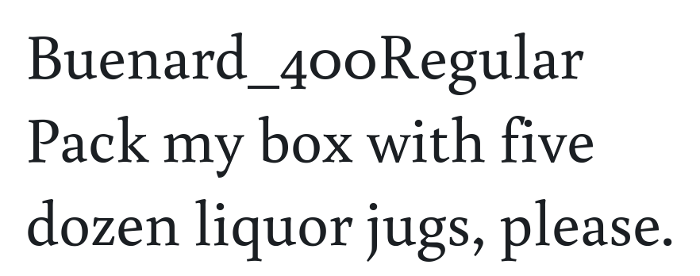](https://github.com/expo/google-fonts/tree/master/font-packages/buenard#readme)||||
### [Butcherman](https://github.com/expo/google-fonts/tree/master/font-packages/butcherman#readme)

||||
|-|-|-|
|||||
### [Caesar Dressing](https://github.com/expo/google-fonts/tree/master/font-packages/caesar-dressing#readme)

||||
|-|-|-|
|[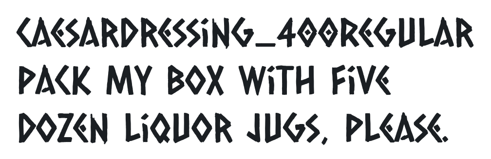](https://github.com/expo/google-fonts/tree/master/font-packages/caesar-dressing#readme)||||
### [Cambo](https://github.com/expo/google-fonts/tree/master/font-packages/cambo#readme)

||||
|-|-|-|
|||||
### [Creepster](https://github.com/expo/google-fonts/tree/master/font-packages/creepster#readme)

||||
|-|-|-|
|||||
### [Crete Round](https://github.com/expo/google-fonts/tree/master/font-packages/crete-round#readme)

||||
|-|-|-|
|||||
### [Duru Sans](https://github.com/expo/google-fonts/tree/master/font-packages/duru-sans#readme)

||||
|-|-|-|
|||||
### [Dynalight](https://github.com/expo/google-fonts/tree/master/font-packages/dynalight#readme)

||||
|-|-|-|
|||||
### [Eater](https://github.com/expo/google-fonts/tree/master/font-packages/eater#readme)

||||
|-|-|-|
|||||
### [Flamenco](https://github.com/expo/google-fonts/tree/master/font-packages/flamenco#readme)

||||
|-|-|-|
|||||
### [Flavors](https://github.com/expo/google-fonts/tree/master/font-packages/flavors#readme)

||||
|-|-|-|
|||||
### [Fredericka the Great](https://github.com/expo/google-fonts/tree/master/font-packages/fredericka-the-great#readme)

||||
|-|-|-|
|||||
### [Frijole](https://github.com/expo/google-fonts/tree/master/font-packages/frijole#readme)

||||
|-|-|-|
|||||
### [Fugaz One](https://github.com/expo/google-fonts/tree/master/font-packages/fugaz-one#readme)

||||
|-|-|-|
|||||
### [Habibi](https://github.com/expo/google-fonts/tree/master/font-packages/habibi#readme)

||||
|-|-|-|
|||||
### [Inder](https://github.com/expo/google-fonts/tree/master/font-packages/inder#readme)

||||
|-|-|-|
|[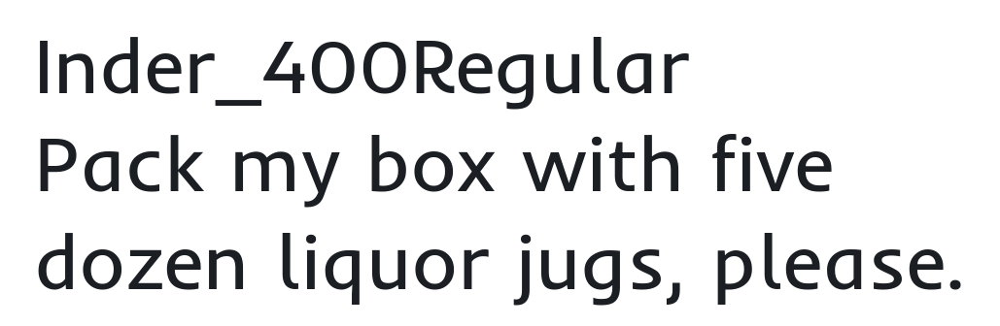](https://github.com/expo/google-fonts/tree/master/font-packages/inder#readme)||||
### [Italianno](https://github.com/expo/google-fonts/tree/master/font-packages/italianno#readme)

||||
|-|-|-|
|||||
### [Medula One](https://github.com/expo/google-fonts/tree/master/font-packages/medula-one#readme)

||||
|-|-|-|
|||||
### [Miniver](https://github.com/expo/google-fonts/tree/master/font-packages/miniver#readme)

||||
|-|-|-|
|||||
### [Nosifer](https://github.com/expo/google-fonts/tree/master/font-packages/nosifer#readme)

||||
|-|-|-|
|[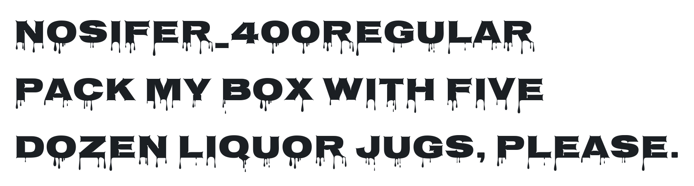](https://github.com/expo/google-fonts/tree/master/font-packages/nosifer#readme)||||
### [Oldenburg](https://github.com/expo/google-fonts/tree/master/font-packages/oldenburg#readme)

||||
|-|-|-|
|[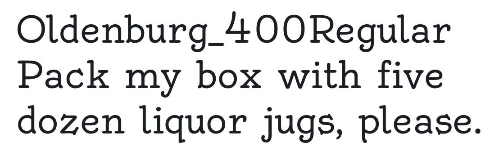](https://github.com/expo/google-fonts/tree/master/font-packages/oldenburg#readme)||||
### [Overlock](https://github.com/expo/google-fonts/tree/master/font-packages/overlock#readme)

||||
|-|-|-|
||[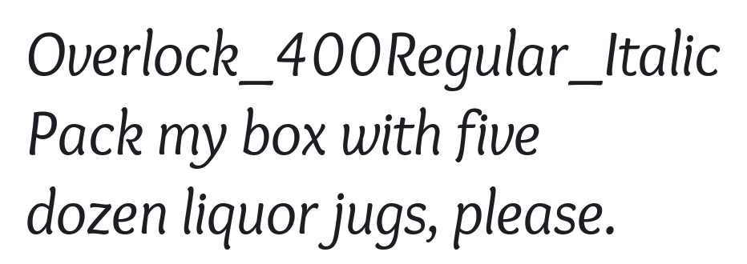](https://github.com/expo/google-fonts/tree/master/font-packages/overlock#readme)|||
|||||
### [Overlock SC](https://github.com/expo/google-fonts/tree/master/font-packages/overlock-sc#readme)

||||
|-|-|-|
|||||
### [Patua One](https://github.com/expo/google-fonts/tree/master/font-packages/patua-one#readme)

||||
|-|-|-|
|[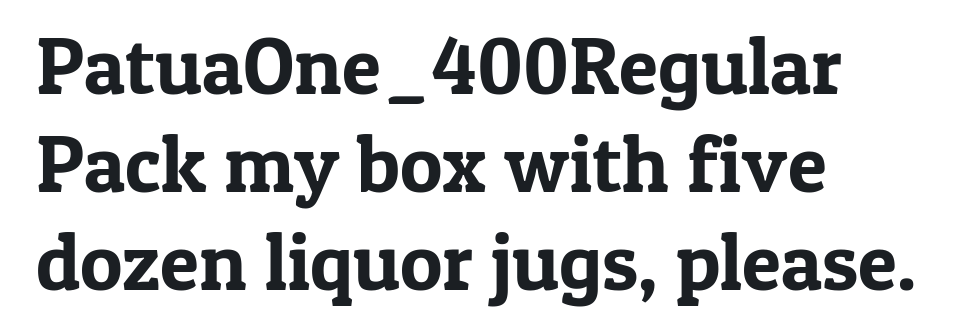](https://github.com/expo/google-fonts/tree/master/font-packages/patua-one#readme)||||
### [Playball](https://github.com/expo/google-fonts/tree/master/font-packages/playball#readme)

||||
|-|-|-|
|||||
### [Quantico](https://github.com/expo/google-fonts/tree/master/font-packages/quantico#readme)

||||
|-|-|-|
|||||
|||||
### [Qwigley](https://github.com/expo/google-fonts/tree/master/font-packages/qwigley#readme)

||||
|-|-|-|
|||||
### [Ruge Boogie](https://github.com/expo/google-fonts/tree/master/font-packages/ruge-boogie#readme)

||||
|-|-|-|
|||||
### [Ruthie](https://github.com/expo/google-fonts/tree/master/font-packages/ruthie#readme)

||||
|-|-|-|
|||||
### [Sail](https://github.com/expo/google-fonts/tree/master/font-packages/sail#readme)

||||
|-|-|-|
|[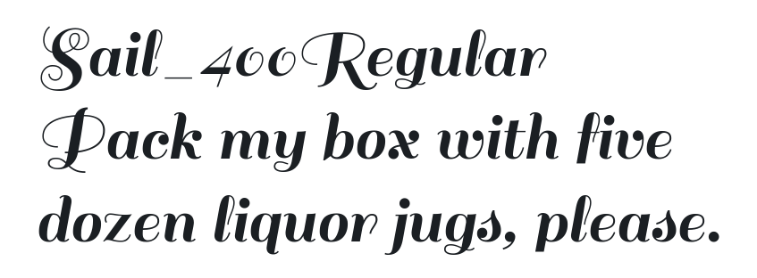](https://github.com/expo/google-fonts/tree/master/font-packages/sail#readme)||||
### [Sarina](https://github.com/expo/google-fonts/tree/master/font-packages/sarina#readme)

||||
|-|-|-|
|||||
### [Sofia](https://github.com/expo/google-fonts/tree/master/font-packages/sofia#readme)

||||
|-|-|-|
|||||
### [Trade Winds](https://github.com/expo/google-fonts/tree/master/font-packages/trade-winds#readme)

||||
|-|-|-|
|||||
### [Trykker](https://github.com/expo/google-fonts/tree/master/font-packages/trykker#readme)

||||
|-|-|-|
|||||
### [Uncial Antiqua](https://github.com/expo/google-fonts/tree/master/font-packages/uncial-antiqua#readme)

||||
|-|-|-|
|||||
### [Yesteryear](https://github.com/expo/google-fonts/tree/master/font-packages/yesteryear#readme)

||||
|-|-|-|
|||||
### [Basic](https://github.com/expo/google-fonts/tree/master/font-packages/basic#readme)

||||
|-|-|-|
|||||
### [Squada One](https://github.com/expo/google-fonts/tree/master/font-packages/squada-one#readme)

||||
|-|-|-|
|[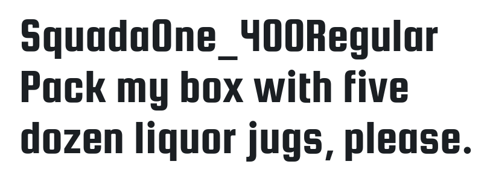](https://github.com/expo/google-fonts/tree/master/font-packages/squada-one#readme)||||
### [Bad Script](https://github.com/expo/google-fonts/tree/master/font-packages/bad-script#readme)

||||
|-|-|-|
|||||
### [Balthazar](https://github.com/expo/google-fonts/tree/master/font-packages/balthazar#readme)

||||
|-|-|-|
|||||
### [Bilbo Swash Caps](https://github.com/expo/google-fonts/tree/master/font-packages/bilbo-swash-caps#readme)

||||
|-|-|-|
|||||
### [Chango](https://github.com/expo/google-fonts/tree/master/font-packages/chango#readme)

||||
|-|-|-|
|||||
### [Enriqueta](https://github.com/expo/google-fonts/tree/master/font-packages/enriqueta#readme)

||||
|-|-|-|
|||[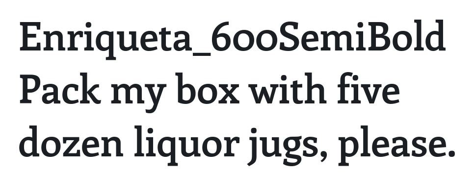](https://github.com/expo/google-fonts/tree/master/font-packages/enriqueta#readme)||
|[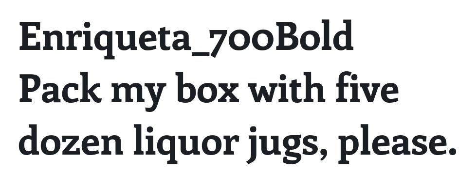](https://github.com/expo/google-fonts/tree/master/font-packages/enriqueta#readme)||||
### [Handlee](https://github.com/expo/google-fonts/tree/master/font-packages/handlee#readme)

||||
|-|-|-|
|||||
### [Marko One](https://github.com/expo/google-fonts/tree/master/font-packages/marko-one#readme)

||||
|-|-|-|
|||||
### [Montserrat](https://github.com/expo/google-fonts/tree/master/font-packages/montserrat#readme)

||||
|-|-|-|
|[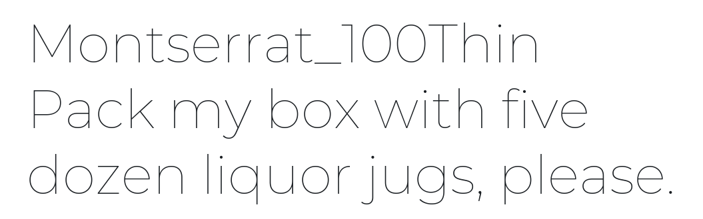](https://github.com/expo/google-fonts/tree/master/font-packages/montserrat#readme)|[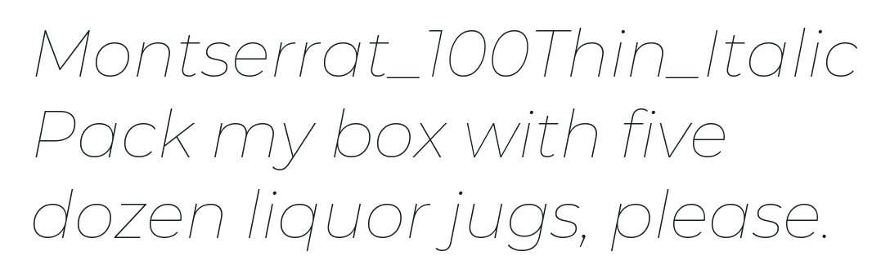](https://github.com/expo/google-fonts/tree/master/font-packages/montserrat#readme)|||
|||||
|||||
|||[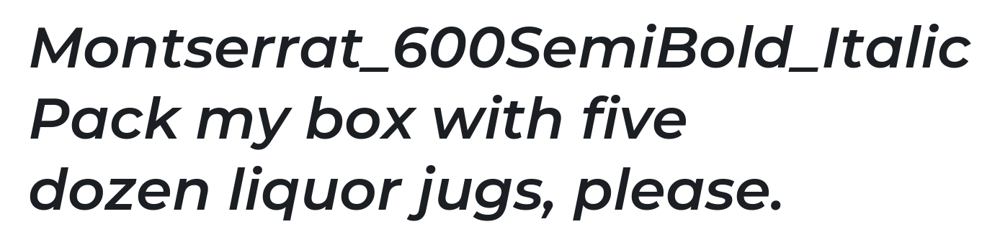](https://github.com/expo/google-fonts/tree/master/font-packages/montserrat#readme)||
||[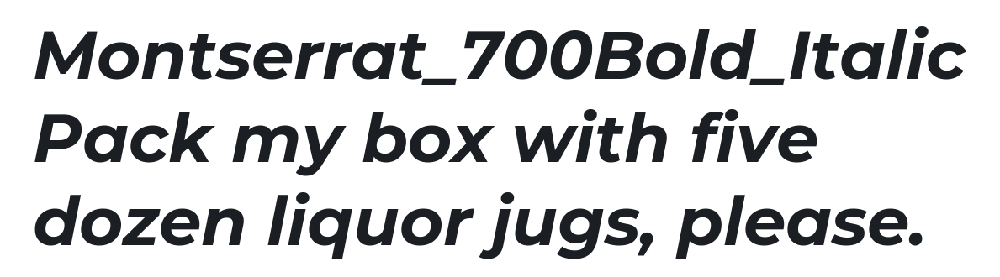](https://github.com/expo/google-fonts/tree/master/font-packages/montserrat#readme)|[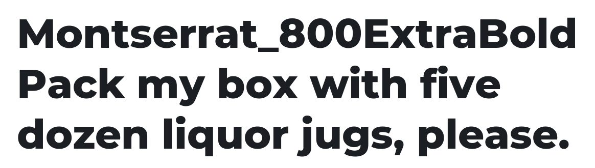](https://github.com/expo/google-fonts/tree/master/font-packages/montserrat#readme)||
|||||
### [Passion One](https://github.com/expo/google-fonts/tree/master/font-packages/passion-one#readme)

||||
|-|-|-|
|[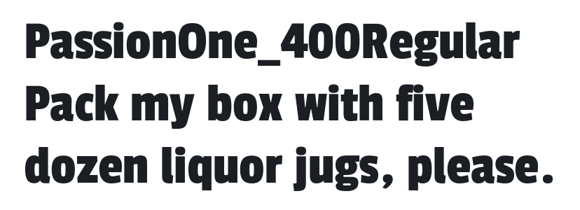](https://github.com/expo/google-fonts/tree/master/font-packages/passion-one#readme)|[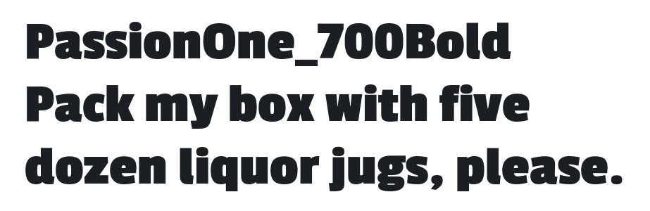](https://github.com/expo/google-fonts/tree/master/font-packages/passion-one#readme)|||
### [Plaster](https://github.com/expo/google-fonts/tree/master/font-packages/plaster#readme)

||||
|-|-|-|
|||||
### [Radley](https://github.com/expo/google-fonts/tree/master/font-packages/radley#readme)

||||
|-|-|-|
|[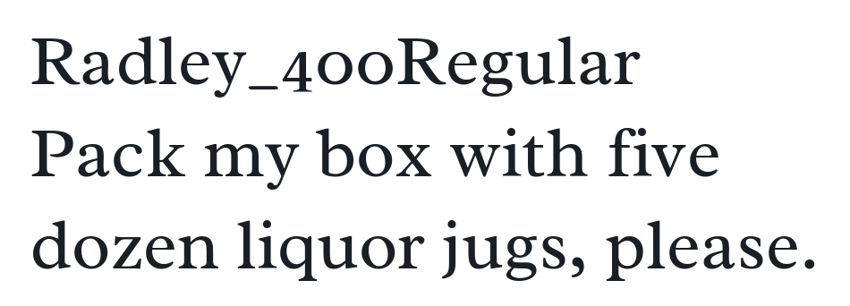](https://github.com/expo/google-fonts/tree/master/font-packages/radley#readme)||||
### [Spicy Rice](https://github.com/expo/google-fonts/tree/master/font-packages/spicy-rice#readme)

||||
|-|-|-|
|||||
### [Arbutus](https://github.com/expo/google-fonts/tree/master/font-packages/arbutus#readme)

||||
|-|-|-|
|[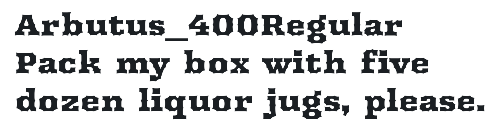](https://github.com/expo/google-fonts/tree/master/font-packages/arbutus#readme)||||
### [Baumans](https://github.com/expo/google-fonts/tree/master/font-packages/baumans#readme)

||||
|-|-|-|
|[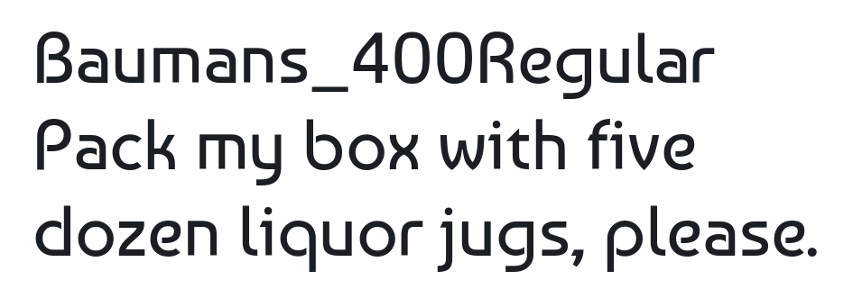](https://github.com/expo/google-fonts/tree/master/font-packages/baumans#readme)||||
### [Bilbo](https://github.com/expo/google-fonts/tree/master/font-packages/bilbo#readme)

||||
|-|-|-|
|[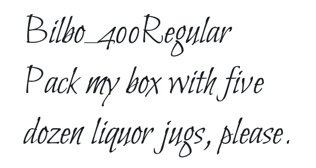](https://github.com/expo/google-fonts/tree/master/font-packages/bilbo#readme)||||
### [Bonbon](https://github.com/expo/google-fonts/tree/master/font-packages/bonbon#readme)

||||
|-|-|-|
|||||
### [Ceviche One](https://github.com/expo/google-fonts/tree/master/font-packages/ceviche-one#readme)

||||
|-|-|-|
|||||
### [Chivo](https://github.com/expo/google-fonts/tree/master/font-packages/chivo#readme)

||||
|-|-|-|
|||||
|||||
|||||
### [Electrolize](https://github.com/expo/google-fonts/tree/master/font-packages/electrolize#readme)

||||
|-|-|-|
|||||
### [Engagement](https://github.com/expo/google-fonts/tree/master/font-packages/engagement#readme)

||||
|-|-|-|
|||||
### [Fascinate](https://github.com/expo/google-fonts/tree/master/font-packages/fascinate#readme)

||||
|-|-|-|
|||||
### [Fascinate Inline](https://github.com/expo/google-fonts/tree/master/font-packages/fascinate-inline#readme)

||||
|-|-|-|
|||||
### [Fresca](https://github.com/expo/google-fonts/tree/master/font-packages/fresca#readme)

||||
|-|-|-|
|||||
### [Galdeano](https://github.com/expo/google-fonts/tree/master/font-packages/galdeano#readme)

||||
|-|-|-|
|[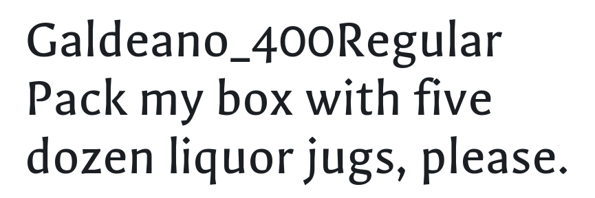](https://github.com/expo/google-fonts/tree/master/font-packages/galdeano#readme)||||
### [Marmelad](https://github.com/expo/google-fonts/tree/master/font-packages/marmelad#readme)

||||
|-|-|-|
|||||
### [Metamorphous](https://github.com/expo/google-fonts/tree/master/font-packages/metamorphous#readme)

||||
|-|-|-|
|[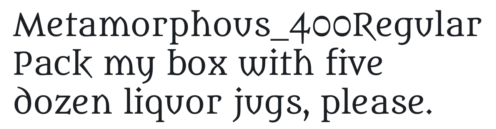](https://github.com/expo/google-fonts/tree/master/font-packages/metamorphous#readme)||||
### [Original Surfer](https://github.com/expo/google-fonts/tree/master/font-packages/original-surfer#readme)

||||
|-|-|-|
|||||
### [Stint Ultra Condensed](https://github.com/expo/google-fonts/tree/master/font-packages/stint-ultra-condensed#readme)

||||
|-|-|-|
|||||
### [Viga](https://github.com/expo/google-fonts/tree/master/font-packages/viga#readme)

||||
|-|-|-|
|||||
### [Unkempt](https://github.com/expo/google-fonts/tree/master/font-packages/unkempt#readme)

||||
|-|-|-|
|||||
### [Aguafina Script](https://github.com/expo/google-fonts/tree/master/font-packages/aguafina-script#readme)

||||
|-|-|-|
|[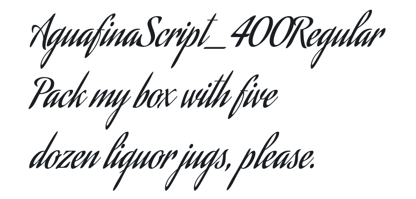](https://github.com/expo/google-fonts/tree/master/font-packages/aguafina-script#readme)||||
### [Aladin](https://github.com/expo/google-fonts/tree/master/font-packages/aladin#readme)

||||
|-|-|-|
|||||
### [Cabin Condensed](https://github.com/expo/google-fonts/tree/master/font-packages/cabin-condensed#readme)

||||
|-|-|-|
|||||
|||||
### [Cagliostro](https://github.com/expo/google-fonts/tree/master/font-packages/cagliostro#readme)

||||
|-|-|-|
|[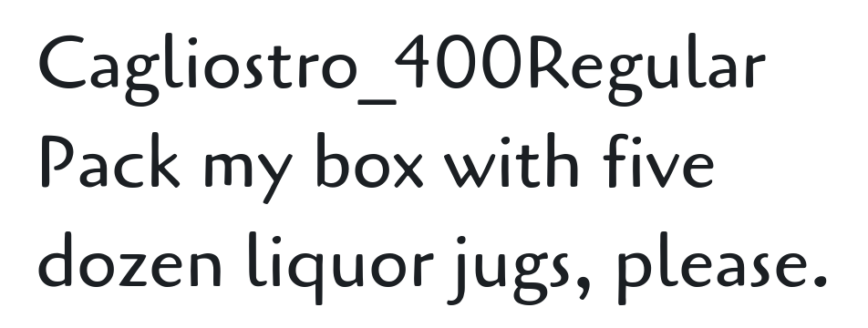](https://github.com/expo/google-fonts/tree/master/font-packages/cagliostro#readme)||||
### [Changa One](https://github.com/expo/google-fonts/tree/master/font-packages/changa-one#readme)

||||
|-|-|-|
|||||
### [Chicle](https://github.com/expo/google-fonts/tree/master/font-packages/chicle#readme)

||||
|-|-|-|
|||||
### [Dr Sugiyama](https://github.com/expo/google-fonts/tree/master/font-packages/dr-sugiyama#readme)

||||
|-|-|-|
|[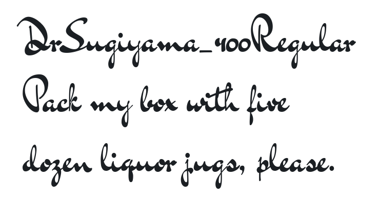](https://github.com/expo/google-fonts/tree/master/font-packages/dr-sugiyama#readme)||||
### [Herr Von Muellerhoff](https://github.com/expo/google-fonts/tree/master/font-packages/herr-von-muellerhoff#readme)

||||
|-|-|-|
|||||
### [Lemon](https://github.com/expo/google-fonts/tree/master/font-packages/lemon#readme)

||||
|-|-|-|
|||||
### [Miss Fajardose](https://github.com/expo/google-fonts/tree/master/font-packages/miss-fajardose#readme)

||||
|-|-|-|
|||||
### [Monsieur La Doulaise](https://github.com/expo/google-fonts/tree/master/font-packages/monsieur-la-doulaise#readme)

||||
|-|-|-|
|||||
### [Mr Dafoe](https://github.com/expo/google-fonts/tree/master/font-packages/mr-dafoe#readme)

||||
|-|-|-|
|[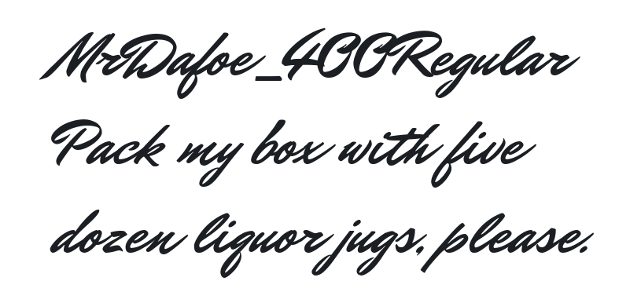](https://github.com/expo/google-fonts/tree/master/font-packages/mr-dafoe#readme)||||
### [Mr De Haviland](https://github.com/expo/google-fonts/tree/master/font-packages/mr-de-haviland#readme)

||||
|-|-|-|
|||||
### [Mrs Sheppards](https://github.com/expo/google-fonts/tree/master/font-packages/mrs-sheppards#readme)

||||
|-|-|-|
|||||
### [Piedra](https://github.com/expo/google-fonts/tree/master/font-packages/piedra#readme)

||||
|-|-|-|
|||||
### [Unlock](https://github.com/expo/google-fonts/tree/master/font-packages/unlock#readme)

||||
|-|-|-|
|||||
### [Bubblegum Sans](https://github.com/expo/google-fonts/tree/master/font-packages/bubblegum-sans#readme)

||||
|-|-|-|
|||||
### [Concert One](https://github.com/expo/google-fonts/tree/master/font-packages/concert-one#readme)

||||
|-|-|-|
|||||
### [Iceland](https://github.com/expo/google-fonts/tree/master/font-packages/iceland#readme)

||||
|-|-|-|
|[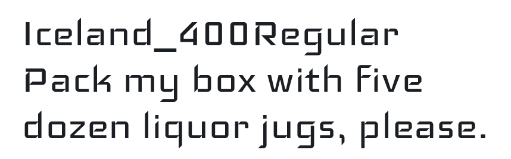](https://github.com/expo/google-fonts/tree/master/font-packages/iceland#readme)||||
### [Knewave](https://github.com/expo/google-fonts/tree/master/font-packages/knewave#readme)

||||
|-|-|-|
|[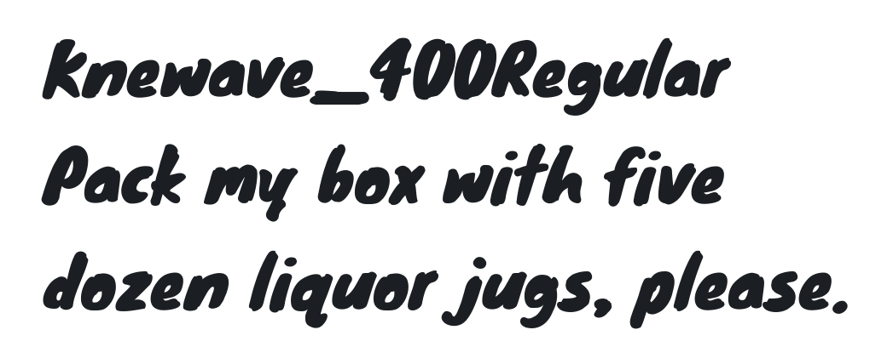](https://github.com/expo/google-fonts/tree/master/font-packages/knewave#readme)||||
### [Niconne](https://github.com/expo/google-fonts/tree/master/font-packages/niconne#readme)

||||
|-|-|-|
|||||
### [Ribeye](https://github.com/expo/google-fonts/tree/master/font-packages/ribeye#readme)

||||
|-|-|-|
|[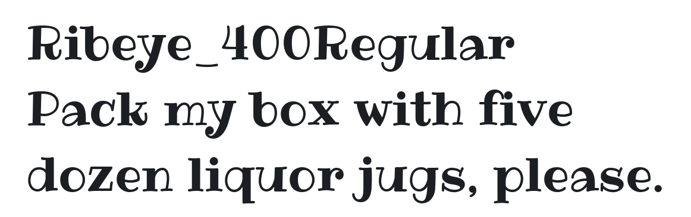](https://github.com/expo/google-fonts/tree/master/font-packages/ribeye#readme)||||
### [Ribeye Marrow](https://github.com/expo/google-fonts/tree/master/font-packages/ribeye-marrow#readme)

||||
|-|-|-|
|||||
### [Righteous](https://github.com/expo/google-fonts/tree/master/font-packages/righteous#readme)

||||
|-|-|-|
|||||
### [Signika](https://github.com/expo/google-fonts/tree/master/font-packages/signika#readme)

||||
|-|-|-|
|[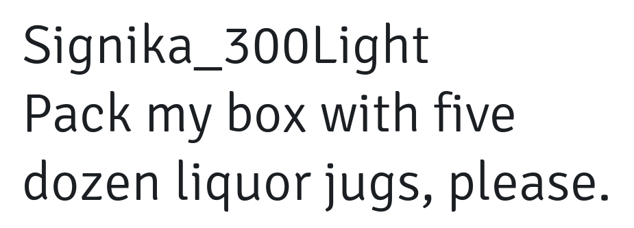](https://github.com/expo/google-fonts/tree/master/font-packages/signika#readme)||||
|[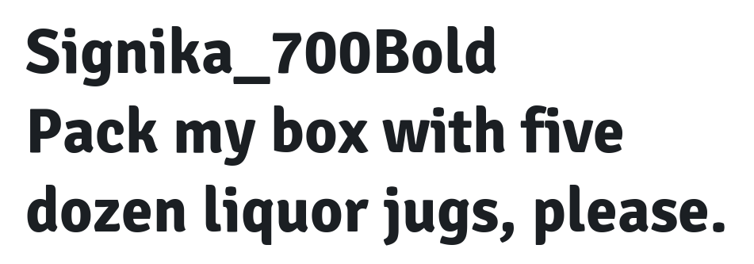](https://github.com/expo/google-fonts/tree/master/font-packages/signika#readme)||||
### [Signika Negative](https://github.com/expo/google-fonts/tree/master/font-packages/signika-negative#readme)

||||
|-|-|-|
|[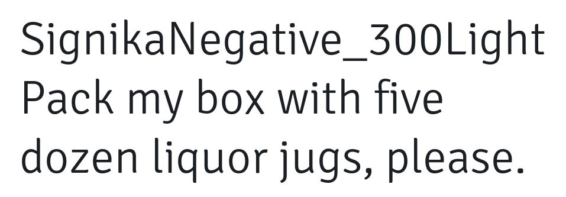](https://github.com/expo/google-fonts/tree/master/font-packages/signika-negative#readme)||[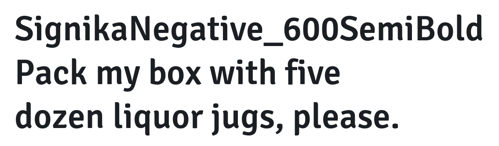](https://github.com/expo/google-fonts/tree/master/font-packages/signika-negative#readme)||
|[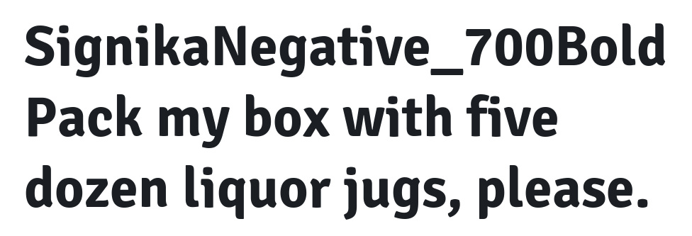](https://github.com/expo/google-fonts/tree/master/font-packages/signika-negative#readme)||||
### [Spirax](https://github.com/expo/google-fonts/tree/master/font-packages/spirax#readme)

||||
|-|-|-|
|||||
### [Devonshire](https://github.com/expo/google-fonts/tree/master/font-packages/devonshire#readme)

||||
|-|-|-|
|||||
### [Fondamento](https://github.com/expo/google-fonts/tree/master/font-packages/fondamento#readme)

||||
|-|-|-|
|||||
### [Playfair Display](https://github.com/expo/google-fonts/tree/master/font-packages/playfair-display#readme)

||||
|-|-|-|
|||[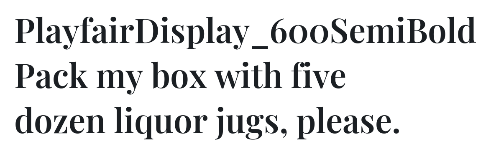](https://github.com/expo/google-fonts/tree/master/font-packages/playfair-display#readme)||
||[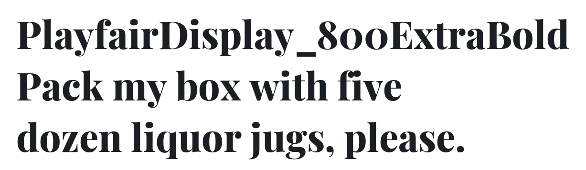](https://github.com/expo/google-fonts/tree/master/font-packages/playfair-display#readme)|||
|[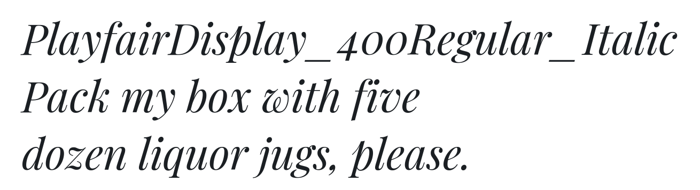](https://github.com/expo/google-fonts/tree/master/font-packages/playfair-display#readme)||||
|||||
### [Convergence](https://github.com/expo/google-fonts/tree/master/font-packages/convergence#readme)

||||
|-|-|-|
|||||
### [Nokora](https://github.com/expo/google-fonts/tree/master/font-packages/nokora#readme)

||||
|-|-|-|
|||||
### [Arapey](https://github.com/expo/google-fonts/tree/master/font-packages/arapey#readme)

||||
|-|-|-|
|[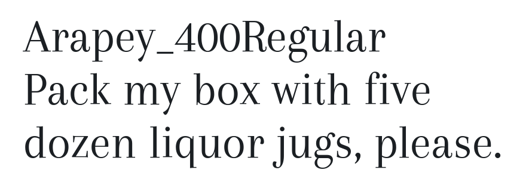](https://github.com/expo/google-fonts/tree/master/font-packages/arapey#readme)|[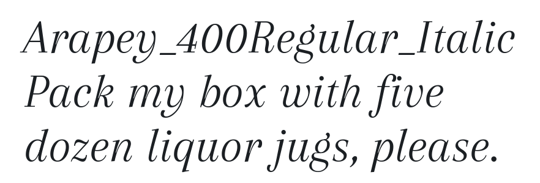](https://github.com/expo/google-fonts/tree/master/font-packages/arapey#readme)|||
### [Fjord One](https://github.com/expo/google-fonts/tree/master/font-packages/fjord-one#readme)

||||
|-|-|-|
|||||
### [Lancelot](https://github.com/expo/google-fonts/tree/master/font-packages/lancelot#readme)

||||
|-|-|-|
|||||
### [Mate](https://github.com/expo/google-fonts/tree/master/font-packages/mate#readme)

||||
|-|-|-|
|||||
### [Mate SC](https://github.com/expo/google-fonts/tree/master/font-packages/mate-sc#readme)

||||
|-|-|-|
|||||
### [Petrona](https://github.com/expo/google-fonts/tree/master/font-packages/petrona#readme)

||||
|-|-|-|
|||||
### [Poly](https://github.com/expo/google-fonts/tree/master/font-packages/poly#readme)

||||
|-|-|-|
||[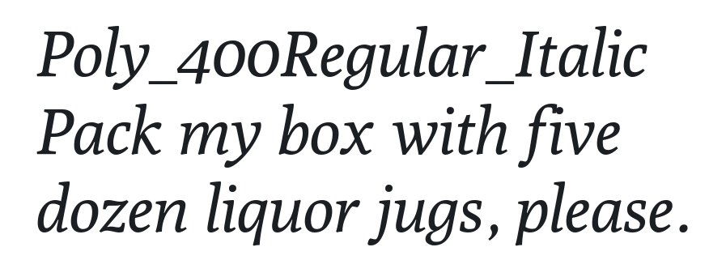](https://github.com/expo/google-fonts/tree/master/font-packages/poly#readme)|||
### [Rammetto One](https://github.com/expo/google-fonts/tree/master/font-packages/rammetto-one#readme)

||||
|-|-|-|
|||||
### [Supermercado One](https://github.com/expo/google-fonts/tree/master/font-packages/supermercado-one#readme)

||||
|-|-|-|
|||||
### [Atomic Age](https://github.com/expo/google-fonts/tree/master/font-packages/atomic-age#readme)

||||
|-|-|-|
|||||
### [Contrail One](https://github.com/expo/google-fonts/tree/master/font-packages/contrail-one#readme)

||||
|-|-|-|
|||||
### [Jockey One](https://github.com/expo/google-fonts/tree/master/font-packages/jockey-one#readme)

||||
|-|-|-|
|||||
### [Linden Hill](https://github.com/expo/google-fonts/tree/master/font-packages/linden-hill#readme)

||||
|-|-|-|
|||||
### [Quicksand](https://github.com/expo/google-fonts/tree/master/font-packages/quicksand#readme)

||||
|-|-|-|
|||||
|[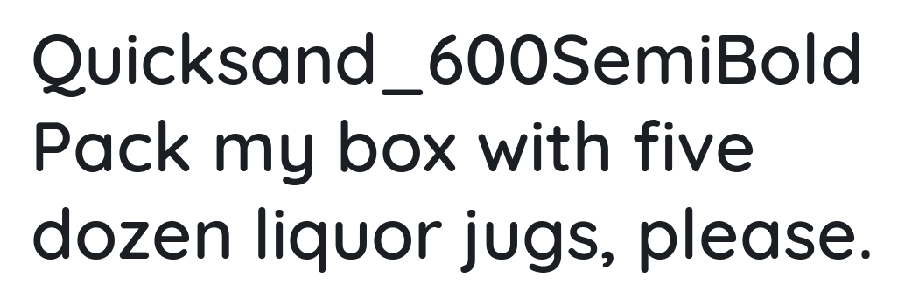](https://github.com/expo/google-fonts/tree/master/font-packages/quicksand#readme)||||
### [Amatic SC](https://github.com/expo/google-fonts/tree/master/font-packages/amatic-sc#readme)

||||
|-|-|-|
||[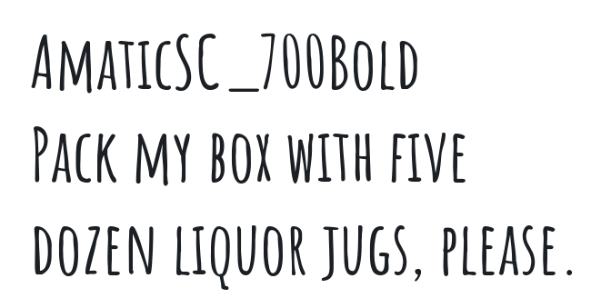](https://github.com/expo/google-fonts/tree/master/font-packages/amatic-sc#readme)|||
### [Cookie](https://github.com/expo/google-fonts/tree/master/font-packages/cookie#readme)

||||
|-|-|-|
|||||
### [Delius Unicase](https://github.com/expo/google-fonts/tree/master/font-packages/delius-unicase#readme)

||||
|-|-|-|
|||||
### [Marck Script](https://github.com/expo/google-fonts/tree/master/font-packages/marck-script#readme)

||||
|-|-|-|
|[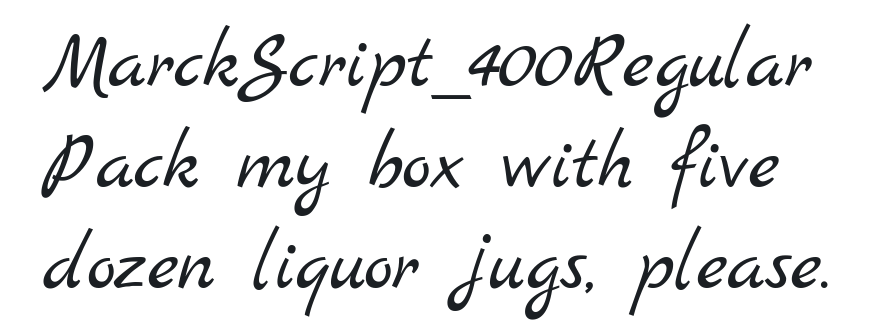](https://github.com/expo/google-fonts/tree/master/font-packages/marck-script#readme)||||
### [Pinyon Script](https://github.com/expo/google-fonts/tree/master/font-packages/pinyon-script#readme)

||||
|-|-|-|
|||||
### [Rancho](https://github.com/expo/google-fonts/tree/master/font-packages/rancho#readme)

||||
|-|-|-|
|||||
### [Salsa](https://github.com/expo/google-fonts/tree/master/font-packages/salsa#readme)

||||
|-|-|-|
|||||
### [Sancreek](https://github.com/expo/google-fonts/tree/master/font-packages/sancreek#readme)

||||
|-|-|-|
|||||
### [Satisfy](https://github.com/expo/google-fonts/tree/master/font-packages/satisfy#readme)

||||
|-|-|-|
|||||
### [Vast Shadow](https://github.com/expo/google-fonts/tree/master/font-packages/vast-shadow#readme)

||||
|-|-|-|
|||||
### [Andada](https://github.com/expo/google-fonts/tree/master/font-packages/andada#readme)

||||
|-|-|-|
|||||
### [Federant](https://github.com/expo/google-fonts/tree/master/font-packages/federant#readme)

||||
|-|-|-|
|||||
### [Gochi Hand](https://github.com/expo/google-fonts/tree/master/font-packages/gochi-hand#readme)

||||
|-|-|-|
|||||
### [Ubuntu Condensed](https://github.com/expo/google-fonts/tree/master/font-packages/ubuntu-condensed#readme)

||||
|-|-|-|
|||||
### [Ubuntu Mono](https://github.com/expo/google-fonts/tree/master/font-packages/ubuntu-mono#readme)

||||
|-|-|-|
|[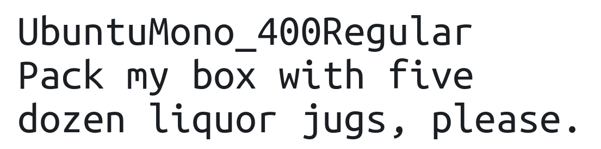](https://github.com/expo/google-fonts/tree/master/font-packages/ubuntu-mono#readme)||||
|||||
### [Alike Angular](https://github.com/expo/google-fonts/tree/master/font-packages/alike-angular#readme)

||||
|-|-|-|
|[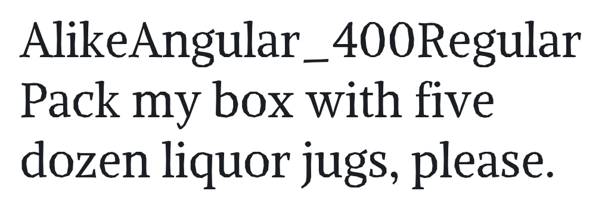](https://github.com/expo/google-fonts/tree/master/font-packages/alike-angular#readme)||||
### [Poller One](https://github.com/expo/google-fonts/tree/master/font-packages/poller-one#readme)

||||
|-|-|-|
|[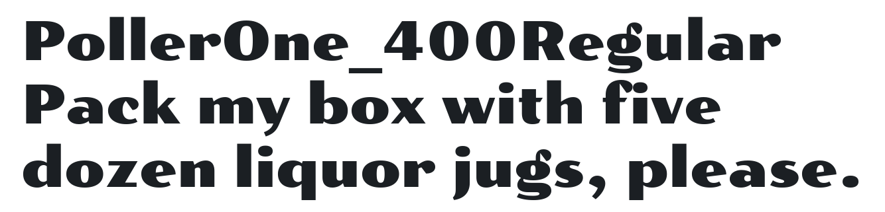](https://github.com/expo/google-fonts/tree/master/font-packages/poller-one#readme)||||
### [Spinnaker](https://github.com/expo/google-fonts/tree/master/font-packages/spinnaker#readme)

||||
|-|-|-|
|[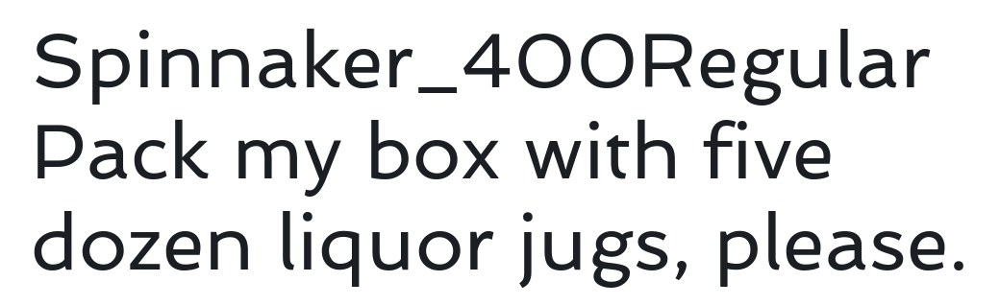](https://github.com/expo/google-fonts/tree/master/font-packages/spinnaker#readme)||||
### [Adamina](https://github.com/expo/google-fonts/tree/master/font-packages/adamina#readme)

||||
|-|-|-|
|||||
### [Cardo](https://github.com/expo/google-fonts/tree/master/font-packages/cardo#readme)

||||
|-|-|-|
|||||
### [Julee](https://github.com/expo/google-fonts/tree/master/font-packages/julee#readme)

||||
|-|-|-|
|||||
### [Merienda One](https://github.com/expo/google-fonts/tree/master/font-packages/merienda-one#readme)

||||
|-|-|-|
|||||
### [Prata](https://github.com/expo/google-fonts/tree/master/font-packages/prata#readme)

||||
|-|-|-|
|||||
### [Rosario](https://github.com/expo/google-fonts/tree/master/font-packages/rosario#readme)

||||
|-|-|-|
|||[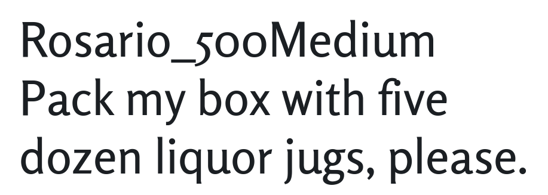](https://github.com/expo/google-fonts/tree/master/font-packages/rosario#readme)||
|[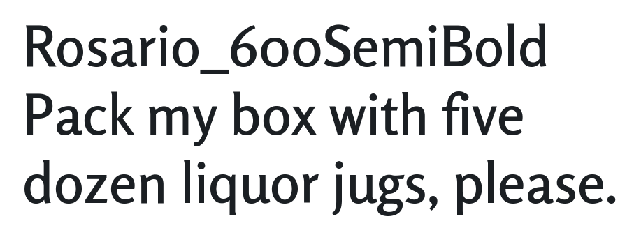](https://github.com/expo/google-fonts/tree/master/font-packages/rosario#readme)||[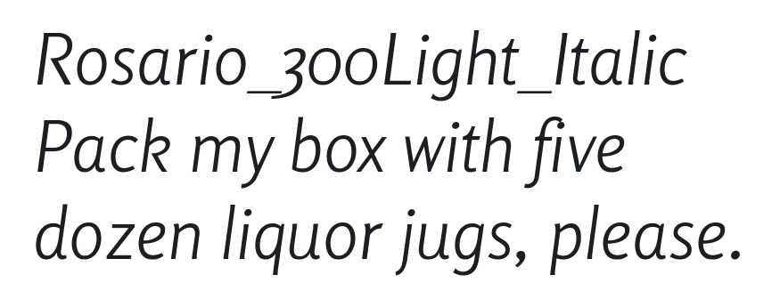](https://github.com/expo/google-fonts/tree/master/font-packages/rosario#readme)||
|||||
|[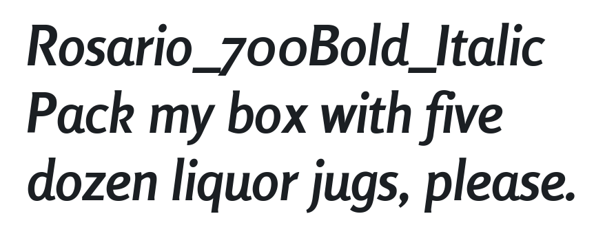](https://github.com/expo/google-fonts/tree/master/font-packages/rosario#readme)||||
### [Sorts Mill Goudy](https://github.com/expo/google-fonts/tree/master/font-packages/sorts-mill-goudy#readme)

||||
|-|-|-|
|[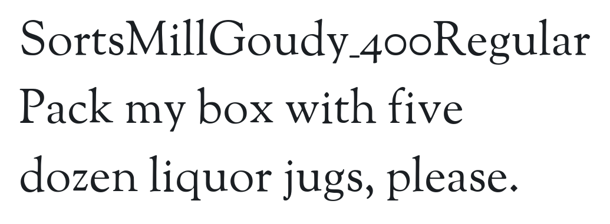](https://github.com/expo/google-fonts/tree/master/font-packages/sorts-mill-goudy#readme)||||
### [Abril Fatface](https://github.com/expo/google-fonts/tree/master/font-packages/abril-fatface#readme)

||||
|-|-|-|
|||||
### [Antic](https://github.com/expo/google-fonts/tree/master/font-packages/antic#readme)

||||
|-|-|-|
|||||
### [Dorsa](https://github.com/expo/google-fonts/tree/master/font-packages/dorsa#readme)

||||
|-|-|-|
|||||
### [Fanwood Text](https://github.com/expo/google-fonts/tree/master/font-packages/fanwood-text#readme)

||||
|-|-|-|
|||||
### [Passero One](https://github.com/expo/google-fonts/tree/master/font-packages/passero-one#readme)

||||
|-|-|-|
|||||
### [Philosopher](https://github.com/expo/google-fonts/tree/master/font-packages/philosopher#readme)

||||
|-|-|-|
|||||
|||||
### [Prociono](https://github.com/expo/google-fonts/tree/master/font-packages/prociono#readme)

||||
|-|-|-|
|||||
### [Alike](https://github.com/expo/google-fonts/tree/master/font-packages/alike#readme)

||||
|-|-|-|
|||||
### [Monoton](https://github.com/expo/google-fonts/tree/master/font-packages/monoton#readme)

||||
|-|-|-|
|||||
### [Aldrich](https://github.com/expo/google-fonts/tree/master/font-packages/aldrich#readme)

||||
|-|-|-|
|[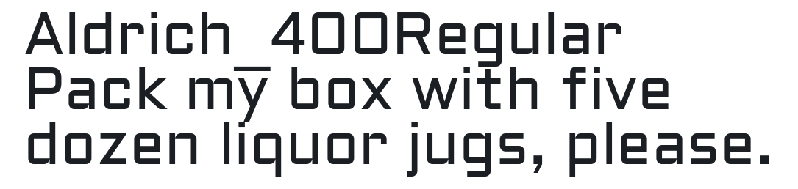](https://github.com/expo/google-fonts/tree/master/font-packages/aldrich#readme)||||
### [Days One](https://github.com/expo/google-fonts/tree/master/font-packages/days-one#readme)

||||
|-|-|-|
|||||
### [Gentium Book Basic](https://github.com/expo/google-fonts/tree/master/font-packages/gentium-book-basic#readme)

||||
|-|-|-|
|||||
|||||
### [Montez](https://github.com/expo/google-fonts/tree/master/font-packages/montez#readme)

||||
|-|-|-|
|||||
### [Numans](https://github.com/expo/google-fonts/tree/master/font-packages/numans#readme)

||||
|-|-|-|
|||||
### [Short Stack](https://github.com/expo/google-fonts/tree/master/font-packages/short-stack#readme)

||||
|-|-|-|
|||||
### [Vidaloka](https://github.com/expo/google-fonts/tree/master/font-packages/vidaloka#readme)

||||
|-|-|-|
|||||
### [Volkhov](https://github.com/expo/google-fonts/tree/master/font-packages/volkhov#readme)

||||
|-|-|-|
||[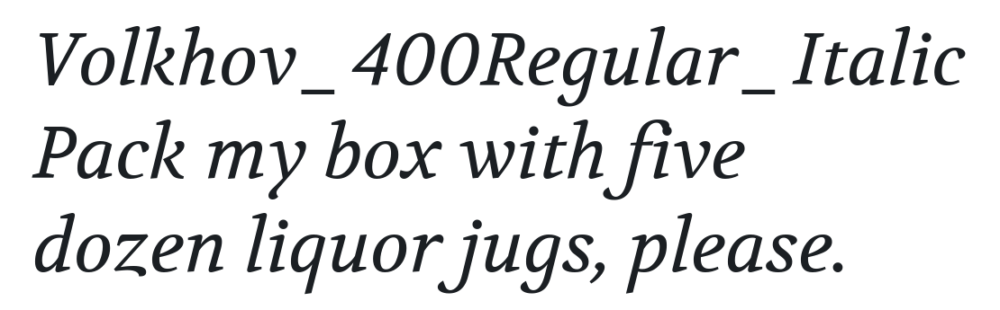](https://github.com/expo/google-fonts/tree/master/font-packages/volkhov#readme)|||
|||||
### [Voltaire](https://github.com/expo/google-fonts/tree/master/font-packages/voltaire#readme)

||||
|-|-|-|
|||||
### [Alice](https://github.com/expo/google-fonts/tree/master/font-packages/alice#readme)

||||
|-|-|-|
|||||
### [Andika](https://github.com/expo/google-fonts/tree/master/font-packages/andika#readme)

||||
|-|-|-|
|||||
### [Comfortaa](https://github.com/expo/google-fonts/tree/master/font-packages/comfortaa#readme)

||||
|-|-|-|
|||||
|||||
### [Coustard](https://github.com/expo/google-fonts/tree/master/font-packages/coustard#readme)

||||
|-|-|-|
||[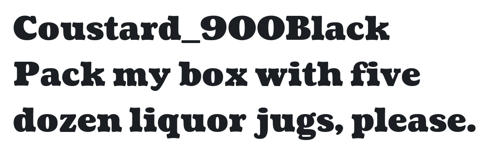](https://github.com/expo/google-fonts/tree/master/font-packages/coustard#readme)|||
### [Geostar](https://github.com/expo/google-fonts/tree/master/font-packages/geostar#readme)

||||
|-|-|-|
|||||
### [Geostar Fill](https://github.com/expo/google-fonts/tree/master/font-packages/geostar-fill#readme)

||||
|-|-|-|
|||||
### [Questrial](https://github.com/expo/google-fonts/tree/master/font-packages/questrial#readme)

||||
|-|-|-|
|||||
### [Abel](https://github.com/expo/google-fonts/tree/master/font-packages/abel#readme)

||||
|-|-|-|
|[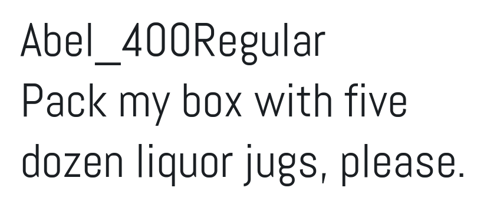](https://github.com/expo/google-fonts/tree/master/font-packages/abel#readme)||||
### [Actor](https://github.com/expo/google-fonts/tree/master/font-packages/actor#readme)

||||
|-|-|-|
|||||
### [Delius Swash Caps](https://github.com/expo/google-fonts/tree/master/font-packages/delius-swash-caps#readme)

||||
|-|-|-|
|||||
### [Marvel](https://github.com/expo/google-fonts/tree/master/font-packages/marvel#readme)

||||
|-|-|-|
|||[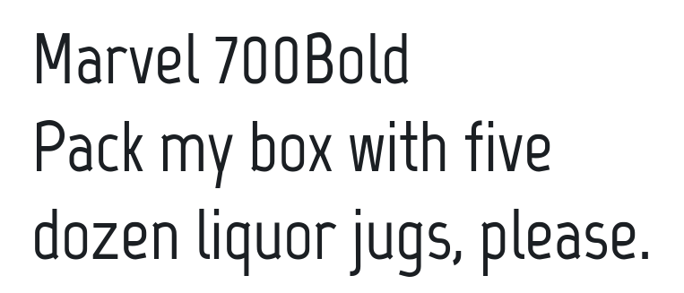](https://github.com/expo/google-fonts/tree/master/font-packages/marvel#readme)||
|||||
### [Rationale](https://github.com/expo/google-fonts/tree/master/font-packages/rationale#readme)

||||
|-|-|-|
|||||
### [Rochester](https://github.com/expo/google-fonts/tree/master/font-packages/rochester#readme)

||||
|-|-|-|
|||||
### [Smokum](https://github.com/expo/google-fonts/tree/master/font-packages/smokum#readme)

||||
|-|-|-|
|||||
### [Tulpen One](https://github.com/expo/google-fonts/tree/master/font-packages/tulpen-one#readme)

||||
|-|-|-|
|||||
### [Aubrey](https://github.com/expo/google-fonts/tree/master/font-packages/aubrey#readme)

||||
|-|-|-|
|||||
### [Black Ops One](https://github.com/expo/google-fonts/tree/master/font-packages/black-ops-one#readme)

||||
|-|-|-|
|||||
### [Carme](https://github.com/expo/google-fonts/tree/master/font-packages/carme#readme)

||||
|-|-|-|
|||||
### [Delius](https://github.com/expo/google-fonts/tree/master/font-packages/delius#readme)

||||
|-|-|-|
|||||
### [Federo](https://github.com/expo/google-fonts/tree/master/font-packages/federo#readme)

||||
|-|-|-|
|||||
### [Gloria Hallelujah](https://github.com/expo/google-fonts/tree/master/font-packages/gloria-hallelujah#readme)

||||
|-|-|-|
|||||
### [Kelly Slab](https://github.com/expo/google-fonts/tree/master/font-packages/kelly-slab#readme)

||||
|-|-|-|
|||||
### [Rokkitt](https://github.com/expo/google-fonts/tree/master/font-packages/rokkitt#readme)

||||
|-|-|-|
|||[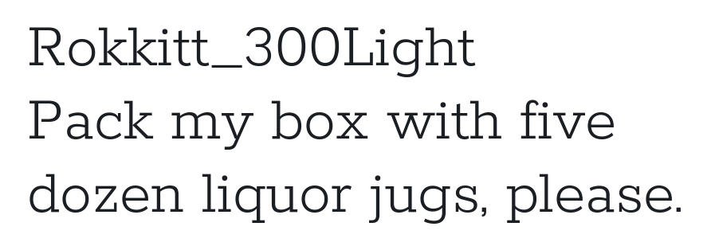](https://github.com/expo/google-fonts/tree/master/font-packages/rokkitt#readme)||
|||||
||[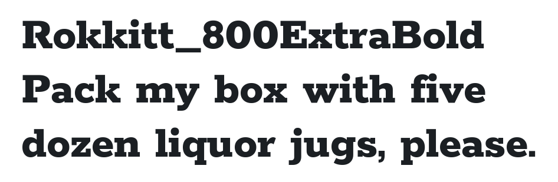](https://github.com/expo/google-fonts/tree/master/font-packages/rokkitt#readme)|[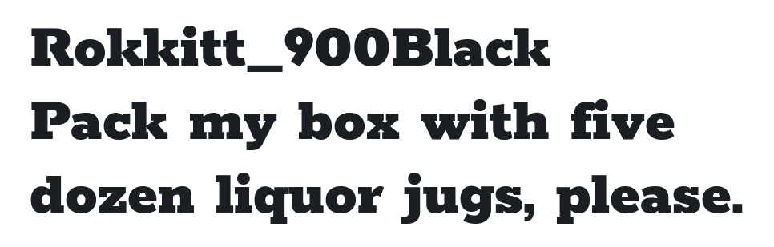](https://github.com/expo/google-fonts/tree/master/font-packages/rokkitt#readme)||
### [Tienne](https://github.com/expo/google-fonts/tree/master/font-packages/tienne#readme)

||||
|-|-|-|
|[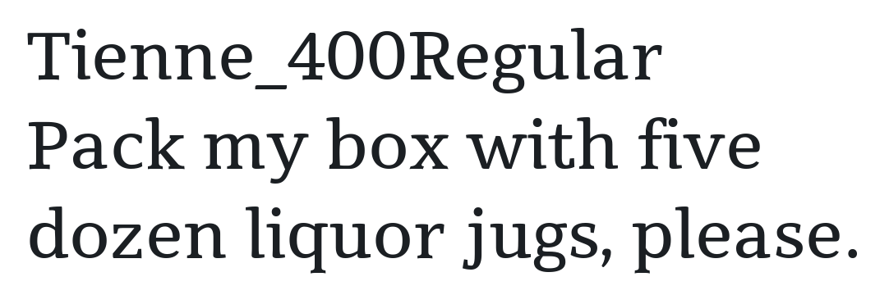](https://github.com/expo/google-fonts/tree/master/font-packages/tienne#readme)||||
### [Gentium Basic](https://github.com/expo/google-fonts/tree/master/font-packages/gentium-basic#readme)

||||
|-|-|-|
|||||
|||||
### [Leckerli One](https://github.com/expo/google-fonts/tree/master/font-packages/leckerli-one#readme)

||||
|-|-|-|
|[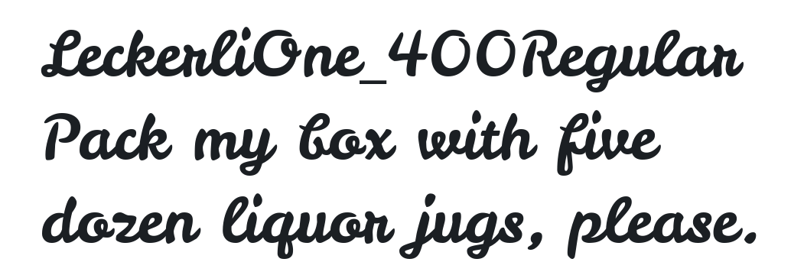](https://github.com/expo/google-fonts/tree/master/font-packages/leckerli-one#readme)||||
### [Ovo](https://github.com/expo/google-fonts/tree/master/font-packages/ovo#readme)

||||
|-|-|-|
|[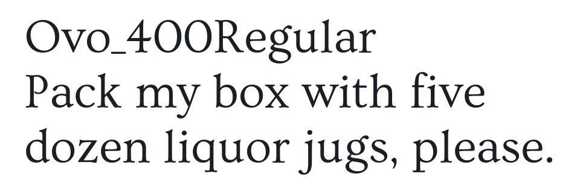](https://github.com/expo/google-fonts/tree/master/font-packages/ovo#readme)||||
### [Pompiere](https://github.com/expo/google-fonts/tree/master/font-packages/pompiere#readme)

||||
|-|-|-|
|[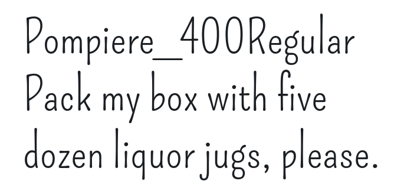](https://github.com/expo/google-fonts/tree/master/font-packages/pompiere#readme)||||
### [Snippet](https://github.com/expo/google-fonts/tree/master/font-packages/snippet#readme)

||||
|-|-|-|
|||||
### [Unna](https://github.com/expo/google-fonts/tree/master/font-packages/unna#readme)

||||
|-|-|-|
|||||
|[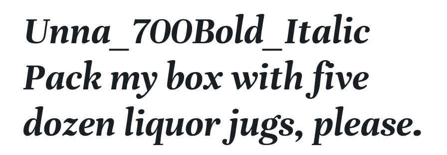](https://github.com/expo/google-fonts/tree/master/font-packages/unna#readme)||||
### [Yellowtail](https://github.com/expo/google-fonts/tree/master/font-packages/yellowtail#readme)

||||
|-|-|-|
|||||
### [Bowlby One](https://github.com/expo/google-fonts/tree/master/font-packages/bowlby-one#readme)

||||
|-|-|-|
|[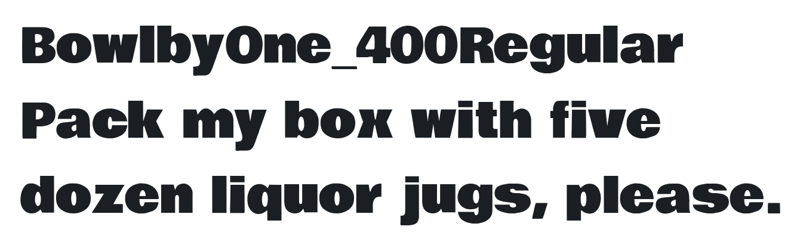](https://github.com/expo/google-fonts/tree/master/font-packages/bowlby-one#readme)||||
### [Give You Glory](https://github.com/expo/google-fonts/tree/master/font-packages/give-you-glory#readme)

||||
|-|-|-|
|||||
### [Istok Web](https://github.com/expo/google-fonts/tree/master/font-packages/istok-web#readme)

||||
|-|-|-|
||[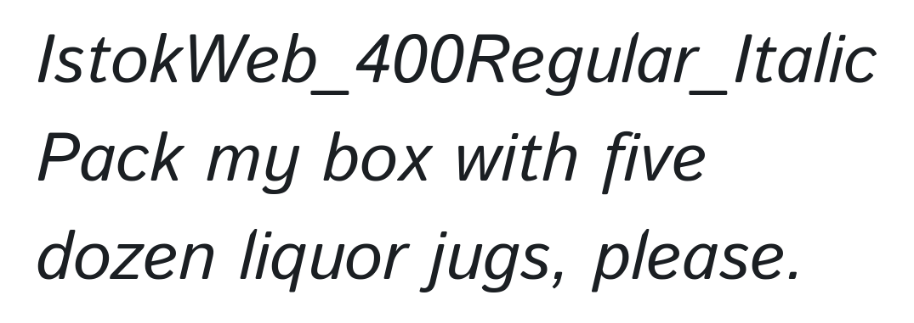](https://github.com/expo/google-fonts/tree/master/font-packages/istok-web#readme)|||
|||||
### [Modern Antiqua](https://github.com/expo/google-fonts/tree/master/font-packages/modern-antiqua#readme)

||||
|-|-|-|
|||||
### [Varela Round](https://github.com/expo/google-fonts/tree/master/font-packages/varela-round#readme)

||||
|-|-|-|
|||||
### [Yeseva One](https://github.com/expo/google-fonts/tree/master/font-packages/yeseva-one#readme)

||||
|-|-|-|
|||||
### [Bowlby One SC](https://github.com/expo/google-fonts/tree/master/font-packages/bowlby-one-sc#readme)

||||
|-|-|-|
|[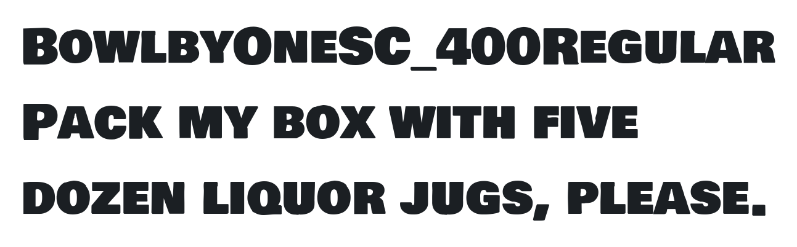](https://github.com/expo/google-fonts/tree/master/font-packages/bowlby-one-sc#readme)||||
### [Forum](https://github.com/expo/google-fonts/tree/master/font-packages/forum#readme)

||||
|-|-|-|
|||||
### [Lora](https://github.com/expo/google-fonts/tree/master/font-packages/lora#readme)

||||
|-|-|-|
||[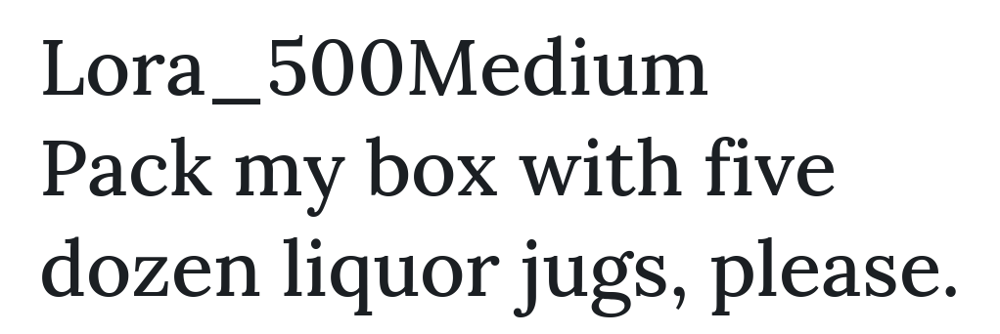](https://github.com/expo/google-fonts/tree/master/font-packages/lora#readme)|||
||[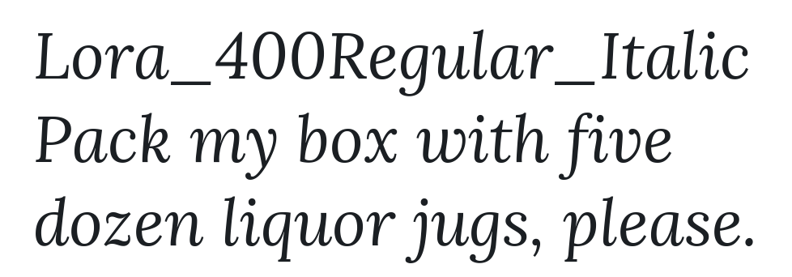](https://github.com/expo/google-fonts/tree/master/font-packages/lora#readme)|||
||[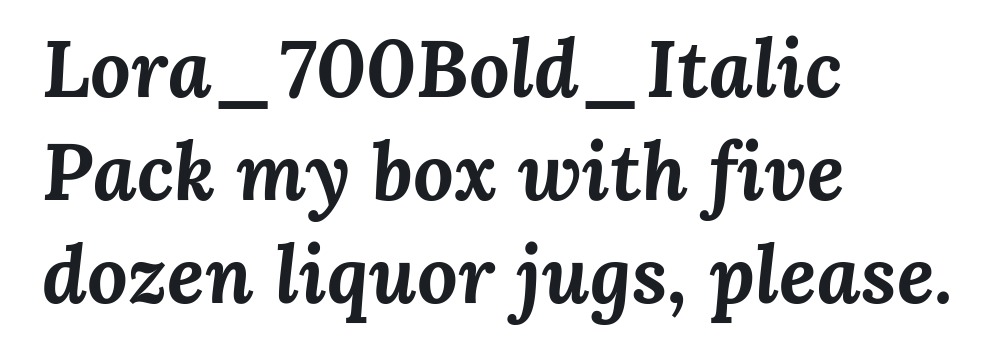](https://github.com/expo/google-fonts/tree/master/font-packages/lora#readme)|||
### [Love Ya Like A Sister](https://github.com/expo/google-fonts/tree/master/font-packages/love-ya-like-a-sister#readme)

||||
|-|-|-|
|||||
### [Loved by the King](https://github.com/expo/google-fonts/tree/master/font-packages/loved-by-the-king#readme)

||||
|-|-|-|
|||||
### [Patrick Hand](https://github.com/expo/google-fonts/tree/master/font-packages/patrick-hand#readme)

||||
|-|-|-|
|||||
### [Stardos Stencil](https://github.com/expo/google-fonts/tree/master/font-packages/stardos-stencil#readme)

||||
|-|-|-|
||[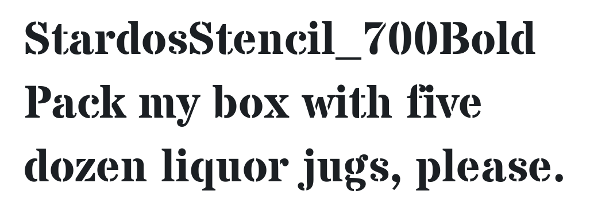](https://github.com/expo/google-fonts/tree/master/font-packages/stardos-stencil#readme)|||
### [Asset](https://github.com/expo/google-fonts/tree/master/font-packages/asset#readme)

||||
|-|-|-|
|||||
### [Goblin One](https://github.com/expo/google-fonts/tree/master/font-packages/goblin-one#readme)

||||
|-|-|-|
|[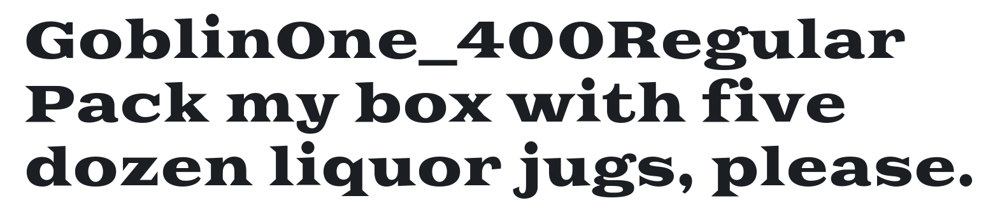](https://github.com/expo/google-fonts/tree/master/font-packages/goblin-one#readme)||||
### [Gravitas One](https://github.com/expo/google-fonts/tree/master/font-packages/gravitas-one#readme)

||||
|-|-|-|
|||||
### [Hammersmith One](https://github.com/expo/google-fonts/tree/master/font-packages/hammersmith-one#readme)

||||
|-|-|-|
|||||
### [Varela](https://github.com/expo/google-fonts/tree/master/font-packages/varela#readme)

||||
|-|-|-|
|||||
### [Lobster Two](https://github.com/expo/google-fonts/tree/master/font-packages/lobster-two#readme)

||||
|-|-|-|
|||||
|[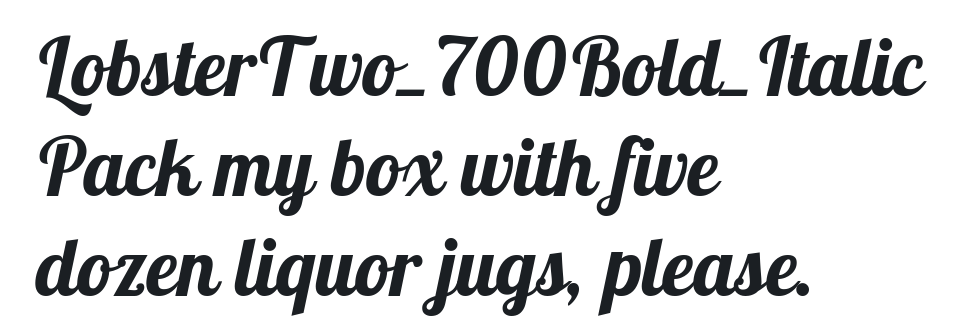](https://github.com/expo/google-fonts/tree/master/font-packages/lobster-two#readme)||||
### [Nixie One](https://github.com/expo/google-fonts/tree/master/font-packages/nixie-one#readme)

||||
|-|-|-|
|[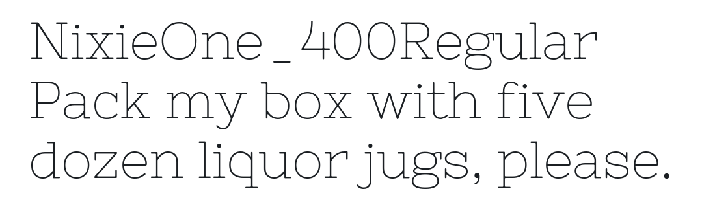](https://github.com/expo/google-fonts/tree/master/font-packages/nixie-one#readme)||||
### [Redressed](https://github.com/expo/google-fonts/tree/master/font-packages/redressed#readme)

||||
|-|-|-|
|||||
### [Cedarville Cursive](https://github.com/expo/google-fonts/tree/master/font-packages/cedarville-cursive#readme)

||||
|-|-|-|
|[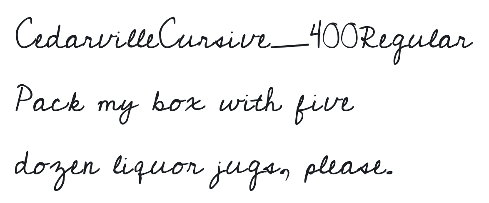](https://github.com/expo/google-fonts/tree/master/font-packages/cedarville-cursive#readme)||||
### [Kameron](https://github.com/expo/google-fonts/tree/master/font-packages/kameron#readme)

||||
|-|-|-|
|||||
### [La Belle Aurore](https://github.com/expo/google-fonts/tree/master/font-packages/la-belle-aurore#readme)

||||
|-|-|-|
|||||
### [Shadows Into Light](https://github.com/expo/google-fonts/tree/master/font-packages/shadows-into-light#readme)

||||
|-|-|-|
|||||
### [Zeyada](https://github.com/expo/google-fonts/tree/master/font-packages/zeyada#readme)

||||
|-|-|-|
|[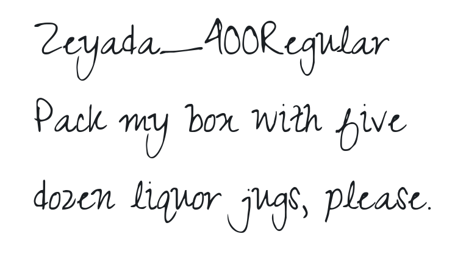](https://github.com/expo/google-fonts/tree/master/font-packages/zeyada#readme)||||
### [Artifika](https://github.com/expo/google-fonts/tree/master/font-packages/artifika#readme)

||||
|-|-|-|
|||||
### [Limelight](https://github.com/expo/google-fonts/tree/master/font-packages/limelight#readme)

||||
|-|-|-|
|||||
### [Maven Pro](https://github.com/expo/google-fonts/tree/master/font-packages/maven-pro#readme)

||||
|-|-|-|
||[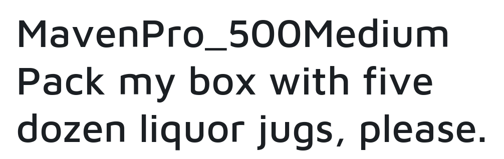](https://github.com/expo/google-fonts/tree/master/font-packages/maven-pro#readme)|||
|[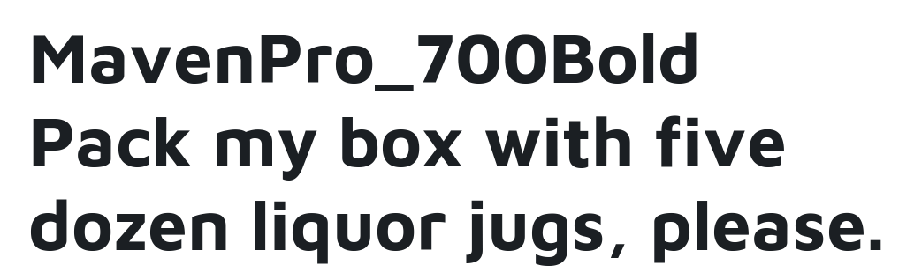](https://github.com/expo/google-fonts/tree/master/font-packages/maven-pro#readme)||||
### [Muli](https://github.com/expo/google-fonts/tree/master/font-packages/muli#readme)

||||
|-|-|-|
|||||
|||||
|||||
|||||
|||||
|||||
### [Tenor Sans](https://github.com/expo/google-fonts/tree/master/font-packages/tenor-sans#readme)

||||
|-|-|-|
|||||
### [Brawler](https://github.com/expo/google-fonts/tree/master/font-packages/brawler#readme)

||||
|-|-|-|
|||||
### [Caudex](https://github.com/expo/google-fonts/tree/master/font-packages/caudex#readme)

||||
|-|-|-|
|||||
|||||
### [Dancing Script](https://github.com/expo/google-fonts/tree/master/font-packages/dancing-script#readme)

||||
|-|-|-|
|[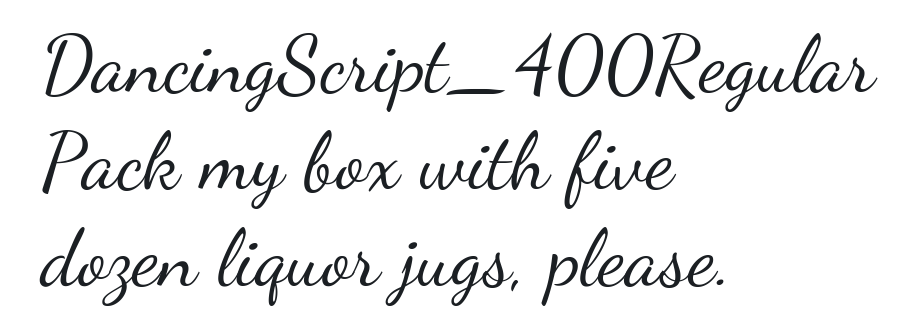](https://github.com/expo/google-fonts/tree/master/font-packages/dancing-script#readme)|[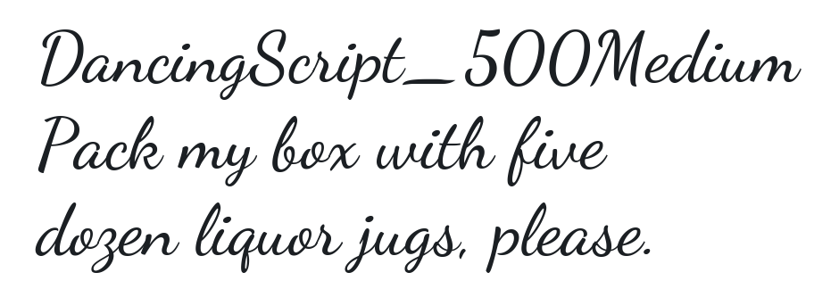](https://github.com/expo/google-fonts/tree/master/font-packages/dancing-script#readme)|||
|||||
### [Jura](https://github.com/expo/google-fonts/tree/master/font-packages/jura#readme)

||||
|-|-|-|
||[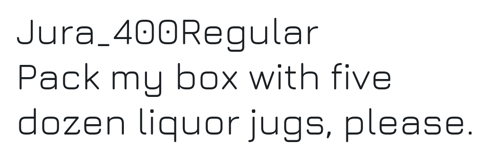](https://github.com/expo/google-fonts/tree/master/font-packages/jura#readme)|[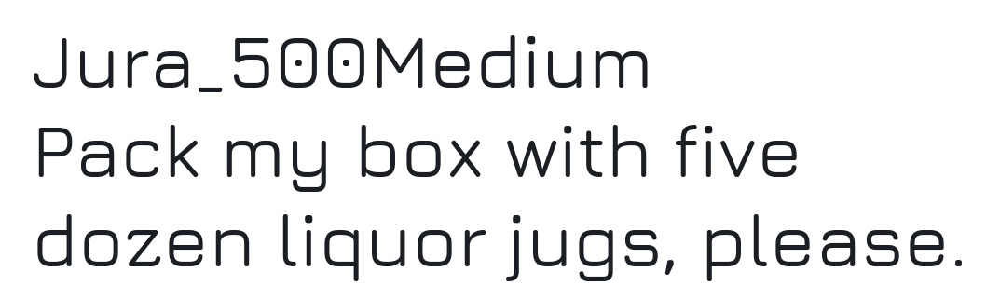](https://github.com/expo/google-fonts/tree/master/font-packages/jura#readme)||
||[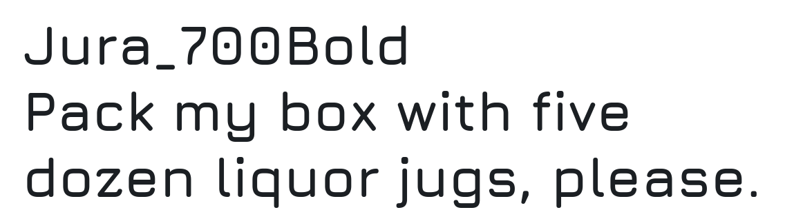](https://github.com/expo/google-fonts/tree/master/font-packages/jura#readme)|||
### [Podkova](https://github.com/expo/google-fonts/tree/master/font-packages/podkova#readme)

||||
|-|-|-|
|[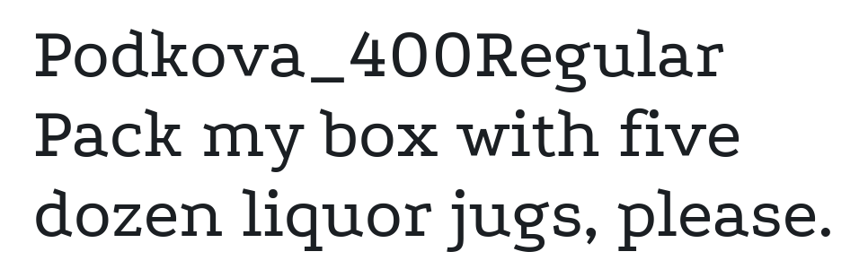](https://github.com/expo/google-fonts/tree/master/font-packages/podkova#readme)||||
|||||
### [Ruslan Display](https://github.com/expo/google-fonts/tree/master/font-packages/ruslan-display#readme)

||||
|-|-|-|
|||||
### [Wire One](https://github.com/expo/google-fonts/tree/master/font-packages/wire-one#readme)

||||
|-|-|-|
|||||
### [Mako](https://github.com/expo/google-fonts/tree/master/font-packages/mako#readme)

||||
|-|-|-|
|||||
### [Merriweather](https://github.com/expo/google-fonts/tree/master/font-packages/merriweather#readme)

||||
|-|-|-|
||[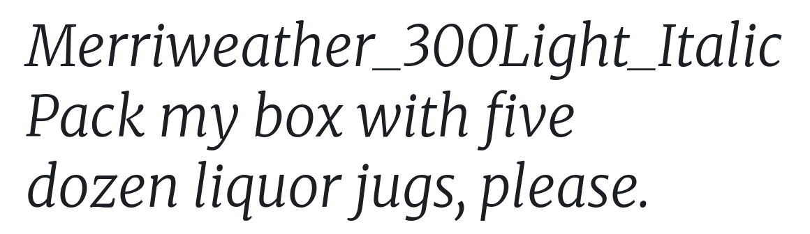](https://github.com/expo/google-fonts/tree/master/font-packages/merriweather#readme)|||
|[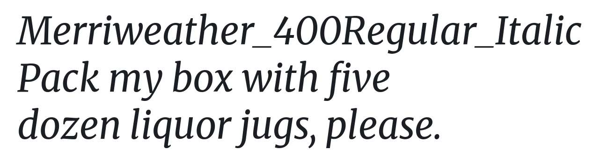](https://github.com/expo/google-fonts/tree/master/font-packages/merriweather#readme)|[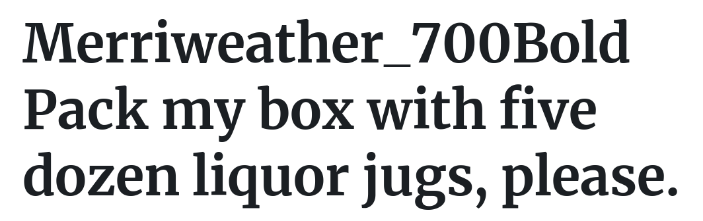](https://github.com/expo/google-fonts/tree/master/font-packages/merriweather#readme)|||
|||||
### [Metrophobic](https://github.com/expo/google-fonts/tree/master/font-packages/metrophobic#readme)

||||
|-|-|-|
|[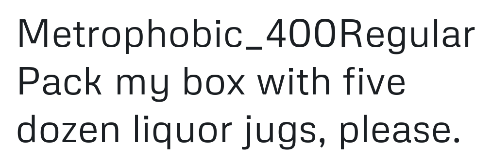](https://github.com/expo/google-fonts/tree/master/font-packages/metrophobic#readme)||||
### [Nothing You Could Do](https://github.com/expo/google-fonts/tree/master/font-packages/nothing-you-could-do#readme)

||||
|-|-|-|
|||||
### [Shanti](https://github.com/expo/google-fonts/tree/master/font-packages/shanti#readme)

||||
|-|-|-|
|||||
### [Open Sans Condensed](https://github.com/expo/google-fonts/tree/master/font-packages/open-sans-condensed#readme)

||||
|-|-|-|
|||||
### [Ultra](https://github.com/expo/google-fonts/tree/master/font-packages/ultra#readme)

||||
|-|-|-|
|||||
### [Amaranth](https://github.com/expo/google-fonts/tree/master/font-packages/amaranth#readme)

||||
|-|-|-|
|||[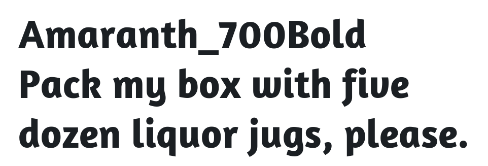](https://github.com/expo/google-fonts/tree/master/font-packages/amaranth#readme)||
|||||
### [Bigshot One](https://github.com/expo/google-fonts/tree/master/font-packages/bigshot-one#readme)

||||
|-|-|-|
|||||
### [Carter One](https://github.com/expo/google-fonts/tree/master/font-packages/carter-one#readme)

||||
|-|-|-|
|||||
### [Didact Gothic](https://github.com/expo/google-fonts/tree/master/font-packages/didact-gothic#readme)

||||
|-|-|-|
|||||
### [Expletus Sans](https://github.com/expo/google-fonts/tree/master/font-packages/expletus-sans#readme)

||||
|-|-|-|
|||||
|||||
|[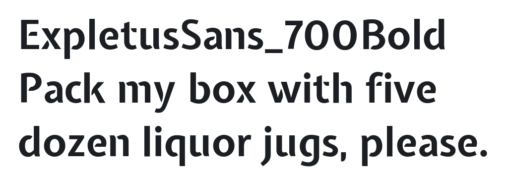](https://github.com/expo/google-fonts/tree/master/font-packages/expletus-sans#readme)|[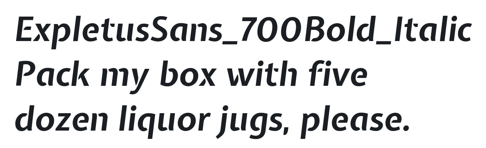](https://github.com/expo/google-fonts/tree/master/font-packages/expletus-sans#readme)|||
### [Francois One](https://github.com/expo/google-fonts/tree/master/font-packages/francois-one#readme)

||||
|-|-|-|
|||||
### [Holtwood One SC](https://github.com/expo/google-fonts/tree/master/font-packages/holtwood-one-sc#readme)

||||
|-|-|-|
|||||
### [Judson](https://github.com/expo/google-fonts/tree/master/font-packages/judson#readme)

||||
|-|-|-|
|||||
### [Megrim](https://github.com/expo/google-fonts/tree/master/font-packages/megrim#readme)

||||
|-|-|-|
|[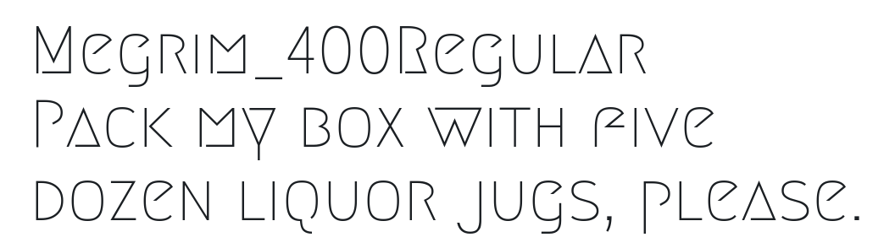](https://github.com/expo/google-fonts/tree/master/font-packages/megrim#readme)||||
### [Monofett](https://github.com/expo/google-fonts/tree/master/font-packages/monofett#readme)

||||
|-|-|-|
|||||
### [Paytone One](https://github.com/expo/google-fonts/tree/master/font-packages/paytone-one#readme)

||||
|-|-|-|
|||||
### [Play](https://github.com/expo/google-fonts/tree/master/font-packages/play#readme)

||||
|-|-|-|
|||||
### [Sigmar One](https://github.com/expo/google-fonts/tree/master/font-packages/sigmar-one#readme)

||||
|-|-|-|
|||||
### [Aclonica](https://github.com/expo/google-fonts/tree/master/font-packages/aclonica#readme)

||||
|-|-|-|
|||||
### [Damion](https://github.com/expo/google-fonts/tree/master/font-packages/damion#readme)

||||
|-|-|-|
|||||
### [News Cycle](https://github.com/expo/google-fonts/tree/master/font-packages/news-cycle#readme)

||||
|-|-|-|
||[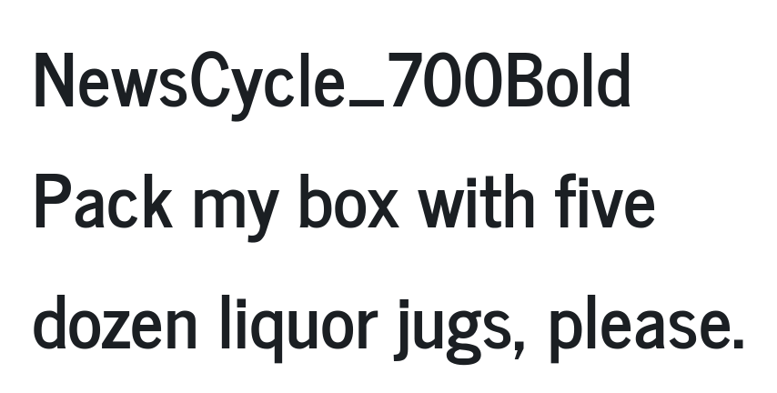](https://github.com/expo/google-fonts/tree/master/font-packages/news-cycle#readme)|||
### [Over the Rainbow](https://github.com/expo/google-fonts/tree/master/font-packages/over-the-rainbow#readme)

||||
|-|-|-|
|||||
### [Swanky and Moo Moo](https://github.com/expo/google-fonts/tree/master/font-packages/swanky-and-moo-moo#readme)

||||
|-|-|-|
|[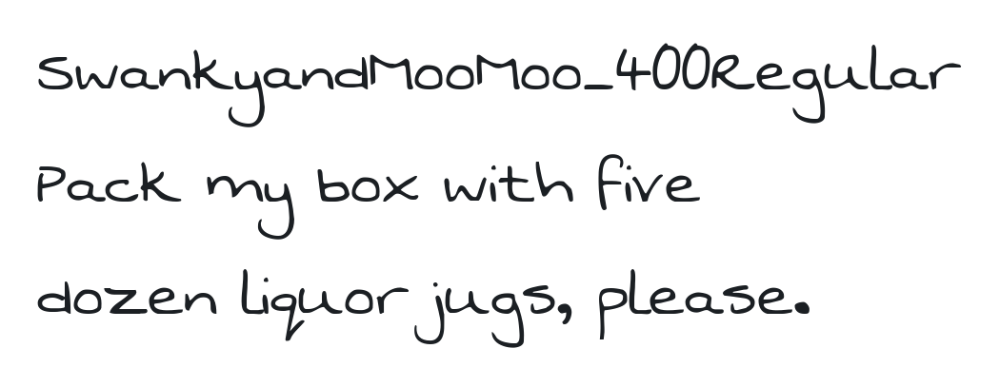](https://github.com/expo/google-fonts/tree/master/font-packages/swanky-and-moo-moo#readme)||||
### [Syncopate](https://github.com/expo/google-fonts/tree/master/font-packages/syncopate#readme)

||||
|-|-|-|
|[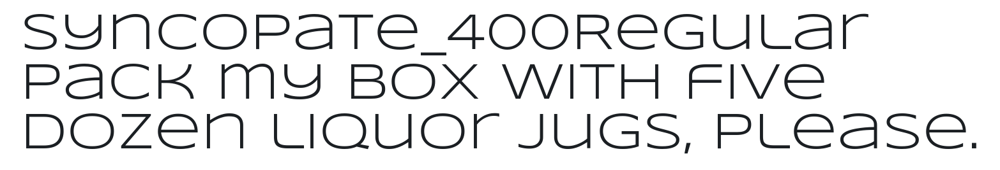](https://github.com/expo/google-fonts/tree/master/font-packages/syncopate#readme)||||
### [Wallpoet](https://github.com/expo/google-fonts/tree/master/font-packages/wallpoet#readme)

||||
|-|-|-|
|||||
### [Siemreap](https://github.com/expo/google-fonts/tree/master/font-packages/siemreap#readme)

||||
|-|-|-|
|||||
### [Smythe](https://github.com/expo/google-fonts/tree/master/font-packages/smythe#readme)

||||
|-|-|-|
|||||
### [Special Elite](https://github.com/expo/google-fonts/tree/master/font-packages/special-elite#readme)

||||
|-|-|-|
|||||
### [The Girl Next Door](https://github.com/expo/google-fonts/tree/master/font-packages/the-girl-next-door#readme)

||||
|-|-|-|
|||||
### [Annie Use Your Telescope](https://github.com/expo/google-fonts/tree/master/font-packages/annie-use-your-telescope#readme)

||||
|-|-|-|
|||||
### [Dawning of a New Day](https://github.com/expo/google-fonts/tree/master/font-packages/dawning-of-a-new-day#readme)

||||
|-|-|-|
|||||
### [Nova Square](https://github.com/expo/google-fonts/tree/master/font-packages/nova-square#readme)

||||
|-|-|-|
|[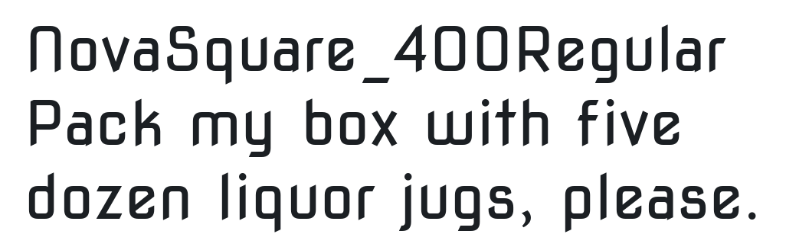](https://github.com/expo/google-fonts/tree/master/font-packages/nova-square#readme)||||
### [Sue Ellen Francisco](https://github.com/expo/google-fonts/tree/master/font-packages/sue-ellen-francisco#readme)

||||
|-|-|-|
|||||
### [Waiting for the Sunrise](https://github.com/expo/google-fonts/tree/master/font-packages/waiting-for-the-sunrise#readme)

||||
|-|-|-|
|||||
### [Miltonian](https://github.com/expo/google-fonts/tree/master/font-packages/miltonian#readme)

||||
|-|-|-|
|||||
### [Miltonian Tattoo](https://github.com/expo/google-fonts/tree/master/font-packages/miltonian-tattoo#readme)

||||
|-|-|-|
|||||
### [Michroma](https://github.com/expo/google-fonts/tree/master/font-packages/michroma#readme)

||||
|-|-|-|
|||||
### [Cabin](https://github.com/expo/google-fonts/tree/master/font-packages/cabin#readme)

||||
|-|-|-|
|||||
|||||
|||||
### [EB Garamond](https://github.com/expo/google-fonts/tree/master/font-packages/eb-garamond#readme)

||||
|-|-|-|
|[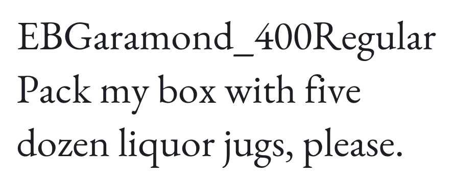](https://github.com/expo/google-fonts/tree/master/font-packages/eb-garamond#readme)|[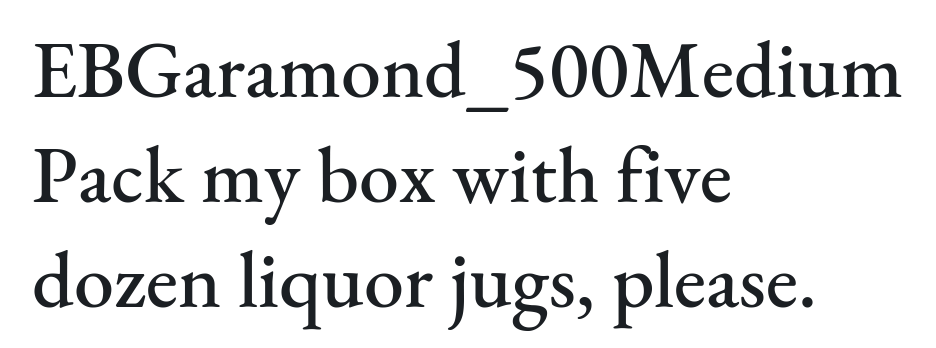](https://github.com/expo/google-fonts/tree/master/font-packages/eb-garamond#readme)|||
|[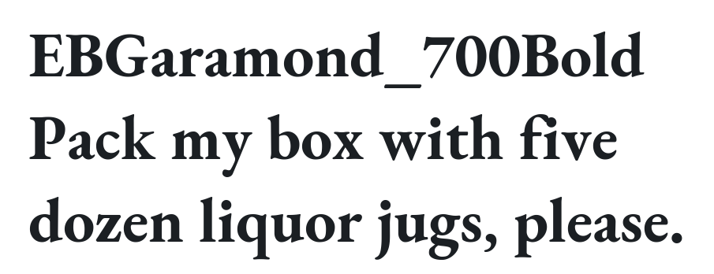](https://github.com/expo/google-fonts/tree/master/font-packages/eb-garamond#readme)||||
|||||
|||||
### [Nova Cut](https://github.com/expo/google-fonts/tree/master/font-packages/nova-cut#readme)

||||
|-|-|-|
|[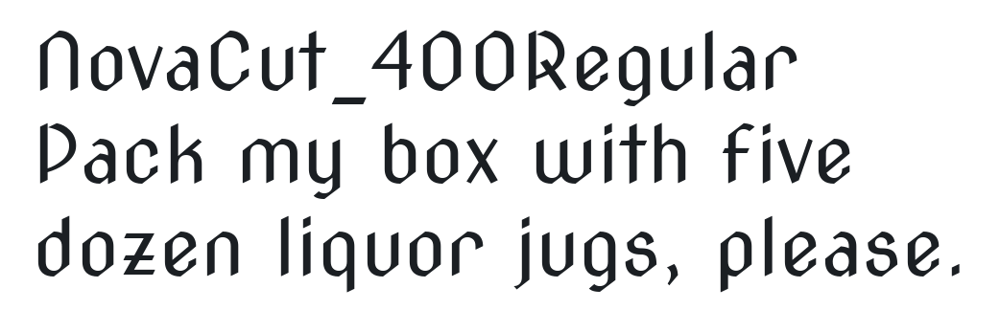](https://github.com/expo/google-fonts/tree/master/font-packages/nova-cut#readme)||||
### [Nova Flat](https://github.com/expo/google-fonts/tree/master/font-packages/nova-flat#readme)

||||
|-|-|-|
|[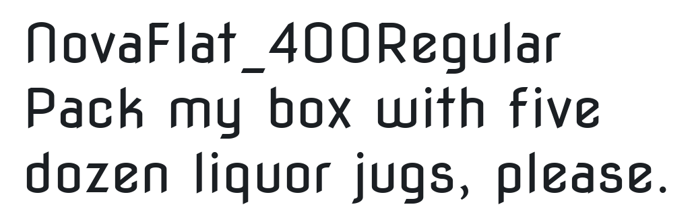](https://github.com/expo/google-fonts/tree/master/font-packages/nova-flat#readme)||||
### [Nova Mono](https://github.com/expo/google-fonts/tree/master/font-packages/nova-mono#readme)

||||
|-|-|-|
|[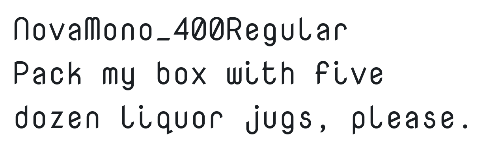](https://github.com/expo/google-fonts/tree/master/font-packages/nova-mono#readme)||||
### [Nova Oval](https://github.com/expo/google-fonts/tree/master/font-packages/nova-oval#readme)

||||
|-|-|-|
|[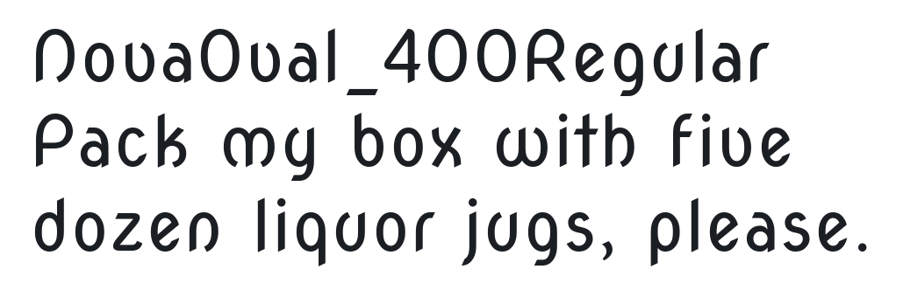](https://github.com/expo/google-fonts/tree/master/font-packages/nova-oval#readme)||||
### [Nova Round](https://github.com/expo/google-fonts/tree/master/font-packages/nova-round#readme)

||||
|-|-|-|
|||||
### [Nova Script](https://github.com/expo/google-fonts/tree/master/font-packages/nova-script#readme)

||||
|-|-|-|
|||||
### [Nova Slim](https://github.com/expo/google-fonts/tree/master/font-packages/nova-slim#readme)

||||
|-|-|-|
|[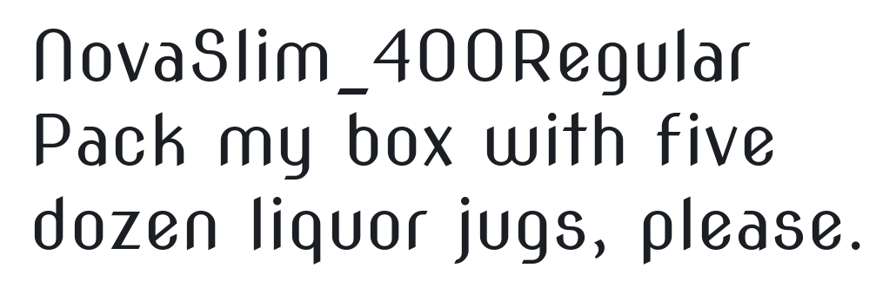](https://github.com/expo/google-fonts/tree/master/font-packages/nova-slim#readme)||||
### [Cabin Sketch](https://github.com/expo/google-fonts/tree/master/font-packages/cabin-sketch#readme)

||||
|-|-|-|
|||||
### [Irish Grover](https://github.com/expo/google-fonts/tree/master/font-packages/irish-grover#readme)

||||
|-|-|-|
|||||
### [Architects Daughter](https://github.com/expo/google-fonts/tree/master/font-packages/architects-daughter#readme)

||||
|-|-|-|
|||||
### [Candal](https://github.com/expo/google-fonts/tree/master/font-packages/candal#readme)

||||
|-|-|-|
|||||
### [Indie Flower](https://github.com/expo/google-fonts/tree/master/font-packages/indie-flower#readme)

||||
|-|-|-|
|||||
### [League Script](https://github.com/expo/google-fonts/tree/master/font-packages/league-script#readme)

||||
|-|-|-|
|[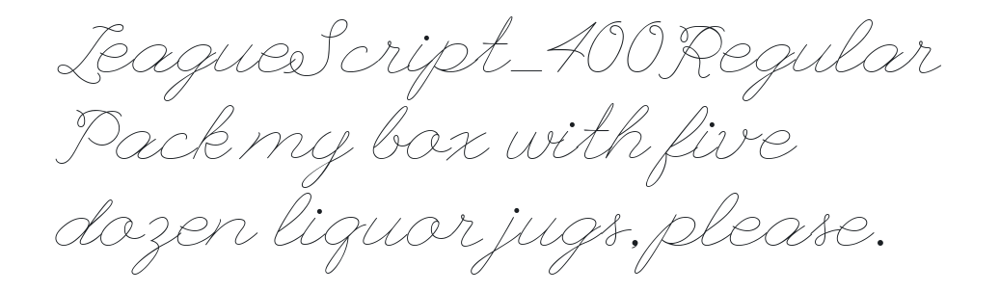](https://github.com/expo/google-fonts/tree/master/font-packages/league-script#readme)||||
### [Pacifico](https://github.com/expo/google-fonts/tree/master/font-packages/pacifico#readme)

||||
|-|-|-|
|||||
### [Angkor](https://github.com/expo/google-fonts/tree/master/font-packages/angkor#readme)

||||
|-|-|-|
|||||
### [Battambang](https://github.com/expo/google-fonts/tree/master/font-packages/battambang#readme)

||||
|-|-|-|
|||||
### [Bayon](https://github.com/expo/google-fonts/tree/master/font-packages/bayon#readme)

||||
|-|-|-|
|[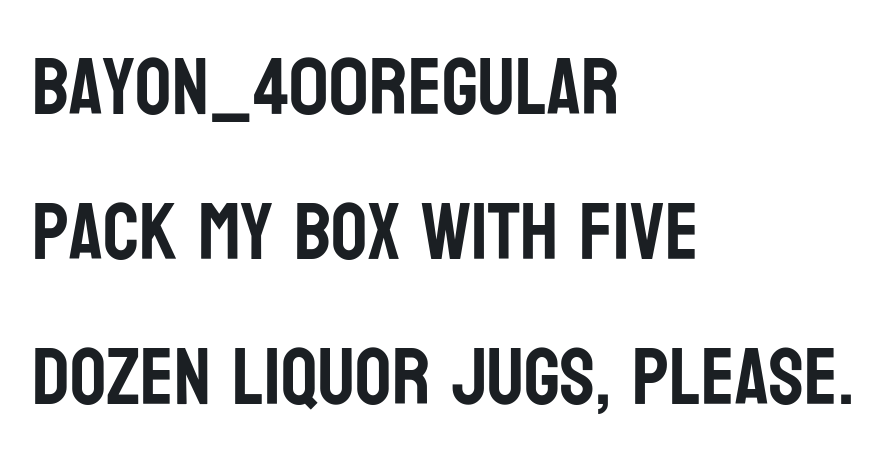](https://github.com/expo/google-fonts/tree/master/font-packages/bayon#readme)||||
### [Bokor](https://github.com/expo/google-fonts/tree/master/font-packages/bokor#readme)

||||
|-|-|-|
|[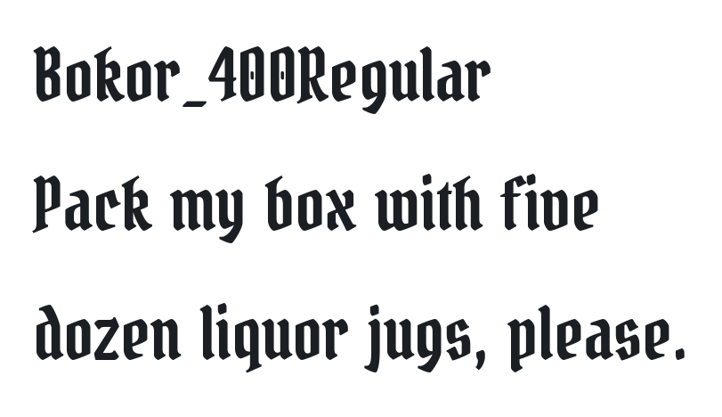](https://github.com/expo/google-fonts/tree/master/font-packages/bokor#readme)||||
### [Chenla](https://github.com/expo/google-fonts/tree/master/font-packages/chenla#readme)

||||
|-|-|-|
|||||
### [Content](https://github.com/expo/google-fonts/tree/master/font-packages/content#readme)

||||
|-|-|-|
|||||
### [Dangrek](https://github.com/expo/google-fonts/tree/master/font-packages/dangrek#readme)

||||
|-|-|-|
|||||
### [Freehand](https://github.com/expo/google-fonts/tree/master/font-packages/freehand#readme)

||||
|-|-|-|
|||||
### [Khmer](https://github.com/expo/google-fonts/tree/master/font-packages/khmer#readme)

||||
|-|-|-|
|||||
### [Koulen](https://github.com/expo/google-fonts/tree/master/font-packages/koulen#readme)

||||
|-|-|-|
|||||
### [MedievalSharp](https://github.com/expo/google-fonts/tree/master/font-packages/medievalsharp#readme)

||||
|-|-|-|
|||||
### [Metal](https://github.com/expo/google-fonts/tree/master/font-packages/metal#readme)

||||
|-|-|-|
|||||
### [Moul](https://github.com/expo/google-fonts/tree/master/font-packages/moul#readme)

||||
|-|-|-|
|||||
### [Moulpali](https://github.com/expo/google-fonts/tree/master/font-packages/moulpali#readme)

||||
|-|-|-|
|||||
### [Odor Mean Chey](https://github.com/expo/google-fonts/tree/master/font-packages/odor-mean-chey#readme)

||||
|-|-|-|
|[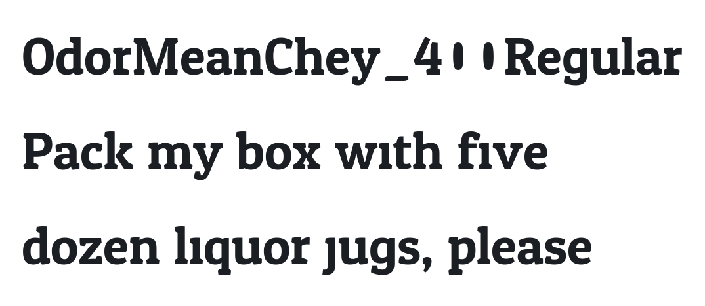](https://github.com/expo/google-fonts/tree/master/font-packages/odor-mean-chey#readme)||||
### [Preahvihear](https://github.com/expo/google-fonts/tree/master/font-packages/preahvihear#readme)

||||
|-|-|-|
|[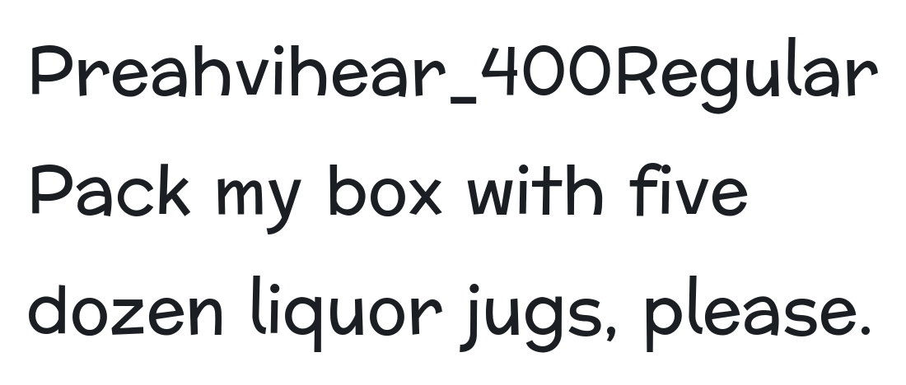](https://github.com/expo/google-fonts/tree/master/font-packages/preahvihear#readme)||||
### [Suwannaphum](https://github.com/expo/google-fonts/tree/master/font-packages/suwannaphum#readme)

||||
|-|-|-|
|||||
### [Taprom](https://github.com/expo/google-fonts/tree/master/font-packages/taprom#readme)

||||
|-|-|-|
|||||
### [VT323](https://github.com/expo/google-fonts/tree/master/font-packages/vt323#readme)

||||
|-|-|-|
|||||
### [Anton](https://github.com/expo/google-fonts/tree/master/font-packages/anton#readme)

||||
|-|-|-|
|||||
### [Bevan](https://github.com/expo/google-fonts/tree/master/font-packages/bevan#readme)

||||
|-|-|-|
|||||
### [Astloch](https://github.com/expo/google-fonts/tree/master/font-packages/astloch#readme)

||||
|-|-|-|
|[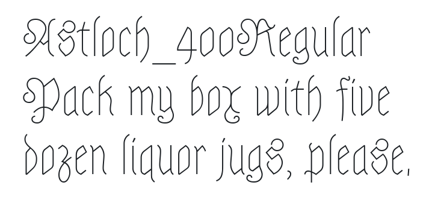](https://github.com/expo/google-fonts/tree/master/font-packages/astloch#readme)||||
### [Six Caps](https://github.com/expo/google-fonts/tree/master/font-packages/six-caps#readme)

||||
|-|-|-|
|||||
### [Bangers](https://github.com/expo/google-fonts/tree/master/font-packages/bangers#readme)

||||
|-|-|-|
|||||
### [Coda Caption](https://github.com/expo/google-fonts/tree/master/font-packages/coda-caption#readme)

||||
|-|-|-|
|||||
### [Goudy Bookletter 1911](https://github.com/expo/google-fonts/tree/master/font-packages/goudy-bookletter-1911#readme)

||||
|-|-|-|
|[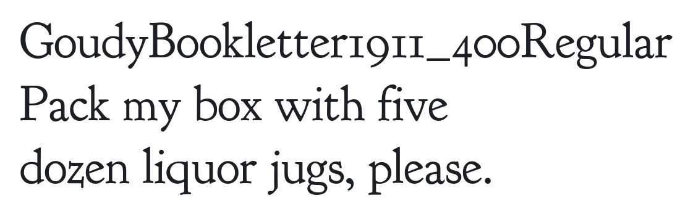](https://github.com/expo/google-fonts/tree/master/font-packages/goudy-bookletter-1911#readme)||||
### [Neuton](https://github.com/expo/google-fonts/tree/master/font-packages/neuton#readme)

||||
|-|-|-|
||[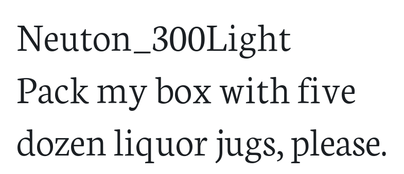](https://github.com/expo/google-fonts/tree/master/font-packages/neuton#readme)|||
|||||
### [PT Serif](https://github.com/expo/google-fonts/tree/master/font-packages/pt-serif#readme)

||||
|-|-|-|
|||||
|[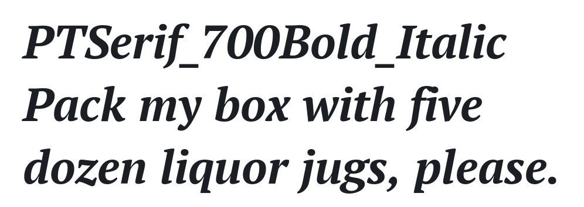](https://github.com/expo/google-fonts/tree/master/font-packages/pt-serif#readme)||||
### [PT Serif Caption](https://github.com/expo/google-fonts/tree/master/font-packages/pt-serif-caption#readme)

||||
|-|-|-|
|[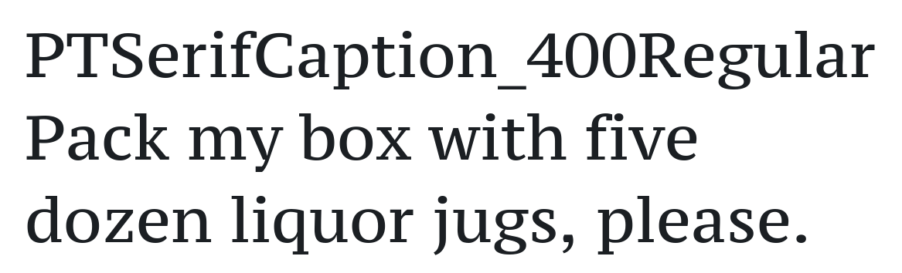](https://github.com/expo/google-fonts/tree/master/font-packages/pt-serif-caption#readme)||||
### [Kreon](https://github.com/expo/google-fonts/tree/master/font-packages/kreon#readme)

||||
|-|-|-|
|||||
|[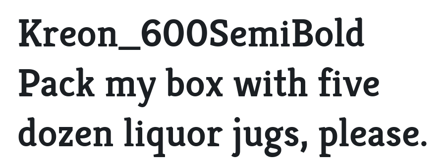](https://github.com/expo/google-fonts/tree/master/font-packages/kreon#readme)||||
### [Meddon](https://github.com/expo/google-fonts/tree/master/font-packages/meddon#readme)

||||
|-|-|-|
|||||
### [Open Sans](https://github.com/expo/google-fonts/tree/master/font-packages/open-sans#readme)

||||
|-|-|-|
|[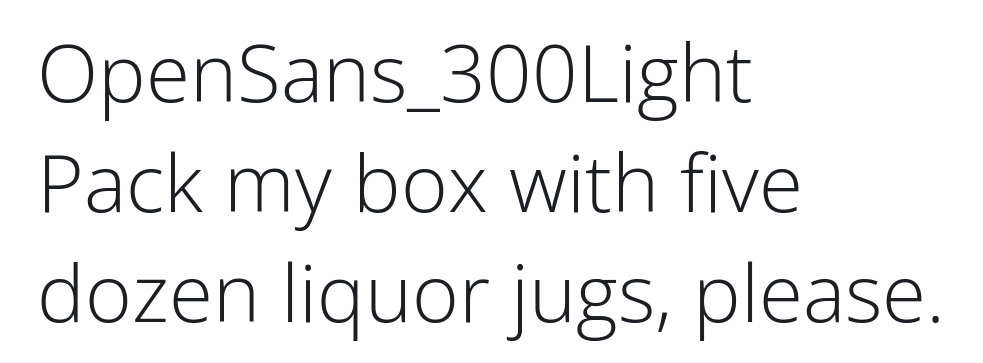](https://github.com/expo/google-fonts/tree/master/font-packages/open-sans#readme)|[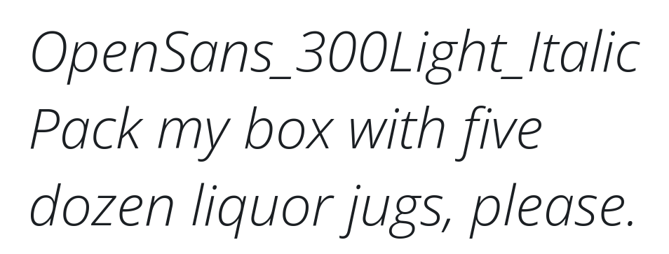](https://github.com/expo/google-fonts/tree/master/font-packages/open-sans#readme)|||
||[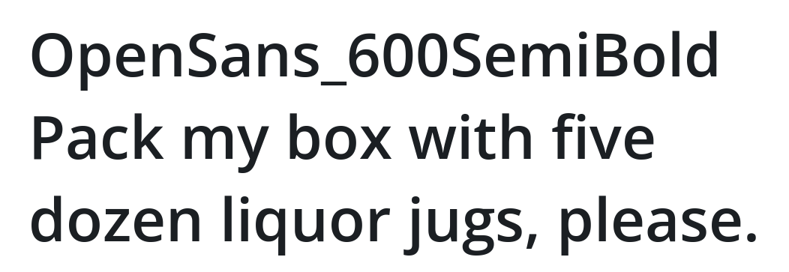](https://github.com/expo/google-fonts/tree/master/font-packages/open-sans#readme)|||
||[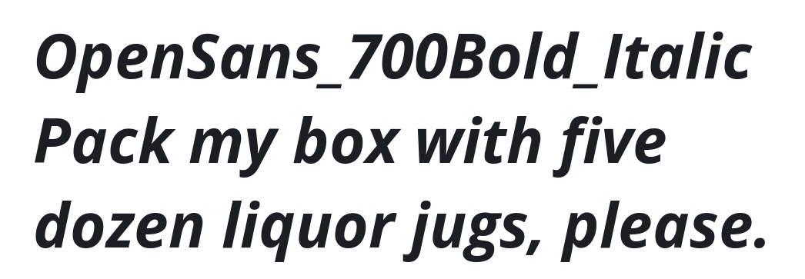](https://github.com/expo/google-fonts/tree/master/font-packages/open-sans#readme)|||
|[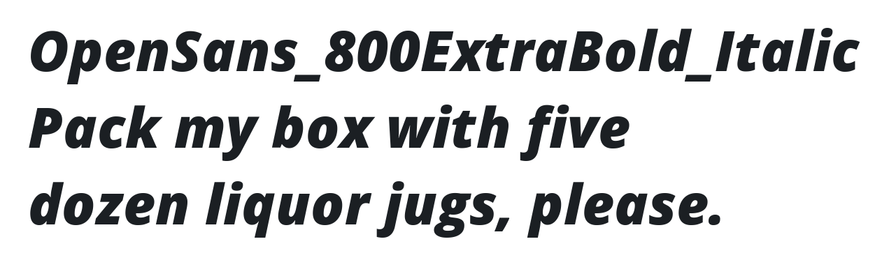](https://github.com/expo/google-fonts/tree/master/font-packages/open-sans#readme)||||
### [Crimson Text](https://github.com/expo/google-fonts/tree/master/font-packages/crimson-text#readme)

||||
|-|-|-|
|[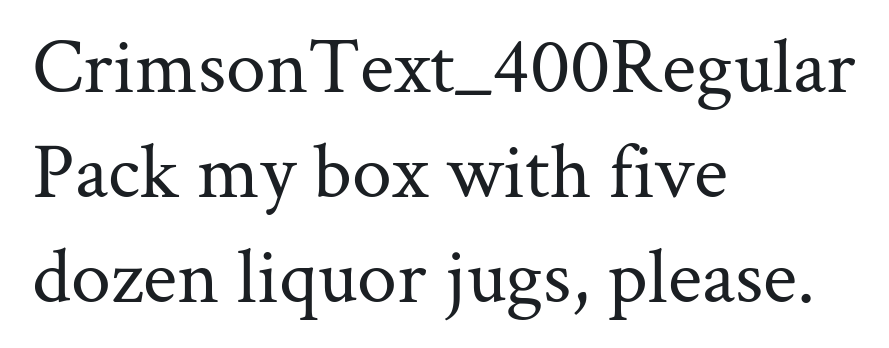](https://github.com/expo/google-fonts/tree/master/font-packages/crimson-text#readme)||[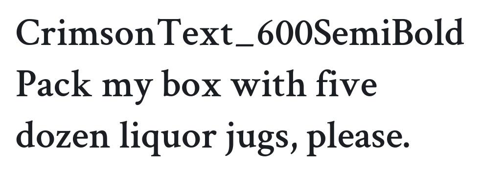](https://github.com/expo/google-fonts/tree/master/font-packages/crimson-text#readme)||
|||||
### [Calligraffitti](https://github.com/expo/google-fonts/tree/master/font-packages/calligraffitti#readme)

||||
|-|-|-|
|||||
### [Cherry Cream Soda](https://github.com/expo/google-fonts/tree/master/font-packages/cherry-cream-soda#readme)

||||
|-|-|-|
|||||
### [Chewy](https://github.com/expo/google-fonts/tree/master/font-packages/chewy#readme)

||||
|-|-|-|
|||||
### [Coming Soon](https://github.com/expo/google-fonts/tree/master/font-packages/coming-soon#readme)

||||
|-|-|-|
|||||
### [Crafty Girls](https://github.com/expo/google-fonts/tree/master/font-packages/crafty-girls#readme)

||||
|-|-|-|
|||||
### [Crushed](https://github.com/expo/google-fonts/tree/master/font-packages/crushed#readme)

||||
|-|-|-|
|[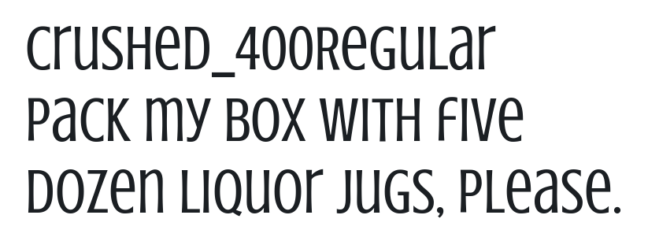](https://github.com/expo/google-fonts/tree/master/font-packages/crushed#readme)||||
### [Fontdiner Swanky](https://github.com/expo/google-fonts/tree/master/font-packages/fontdiner-swanky#readme)

||||
|-|-|-|
|||||
### [Homemade Apple](https://github.com/expo/google-fonts/tree/master/font-packages/homemade-apple#readme)

||||
|-|-|-|
|||||
### [Kranky](https://github.com/expo/google-fonts/tree/master/font-packages/kranky#readme)

||||
|-|-|-|
|||||
### [Luckiest Guy](https://github.com/expo/google-fonts/tree/master/font-packages/luckiest-guy#readme)

||||
|-|-|-|
|||||
### [Permanent Marker](https://github.com/expo/google-fonts/tree/master/font-packages/permanent-marker#readme)

||||
|-|-|-|
|||||
### [Rock Salt](https://github.com/expo/google-fonts/tree/master/font-packages/rock-salt#readme)

||||
|-|-|-|
|[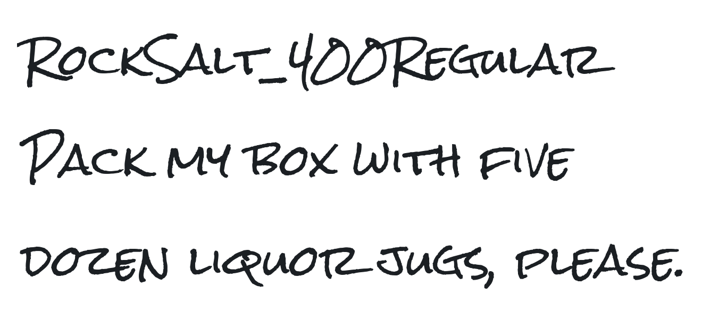](https://github.com/expo/google-fonts/tree/master/font-packages/rock-salt#readme)||||
### [Schoolbell](https://github.com/expo/google-fonts/tree/master/font-packages/schoolbell#readme)

||||
|-|-|-|
|||||
### [Slackey](https://github.com/expo/google-fonts/tree/master/font-packages/slackey#readme)

||||
|-|-|-|
|||||
### [Sunshiney](https://github.com/expo/google-fonts/tree/master/font-packages/sunshiney#readme)

||||
|-|-|-|
|||||
### [Walter Turncoat](https://github.com/expo/google-fonts/tree/master/font-packages/walter-turncoat#readme)

||||
|-|-|-|
|||||
### [Buda](https://github.com/expo/google-fonts/tree/master/font-packages/buda#readme)

||||
|-|-|-|
|||||
### [Corben](https://github.com/expo/google-fonts/tree/master/font-packages/corben#readme)

||||
|-|-|-|
|||||
### [Gruppo](https://github.com/expo/google-fonts/tree/master/font-packages/gruppo#readme)

||||
|-|-|-|
|||||
### [Just Another Hand](https://github.com/expo/google-fonts/tree/master/font-packages/just-another-hand#readme)

||||
|-|-|-|
|||||
### [Kristi](https://github.com/expo/google-fonts/tree/master/font-packages/kristi#readme)

||||
|-|-|-|
|[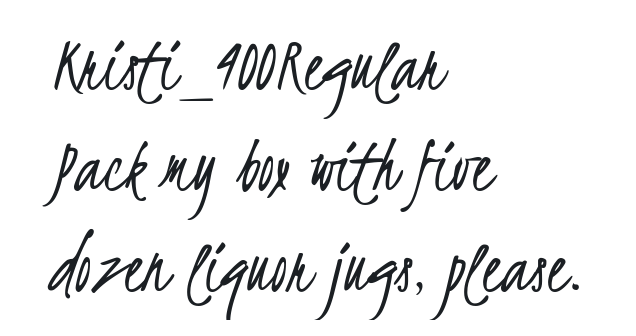](https://github.com/expo/google-fonts/tree/master/font-packages/kristi#readme)||||
### [Lekton](https://github.com/expo/google-fonts/tree/master/font-packages/lekton#readme)

||||
|-|-|-|
|||[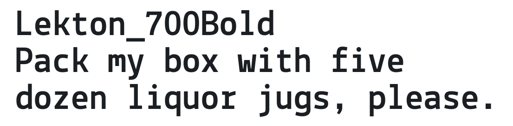](https://github.com/expo/google-fonts/tree/master/font-packages/lekton#readme)||
### [Maiden Orange](https://github.com/expo/google-fonts/tree/master/font-packages/maiden-orange#readme)

||||
|-|-|-|
|||||
### [Allan](https://github.com/expo/google-fonts/tree/master/font-packages/allan#readme)

||||
|-|-|-|
|||||
### [Anonymous Pro](https://github.com/expo/google-fonts/tree/master/font-packages/anonymous-pro#readme)

||||
|-|-|-|
|||||
|||||
### [Copse](https://github.com/expo/google-fonts/tree/master/font-packages/copse#readme)

||||
|-|-|-|
|||||
### [Kenia](https://github.com/expo/google-fonts/tree/master/font-packages/kenia#readme)

||||
|-|-|-|
|||||
### [Lato](https://github.com/expo/google-fonts/tree/master/font-packages/lato#readme)

||||
|-|-|-|
|||||
|[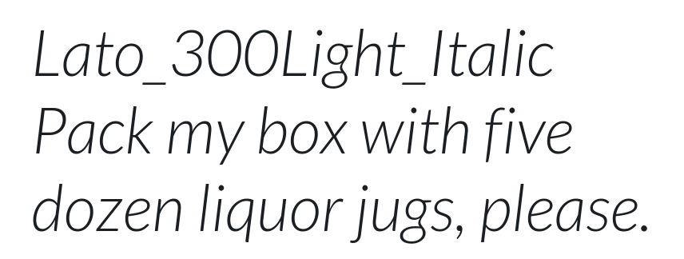](https://github.com/expo/google-fonts/tree/master/font-packages/lato#readme)||||
|||[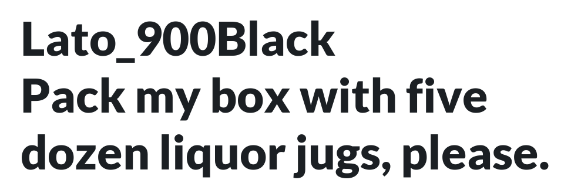](https://github.com/expo/google-fonts/tree/master/font-packages/lato#readme)||
|[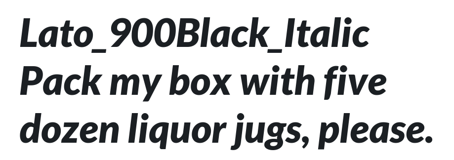](https://github.com/expo/google-fonts/tree/master/font-packages/lato#readme)||||
### [Orbitron](https://github.com/expo/google-fonts/tree/master/font-packages/orbitron#readme)

||||
|-|-|-|
||[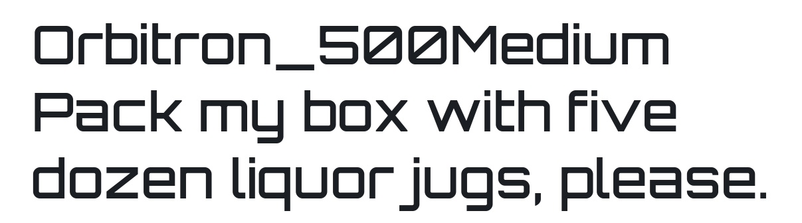](https://github.com/expo/google-fonts/tree/master/font-packages/orbitron#readme)|[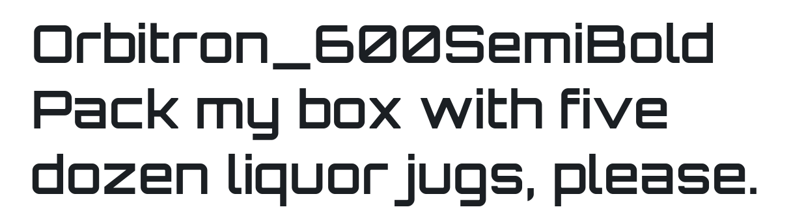](https://github.com/expo/google-fonts/tree/master/font-packages/orbitron#readme)||
|||||
### [Sniglet](https://github.com/expo/google-fonts/tree/master/font-packages/sniglet#readme)

||||
|-|-|-|
|||||
### [Ubuntu](https://github.com/expo/google-fonts/tree/master/font-packages/ubuntu#readme)

||||
|-|-|-|
|||||
|[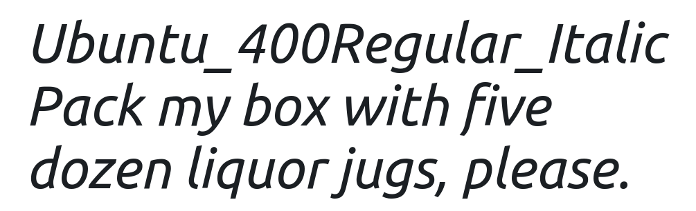](https://github.com/expo/google-fonts/tree/master/font-packages/ubuntu#readme)||||
|||||
### [Vibur](https://github.com/expo/google-fonts/tree/master/font-packages/vibur#readme)

||||
|-|-|-|
|||||
### [Mountains of Christmas](https://github.com/expo/google-fonts/tree/master/font-packages/mountains-of-christmas#readme)

||||
|-|-|-|
|||||
### [Coda](https://github.com/expo/google-fonts/tree/master/font-packages/coda#readme)

||||
|-|-|-|
|||||
### [Covered By Your Grace](https://github.com/expo/google-fonts/tree/master/font-packages/covered-by-your-grace#readme)

||||
|-|-|-|
|[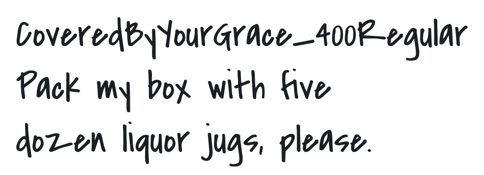](https://github.com/expo/google-fonts/tree/master/font-packages/covered-by-your-grace#readme)||||
### [Just Me Again Down Here](https://github.com/expo/google-fonts/tree/master/font-packages/just-me-again-down-here#readme)

||||
|-|-|-|
|||||
### [UnifrakturCook](https://github.com/expo/google-fonts/tree/master/font-packages/unifrakturcook#readme)

||||
|-|-|-|
|||||
### [Allerta](https://github.com/expo/google-fonts/tree/master/font-packages/allerta#readme)

||||
|-|-|-|
|||||
### [Allerta Stencil](https://github.com/expo/google-fonts/tree/master/font-packages/allerta-stencil#readme)

||||
|-|-|-|
|||||
### [Bentham](https://github.com/expo/google-fonts/tree/master/font-packages/bentham#readme)

||||
|-|-|-|
|||||
### [Geo](https://github.com/expo/google-fonts/tree/master/font-packages/geo#readme)

||||
|-|-|-|
||[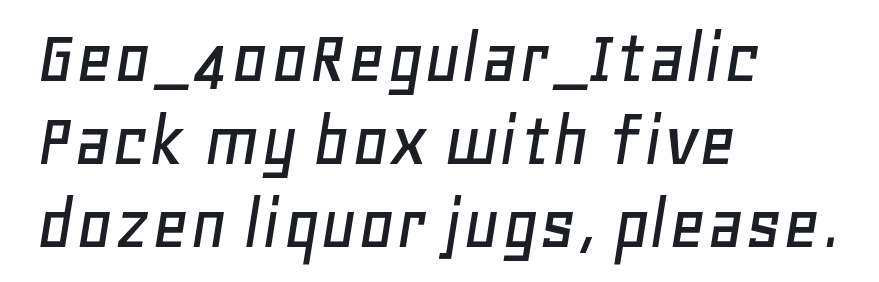](https://github.com/expo/google-fonts/tree/master/font-packages/geo#readme)|||
### [Puritan](https://github.com/expo/google-fonts/tree/master/font-packages/puritan#readme)

||||
|-|-|-|
|||||
|||||
### [UnifrakturMaguntia](https://github.com/expo/google-fonts/tree/master/font-packages/unifrakturmaguntia#readme)

||||
|-|-|-|
|||||
### [Arimo](https://github.com/expo/google-fonts/tree/master/font-packages/arimo#readme)

||||
|-|-|-|
|||||
|||||
### [Cousine](https://github.com/expo/google-fonts/tree/master/font-packages/cousine#readme)

||||
|-|-|-|
|||||
|||||
### [Tinos](https://github.com/expo/google-fonts/tree/master/font-packages/tinos#readme)

||||
|-|-|-|
||[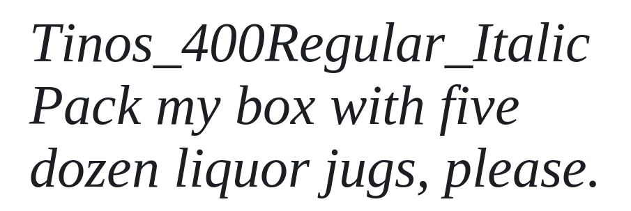](https://github.com/expo/google-fonts/tree/master/font-packages/tinos#readme)|||
|[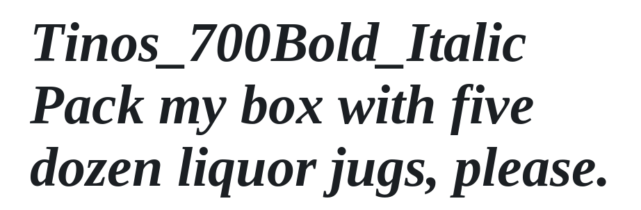](https://github.com/expo/google-fonts/tree/master/font-packages/tinos#readme)||||
### [Arvo](https://github.com/expo/google-fonts/tree/master/font-packages/arvo#readme)

||||
|-|-|-|
||[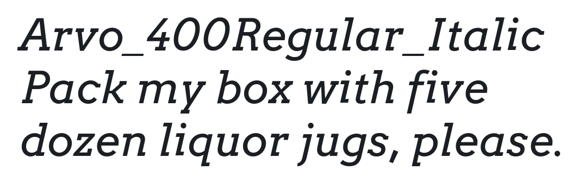](https://github.com/expo/google-fonts/tree/master/font-packages/arvo#readme)|[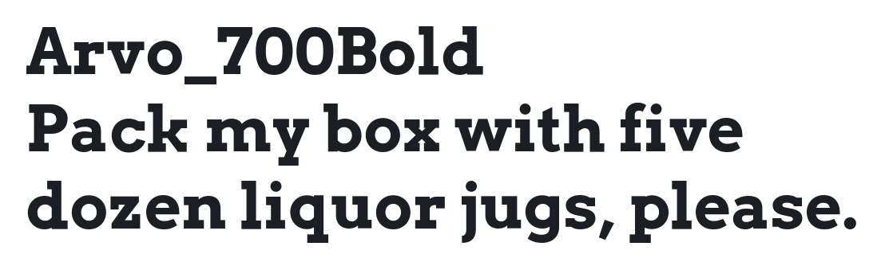](https://github.com/expo/google-fonts/tree/master/font-packages/arvo#readme)||
|||||
### [Josefin Sans](https://github.com/expo/google-fonts/tree/master/font-packages/josefin-sans#readme)

||||
|-|-|-|
|[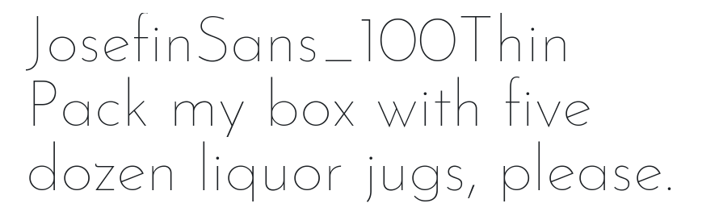](https://github.com/expo/google-fonts/tree/master/font-packages/josefin-sans#readme)||||
|||||
|||||
|||[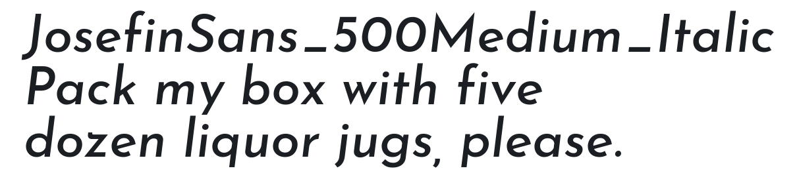](https://github.com/expo/google-fonts/tree/master/font-packages/josefin-sans#readme)||
||[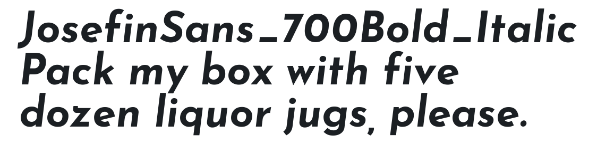](https://github.com/expo/google-fonts/tree/master/font-packages/josefin-sans#readme)|||
### [Josefin Slab](https://github.com/expo/google-fonts/tree/master/font-packages/josefin-slab#readme)

||||
|-|-|-|
|[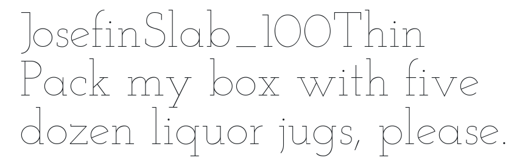](https://github.com/expo/google-fonts/tree/master/font-packages/josefin-slab#readme)||||
|||[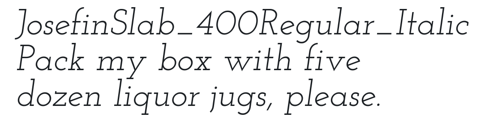](https://github.com/expo/google-fonts/tree/master/font-packages/josefin-slab#readme)||
||[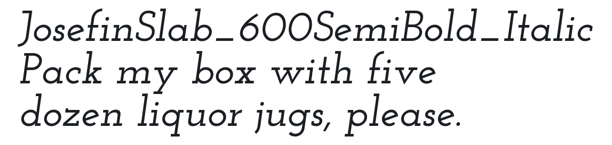](https://github.com/expo/google-fonts/tree/master/font-packages/josefin-slab#readme)|||
|[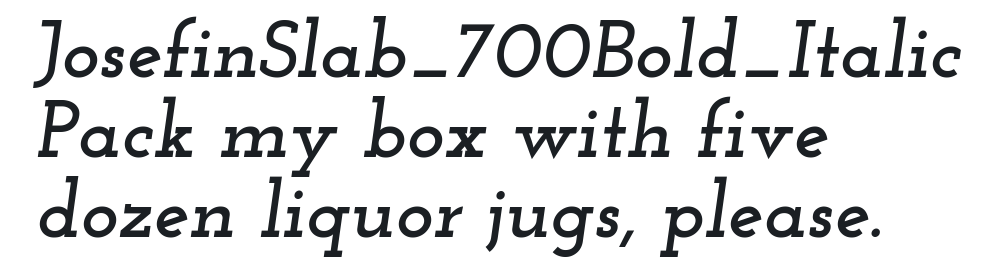](https://github.com/expo/google-fonts/tree/master/font-packages/josefin-slab#readme)||||
### [GFS Didot](https://github.com/expo/google-fonts/tree/master/font-packages/gfs-didot#readme)

||||
|-|-|-|
|||||
### [GFS Neohellenic](https://github.com/expo/google-fonts/tree/master/font-packages/gfs-neohellenic#readme)

||||
|-|-|-|
|||||
|[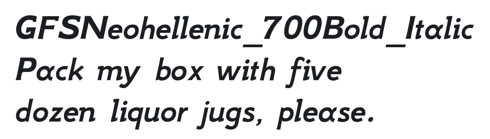](https://github.com/expo/google-fonts/tree/master/font-packages/gfs-neohellenic#readme)||||
### [Hanuman](https://github.com/expo/google-fonts/tree/master/font-packages/hanuman#readme)

||||
|-|-|-|
|[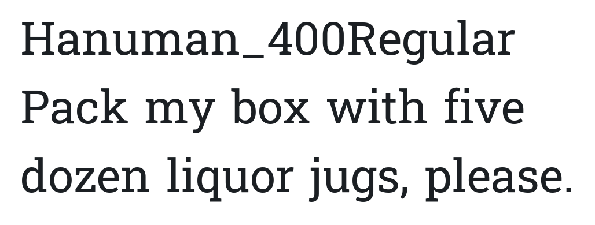](https://github.com/expo/google-fonts/tree/master/font-packages/hanuman#readme)|[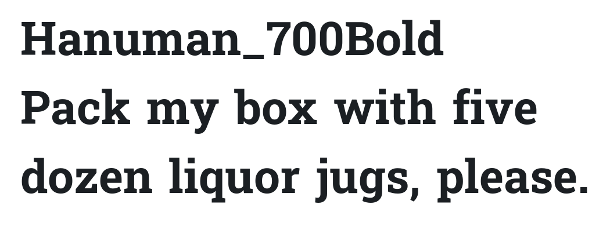](https://github.com/expo/google-fonts/tree/master/font-packages/hanuman#readme)|||
### [Neucha](https://github.com/expo/google-fonts/tree/master/font-packages/neucha#readme)

||||
|-|-|-|
|||||
### [PT Sans](https://github.com/expo/google-fonts/tree/master/font-packages/pt-sans#readme)

||||
|-|-|-|
|||||
|[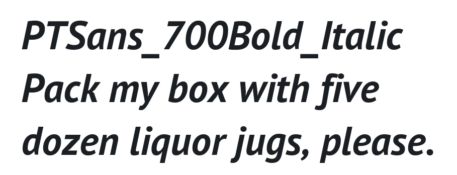](https://github.com/expo/google-fonts/tree/master/font-packages/pt-sans#readme)||||
### [PT Sans Caption](https://github.com/expo/google-fonts/tree/master/font-packages/pt-sans-caption#readme)

||||
|-|-|-|
||[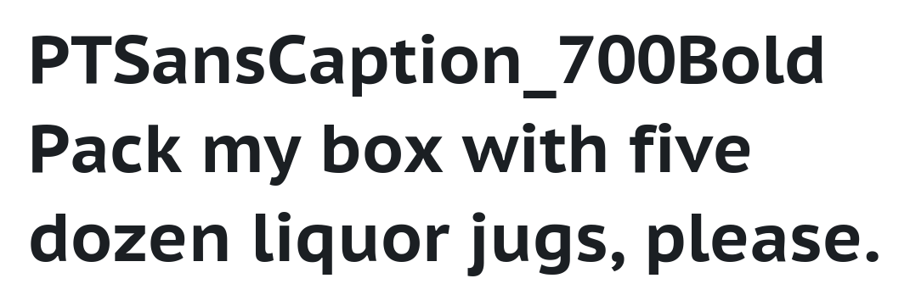](https://github.com/expo/google-fonts/tree/master/font-packages/pt-sans-caption#readme)|||
### [PT Sans Narrow](https://github.com/expo/google-fonts/tree/master/font-packages/pt-sans-narrow#readme)

||||
|-|-|-|
|||||
### [Vollkorn](https://github.com/expo/google-fonts/tree/master/font-packages/vollkorn#readme)

||||
|-|-|-|
|||||
|[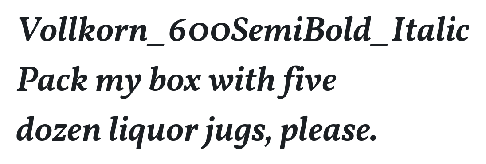](https://github.com/expo/google-fonts/tree/master/font-packages/vollkorn#readme)||||
|||||
### [Tangerine](https://github.com/expo/google-fonts/tree/master/font-packages/tangerine#readme)

||||
|-|-|-|
||[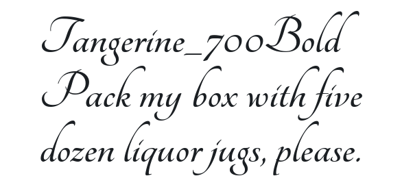](https://github.com/expo/google-fonts/tree/master/font-packages/tangerine#readme)|||
### [Old Standard TT](https://github.com/expo/google-fonts/tree/master/font-packages/old-standard-tt#readme)

||||
|-|-|-|
|[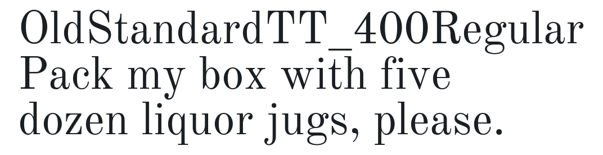](https://github.com/expo/google-fonts/tree/master/font-packages/old-standard-tt#readme)|[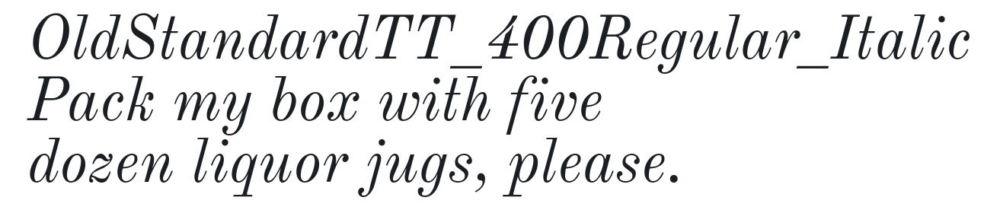](https://github.com/expo/google-fonts/tree/master/font-packages/old-standard-tt#readme)|[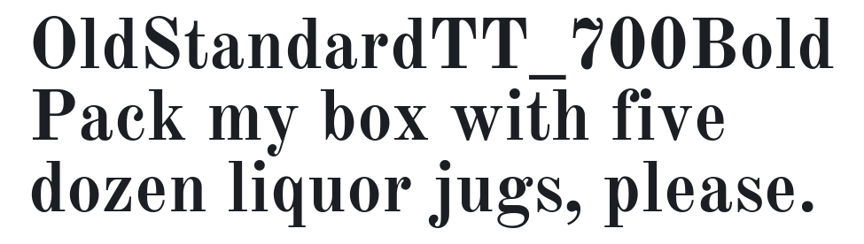](https://github.com/expo/google-fonts/tree/master/font-packages/old-standard-tt#readme)||
### [IM Fell DW Pica](https://github.com/expo/google-fonts/tree/master/font-packages/im-fell-dw-pica#readme)

||||
|-|-|-|
|||||
### [IM Fell DW Pica SC](https://github.com/expo/google-fonts/tree/master/font-packages/im-fell-dw-pica-sc#readme)

||||
|-|-|-|
|||||
### [IM Fell Double Pica](https://github.com/expo/google-fonts/tree/master/font-packages/im-fell-double-pica#readme)

||||
|-|-|-|
||[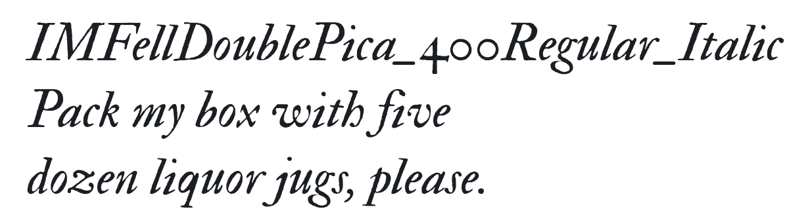](https://github.com/expo/google-fonts/tree/master/font-packages/im-fell-double-pica#readme)|||
### [IM Fell Double Pica SC](https://github.com/expo/google-fonts/tree/master/font-packages/im-fell-double-pica-sc#readme)

||||
|-|-|-|
|[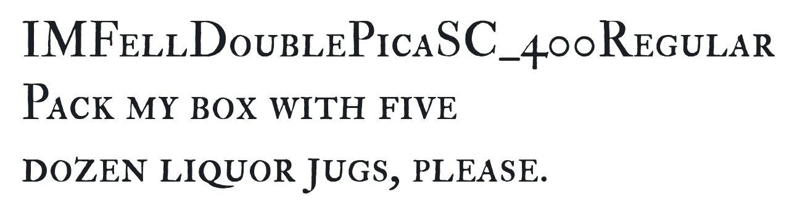](https://github.com/expo/google-fonts/tree/master/font-packages/im-fell-double-pica-sc#readme)||||
### [IM Fell English](https://github.com/expo/google-fonts/tree/master/font-packages/im-fell-english#readme)

||||
|-|-|-|
|[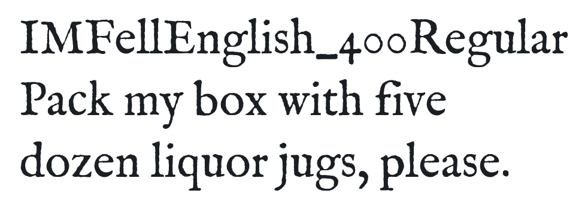](https://github.com/expo/google-fonts/tree/master/font-packages/im-fell-english#readme)||||
### [IM Fell English SC](https://github.com/expo/google-fonts/tree/master/font-packages/im-fell-english-sc#readme)

||||
|-|-|-|
|[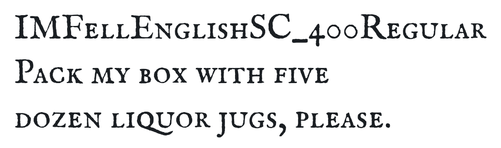](https://github.com/expo/google-fonts/tree/master/font-packages/im-fell-english-sc#readme)||||
### [IM Fell French Canon](https://github.com/expo/google-fonts/tree/master/font-packages/im-fell-french-canon#readme)

||||
|-|-|-|
|||||
### [IM Fell French Canon SC](https://github.com/expo/google-fonts/tree/master/font-packages/im-fell-french-canon-sc#readme)

||||
|-|-|-|
|||||
### [IM Fell Great Primer](https://github.com/expo/google-fonts/tree/master/font-packages/im-fell-great-primer#readme)

||||
|-|-|-|
||[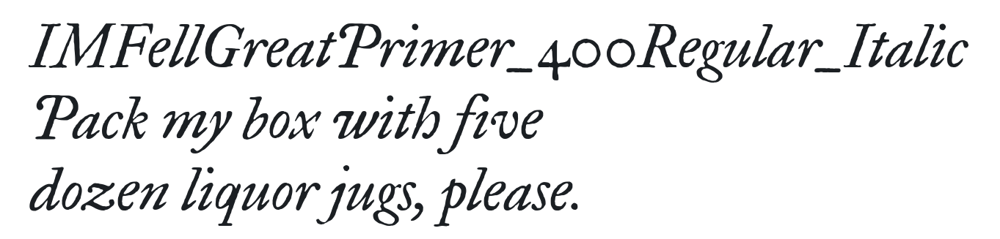](https://github.com/expo/google-fonts/tree/master/font-packages/im-fell-great-primer#readme)|||
### [IM Fell Great Primer SC](https://github.com/expo/google-fonts/tree/master/font-packages/im-fell-great-primer-sc#readme)

||||
|-|-|-|
|[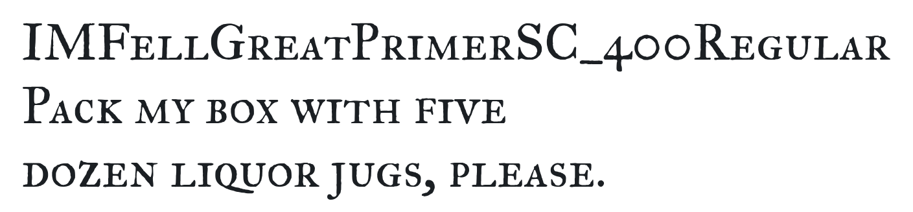](https://github.com/expo/google-fonts/tree/master/font-packages/im-fell-great-primer-sc#readme)||||
### [Lobster](https://github.com/expo/google-fonts/tree/master/font-packages/lobster#readme)

||||
|-|-|-|
|[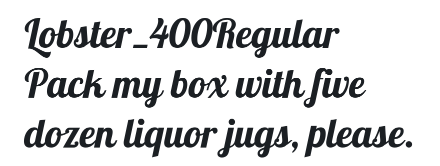](https://github.com/expo/google-fonts/tree/master/font-packages/lobster#readme)||||
### [Yanone Kaffeesatz](https://github.com/expo/google-fonts/tree/master/font-packages/yanone-kaffeesatz#readme)

||||
|-|-|-|
|||||
|[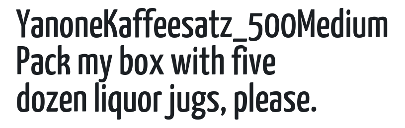](https://github.com/expo/google-fonts/tree/master/font-packages/yanone-kaffeesatz#readme)|[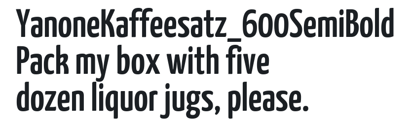](https://github.com/expo/google-fonts/tree/master/font-packages/yanone-kaffeesatz#readme)|[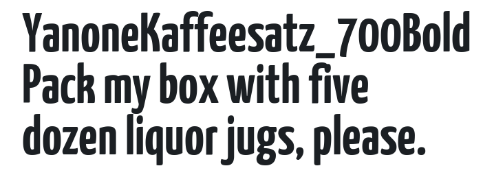](https://github.com/expo/google-fonts/tree/master/font-packages/yanone-kaffeesatz#readme)||
### [Cantarell](https://github.com/expo/google-fonts/tree/master/font-packages/cantarell#readme)

||||
|-|-|-|
|||||
|||||
### [Nobile](https://github.com/expo/google-fonts/tree/master/font-packages/nobile#readme)

||||
|-|-|-|
|||||
|||||
### [Reenie Beanie](https://github.com/expo/google-fonts/tree/master/font-packages/reenie-beanie#readme)

||||
|-|-|-|
|||||
### [Molengo](https://github.com/expo/google-fonts/tree/master/font-packages/molengo#readme)

||||
|-|-|-|
|[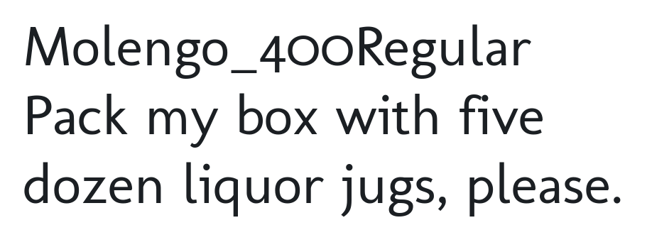](https://github.com/expo/google-fonts/tree/master/font-packages/molengo#readme)||||
### [Inconsolata](https://github.com/expo/google-fonts/tree/master/font-packages/inconsolata#readme)

||||
|-|-|-|
|||||
|||||
|||||
