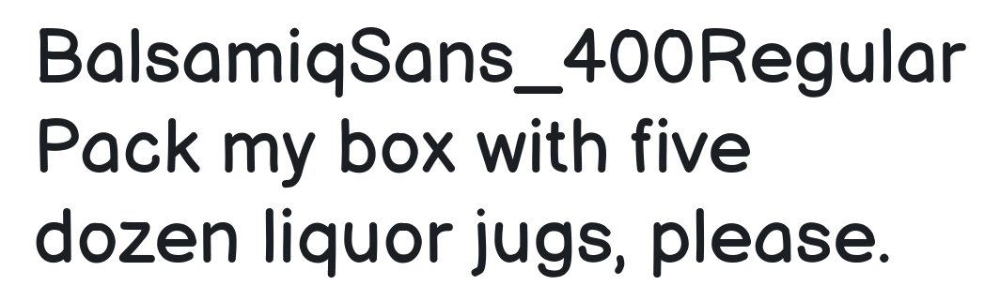

# expo-google-fonts
  


The `@expo-google-fonts` packages for Expo allow you to easily use 
any of 991 fonts (and their variants) from 
[fonts.google.com](https://fonts.google.com) in your Expo app.

These packages and all these fonts work across web, iOS, and Android and 
are free to use and open source.

## Usage

Here is an example of using the [Inter font family](https://fonts.google.com/specimen/Inter) in a very simple project.

#### Install the package for the font you want

```sh
expo install @expo-google-fonts/inter expo-font
```

#### In your app

```js
import React, { useState, useEffect } from 'react';

import { Text, View, StyleSheet } from 'react-native';
import { AppLoading } from 'expo';
import {
  useFonts,
  Inter_400Regular,
} from '@expo-google-fonts/inter';

export default () => {
  let [fontsLoaded] = useFonts({
    Inter_Regular400,
  });

  if (!fontsLoaded) {
    return <AppLoading />;
  } else {
    return (
      <View style={{ flex: 1, justifyContent: 'center', alignItems: 'center' }}>

        <Text style={{ fontFamily: 'Inter_400Regular' }}>
          Inter Regular
        </Text>

      </View>
    );
  }
};

```


### Example Project

Here is a [minimal but complete example](https://github.com/expo/google-fonts/tree/master/example).

Each individual font family package README includes a complete example of using that font family.

## 🔡 Available Fonts

You can browse all available Google Fonts on [fonts.google.com](https://fonts.google.com).

Here are a few examples of the 3014 variants of 991 fonts available:


||||
|-|-|-|
|[](https://github.com/expo/google-fonts/tree/master/font-packages/inter#readme)|[](https://github.com/expo/google-fonts/tree/master/font-packages/manrope#readme)|[](https://github.com/expo/google-fonts/tree/master/font-packages/allan#readme)|
|[](https://github.com/expo/google-fonts/tree/master/font-packages/roboto#readme)|[](https://github.com/expo/google-fonts/tree/master/font-packages/lusitana#readme)|[](https://github.com/expo/google-fonts/tree/master/font-packages/nunito#readme)|
|[](https://github.com/expo/google-fonts/tree/master/font-packages/bangers#readme)|[](https://github.com/expo/google-fonts/tree/master/font-packages/source-sans-pro#readme)|[](https://github.com/expo/google-fonts/tree/master/font-packages/roboto-condensed#readme)|
|[](https://github.com/expo/google-fonts/tree/master/font-packages/playfair-display#readme)|[](https://github.com/expo/google-fonts/tree/master/font-packages/ubuntu#readme)|[](https://github.com/expo/google-fonts/tree/master/font-packages/oswald#readme)|
|[](https://github.com/expo/google-fonts/tree/master/font-packages/balsamiq-sans#readme)|[](https://github.com/expo/google-fonts/tree/master/font-packages/jost#readme)|[](https://github.com/expo/google-fonts/tree/master/font-packages/lato#readme)|


You can check out [the gallery for this project](./GALLERY.md) to see all of them.

## 👩‍💻 @expo-google-fonts/dev


If you are trying out lots of different fonts, you can try using the [`@expo-google-fonts/dev` package](https://github.com/expo/google-fonts/tree/master/font-packages/dev#readme).

You can import *any* font style from any Expo Google Fonts package from it. It will load the fonts
over the network at runtime instead of adding the asset as a file to your project, so it may take longer
for your app to get to interactivity at startup, but it is extremely convenient
for playing around with any style that you want.

## 📖 Licensing

The Expo Google Fonts project and its code are licensed under the MIT License.

All the fonts in the Google Fonts catalog are free and open source.

Individual fonts have their own licenses. Many are licensed using the
[Open Font License](https://scripts.sil.org/cms/scripts/page.php?site_id=nrsi&id=OFL). 
For example, [Nunito](https://fonts.google.com/specimen/Nunito) uses the OFL. 
Check the Google Fonts pages of the font families you are using and add those licenses to
your project's licenses list when you publish.

#### Q: Can I use these fonts commercially: to make a logo, in my app, on my website, etc.?

A: You can use these fonts freely in your products & projects - print or digital, commercial or otherwise. However, you can't sell the fonts on their own. This isn't legal advice, please consider consulting a lawyer and see the full license for all details.

## 🤝 Contributing

Contributions are very welcome! Note that everything under `font-packages` and also this README are generated.
So, please make any changes you want to make to the [generator](https://github.com/expo/google-fonts/tree/master/packages/generator#readme) instead of the packages themselves.

### Authors 

- Charlie Cheever ([@ccheever](https://github.com/ccheever)) - Expo
- Leandro Favre ([@AtilaDev](https://github.com/AtilaDev)) - AtilaDev

## 🔗 Links

- [Google Fonts](https://fonts.google.com)
- [Using Custom Fonts Guide in the Expo docs](https://docs.expo.io/guides/using-custom-fonts/)
- [`google_fonts` Flutter Package](https://pub.dev/packages/google_fonts)
- [Gallery of all available styles in Expo Google Fonts](./GALLERY.md)
- [Generation of these packages and this readme](https://github.com/expo/google-fonts/tree/master/packages/generator#readme)

