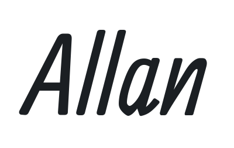

# @expo-google-fonts/allan

This package lets you use the [**Allan**](https://fonts.google.com/specimen/Allan) font family from [Google Fonts](https://fonts.google.com/) in your Expo app.

v0.0.3

## Allan



This font family contains [2 styles](#gallery).

- `Allan_Regular400`
- `Allan_Bold700`

## Usage

Run this command from the shell in the root directory of your Expo project to add the font family package to your project
```sh
expo install @expo-google-fonts/allan expo-font @use-expo/font
```

Now add code like this to your project
```js
import React, { useState, useEffect } from 'react';

import { Text, View, StyleSheet } from 'react-native';
import { AppLoading } from 'expo';
import { useFonts } from '@use-expo/font';
import { Allan_Regular400, Allan_Bold700 } from '@expo-google-fonts/allan';

export default () => {
  let [fontsLoaded] = useFonts({
    Allan_Regular400,
    Allan_Bold700,
  });

  let fontSize = 24;
  let paddingVertical = 6;

  if (!fontsLoaded) {
    return <AppLoading />;
  } else {
    return (
      <View style={{ flex: 1, justifyContent: 'center', alignItems: 'center' }}>
        <Text style={{ fontSize, paddingVertical, fontFamily: 'Allan_Regular400' }}>
          Allan_Regular400
        </Text>

        <Text style={{ fontSize, paddingVertical, fontFamily: 'Allan_Bold700' }}>
          Allan_Bold700
        </Text>
      </View>
    );
  }
};

```

## Gallery

##### Allan_Regular400


##### Allan_Bold700


## Use During Development

If you are trying out lots of different fonts, you can try using the [`@expo-google-fonts/dev` package](https://www.npmjs.com/package/@expo-google-fonts/dev).

You can import *any* font style from any Expo Google Fonts package from it. It will load the fonts
over the network at runtime instead of adding the asset as a file to your project, so it will be 
less performant, and is not a good choice for most production deployments. But, it is extremely convenient
for playing around with any style that you want.

## Links

- [Allan on Google Fonts](https://fonts.google.com/specimen/Allan)
- [Google Fonts](https://fonts.google.com/)
- [This package on npm](https://www.npmjs.com/package/@expo-google-fonts/allan)
- [This package on GitHub](https://github.com/expo/google-fonts/tree/master/font-packages/allan)
- [The Expo Google Fonts project on GitHub](https://github.com/expo/google-fonts)
- [`@expo-google-fonts/dev` Devlopment Package](https://github.com/expo/google-fonts/tree/master/font-packages/dev)


*This file was generated. Instead of editing it by head, please make contributions to [the generator](https://github.com/expo/google-fonts/tree/master/packages/generator)*
