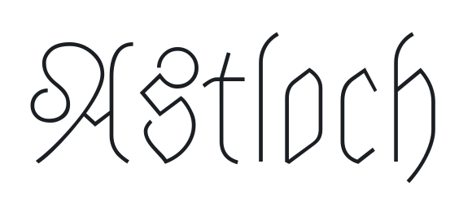

# @expo-google-fonts/astloch

This package lets you use the [**Astloch**](https://fonts.google.com/specimen/Astloch) font family from [Google Fonts](https://fonts.google.com/) in your Expo app.

v0.0.2

## Astloch



This font family contains [2 styles](#gallery).

- `Astloch_Regular400`
- `Astloch_Bold700`

## Usage

Run this command from the shell in the root directory of your Expo project to add the font family package to your project
```sh
yarn add @expo-google-fonts/astloch expo-font @use-expo/font
```

Now add code like this to your project
```js
import React, { useState, useEffect } from 'react';

import { Text, View, StyleSheet } from 'react-native';
import { AppLoading } from 'expo';
import { useFonts } from '@use-expo/font';
import { Astloch_Regular400, Astloch_Bold700 } from '@expo-google-fonts/astloch';

export default () => {
  let [fontsLoaded] = useFonts({
    Astloch_Regular400,
    Astloch_Bold700,
  });

  let fontSize = 24;
  let paddingVertical = 6;

  if (!fontsLoaded) {
    return <AppLoading />;
  } else {
    return (
      <View style={{ flex: 1, justifyContent: 'center', alignItems: 'center' }}>
        <Text style={{ fontSize, paddingVertical, fontFamily: 'Astloch_Regular400' }}>
          Astloch_Regular400
        </Text>

        <Text style={{ fontSize, paddingVertical, fontFamily: 'Astloch_Bold700' }}>
          Astloch_Bold700
        </Text>
      </View>
    );
  }
};

```

## Gallery

##### Astloch_Regular400


##### Astloch_Bold700


## Use During Development

If you are trying out lots of different fonts, you can try using the [`@expo-google-fonts/dev` package](https://www.npmjs.com/package/@expo-google-fonts/dev).

You can import *any* font style from any Expo Google Fonts package from it. It will load the fonts
over the network at runtime instead of adding the asset as a file to your project, so it will be 
less performant, and is not a good choice for most production deployments. But, it is extremely convenient
for playing around with any style that you want.

## Links

- [Astloch on Google Fonts](https://fonts.google.com/specimen/Astloch)
- [Google Fonts](https://fonts.google.com/)
- [This package on npm](https://www.npmjs.com/package/@expo-google-fonts/astloch)
- [This package on GitHub](https://github.com/expo/google-fonts/tree/master/font-packages/astloch)
- [The Expo Google Fonts project on GitHub](https://github.com/expo/google-fonts)
- [`@expo-google-fonts/dev` Devlopment Package](https://github.com/expo/google-fonts/tree/master/font-packages/dev)


*This file was generated. Instead of editing it by head, please make contributions to [the generator](https://github.com/expo/google-fonts/tree/master/packages/generator)*
