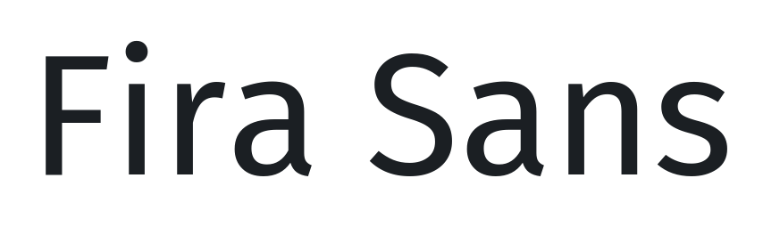

# @expo-google-fonts/fira-sans

This package lets you use the [**Fira Sans**](https://fonts.google.com/specimen/Fira+Sans) font family from [Google Fonts](https://fonts.google.com/) in your Expo app.

v0.0.3

## Fira Sans



This font family contains [18 styles](#gallery).

- `FiraSans_Thin100`
- `FiraSans_Thin100_Italic`
- `FiraSans_ExtraLight200`
- `FiraSans_ExtraLight200_Italic`
- `FiraSans_Light300`
- `FiraSans_Light300_Italic`
- `FiraSans_Regular400`
- `FiraSans_Regular400_Italic`
- `FiraSans_Medium500`
- `FiraSans_Medium500_Italic`
- `FiraSans_SemiBold600`
- `FiraSans_SemiBold600_Italic`
- `FiraSans_Bold700`
- `FiraSans_Bold700_Italic`
- `FiraSans_ExtraBold800`
- `FiraSans_ExtraBold800_Italic`
- `FiraSans_Black900`
- `FiraSans_Black900_Italic`

## Usage

Run this command from the shell in the root directory of your Expo project to add the font family package to your project
```sh
expo install @expo-google-fonts/fira-sans expo-font @use-expo/font
```

Now add code like this to your project
```js
import React, { useState, useEffect } from 'react';

import { Text, View, StyleSheet } from 'react-native';
import { AppLoading } from 'expo';
import { useFonts } from '@use-expo/font';
import {
  FiraSans_Thin100,
  FiraSans_Thin100_Italic,
  FiraSans_ExtraLight200,
  FiraSans_ExtraLight200_Italic,
  FiraSans_Light300,
  FiraSans_Light300_Italic,
  FiraSans_Regular400,
  FiraSans_Regular400_Italic,
  FiraSans_Medium500,
  FiraSans_Medium500_Italic,
  FiraSans_SemiBold600,
  FiraSans_SemiBold600_Italic,
  FiraSans_Bold700,
  FiraSans_Bold700_Italic,
  FiraSans_ExtraBold800,
  FiraSans_ExtraBold800_Italic,
  FiraSans_Black900,
  FiraSans_Black900_Italic,
} from '@expo-google-fonts/fira-sans';

export default () => {
  let [fontsLoaded] = useFonts({
    FiraSans_Thin100,
    FiraSans_Thin100_Italic,
    FiraSans_ExtraLight200,
    FiraSans_ExtraLight200_Italic,
    FiraSans_Light300,
    FiraSans_Light300_Italic,
    FiraSans_Regular400,
    FiraSans_Regular400_Italic,
    FiraSans_Medium500,
    FiraSans_Medium500_Italic,
    FiraSans_SemiBold600,
    FiraSans_SemiBold600_Italic,
    FiraSans_Bold700,
    FiraSans_Bold700_Italic,
    FiraSans_ExtraBold800,
    FiraSans_ExtraBold800_Italic,
    FiraSans_Black900,
    FiraSans_Black900_Italic,
  });

  let fontSize = 24;
  let paddingVertical = 6;

  if (!fontsLoaded) {
    return <AppLoading />;
  } else {
    return (
      <View style={{ flex: 1, justifyContent: 'center', alignItems: 'center' }}>
        <Text style={{ fontSize, paddingVertical, fontFamily: 'FiraSans_Thin100' }}>
          FiraSans_Thin100
        </Text>

        <Text style={{ fontSize, paddingVertical, fontFamily: 'FiraSans_Thin100_Italic' }}>
          FiraSans_Thin100_Italic
        </Text>

        <Text style={{ fontSize, paddingVertical, fontFamily: 'FiraSans_ExtraLight200' }}>
          FiraSans_ExtraLight200
        </Text>

        <Text style={{ fontSize, paddingVertical, fontFamily: 'FiraSans_ExtraLight200_Italic' }}>
          FiraSans_ExtraLight200_Italic
        </Text>

        <Text style={{ fontSize, paddingVertical, fontFamily: 'FiraSans_Light300' }}>
          FiraSans_Light300
        </Text>

        <Text style={{ fontSize, paddingVertical, fontFamily: 'FiraSans_Light300_Italic' }}>
          FiraSans_Light300_Italic
        </Text>

        <Text style={{ fontSize, paddingVertical, fontFamily: 'FiraSans_Regular400' }}>
          FiraSans_Regular400
        </Text>

        <Text style={{ fontSize, paddingVertical, fontFamily: 'FiraSans_Regular400_Italic' }}>
          FiraSans_Regular400_Italic
        </Text>

        <Text style={{ fontSize, paddingVertical, fontFamily: 'FiraSans_Medium500' }}>
          FiraSans_Medium500
        </Text>

        <Text style={{ fontSize, paddingVertical, fontFamily: 'FiraSans_Medium500_Italic' }}>
          FiraSans_Medium500_Italic
        </Text>

        <Text style={{ fontSize, paddingVertical, fontFamily: 'FiraSans_SemiBold600' }}>
          FiraSans_SemiBold600
        </Text>

        <Text style={{ fontSize, paddingVertical, fontFamily: 'FiraSans_SemiBold600_Italic' }}>
          FiraSans_SemiBold600_Italic
        </Text>

        <Text style={{ fontSize, paddingVertical, fontFamily: 'FiraSans_Bold700' }}>
          FiraSans_Bold700
        </Text>

        <Text style={{ fontSize, paddingVertical, fontFamily: 'FiraSans_Bold700_Italic' }}>
          FiraSans_Bold700_Italic
        </Text>

        <Text style={{ fontSize, paddingVertical, fontFamily: 'FiraSans_ExtraBold800' }}>
          FiraSans_ExtraBold800
        </Text>

        <Text style={{ fontSize, paddingVertical, fontFamily: 'FiraSans_ExtraBold800_Italic' }}>
          FiraSans_ExtraBold800_Italic
        </Text>

        <Text style={{ fontSize, paddingVertical, fontFamily: 'FiraSans_Black900' }}>
          FiraSans_Black900
        </Text>

        <Text style={{ fontSize, paddingVertical, fontFamily: 'FiraSans_Black900_Italic' }}>
          FiraSans_Black900_Italic
        </Text>
      </View>
    );
  }
};

```

## Gallery

##### FiraSans_Thin100


##### FiraSans_Thin100_Italic


##### FiraSans_ExtraLight200


##### FiraSans_ExtraLight200_Italic


##### FiraSans_Light300


##### FiraSans_Light300_Italic


##### FiraSans_Regular400


##### FiraSans_Regular400_Italic


##### FiraSans_Medium500


##### FiraSans_Medium500_Italic


##### FiraSans_SemiBold600


##### FiraSans_SemiBold600_Italic


##### FiraSans_Bold700


##### FiraSans_Bold700_Italic


##### FiraSans_ExtraBold800


##### FiraSans_ExtraBold800_Italic


##### FiraSans_Black900


##### FiraSans_Black900_Italic


## Use During Development

If you are trying out lots of different fonts, you can try using the [`@expo-google-fonts/dev` package](https://www.npmjs.com/package/@expo-google-fonts/dev).

You can import *any* font style from any Expo Google Fonts package from it. It will load the fonts
over the network at runtime instead of adding the asset as a file to your project, so it will be 
less performant, and is not a good choice for most production deployments. But, it is extremely convenient
for playing around with any style that you want.

## Links

- [Fira Sans on Google Fonts](https://fonts.google.com/specimen/Fira+Sans)
- [Google Fonts](https://fonts.google.com/)
- [This package on npm](https://www.npmjs.com/package/@expo-google-fonts/fira-sans)
- [This package on GitHub](https://github.com/expo/google-fonts/tree/master/font-packages/fira-sans)
- [The Expo Google Fonts project on GitHub](https://github.com/expo/google-fonts)
- [`@expo-google-fonts/dev` Devlopment Package](https://github.com/expo/google-fonts/tree/master/font-packages/dev)


*This file was generated. Instead of editing it by head, please make contributions to [the generator](https://github.com/expo/google-fonts/tree/master/packages/generator)*
