# @expo-google-fonts/material-symbols-outlined


This package lets you use the [**Material Symbols Outlined**](https://fonts.google.com/specimen/Material+Symbols+Outlined) font family from [Google Fonts](https://fonts.google.com/) in your Expo app.

## Material Symbols Outlined


This font family contains [14 styles](#-gallery).

- `MaterialSymbolsOutlined_100Thin`
- `MaterialSymbolsOutlined_200ExtraLight`
- `MaterialSymbolsOutlined_300Light`
- `MaterialSymbolsOutlined_400Regular`
- `MaterialSymbolsOutlined_500Medium`
- `MaterialSymbolsOutlined_600SemiBold`
- `MaterialSymbolsOutlined_700Bold`
- `MaterialSymbolsOutlined_100Thin_Filled`
- `MaterialSymbolsOutlined_200ExtraLight_Filled`
- `MaterialSymbolsOutlined_300Light_Filled`
- `MaterialSymbolsOutlined_400Regular_Filled`
- `MaterialSymbolsOutlined_500Medium_Filled`
- `MaterialSymbolsOutlined_600SemiBold_Filled`
- `MaterialSymbolsOutlined_700Bold_Filled`

## Usage

Run this command from the shell in the root directory of your Expo project to add the font family package to your project

```sh
npx expo install @expo-google-fonts/material-symbols-outlined expo-font
```

Now add code like this to your project

```js
import { Text, View } from "react-native";
import { useFonts } from '@expo-google-fonts/material-symbols-outlined/useFonts';
import { MaterialSymbolsOutlined_100Thin } from '@expo-google-fonts/material-symbols-outlined/100Thin';
import { MaterialSymbolsOutlined_200ExtraLight } from '@expo-google-fonts/material-symbols-outlined/200ExtraLight';
import { MaterialSymbolsOutlined_300Light } from '@expo-google-fonts/material-symbols-outlined/300Light';
import { MaterialSymbolsOutlined_400Regular } from '@expo-google-fonts/material-symbols-outlined/400Regular';
import { MaterialSymbolsOutlined_500Medium } from '@expo-google-fonts/material-symbols-outlined/500Medium';
import { MaterialSymbolsOutlined_600SemiBold } from '@expo-google-fonts/material-symbols-outlined/600SemiBold';
import { MaterialSymbolsOutlined_700Bold } from '@expo-google-fonts/material-symbols-outlined/700Bold';
import { MaterialSymbolsOutlined_100Thin_Filled } from '@expo-google-fonts/material-symbols-outlined/100Thin_Filled';
import { MaterialSymbolsOutlined_200ExtraLight_Filled } from '@expo-google-fonts/material-symbols-outlined/200ExtraLight_Filled';
import { MaterialSymbolsOutlined_300Light_Filled } from '@expo-google-fonts/material-symbols-outlined/300Light_Filled';
import { MaterialSymbolsOutlined_400Regular_Filled } from '@expo-google-fonts/material-symbols-outlined/400Regular_Filled';
import { MaterialSymbolsOutlined_500Medium_Filled } from '@expo-google-fonts/material-symbols-outlined/500Medium_Filled';
import { MaterialSymbolsOutlined_600SemiBold_Filled } from '@expo-google-fonts/material-symbols-outlined/600SemiBold_Filled';
import { MaterialSymbolsOutlined_700Bold_Filled } from '@expo-google-fonts/material-symbols-outlined/700Bold_Filled';

export default () => {

  let [fontsLoaded] = useFonts({
    MaterialSymbolsOutlined_100Thin, 
    MaterialSymbolsOutlined_200ExtraLight, 
    MaterialSymbolsOutlined_300Light, 
    MaterialSymbolsOutlined_400Regular, 
    MaterialSymbolsOutlined_500Medium, 
    MaterialSymbolsOutlined_600SemiBold, 
    MaterialSymbolsOutlined_700Bold, 
    MaterialSymbolsOutlined_100Thin_Filled, 
    MaterialSymbolsOutlined_200ExtraLight_Filled, 
    MaterialSymbolsOutlined_300Light_Filled, 
    MaterialSymbolsOutlined_400Regular_Filled, 
    MaterialSymbolsOutlined_500Medium_Filled, 
    MaterialSymbolsOutlined_600SemiBold_Filled, 
    MaterialSymbolsOutlined_700Bold_Filled
  });

  let fontSize = 24;
  let paddingVertical = 6;

  if (!fontsLoaded) {
    return null;
  } else {
    return (
      <View style={{ flex: 1, justifyContent: "center", alignItems: "center" }}>
        <Text style={{
          fontSize,
          paddingVertical,
          // Note the quoting of the value for `fontFamily` here; it expects a string!
          fontFamily: "MaterialSymbolsOutlined_100Thin"
        }}>
          Material Symbols Outlined Thin
        </Text>
        <Text style={{
          fontSize,
          paddingVertical,
          // Note the quoting of the value for `fontFamily` here; it expects a string!
          fontFamily: "MaterialSymbolsOutlined_200ExtraLight"
        }}>
          Material Symbols Outlined Extra Light
        </Text>
        <Text style={{
          fontSize,
          paddingVertical,
          // Note the quoting of the value for `fontFamily` here; it expects a string!
          fontFamily: "MaterialSymbolsOutlined_300Light"
        }}>
          Material Symbols Outlined Light
        </Text>
        <Text style={{
          fontSize,
          paddingVertical,
          // Note the quoting of the value for `fontFamily` here; it expects a string!
          fontFamily: "MaterialSymbolsOutlined_400Regular"
        }}>
          Material Symbols Outlined Regular
        </Text>
        <Text style={{
          fontSize,
          paddingVertical,
          // Note the quoting of the value for `fontFamily` here; it expects a string!
          fontFamily: "MaterialSymbolsOutlined_500Medium"
        }}>
          Material Symbols Outlined Medium
        </Text>
        <Text style={{
          fontSize,
          paddingVertical,
          // Note the quoting of the value for `fontFamily` here; it expects a string!
          fontFamily: "MaterialSymbolsOutlined_600SemiBold"
        }}>
          Material Symbols Outlined Semi Bold
        </Text>
        <Text style={{
          fontSize,
          paddingVertical,
          // Note the quoting of the value for `fontFamily` here; it expects a string!
          fontFamily: "MaterialSymbolsOutlined_700Bold"
        }}>
          Material Symbols Outlined Bold
        </Text>
        <Text style={{
          fontSize,
          paddingVertical,
          // Note the quoting of the value for `fontFamily` here; it expects a string!
          fontFamily: "MaterialSymbolsOutlined_100Thin_Filled"
        }}>
          Material Symbols Outlined Thin Filled
        </Text>
        <Text style={{
          fontSize,
          paddingVertical,
          // Note the quoting of the value for `fontFamily` here; it expects a string!
          fontFamily: "MaterialSymbolsOutlined_200ExtraLight_Filled"
        }}>
          Material Symbols Outlined Extra Light Filled
        </Text>
        <Text style={{
          fontSize,
          paddingVertical,
          // Note the quoting of the value for `fontFamily` here; it expects a string!
          fontFamily: "MaterialSymbolsOutlined_300Light_Filled"
        }}>
          Material Symbols Outlined Light Filled
        </Text>
        <Text style={{
          fontSize,
          paddingVertical,
          // Note the quoting of the value for `fontFamily` here; it expects a string!
          fontFamily: "MaterialSymbolsOutlined_400Regular_Filled"
        }}>
          Material Symbols Outlined Filled
        </Text>
        <Text style={{
          fontSize,
          paddingVertical,
          // Note the quoting of the value for `fontFamily` here; it expects a string!
          fontFamily: "MaterialSymbolsOutlined_500Medium_Filled"
        }}>
          Material Symbols Outlined Medium Filled
        </Text>
        <Text style={{
          fontSize,
          paddingVertical,
          // Note the quoting of the value for `fontFamily` here; it expects a string!
          fontFamily: "MaterialSymbolsOutlined_600SemiBold_Filled"
        }}>
          Material Symbols Outlined Semi Bold Filled
        </Text>
        <Text style={{
          fontSize,
          paddingVertical,
          // Note the quoting of the value for `fontFamily` here; it expects a string!
          fontFamily: "MaterialSymbolsOutlined_700Bold_Filled"
        }}>
          Material Symbols Outlined Bold Filled
        </Text>
      </View>
    );
  }
};
```

## 🔡 Gallery


||||
|-|-|-|
|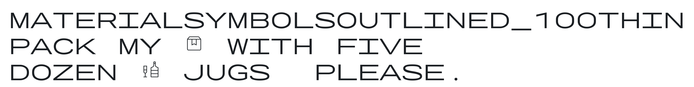|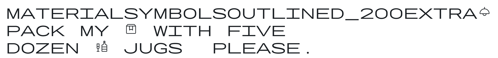|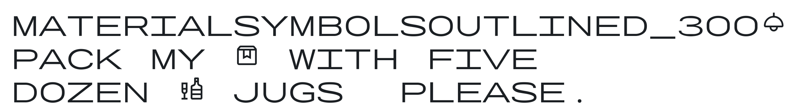||
|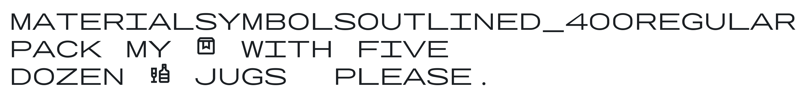|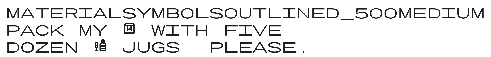|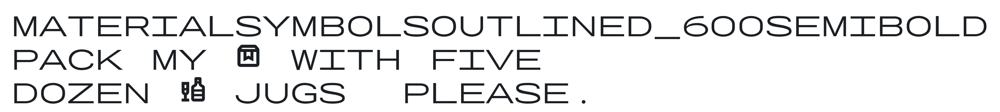||
|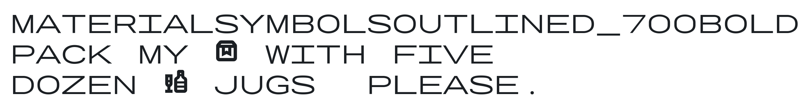|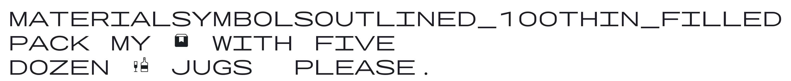|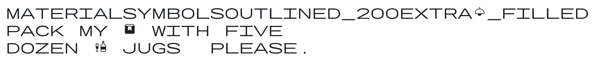||
|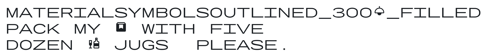|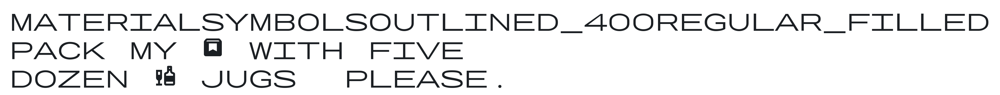|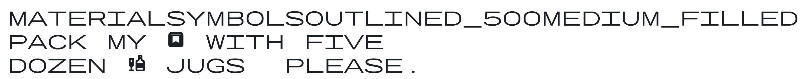||
|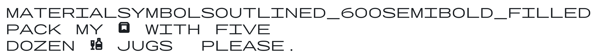|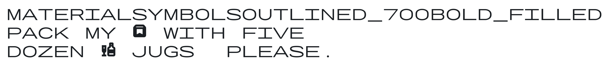|||


## 👩‍💻 Use During Development

If you are trying out lots of different fonts, you can try using the [`@expo-google-fonts/dev` package](https://github.com/expo/google-fonts/tree/master/font-packages/dev#readme).

You can import _any_ font style from any Expo Google Fonts package from it. It will load the fonts over the network at runtime instead of adding the asset as a file to your project, so it may take longer for your app to get to interactivity at startup, but it is extremely convenient for playing around with any style that you want.


## 📖 License

The `@expo-google-fonts/material-symbols-outlined` package and its code are released under the MIT license.

All the fonts in the Google Fonts catalog are free and open source.

Check the [Material Symbols Outlined page on Google Fonts](https://fonts.google.com/specimen/Material+Symbols+Outlined) for the specific license of this font family.

You can use these fonts freely in your products & projects - print or digital, commercial or otherwise. However, you can't sell the fonts on their own. This isn't legal advice, please consider consulting a lawyer and see the full license for all details.

## 🔗 Links

- [Material Symbols Outlined on Google Fonts](https://fonts.google.com/specimen/Material+Symbols+Outlined)
- [Google Fonts](https://fonts.google.com/)
- [This package on npm](https://www.npmjs.com/package/@expo-google-fonts/material-symbols-outlined)
- [This package on GitHub](https://github.com/expo/google-fonts/tree/master/font-packages/material-symbols-outlined)
- [The Expo Google Fonts project on GitHub](https://github.com/expo/google-fonts)
- [`@expo-google-fonts/dev` Devlopment Package](https://github.com/expo/google-fonts/tree/master/font-packages/dev)

## 🤝 Contributing

Contributions are very welcome! This entire directory, including what you are reading now, was generated from code. Instead of submitting PRs to this directly, please make contributions to [the generator](https://github.com/expo/google-fonts/tree/master/packages/generator) instead.
