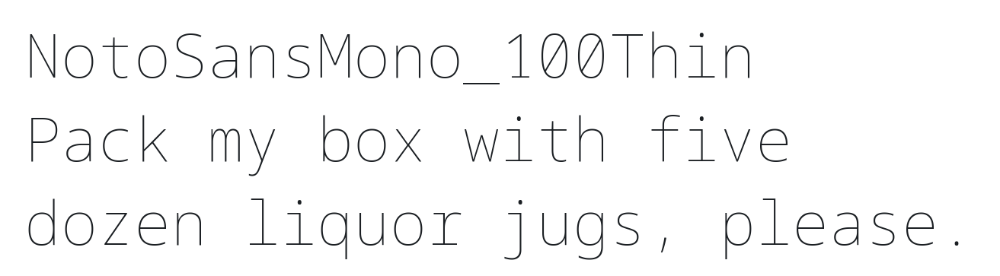
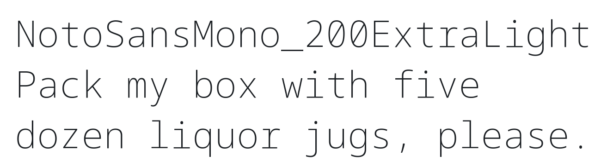
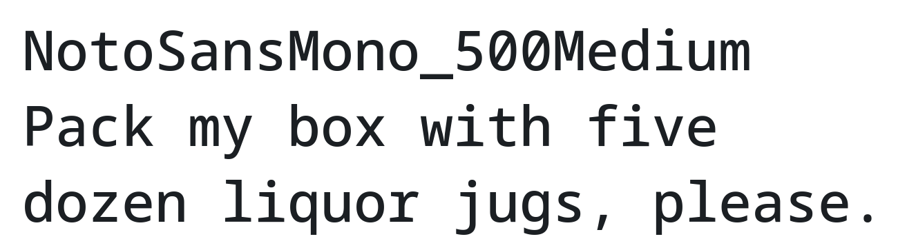

# @expo-google-fonts/noto-sans-mono


This package lets you use the [**Noto Sans Mono**](https://fonts.google.com/specimen/Noto+Sans+Mono) font family from [Google Fonts](https://fonts.google.com/) in your Expo app.

## Noto Sans Mono


This font family contains [9 styles](#-gallery).

- `NotoSansMono_100Thin`
- `NotoSansMono_200ExtraLight`
- `NotoSansMono_300Light`
- `NotoSansMono_400Regular`
- `NotoSansMono_500Medium`
- `NotoSansMono_600SemiBold`
- `NotoSansMono_700Bold`
- `NotoSansMono_800ExtraBold`
- `NotoSansMono_900Black`

## Usage

Run this command from the shell in the root directory of your Expo project to add the font family package to your project
```sh
expo install @expo-google-fonts/noto-sans-mono expo-font expo-app-loading
```

Now add code like this to your project
```js
import React, { useState, useEffect } from 'react';

import { Text, View, StyleSheet } from 'react-native';
import AppLoading from 'expo-app-loading';
import {
  useFonts,
  NotoSansMono_100Thin,
  NotoSansMono_200ExtraLight,
  NotoSansMono_300Light,
  NotoSansMono_400Regular,
  NotoSansMono_500Medium,
  NotoSansMono_600SemiBold,
  NotoSansMono_700Bold,
  NotoSansMono_800ExtraBold,
  NotoSansMono_900Black,
} from '@expo-google-fonts/noto-sans-mono';

export default () => {
  let [fontsLoaded] = useFonts({
    NotoSansMono_100Thin,
    NotoSansMono_200ExtraLight,
    NotoSansMono_300Light,
    NotoSansMono_400Regular,
    NotoSansMono_500Medium,
    NotoSansMono_600SemiBold,
    NotoSansMono_700Bold,
    NotoSansMono_800ExtraBold,
    NotoSansMono_900Black,
  });

  let fontSize = 24;
  let paddingVertical = 6;

  if (!fontsLoaded) {
    return <AppLoading />;
  } else {
    return (
      <View style={{ flex: 1, justifyContent: 'center', alignItems: 'center' }}>
        <Text
          style={{
            fontSize,
            paddingVertical,
            // Note the quoting of the value for `fontFamily` here; it expects a string!
            fontFamily: 'NotoSansMono_100Thin',
          }}>
          Noto Sans Mono Thin
        </Text>

        <Text
          style={{
            fontSize,
            paddingVertical,
            // Note the quoting of the value for `fontFamily` here; it expects a string!
            fontFamily: 'NotoSansMono_200ExtraLight',
          }}>
          Noto Sans Mono Extra Light
        </Text>

        <Text
          style={{
            fontSize,
            paddingVertical,
            // Note the quoting of the value for `fontFamily` here; it expects a string!
            fontFamily: 'NotoSansMono_300Light',
          }}>
          Noto Sans Mono Light
        </Text>

        <Text
          style={{
            fontSize,
            paddingVertical,
            // Note the quoting of the value for `fontFamily` here; it expects a string!
            fontFamily: 'NotoSansMono_400Regular',
          }}>
          Noto Sans Mono Regular
        </Text>

        <Text
          style={{
            fontSize,
            paddingVertical,
            // Note the quoting of the value for `fontFamily` here; it expects a string!
            fontFamily: 'NotoSansMono_500Medium',
          }}>
          Noto Sans Mono Medium
        </Text>

        <Text
          style={{
            fontSize,
            paddingVertical,
            // Note the quoting of the value for `fontFamily` here; it expects a string!
            fontFamily: 'NotoSansMono_600SemiBold',
          }}>
          Noto Sans Mono Semi Bold
        </Text>

        <Text
          style={{
            fontSize,
            paddingVertical,
            // Note the quoting of the value for `fontFamily` here; it expects a string!
            fontFamily: 'NotoSansMono_700Bold',
          }}>
          Noto Sans Mono Bold
        </Text>

        <Text
          style={{
            fontSize,
            paddingVertical,
            // Note the quoting of the value for `fontFamily` here; it expects a string!
            fontFamily: 'NotoSansMono_800ExtraBold',
          }}>
          Noto Sans Mono Extra Bold
        </Text>

        <Text
          style={{
            fontSize,
            paddingVertical,
            // Note the quoting of the value for `fontFamily` here; it expects a string!
            fontFamily: 'NotoSansMono_900Black',
          }}>
          Noto Sans Mono Black
        </Text>
      </View>
    );
  }
};

```

## 🔡 Gallery


||||
|-|-|-|
|||||
|||||
|||||


## 👩‍💻 Use During Development

If you are trying out lots of different fonts, you can try using the [`@expo-google-fonts/dev` package](https://github.com/expo/google-fonts/tree/master/font-packages/dev#readme).

You can import *any* font style from any Expo Google Fonts package from it. It will load the fonts
over the network at runtime instead of adding the asset as a file to your project, so it may take longer
for your app to get to interactivity at startup, but it is extremely convenient
for playing around with any style that you want.

## 📖 License

The `@expo-google-fonts/noto-sans-mono` package and its code are released under the MIT license.

All the fonts in the Google Fonts catalog are free and open source.

Check the [Noto Sans Mono page on Google Fonts](https://fonts.google.com/specimen/Noto+Sans+Mono) for the specific license of this font family.

You can use these fonts freely in your products & projects - print or digital, commercial or otherwise. However, you can't sell the fonts on their own. This isn't legal advice, please consider consulting a lawyer and see the full license for all details.

## 🔗 Links

- [Noto Sans Mono on Google Fonts](https://fonts.google.com/specimen/Noto+Sans+Mono)
- [Google Fonts](https://fonts.google.com/)
- [This package on npm](https://www.npmjs.com/package/@expo-google-fonts/noto-sans-mono)
- [This package on GitHub](https://github.com/expo/google-fonts/tree/master/font-packages/noto-sans-mono)
- [The Expo Google Fonts project on GitHub](https://github.com/expo/google-fonts)
- [`@expo-google-fonts/dev` Devlopment Package](https://github.com/expo/google-fonts/tree/master/font-packages/dev)

## 🤝 Contributing

Contributions are very welcome! This entire directory, including what you are reading now, was generated from code. Instead of submitting PRs to this directly, please make contributions to [the generator](https://github.com/expo/google-fonts/tree/master/packages/generator) instead.
